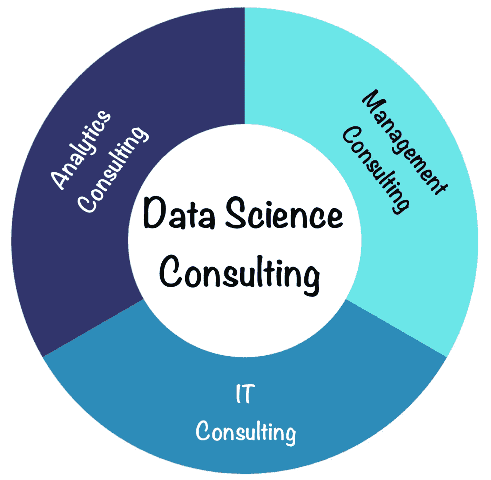

# 如何交付成功的数据科学咨询项目

> 原文：[`towardsdatascience.com/how-to-deliver-successful-data-science-consulting-projects-d4c25f826c36?source=collection_archive---------3-----------------------#2024-07-13`](https://towardsdatascience.com/how-to-deliver-successful-data-science-consulting-projects-d4c25f826c36?source=collection_archive---------3-----------------------#2024-07-13)

## [数据科学咨询](https://medium.com/@hc.ekne/list/data-science-consulting-bcf6e4b59652)

## 成功交付数据科学咨询项目并建立持久客户关系的关键建议

 [汉斯·克里斯蒂安·埃克内](https://medium.com/@hc.ekne?source=post_page---byline--d4c25f826c36--------------------------------)

·发表于 [Towards Data Science](https://towardsdatascience.com/?source=post_page---byline--d4c25f826c36--------------------------------) ·阅读时长：9 分钟·2024 年 7 月 13 日

--

图片由作者使用 DALL-E 生成

# 介绍

我不羞于承认：数据科学咨询并不总是轻松的！它可能是残酷的——尤其是在高级职位上，当你需要通过产生销售来保持竞争力时。即使让客户满意是你的首要任务，这在数据科学项目中也并非总是简单的事情。

回顾十多年交付数据科学和数据工程项目的经验——其中大部分是作为顾问——我见过一些项目为客户带来了巨大的价值，但我也见过一些项目失败，未能交付理想结果，通常是由于规划不当、期望不匹配和技术难题。

很明显，成功的数据科学咨询不仅仅是成为 Python 和 R 的高手——在 Hackerrank 的数据科学编程竞赛中表现出色；它远比这更深刻，能够在项目交付中融合战略、技术和分析。在本文中，我将从成功和具有挑战性的项目中汲取经验，并说明数据科学咨询如何与管理、IT 和分析咨询交汇。通过了解这些更传统和成熟的咨询角色之间的差异与相似性，我们可以更清晰地看到如何在我们的数据科学项目中交付持久且有影响力的解决方案。

# 与传统咨询角色的相似性与差异性

数据科学咨询 / 作者提供的图片

## 管理咨询与数据科学咨询

管理咨询项目和数据科学咨询项目通常有许多相同的特点。它们都旨在提升业务绩效，并且常常交付具有战略重要性的项目。它们通常也涉及高级管理人员——至少作为项目所有者——并且都需要详细的前期规划。然而，虽然我发现管理咨询项目通常遵循传统的瀑布模型，但数据科学咨询则可以从结合瀑布中的结构化规划与敏捷迭代的混合方法中受益更多。

就交付物而言，管理咨询项目通常会产生战略计划、组织评估或定价建议，通常以 PowerPoint 演示文稿或 Excel 工作簿的形式呈现。与此相对，数据科学项目的主要交付物通常是预测模型、数据管道和仪表盘。

反馈周期也有所不同，传统的管理咨询项目通常会有计划性的定期反馈，而数据科学咨询项目则更依赖于持续的利益相关者参与和迭代反馈周期，以确保项目的成功。

## IT 咨询与数据科学咨询

IT 咨询和数据科学咨询都需要强大的技术专长以及对 IT 基础设施的理解，有些人可能认为数据科学咨询是 IT 咨询的一个子类别。我不认同这一观点，但这两个领域确实有相当大的重叠。

虽然 IT 咨询项目产生系统架构设计、实施计划和更多核心系统软件开发，但数据科学咨询更侧重于生成预测模型、供给模型的数据管道和数据驱动的洞察。

此外，数据科学项目通常与组织的业务部门密切相关，并且在许多情况下，项目的负责人和赞助人是非 IT 领域的领导。例如，你可能会直接向 CMO（首席营销官）或 CDO（首席数据官）汇报，而不是向 CIO（首席信息官）或 CTO（首席技术官）汇报，这通常出现在更多由 IT 驱动的项目中。这意味着你的方法和策略需要与纯 IT 项目有所不同，你通常需要更多地考虑连续性、运营和组织的成熟度。（CIO 和 CTO 通常已经有更完善的系统来应对这些问题。）

然而，随着数据科学在过去几年的成熟，我们看到像 MLOps 这样的领域有了显著发展，同时项目中也出现了将代码开发和编写方式更接近现代软件开发的趋势。我认为这是数据科学朝着更专业、更结构化领域发展的自然过程。

## 分析咨询与数据科学咨询

最后，将分析咨询与数据科学咨询进行比较，我们发现它们都专注于数据，通常涉及较短的项目周期和针对性的交付物。它们还强调基于数据和反馈的快速迭代和持续优化。然而，分析咨询通常解决更狭窄范围的特定业务问题，而数据科学咨询则整合了更广泛的战略对齐和更复杂的模型。

在分析咨询中，经典的交付物通常是数据分析报告、数据集市和仪表板，而数据科学咨询的交付物——正如我们之前提到的——更多集中在数据管道、模型以及战略性和集成的数据产品上。

最后，项目的评估方式通常也不同。分析类项目更多关注分析的准确性和洞察力，而数据科学项目通常还会依据预测准确性和投资回报率来评估。

*对批判性读者的备注：以上描述绝非一成不变，旨在展示不同咨询类型之间的一般差异和相似性。在许多情况下，它们显然会比上述描述更加分化或融合。*

# 成功的数据科学咨询的关键见解

鉴于数据科学咨询与其他咨询类型之间的上述相似性和差异，提出如何调整我们的方法以确保项目的长期成功和可行性是很自然的。除了显而易见的要素，如高质量的交付物、及时的项目交付和强有力的利益相关者管理，还有哪些其他要素是必须到位的才能成功？

## 确保稳健的数据产品

管理咨询通常专注于即时的组织变革和一次性的交付物，而数据科学咨询则需要对稳健性和可持续性保持长远的视角。这带来了一些后果。你可能会并且将会被评判你工作的持续表现，并且应该采取措施，确保你不仅在交接时交付出好的结果，而且还能够在未来的几年里持续交付好的成果。（这与 IT 咨询类似，在 IT 咨询中，持续的表现和维护至关重要。）

例如，我曾构建过已在生产中使用超过 6 年的数据产品！我见证了由于数据管道不够强健，导致系统崩溃和模型结果错误的直接后果。我也曾见过模型变量和标签随时间显著漂移，导致系统性能下降，甚至在某些情况下产生完全错误的见解。

作者使用 DALL-E 创作的图片

我知道这显然不是最吸引眼球的话题，在预算紧张和时间有限的项目中，很难提出额外花时间和资源来构建强健的数据管道和监控变量漂移的论点。然而，我强烈建议你花时间和客户一起探讨这些话题，并将其直接整合进你的项目时间表中。

- 关注长期可持续性。

- 实施强健的数据管道。

- 持续监控模型和变量漂移。

我在之前的一篇文章中写过数据管道的一个方面（变量的独热编码），旨在阐述这个话题，并提供 Python 和 R 的解决方案。

 ## 强健的独热编码

### 生产级独热编码技术在 Python 和 R 中的应用

[towardsdatascience.com

## 文档与知识传递

在数据科学咨询中，适当的文档和知识传递至关重要。与可能涉及较少复杂模型的分析咨询不同，数据科学项目需要详细的文档以确保项目的持续性。客户经常面临人员变动，良好的文档化流程有助于减轻信息丧失的风险。我曾多次接到之前客户的联系，请求我解释我们所构建的模型和系统的各个方面。这并不总是容易的，尤其是在你已经几年没见过代码库的情况下——此时，拥有适当文档化的 Jupyter 笔记本或 Markdown 文档，描述决策过程和分析，就显得非常有用。这确保了任何决策或初步结果都能轻松追溯和解决。

- 确保详尽的文档记录。

- 使用 Jupyter 笔记本、Markdown 文档或类似工具。

- 促进知识传递，减轻人员变动的影响。

## 构建端到端解决方案

构建端到端解决方案是数据科学咨询中的另一个关键考虑因素。与可能专注于提供见解和报告的分析咨询不同，数据科学咨询需要确保模型的可部署性和可操作化。这类似于 IT 咨询，集成到现有的 CI/CD 管道中至关重要。

我曾见过公司因人员变动和未完成的集成任务，导致从模型开发到生产部署浪费了数年的时间。如果我们坚持将项目推进至完全准备好的生产状态，客户本可以更早地享受到模型的全部好处。考虑到项目成本可能达到数百万欧元，这将是一次显著的改进。

- 构建可部署的模型。

- 确保可操作化。

- 集成到现有的 CI/CD 管道中。

## 可视化工件

包括视觉化工件，如仪表板或小部件，有助于展示项目所创造的价值。虽然管理咨询的交付物包括战略计划和评估——通常是以一次性的 PPT 形式呈现——但数据科学咨询则得益于提供持续洞察的视觉工具，能够反映解决方案的影响和收益。这些工件充当了项目价值的提醒，并帮助衡量其成功，类似于分析咨询中可视化的作用。

我最成功的项目之一是为客户构建了一个定价解决方案，他们开始直接在每月的定价委员会会议中使用仪表板组件。尽管仪表板只是项目的一小部分，但它是管理层和公司高层唯一可以互动的部分，因此成为了我们工作的强有力提醒。

- 创建可视化工件，如仪表板。

- 通过可视化展示项目价值。

- 使用工件来衡量成功，并与客户保持相关性。

## 评估组织成熟度

在规划项目时评估组织的成熟度对于避免过度工程化解决方案至关重要。根据客户的成熟度水平调整解决方案的复杂性，能够确保更好的采纳和可用性。请始终记住，当你完成项目时，所有权通常会转交给内部数据科学家和数据工程师。如果客户拥有一支由 20 名数据科学家组成的团队，并且拥有现代化的数据基础设施，能够将你的模型直接集成到现有的 DevOps 中，那当然非常好，但这种情况并不常见。相反，设想一种场景：你正在为一家拥有 20 名员工的公司开发工具，而这家公司只有一名初级数据科学家和一名过度劳累的数据工程师。你会如何调整你的策略？

- 评估组织和分析成熟度。

- 避免过度工程化解决方案。

- 根据客户准备情况调整复杂性。

## 遵循 IT 开发最佳实践

遵循 IT 开发最佳实践变得越来越重要，并且在数据科学咨询中往往是必需的。与可能不涉及大量编码的分析咨询不同，数据科学咨询应该忠实于软件开发实践，以确保可扩展性和可维护性。这与现代 IT 咨询相似，在现代 IT 咨询中，编写模块化、文档完善的代码，并包括测试用的样本数据，是至关重要的实践。

这也与前面提到的文档和知识传递相关。适当文档化并结构化的代码，打包成易于安装的软件包和库，比起成千上万行杂乱无章的代码，更容易维护和管理。当人员变动发生时，如果代码已经得到了适当的开发，你将处于一个更有利的位置。

- 遵循 IT 开发最佳实践。

- 编写模块化且文档齐全的代码。

- 包括用于测试的示例数据。

我想以一段史蒂夫·乔布斯谈咨询的视频来结束这篇文章。他显然对传统的咨询顾问并没有太多同情，但我认为作为数据科学顾问，我们需要更加忠实于他关于真正承担我们所提供的建议和产品的想法。我们的评估标准不仅仅是项目的成功完成，还包括我们创造的持续和长期价值。

史蒂夫·乔布斯谈咨询，来自 YouTube / 视频由 Malonus 提供

# 结论

数据科学咨询是一个激动人心且复杂的职业，它融合了管理、IT 和分析咨询的内容。通过理解各自的相似性与差异，并应用每个领域的最佳实践，你可以交付成功的数据科学咨询项目，为客户创造长期价值。我认为，如果你想建立一个成功的数据科学咨询业务，这是必不可少的。我的个人经验突出了稳健解决方案、全面文档、端到端交付物、可视化产物、评估组织成熟度以及遵循 IT 开发最佳实践在确保数据科学咨询项目成功中的重要性。

感谢阅读！

*如果你喜欢这篇文章并希望访问更多我的内容，请随时在 LinkedIn 上与我联系，链接为* [*https://www.linkedin.com/in/hans-christian-ekne-1760a259/*](https://www.linkedin.com/in/hans-christian-ekne-1760a259/) *，或者访问我的网页* [*https://www.ekneconsulting.com/*](https://www.ekneconsulting.com/) *以探索我提供的一些服务。如果有任何问题，请随时通过电子邮件联系我，邮箱地址是 hce@ekneconsulting.com*
