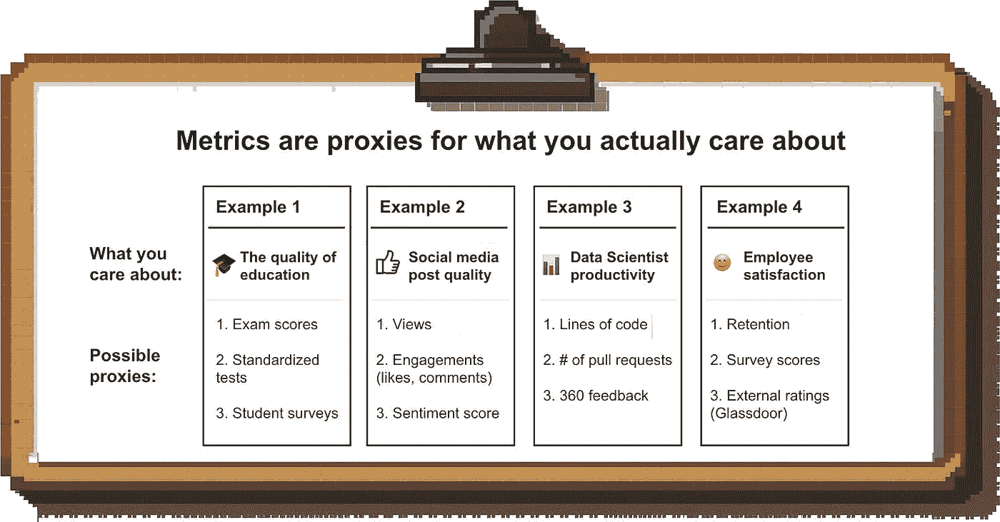
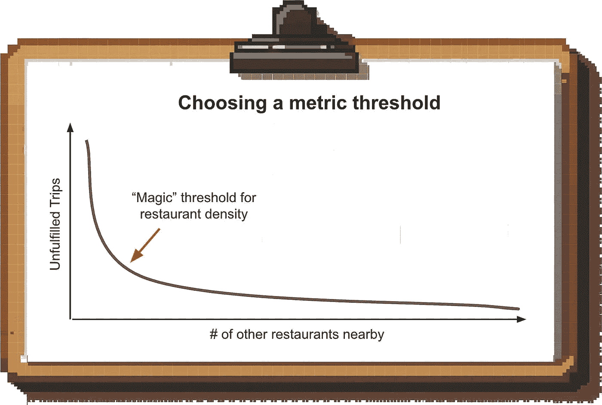
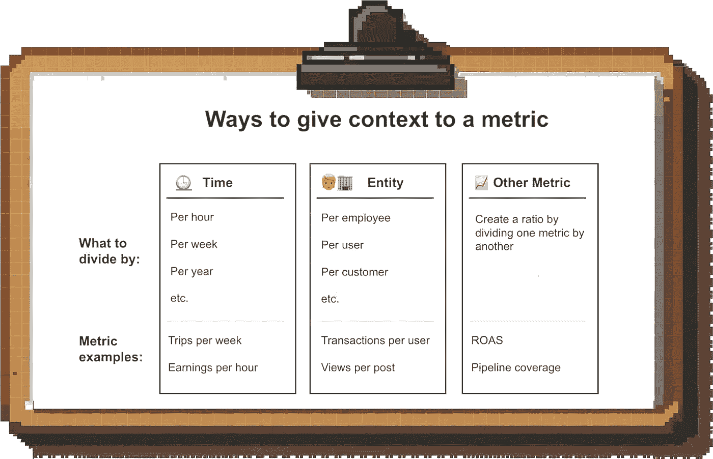

# 如何设计更好的指标

> 原文：[`towardsdatascience.com/how-to-design-better-metrics-9bad7bc8c875?source=collection_archive---------2-----------------------#2024-06-26`](https://towardsdatascience.com/how-to-design-better-metrics-9bad7bc8c875?source=collection_archive---------2-----------------------#2024-06-26)

## 来自像 Uber 和 Meta 等领先公司的 9 个最佳实践

 [Torsten Walbaum](https://medium.com/@twalbaum?source=post_page---byline--9bad7bc8c875--------------------------------)

·发布于 [Towards Data Science](https://towardsdatascience.com/?source=post_page---byline--9bad7bc8c875--------------------------------) ·阅读时间：11 分钟·2024 年 6 月 26 日

--

图片来自作者（通过 Midjourney 创建）

指标是一个强大的工具；它们帮助你衡量你关心的事情。拥有远大的目标是很好的，但为了知道自己是否在取得进展、激励团队并创造问责制，你需要能够用数字来表达这些目标。

但这说起来容易做起来难。有成百上千的指标看似在衡量相同的东西，每天都有新的时髦指标被发明出来。你应该使用哪些指标，应该避免哪些指标呢？**这篇文章将帮助你做出决定。**

在过去的十年里，我一直在研究和关注度量指标，发现有一些通用的原则可以区分好的指标和坏的指标：

# 原则一：一个指标应该是你试图衡量的事情的良好代理

你通常不能直接衡量你关心的具体事物。

假设我的目标是衡量我的新闻简报文章的质量；我该怎么做呢？“质量”是主观的，并没有公认的评估公式。因此，我必须选择一个最佳（或最不坏的）代理来衡量我的目标，**是我实际能够衡量的**。在这个例子中，我可以使用开启率、点赞数等作为质量的代理。

图片来自作者

这与人们常说的“指标的相关性”密切相关：如果你改善这个指标，它会为业务创造价值吗？如果不会，那为什么还要衡量它？

**例如，**假设你在 Uber 工作，想了解你的供应端是否健康。你可能认为平台上司机的数量，或者他们在应用程序上在线的时间，是一个不错的衡量标准。

这些指标并不糟糕，但它们并不能真正告诉你你的供给端是否*真正健康*（即**足以满足需求**）。可能是需求超出了司机的增长，或者大部分需求增长发生在早晨，而供给大多是在下午增长。

更好的指标应该是一个结合供给和需求的指标；例如，骑手打开应用时没有司机可用的次数。

 [## 每当 Torsten Walbaum 发布内容时，您将收到电子邮件通知。

### 每当 Torsten Walbaum 发布内容时，您将收到电子邮件通知。通过注册，如果您还没有账户，将会创建一个 Medium 账户…

medium.com](https://medium.com/@twalbaum/subscribe?source=post_page-----9bad7bc8c875--------------------------------)

# 原则二：该指标应该容易计算和理解

人们喜欢复杂的指标；毕竟，复杂的分析正是你支付给数据团队的费用，对吧？但复杂的指标有几个原因是危险的：

1.  **🤔 它们难以理解。** 如果你不完全理解一个指标是如何计算的，你就不知道如何解读其变化，或者如何影响它。

1.  **🧑‍🔬 它们迫使分析的集中化。** 通常，数据科学团队是唯一能够计算复杂指标的团队。这剥夺了其他团队进行去中心化分析的能力。

1.  ⚠️ **它们容易出错。** 复杂的指标通常需要多个团队的输入；我已经数不清多少次因为上游的某个输入出现问题而发现了错误。更糟糕的是，由于公司中只有少数人能够计算这些指标，同行评审非常少，错误往往会长时间无人察觉。

1.  **🔮 它们通常涉及预测。** 许多复杂的指标依赖于预测（例如，根据过去的数据预测群体表现）。这些预测通常不准确，并且随着新数据的到来而不断变化，从而造成困惑。

**以 LTV:CAC 为例**：

除了它[不是最适合的指标](https://elenaverna.substack.com/p/stop-optimizing-for-a-cacltv-ratio)外，它还很危险，因为它计算起来非常复杂。分子 CAC 需要你基于群体将市场营销和销售的各种成本进行汇总，而分母 LTV 则是基于保留率、增销等因素的预测。

这类指标是你会在两年后才意识到方法论存在问题，并且你一直在看“错误”的数据。

# 原则三：一个好的（操作性）指标应该是响应式的

如果你希望持续管理一个基于某个指标的业务，它需要是响应式的。如果一个指标滞后，即需要几周或几个月的时间才能看到变化影响到指标，那么你就无法获得反馈回路，也就无法进行持续改进。

你可能会倾向于通过预测变化的影响来解决这个问题，而不是等待它们在指标中显现出来，但这通常是不明智的（参见上面的原则#2）。

当然，像收入这样的滞后指标很重要，需要跟踪（特别是对于财务或领导层），但大多数团队应该将大部分时间花在查看领先指标上。

# 原则 4：一个指标应该难以被操控

一旦你选择了一个指标并让人们对改进这个指标负责，他们就会找到最有效的方式去实现目标。通常，这会导致意想不到的结果。**这里有一个例子：**

1.  Facebook 希望向用户展示相关内容，以增加他们在网站上的停留时间

1.  由于“相关性”很难衡量，他们使用参与度指标作为代理（点赞、评论等）

1.  出版商和创作者理解算法的运作方式，并找到心理操控的方式来增加参与度 ➡ 点击诱饵和[愤怒诱饵](https://en.wikipedia.org/wiki/Rage-baiting#:~:text=Rage%20baiting%20or%20farming%20can,memes%2C%20tropes%2C%20or%20comments.)应运而生

> “当一个衡量标准成为目标时，它就不再是一个好的衡量标准。”
> 
> *—— 古德哈特定律*

在上面的例子中，Facebook 可能会对质量的下降感到无所谓，只要用户继续在平台上花时间。但在许多情况下，如果指标在大规模上被操控，可能会造成严重的损害。

假设你提供了一个推荐奖励，用户通过推荐他人注册获得奖励。最有可能发生什么情况？人们会尝试创建大量虚假账户来领取奖励。一个更好的推荐标准应该要求在平台上进行一定金额的交易（例如，$25）才能获得奖励。

所以，防止操控的一种方式是**设计指标以限制你预见到的 unwanted 行为。另一种方法是将指标配对。** 这种方法由安迪·格罗夫在他的《高效能管理》一书中提出：

> “因为指标会引导一个人的活动，所以你应该警惕过度反应。你可以通过将指标配对来做到这一点，这样就能同时衡量效果和反效果。”
> 
> *—— 安迪·格罗夫，《高效能管理》*

**那在实践中是什么样的呢？** 如果你只通过“首次响应时间”来激励客户支持人员，因为你希望客户能够立即得到帮助，他们就会简单地对每个新工单发送一条通用消息。但如果你将其与工单解决时间（或客户满意度）作为目标配对，你就能确保代理商真正关注更快地解决客户问题。

# 原则 5：一个好的指标不应有任意的门槛

许多你会在科技公司看到的流行指标都与某个门槛相关。

**例如：**

+   # 至少有 5 个连接的用户

+   # 视频观看超过 1,000 次

这有道理；通常，单纯采取某个行动本身并不是一个非常有价值的信号，你需要设定一个阈值，才能让这个指标变得有意义。看完大部分视频的人与仅仅点击视频的人是非常不同的。

***但是：阈值不应是任意的。***

不要因为“1,000 次观看”是一个很好的整数就选择它；阈值应该基于数据来确定。1,000 次观看的视频之后会有更高的点击率吗？或者会产生更多后续的内容？更高的创作者留存率？

例如，Twitch [衡量](https://mixpanel.com/blog/scaling-without-losing-focus-on-meaningful-metrics-how-twitch-gets-it-right/)用户观看流媒体至少五分钟的次数。虽然数据显然对这个选择有所影响，但并不完全清楚他们为什么最终选择了五分钟。

在 Uber，我们尝试让数据告诉我们阈值应该设在哪里。例如，我们发现附近有很多其他餐厅的餐厅在 UberEats 上更可靠，因为这样更容易保持骑手的活跃度。我们根据图表中看到的“肘部”设定了我们认为低密度餐厅的阈值：

作者提供的图片

这种方法在许多业务领域都很有效；例如，我们还发现，一旦骑手或司机在平台上完成了一定数量的初始行程，他们就更可能留存。

**你不总是能找到像这样的“魔法”阈值，但在接受一个任意值之前，你应该尽量识别出一个阈值。**

# 原则六：好的指标创造背景

没有背景的绝对数字很少有帮助。你经常会看到像这样的新闻发布：

+   “为我们的客户处理了 10 亿条数据”，或者

+   “我们平台向创作者支付了 1 亿美元的收入”

这些数字本身并没有任何意义。为了使它们有意义，必须将它们放入背景中。平台上的每个创作者平均赚了多少钱？在什么时间范围内？换句话说，将绝对数字转化为比例，就能为它们增加背景信息。

作者提供的图片

当然，在上述例子中，有些是有意为之；公司并不希望公众知道这些细节。但这个问题不仅仅局限于新闻稿和博客文章。

从绝对值来看你的销售管道可能告诉你它是否随着时间增长；但要让它真正有意义，你必须将它与销售团队的规模或他们的配额联系起来。这给出了管道覆盖率，即管道与配额的比例，这是一个更有意义的指标。

创建这些类型的比例也使得比较更加有洞察力和公平；例如，比较每个部门的收入会让大部门看起来更好，但比较每个员工的收入则能真实反映生产力。

# 原则七：一个指标需要有明确的负责人来控制该指标

如果你想看到某个指标的变化，你需要有一个人负责改进它。

即使多个团队的工作有助于推动该指标，你仍然需要一个单一的“负责人”来负责实现目标（否则你最终只会看到很多相互指责）。

这里有三种可能的问题场景：

1.  **没有负责人。** 如果没有人专注于改进该指标，那么它将继续沿着当前的轨迹发展。

1.  **多个负责人。** 不明确的责任分配会导致摩擦和缺乏问责。例如，在 UberEats 曾有一段时间，不清楚某些指标是由本地城市团队还是中央运营团队负责。在一段短时间内，我们花更多时间开会讨论这个问题，而不是实际执行。

1.  **缺乏控制。** 指派一个无力（或感觉无力）推动指标变化的负责人，是失败的又一个原因。这可能是因为负责人没有直接控制该指标的杠杆，缺乏预算，或者缺乏其他团队的支持。

# 原则 8：好的指标最小化噪音

一个指标只有在你能够解读其变化时才具有可操作性。为了获得清晰的解读，你需要尽可能消除“噪音”源。

**例如：** 假设你是一个小型 B2B SaaS 初创公司，并且将网站流量作为你漏斗顶部的领先指标。如果你仅仅看“原始”访问量，你将会受到自己员工、朋友和家人以及现有客户访问网站的噪音干扰，你可能会发现网站流量与漏斗下游指标之间几乎没有关联。

如果可能，排除这些流量来源，以便你能更好地了解你的潜在客户漏斗的实际情况。

# 原则 9：某些指标应成为行业标准

对于某些指标，能够在公司之间进行比较是非常重要的。例如，如果你在 B2B SaaS 领域，你的 CFO 会希望将你的净收入保持率（NRR）、客户获取成本回收期（CAC Paybacks）或魔法数字（Magic Number）与竞争对手进行比较（你的投资者也会有同样的需求）。

如果你以非市场标准的方式计算这些指标，你将无法通过基准测试获得任何洞察，还会引起大量混乱。这并不是说你不应该创造新的指标；事实上，我在我的职业生涯中自己也创造了几个（并且可能会写一篇单独的文章，介绍如何做到这一点）。

但大多数财务和效率指标的定义最好不要随意修改。

# 总结

以上所有内容都说明了一点：**没有适用于所有场景的*完美*指标**。每个指标都会有缺点，你需要选择“最不糟糕”的那个。

希望以上原则能帮助你做到这一点。

想要更多实用的分析建议，可以考虑在 Medium 上关注我，或者在[LinkedIn](http://www.linkedin.com/comm/mynetwork/discovery-see-all?usecase=PEOPLE_FOLLOWS&followMember=torsten-walbaum)或[Substack](https://www.operatorshandbook.com/)上关注我。

# 奖金：度量标准的耻辱殿堂

一个度量标准不应该被创造出来以支持商业叙事或掩盖不便的真相。这个听起来很显而易见，但实际上有很多奇怪的度量标准是为了这个目的而创造的：

## 1\. WeWork 的社区调整 EBITDA：

最“创造性”的度量标准颁给了 WeWork 的社区调整 EBITDA。

调整后的 EBITDA 一直被认为是一个什么都可以做的领域；但 WeWork 的度量标准乍一看显得特别“有创意”。除了利息、税收、折旧和摊销外，WeWork 还扣除了如市场营销、一般及行政费用等项目。

其目的是展示单位经济学的一个衡量标准，这并不罕见。但 WeWork 并没有很好地解释这一度量标准的目的，导致了（可以理解的）反感和嘲笑。

## 2\. 埃隆·马斯克为 X 公司提出的“未后悔用户分钟数”：

当你的核心互动度量标准，如 DAU，暴跌时，你会怎么做？你告诉人们这些度量标准并不重要，并创造一个新的度量标准来专注于它。于是：未后悔用户分钟数。

你问，怎么衡量这个？X 之外的人都不知道；如果我要猜的话，X 内部的人可能也不知道。

社交媒体绝对是一个可以从单纯的互动度量转向更考虑用户体验质量的领域，但这更可能是一个（掩饰得很薄弱的）尝试，用来转移人们对 X 公司困境的注意力。

## 3\. Netflix 2019 年“观看”定义的变化：

你如何在不做任何实际操作的情况下提高平台上的互动？

你改变了互动的计量标准！

直到 2019 年底，Netflix 将任何观看超过 70%的电影或电视剧集视为一次观看。到了 2019 年底，他们将阈值设定为 2 分钟；这甚至不足以看完大部分电视剧的开场片段。所以，如果有人在片头字幕播放之前退出，也算作一次观看。毫无意外，新数据显示的数字大约高出了 35%。

Netflix 此后再次更改了他们的度量标准，公平地说，新的标准看起来更为合理（总观看时长除以片长；即实际上是“完整观看”）。
