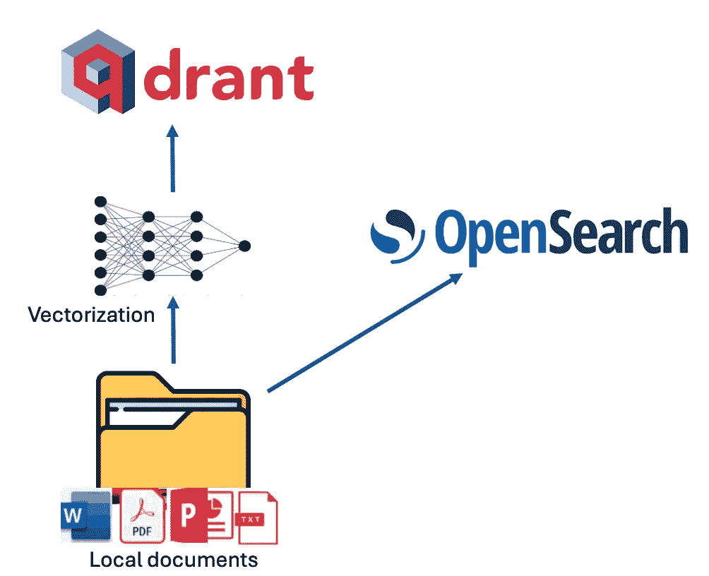
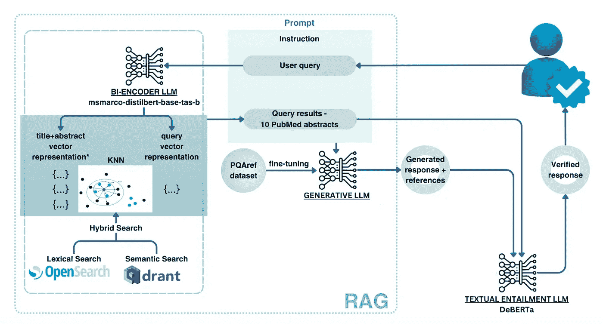
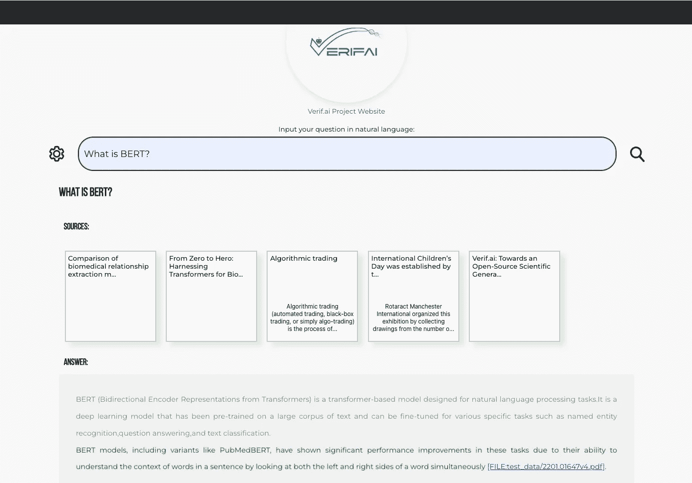
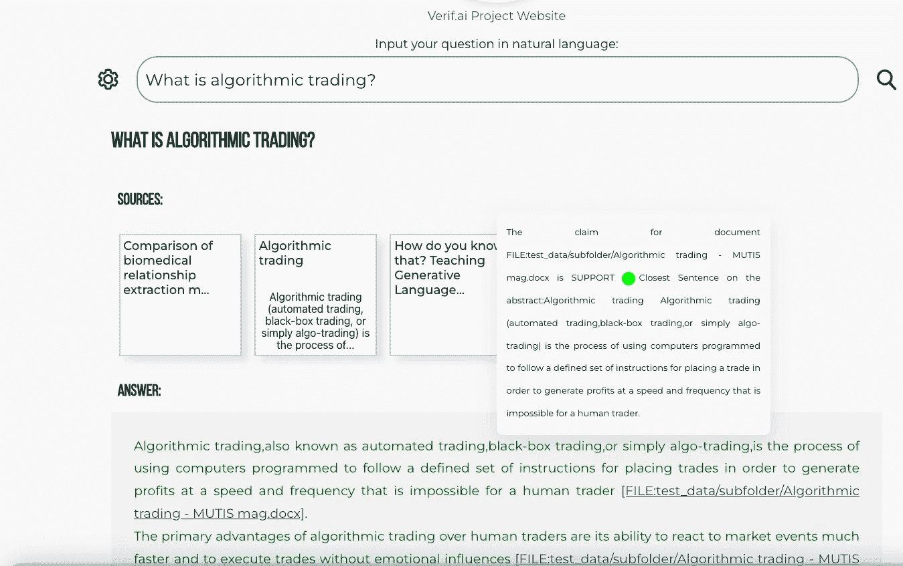

# 如何轻松部署本地生成式搜索引擎使用 VerifAI

> 原文：[`towardsdatascience.com/how-to-easily-deploy-a-local-generative-search-engine-using-verifai-cdf9dedf53c0?source=collection_archive---------4-----------------------#2024-11-21`](https://towardsdatascience.com/how-to-easily-deploy-a-local-generative-search-engine-using-verifai-cdf9dedf53c0?source=collection_archive---------4-----------------------#2024-11-21)

## 一个开源倡议，帮助你基于本地文件和自托管（Mistral, Llama 3.x）或商业 LLM 模型（GPT4, GPT4o 等）部署生成式搜索。

[](https://datawarrior.medium.com/?source=post_page---byline--cdf9dedf53c0--------------------------------)[](https://towardsdatascience.com/?source=post_page---byline--cdf9dedf53c0--------------------------------) [Nikola Milosevic (Data Warrior)](https://datawarrior.medium.com/?source=post_page---byline--cdf9dedf53c0--------------------------------)

·发布于[Towards Data Science](https://towardsdatascience.com/?source=post_page---byline--cdf9dedf53c0--------------------------------) ·8 分钟阅读·2024 年 11 月 21 日

--

我之前曾写过关于构建自己的简单生成式搜索引擎的文章，也写过关于 VerifAI 项目的文章，发布在《Towards Data Science》网站上。然而，这次有一个重大更新值得重新关注。最初，VerifAI 被开发为一个生物医学生成式搜索引擎，提供参考资料和 AI 验证的答案。这个版本仍然可以使用，我们现在称之为**VerifAI BioMed**。可以在这里访问：[`app.verifai-project.com/`](https://app.verifai-project.com/)。

**然而，主要的更新是，你现在可以索引本地文件，并将它们转化为你自己的生成式搜索引擎**（或者称之为生产力引擎，正如一些人称基于 GenAI 的这些系统）。它也可以作为企业或组织的生成式搜索引擎。我们称这个版本为**VerifAI Core**，因为它作为其他版本的基础。在本文中，我们将探讨如何通过几个简单的步骤来部署它并开始使用。鉴于它是用 Python 编写的，所以可以在任何操作系统上运行。

# 架构

描述生成式搜索引擎的最佳方式是将其分解为三个部分（或组件，在我们的案例中）：

+   索引

+   检索增强生成（RAG）方法

+   VerifAI 包含一个附加组件，即一个验证引擎，位于常规生成式搜索功能之上。

在 VerifAI 中进行索引可以通过将其索引脚本指向包含 PDF、MS Word、PowerPoint、Text 或 Markdown (.md) 文件的本地文件夹来完成。该脚本读取并索引这些文件。索引是以双重模式执行的，同时利用词汇和语义索引。

对于词汇索引，VerifAI 使用**OpenSearch**。对于语义索引，它使用在配置文件中指定的嵌入模型对文档块进行向量化（支持来自**Hugging Face**的模型），然后将这些向量存储在**Qdrant**中。这个过程的视觉表示如下图所示。



索引架构（图由作者提供）

当使用 VerifAI 来回答问题时，方法有些复杂。用户问题以自然语言编写，经过预处理（例如，排除停用词），然后转化为查询。

对于**OpenSearch**，只执行词汇处理（例如，排除停用词），并检索最相关的文档。对于**Qdrant**，查询会使用与存储在 Qdrant 中的文档块相同的模型进行嵌入。这些嵌入随后用于查询 Qdrant，基于**点积相似度**检索最相似的文档。使用点积是因为它考虑了向量的角度和大小。

最后，必须将两个引擎的结果合并。这是通过将每个引擎的检索得分标准化到 0 和 1 之间来完成的（通过将每个得分除以其各自引擎中的最高得分）。然后，将对应于同一文档的得分相加，并按合并后的得分降序排序。

使用检索到的文档，构建一个提示。该提示包含指令、最相关的文档和用户的问题。然后，将该提示传递给选择的大型语言模型（可以在配置文件中指定，如果未设置模型，则默认为我们本地部署并微调的 Mistral 版本）。最后，应用验证模型以确保没有幻觉，答案通过 GUI 呈现给用户。该过程的示意图如下图所示。



检索、生成和验证架构（图由作者提供）。该模型基于以下论文的结合：[`arxiv.org/pdf/2407.11485`](https://arxiv.org/pdf/2407.11485)，[`aclanthology.org/2024.bionlp-1.44/`](https://aclanthology.org/2024.bionlp-1.44/)

# 安装必要的库

要安装 VerifAI 生成式搜索，可以先从 GitHub 克隆最新的代码库或使用可用的版本之一。

```py
git clone https://github.com/nikolamilosevic86/verifAI.git
```

在安装 VerifAI Search 时，建议首先创建一个干净的 Python 环境。我已经在 Python 3.6 上进行了测试，但它应该适用于大多数 Python 3 版本。然而，Python 3.10 及以上版本可能会与某些依赖项存在兼容性问题。

要创建一个 Python 环境，可以使用 `venv` 库，如下所示：

```py
python -m venv verifai
source verifai/bin/activate 
```

激活环境后，你可以安装所需的库。需求文件位于`verifAI/backend`目录中**。**你可以运行以下命令来安装所有依赖项：

```py
pip install -r requirements.txt
```

# 配置系统

下一步是配置 VerifAI 及其与其他工具的交互。可以通过直接设置环境变量或使用环境文件（首选选项）来完成。

在 `backend` 文件夹中提供了一个 VerifAI 环境文件的示例，文件名为 `.env.local.example`。你可以将此文件重命名为 `.env`，VerifAI 后端将自动读取该文件。文件结构如下：

```py
SECRET_KEY=6293db7b3f4f67439ad61d1b798242b035ee36c4113bf870
ALGORITHM=HS256

DBNAME=verifai_database
USER_DB=myuser
PASSWORD_DB=mypassword
HOST_DB=localhost

OPENSEARCH_IP=localhost
OPENSEARCH_USER=admin
OPENSEARCH_PASSWORD=admin
OPENSEARCH_PORT=9200
OPENSEARCH_USE_SSL=False

QDRANT_IP=localhost
QDRANT_PORT=6333
QDRANT_API=8da7625d78141e19a9bf3d878f4cb333fedb56eed9097904b46ce4c33e1ce085
QDRANT_USE_SSL=False

OPENAI_PATH=<model-deployment-path>
OPENAI_KEY=<model-deployment-key>
OPENAI_DEPLOYMENT_NAME=<name-of-model-deployment>
MAX_CONTEXT_LENGTH=128000

USE_VERIFICATION = True

EMBEDDING_MODEL="sentence-transformers/msmarco-bert-base-dot-v5"

INDEX_NAME_LEXICAL = 'myindex-lexical'
INDEX_NAME_SEMANTIC = "myindex-semantic"
```

一些变量相当直观。第一个密钥和算法用于前端与后端之间的通信。

接下来是配置访问**PostgreSQL**数据库的变量。需要提供数据库名称（**DBNAME**）、用户名、密码以及数据库所在的主机地址。在我们的例子中，它位于 localhost 上，是在 Docker 镜像中。

下一部分是配置**OpenSearch**访问。包括 IP 地址（在我们的例子中仍是 localhost）、用户名、密码、端口号（默认端口为 9200），以及定义是否使用 SSL 的变量。

一个类似的配置部分是**Qdrant**，对于 Qdrant，我们使用一个 API 密钥，必须在此处定义。

下一部分定义了生成模型。VerifAI 使用了 OpenAI Python 库，这已成为行业标准，并允许它同时使用**OpenAI API、Azure API**、**以及通过 vLLM、OLlama 或** [**Nvidia NIMs**](https://developer.nvidia.com/nim)**。** 用户需要定义接口路径、API 密钥以及将要使用的模型部署名称。我们即将增加支持，允许用户修改或更改用于生成的提示。如果没有提供接口路径和密钥，模型将下载我们已经微调的 Mistral 7B 模型，并部署到本地。但是，如果你的 GPU 内存不足，或者内存总量不足，这可能会失败，或者运行非常缓慢。

你还可以设置**MAX_CONTEXT_LENGTH**，在这种情况下它设置为 128,000 个 token，因为这是 GPT4o 的上下文大小。上下文长度变量用于构建上下文。通常，它通过输入有关回答问题的指令（要事实性回答，并提供参考资料），然后提供检索到的相关文档和问题来构建上下文。然而，文档可能很大，超过上下文长度。如果发生这种情况，文档将被分割成多个部分，并选择最适合上下文大小的前 n 个部分。

下一部分包含用于在 Qdrant 中嵌入文档的模型的 HuggingFace 名称。最后，还列出了在 OpenSearch (**INDEX_NAME_LEXICAL**) 和 Qdrant (**INDEX_NAME_SEMANTIC**) 中的索引名称。

如我们之前所说，VerifAI 有一个组件，用于验证生成的声明是否基于提供的和引用的文档。然而，这个功能可以开启或关闭，因为对于某些用例，可能不需要此功能。可以通过将 **USE_VERIFICATION** 设置为 False 来关闭此功能。

# 安装数据存储

安装的最后一步是运行 `install_datastores.py` 文件。在运行此文件之前，您需要安装 Docker 并确保 Docker 守护进程正在运行。由于该文件读取用于设置用户名称、密码或 API 密钥的配置，因此需要首先创建配置文件。下一节会对此进行说明。

该脚本设置了必要的组件，包括 OpenSearch、Qdrant 和 PostgreSQL，并在 PostgreSQL 中创建了数据库。

```py
python install_datastores.py
```

请注意，此脚本在没有 SSL 证书的情况下安装 Qdrant 和 OpenSearch，以下说明假设不需要 SSL。如果生产环境中需要 SSL，您需要手动配置它。

另外，请注意，我们在此讨论的是在 Docker 上的本地安装。如果您已经部署了 Qdrant 和 OpenSearch，只需更新配置文件，指向这些实例即可。

# 索引文件

此配置由索引方法和后台服务共同使用。因此，必须在索引之前完成该配置。配置完成后，可以通过将 **index_files.py** 指向包含要索引文件的文件夹来运行索引过程：

```py
python index_files.py <path-to-directory-with-files>
```

我们在仓库中包含了一个名为 **test_data** 的文件夹，其中包含几个测试文件（主要是我的论文和其他过去的写作）。您可以用自己的文件替换这些文件，并运行以下命令：

```py
python index_files.py test_data
```

这将对该文件夹及其子文件夹中的所有文件进行索引。完成后，可以运行 VerifAI 服务，供后台和前端使用。

# 运行生成性搜索

只需运行以下命令，即可启动 VerifAI 后台：

```py
python main.py
```

这将启动 FastAPI 服务，作为后台服务，传递请求给 OpenSearch 和 Qdrant，以检索给定查询的相关文件，并部署 LLM 生成答案，同时利用本地模型进行声明验证。

前端是一个名为 client-gui/verifai-ui 的文件夹，使用 React.js 编写，因此需要本地安装 Node.js 和 npm。然后，您可以通过运行 npm install 安装依赖项，并通过运行 npm start 启动前端：

```py
cd ..
cd client-gui/verifai-ui
npm install
npm start
```

最后，安装完成后，系统应该大致如下所示：



启用验证功能后的一个示例问题（绿色文本）并引用文件，文件可以下载（截图由作者提供）



截图展示了已验证声明的工具提示，并呈现了文章中最相似的句子（截图由作者提供）

# 贡献与未来方向

到目前为止，VerifAI 得到了来自欧盟资助的“下一代互联网搜索”项目的帮助。它由塞尔维亚人工智能研究与发展研究所和拜耳公司（Bayer A.G.）联合开发。第一版作为一个面向生物医学的生成搜索引擎开发。该产品将继续在 [`app.verifai-project.com/`](https://app.verifai-project.com/) 上运行。然而，最近我们决定扩展该项目，使其能够真正成为一个开源的生成搜索引擎，能够为任何文件提供可验证的答案，且可以被不同的企业、中小型公司、非政府组织或政府广泛使用。这些修改是由 Natasa Radmilovic 和我自愿开发的（特别感谢 Natasa！）。

然而，鉴于这是一个开源项目，托管在 GitHub 上（[`github.com/nikolamilosevic86/verifAI`](https://github.com/nikolamilosevic86/verifAI)），我们欢迎任何人通过拉取请求、错误报告、功能请求、讨论或其他任何形式的贡献（欢迎随时联系我们——对于 BioMed 和 Core 版本（如此处所述的文档生成搜索），网站将保持不变——[`verifai-project.com`](https://verifai-project.com)）。因此，我们欢迎您贡献代码、启动我们的项目，并在未来关注我们。
