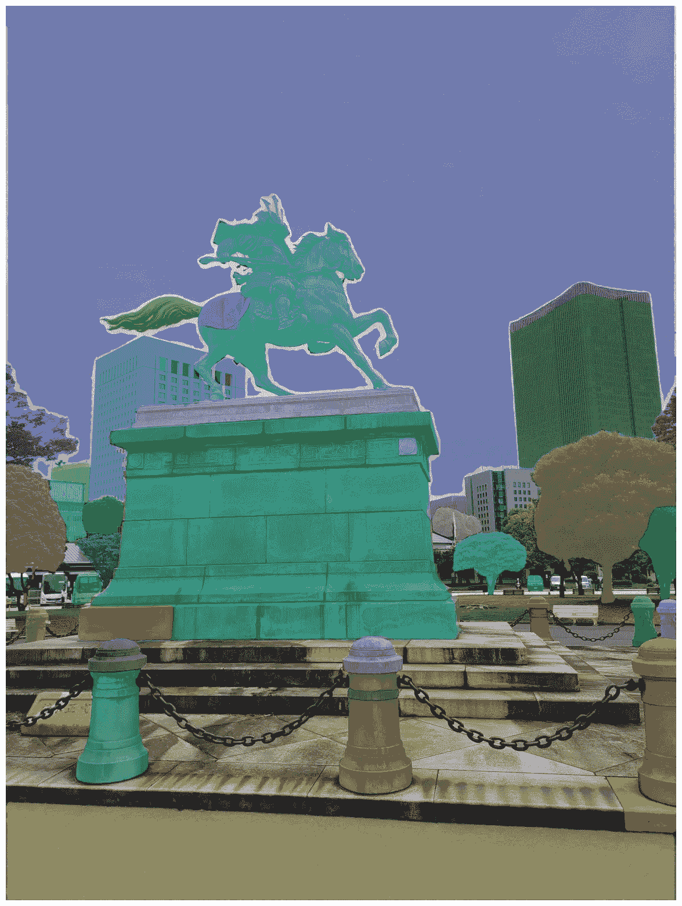

# 如何有效地使用 Meta 的图像分割模型：SAM 2

> 原文：[`towardsdatascience.com/how-to-effectively-detect-objects-with-metas-image-segmentation-model-sam-2-630141595e68?source=collection_archive---------4-----------------------#2024-08-27`](https://towardsdatascience.com/how-to-effectively-detect-objects-with-metas-image-segmentation-model-sam-2-630141595e68?source=collection_archive---------4-----------------------#2024-08-27)

## 学习如何利用 Meta 的新 SAM 2 模型进行任何物体的分割

 [Eivind Kjosbakken](https://oieivind.medium.com/?source=post_page---byline--630141595e68--------------------------------)

·发布于[Towards Data Science](https://towardsdatascience.com/?source=post_page---byline--630141595e68--------------------------------) ·9 分钟阅读·2024 年 8 月 27 日

--

Segment Anything Model 2（SAM2）是 Meta 最新的图像分割模型，能够检测并标记图像和代码中的物体。本文将展示如何下载并利用这个模型，同时回顾该模型及其功能。使用图像分割模型是令人兴奋的，因为你可以立即看到模型的结果，并了解其表现如何，因为分割是一个你的大脑本身就擅长的任务。因此，你可以迅速判断一个图像分割模型的表现是否优秀。

这是一个 SAM 2 应用于武士雕像的示例。图片展示了 SAM 2 如何有效地检测图像中的不同物体。图片由作者提供。

# 动机

我写这篇文章的动机来源于我关于跟进机器学习领域最新模型的系列文章。SAM2 是 Meta 最近发布的一个模型，Meta 是一家不断推出先进开源机器学习模型的公司。我之前已经写过关于亚马逊 Chronos 预测模型，[Llama3](https://medium.com/towards-data-science/unleash-llama3-how-you-can-use-the-latest-big-tech-open-source-llm-3bae9c3f5cd0)，以及其他几个 AI 模型的文章。本文将重点介绍 SAM2，如何使用这个模型，模型可以应用于哪些任务，以及它的表现如何。这个模型也以 Apache 2.0 许可证发布，意味着你可以自由地在商业环境中使用该模型，在我看来，这使得这个模型更加...
