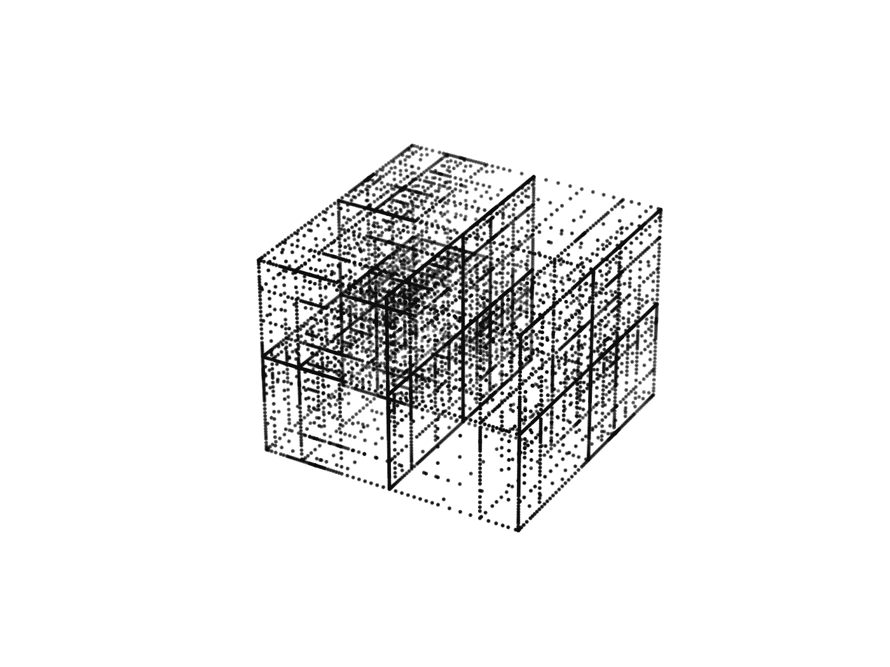

# 如何高效逼近一个或多个变量的函数

> 原文：[`towardsdatascience.com/how-to-efficiently-approximate-a-function-of-one-or-more-variables-fc702c9c9431?source=collection_archive---------12-----------------------#2024-06-28`](https://towardsdatascience.com/how-to-efficiently-approximate-a-function-of-one-or-more-variables-fc702c9c9431?source=collection_archive---------12-----------------------#2024-06-28)

## 使用稀疏网格和切比雪夫插值法来构建多变量函数的精确近似。

 [Ryan Burn](https://medium.com/@ryan.burn?source=post_page---byline--fc702c9c9431--------------------------------)

·发表于 [Towards Data Science](https://towardsdatascience.com/?source=post_page---byline--fc702c9c9431--------------------------------) ·阅读时长 13 分钟·2024 年 6 月 28 日

--

在切比雪夫-高斯-洛巴托节点上的自适应稀疏网格。图由作者提供。

考虑这个近似问题：假设你有一个函数 *f(***x***),* **x** ∈ [-1, 1]^p，该函数计算代价昂贵；因此，你希望构建一个新的函数 *f’*，它计算便宜，但能准确地在 [-1, 1]^p 上逼近 *f*，并且使用尽可能少的 *f* 评估。

这种近似方法在统计学及其他领域有着广泛的应用。例如，*f* 可能表示一个概率密度函数，其中评估需要昂贵的积分运算，而高效的近似方法可以为你提供一种计算可信集的机制。

在这篇博客中，我将介绍两种构建函数近似的强大技术：切比雪夫插值法和自适应稀疏网格。

切比雪夫插值法是近似的基本构建块。如果 *f* 稍微光滑一点（例如，满足利普希茨连续性），那么切比雪夫插值法将会收敛；如果 *f* 是可高阶微分的或者是解析的，切比雪夫插值法将极其迅速地收敛（比其他技术如三次样条插值要好得多）[1, 2]。
