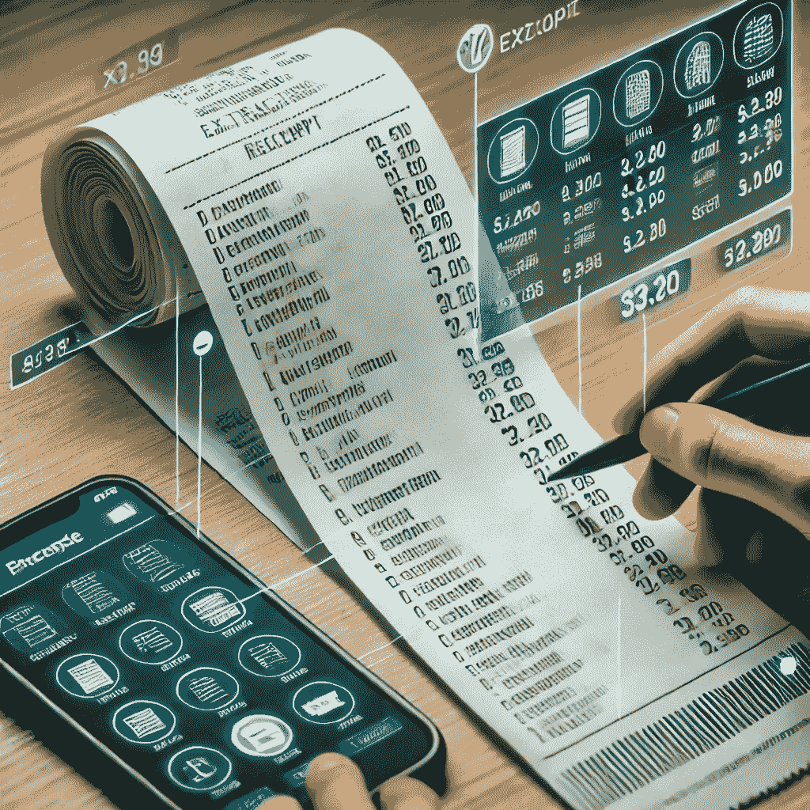

# 如何轻松利用 OCR 和 GPT-4o mini 提取收据信息

> 原文：[`towardsdatascience.com/how-to-effortlessly-extract-receipt-information-with-ocr-and-gpt-4o-mini-0825b4ac1fea?source=collection_archive---------0-----------------------#2024-08-20`](https://towardsdatascience.com/how-to-effortlessly-extract-receipt-information-with-ocr-and-gpt-4o-mini-0825b4ac1fea?source=collection_archive---------0-----------------------#2024-08-20)

## 利用 OCR 和强大的 GPT-4o mini 模型对收据进行信息提取

 [Eivind Kjosbakken](https://oieivind.medium.com/?source=post_page---byline--0825b4ac1fea--------------------------------)

·发表在[Towards Data Science](https://towardsdatascience.com/?source=post_page---byline--0825b4ac1fea--------------------------------)·阅读 13 分钟·2024 年 8 月 20 日

--

在本文中，我将向您展示如何从收据中提取信息，给出收据的简单图像。首先，我们将利用 OCR 从收据中提取信息。然后，这些信息将被发送到 GPT-4o mini 模型进行信息提取。我这个项目的目标是开发一个应用程序，通过拍摄收据的图像并选择哪些物品属于哪个人，来简单地帮助朋友们分账。本文将重点放在这个目标的信息提取部分。

利用 OCR 和 GPT-4o mini 从收据中提取信息。图片由 ChatGPT 提供。OpenAI。 (2024)。*ChatGPT* (4o) [大型语言模型]。[`chatgpt.com/c/c567fd8c-1955-4af9-8566-0a9393e970e5`](https://chatgpt.com/c/c567fd8c-1955-4af9-8566-0a9393e970e5)

本文中开发的应用程序可以在[Google Play](https://play.google.com/store/apps/details?id=com.billsplitt)上访问。

# 动机

浏览收据并计算每个人的份额是一件麻烦事，例如，在餐厅用餐后。我多次遇到这个问题，因此希望找到一个解决方案，使这个过程更有效。因此，我想到了 *BillSplitter* 应用程序。这个想法是用户可以拍摄收据的图像，应用程序将利用 OCR 和语言模型处理收据并提取每个物品及其对应价格，用户只需简单选择...
