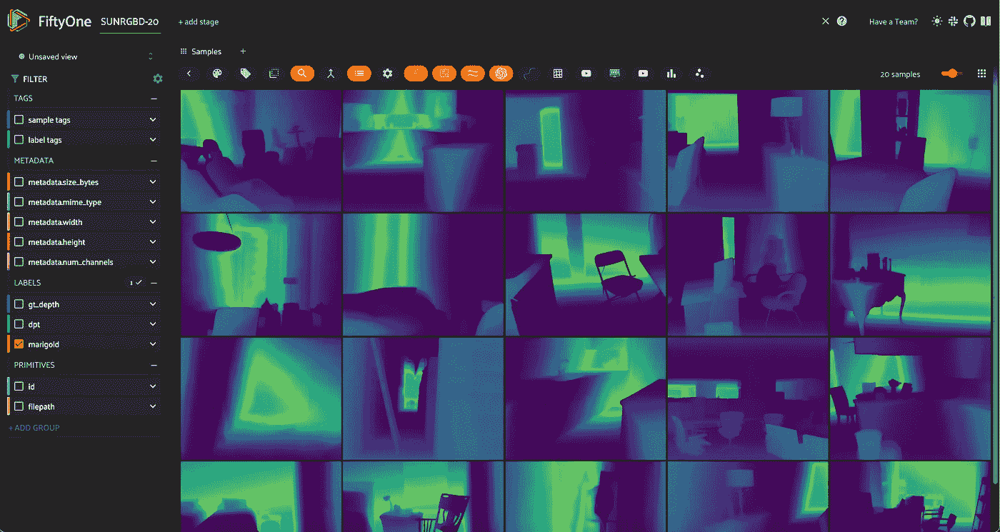
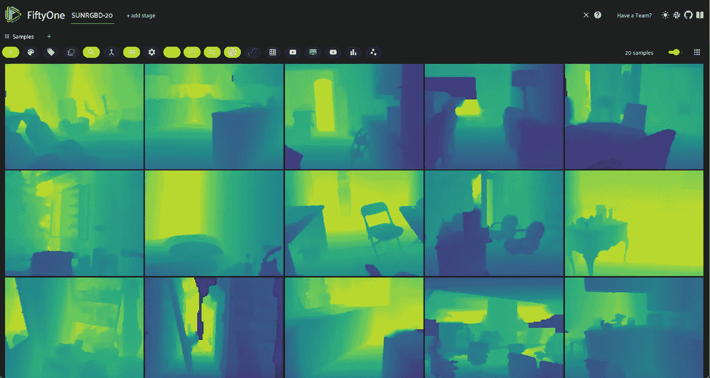
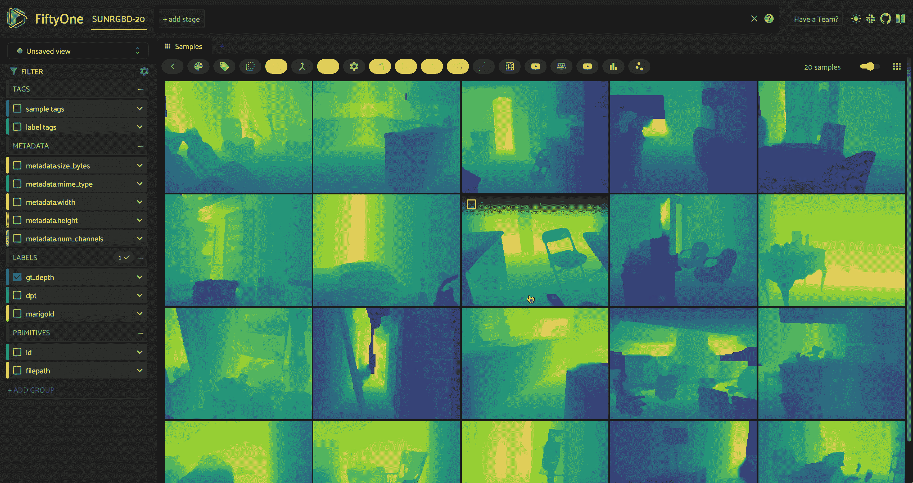
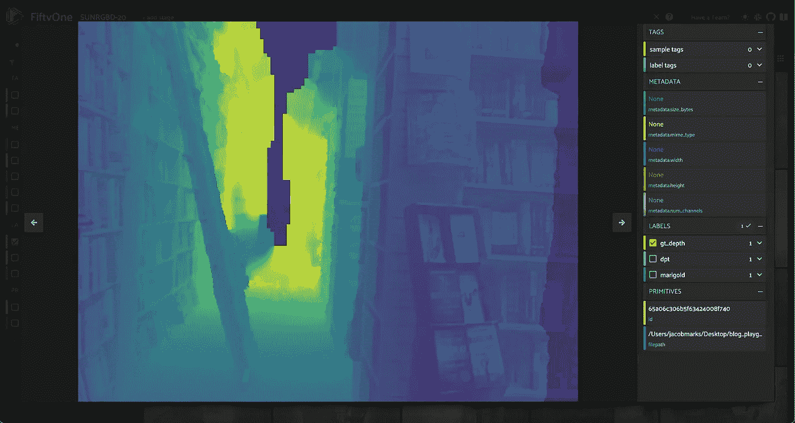
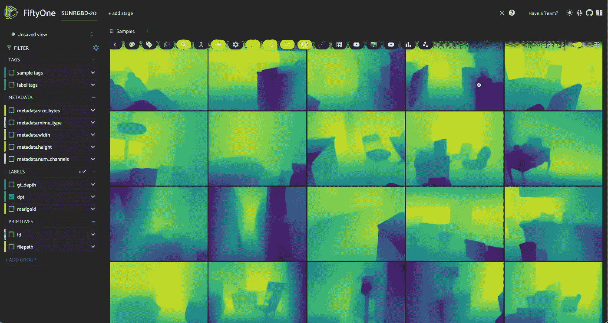
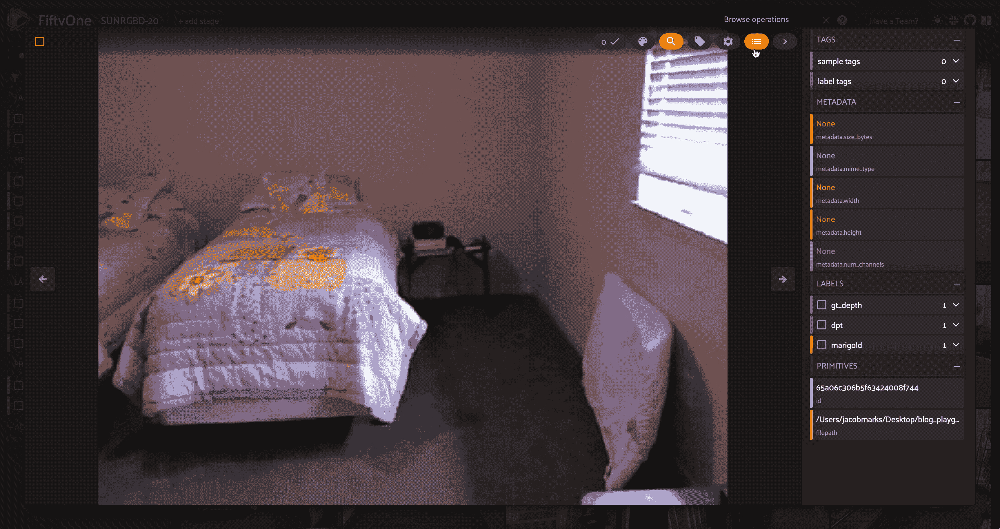

# 如何从单张图像中估计深度

> 原文：[`towardsdatascience.com/how-to-estimate-depth-from-a-single-image-7f421d86b22d?source=collection_archive---------0-----------------------#2024-01-25`](https://towardsdatascience.com/how-to-estimate-depth-from-a-single-image-7f421d86b22d?source=collection_archive---------0-----------------------#2024-01-25)

## 使用 Hugging Face 和 FiftyOne 运行并评估单目深度估计模型

[](https://medium.com/@jacob_marks?source=post_page---byline--7f421d86b22d--------------------------------)[](https://towardsdatascience.com/?source=post_page---byline--7f421d86b22d--------------------------------) [Jacob Marks, Ph.D.](https://medium.com/@jacob_marks?source=post_page---byline--7f421d86b22d--------------------------------)

·发表于 [Towards Data Science](https://towardsdatascience.com/?source=post_page---byline--7f421d86b22d--------------------------------) ·10 分钟阅读·2024 年 1 月 25 日

--



使用 Marigold 在 NYU 深度 v2 图像上生成的单目深度热图。图片由作者提供。

人类通过两只眼睛看世界。双眼视力的一个主要优点是能够感知*深度*——物体离近还是远。人脑通过比较左眼和右眼同时捕捉到的图像，并解释这些差异，从而推断物体的深度。这个过程被称为[立体视觉](https://en.wikipedia.org/wiki/Stereopsis)。

就像深度感知在人类视觉和导航中发挥着关键作用一样，估计深度的能力对于广泛的计算机视觉应用也至关重要，从自动驾驶到机器人，再到增强现实。然而，由于空间限制和预算约束等一系列实际考虑，常常使这些应用仅限于单一摄像头。

[单目深度估计](https://paperswithcode.com/task/monocular-depth-estimation)（MDE）是从单张图像中预测场景深度的任务。由于从单张图像计算深度本质上是模糊的，因为同一个 3D 场景可以有多种方式投影到图像的 2D 平面上，因此 MDE 是一项具有挑战性的任务，需要（显式或隐式）考虑许多线索，如物体大小、遮挡和透视。

在这篇文章中，我们将展示如何加载和可视化深度图数据，运行单目深度估计模型，并评估深度预测。我们将使用来自 [SUN RGB-D](https://rgbd.cs.princeton.edu/) 数据集的数据进行演示。

具体来说，我们将涵盖以下内容：

+   加载和可视化 SUN-RGBD 真实深度图

+   使用 Marigold 和 DPT 进行推理

+   评估相对深度预测

我们将使用 Hugging Face 的[transformers](https://huggingface.co/docs/transformers/index)和[diffusers](https://huggingface.co/docs/diffusers/index)库进行推理，使用[FiftyOne](https://github.com/voxel51/fiftyone)进行数据管理和可视化，使用[scikit-image](https://scikit-image.org/)进行评估指标。所有这些库都是开源的，可以免费使用。*免责声明：我在 Voxel51 工作，该公司是这些库之一（FiftyOne）的主要维护者。*

在开始之前，确保你已经安装了所有必要的库：

```py
pip install -U torch fiftyone diffusers transformers scikit-image
```

然后，我们将导入在整个文章中使用的模块：

```py
from glob import glob
import numpy as np
from PIL import Image
import torch

import fiftyone as fo
import fiftyone.zoo as foz
import fiftyone.brain as fob
from fiftyone import ViewField as F
```

# 加载和可视化 SUN-RGBD 深度数据

[SUN RGB-D 数据集](https://rgbd.cs.princeton.edu/)包含 10,335 张 RGB-D 图像，每张图像都有对应的 RGB 图像、深度图像和相机内参。它包含来自[NYU Depth v2](https://cs.nyu.edu/~silberman/datasets/nyu_depth_v2.html)、伯克利[B3DO](http://kinectdata.com/)和[SUN3D](https://sun3d.cs.princeton.edu/)数据集的图像。SUN RGB-D 是[最受欢迎的](https://paperswithcode.com/dataset/sun-rgb-d)单目深度估计和语义分割任务数据集之一！

💡对于本教程，我们只使用 NYU Depth v2 部分。NYU Depth v2 是[允许商业使用的许可](https://github.com/dwofk/fast-depth/blob/master/LICENSE)（MIT 许可证），可以直接[从 Hugging Face 下载](https://huggingface.co/datasets/sayakpaul/nyu_depth_v2)。

## 下载原始数据

首先，从[这里](https://rgbd.cs.princeton.edu/)下载 SUN RGB-D 数据集并解压，或者使用以下命令直接下载：

```py
curl -o sunrgbd.zip https://rgbd.cs.princeton.edu/data/SUNRGBD.zip
```

然后解压它：

```py
unzip sunrgbd.zip
```

如果你想将数据集用于其他任务，你可以完全转换注释并加载到你的`fiftyone.Dataset`中。但是，对于本教程，我们只使用深度图像，所以我们只会使用 RGB 图像和深度图像（存储在`depth_bfx`子目录中）。

## 创建数据集

因为我们只关注传达核心内容，所以我们将限制在前 20 个样本，这些样本都来自 NYU Depth v2 数据集部分：

```py
## create, name, and persist the dataset
dataset = fo.Dataset(name="SUNRGBD-20", persistent=True)

## pick out first 20 scenes
scene_dirs = glob("SUNRGBD/kv1/NYUdata/*")[:20]

samples = []

for scene_dir in scene_dirs:
    ## Get image file path from scene directory
    image_path = glob(f"{scene_dir}/image/*")[0]

    ## Get depth map file path from scene directory
    depth_path = glob(f"{scene_dir}/depth_bfx/*")[0]

    depth_map = np.array(Image.open(depth_path))
    depth_map = (depth_map * 255 / np.max(depth_map)).astype("uint8")

    ## Create sample
    sample = fo.Sample(
        filepath=image_path,
        gt_depth=fo.Heatmap(map=depth_map),
    )

    samples.append(sample)

## Add samples to dataset
dataset.add_samples(samples);
```

这里我们将深度图像存储为[热图](https://docs.voxel51.com/user_guide/using_datasets.html#heatmaps)。所有内容都以标准化的*相对*距离表示，其中 255 代表场景中的最大距离，0 代表场景中的最小距离。这是表示深度图像的常见方式，尽管这不是唯一的方式。如果我们关注*绝对*距离，我们可以存储每个样本的最小和最大距离参数，并使用这些参数从相对距离中重建绝对距离。

## 可视化真实数据

有了存储在样本中的热图，我们可以可视化地面真实数据：

```py
session = fo.launch_app(dataset, auto=False)
## then open tab to localhost:5151 in browser
```



来自 SUN RGB-D 数据集的样本的地面真实深度图。图片由作者提供。

在处理深度图时，热图的色彩方案和透明度非常重要。我是色盲，因此我发现[viridis](https://cran.r-project.org/web/packages/viridis/vignettes/intro-to-viridis.html)色图并将透明度调到最大最适合我。



热图的可视化设置。图片由作者提供。

## 地面真实值？

通过检查这些 RGB 图像和深度图，我们可以看到地面真实深度图中存在一些不准确之处。例如，在这张图像中，图像中心的深色裂缝实际上是场景中最*远*的部分，但地面真实深度图却显示它是场景中*最近*的部分：



来自 SUN RGB-D 数据集的样本的地面真实深度数据问题。图片由作者提供。

这是 MDE 任务中的一个关键挑战：地面真实数据很难获得，而且通常存在噪声！在评估你的 MDE 模型时，了解这一点至关重要。

# 运行单目深度估计模型

现在我们已经加载了数据集，可以对我们的 RGB 图像运行单目深度估计模型！

长时间以来，像[DORN](https://github.com/hufu6371/DORN)和[DenseDepth](https://github.com/ialhashim/DenseDepth)这样的单目深度估计的最先进模型都是基于卷积神经网络构建的。然而，最近，基于变换器的模型，如[DPT](https://huggingface.co/docs/transformers/model_doc/dpt)和[GLPN](https://huggingface.co/docs/transformers/model_doc/glpn)，以及基于扩散的模型，如[Marigold](https://huggingface.co/Bingxin/Marigold)，都取得了显著的成果！

在本节中，我们将展示如何使用 DPT 和 Marigold 生成 MDE 深度图预测。在这两种情况下，你可以选择使用各自的 Hugging Face 库在本地运行模型，或者通过[Replicate](https://replicate.com/)进行远程运行。

要通过 Replicate 运行，请安装 Python 客户端：

```py
pip install replicate
```

并导出你的 Replicate API 令牌：

```py
export REPLICATE_API_TOKEN=r8_<your_token_here>
```

💡 使用 Replicate 时，模型加载到服务器内存可能需要一些时间（冷启动问题），但一旦加载完成，预测应该只需几秒钟。根据你的本地计算资源，与本地运行相比，使用服务器运行可能会大大提高速度，特别是对于 Marigold 和其他基于扩散的深度估计方法。

## 使用 DPT 进行单目深度估计

我们将首先运行一个密集预测变换器（DPT）。DPT 模型在单目深度估计（MDE）和语义分割等任务中非常有用，这些任务需要“密集”的像素级预测。

以下的检查点使用了[MiDaS](https://github.com/isl-org/MiDaS/tree/master)，它返回的是[反向深度图](https://pyimagesearch.com/2022/01/17/torch-hub-series-5-midas-model-on-depth-estimation/)，因此我们需要将其反转回来，以获得可比较的深度图。

要在本地使用`transformers`运行，首先加载模型和图像处理器：

```py
from transformers import AutoImageProcessor, AutoModelForDepthEstimation

## swap for "Intel/dpt-large" if you'd like
pretrained = "Intel/dpt-hybrid-midas"

image_processor = AutoImageProcessor.from_pretrained(pretrained)
dpt_model = AutoModelForDepthEstimation.from_pretrained(pretrained)
```

接下来，我们将推理代码封装在一个样本中，包括预处理和后处理：

```py
def apply_dpt_model(sample, model, label_field):
    image = Image.open(sample.filepath)
    inputs = image_processor(images=image, return_tensors="pt")

    with torch.no_grad():
        outputs = model(**inputs)
        predicted_depth = outputs.predicted_depth

    prediction = torch.nn.functional.interpolate(
        predicted_depth.unsqueeze(1),
        size=image.size[::-1],
        mode="bicubic",
        align_corners=False,
    )

    output = prediction.squeeze().cpu().numpy()
    ## flip b/c MiDaS returns inverse depth
    formatted = (255 - output * 255 / np.max(output)).astype("uint8")

    sample[label_field] = fo.Heatmap(map=formatted)
    sample.save()
```

在这里，我们将预测结果存储在样本的`label_field`字段中，用热图表示，和真实标签一样。

请注意，在`apply_dpt_model()`函数中，在模型的前向传递和热图生成之间，我们调用了`torch.nn.functional.interpolate()`。这是因为模型的前向传递是在图像的下采样版本上运行的，而我们希望返回一个与原始图像大小相同的热图。

为什么我们需要这样做？如果我们只是想*查看*热图，这一点并不重要。但如果我们想逐像素地比较真实深度图和模型的预测结果，就需要确保它们的大小一致。

剩下的就是遍历数据集：

```py
for sample in dataset.iter_samples(autosave=True, progress=True):
    apply_dpt_model(sample, dpt_model, "dpt")

session = fo.launch_app(dataset)
```



使用混合 MiDaS DPT 模型在 SUN RGB-D 样本图像上预测的相对深度图。图片由作者提供。

要使用 Replicate 运行，你可以使用[这个](https://replicate.com/cjwbw/midas)模型。以下是 API 的样式：

```py
import replicate

## example application to first sample
rgb_fp = dataset.first().filepath

output = replicate.run(
    "cjwbw/midas:a6ba5798f04f80d3b314de0f0a62277f21ab3503c60c84d4817de83c5edfdae0",
    input={
        "model_type": "dpt_beit_large_512",
        "image":open(rgb_fp, "rb")
    }
)
print(output)
```

## 使用 Marigold 进行单目深度估计

源于在文本到图像领域的巨大成功，扩散模型正在被应用于越来越广泛的问题。[Marigold](https://huggingface.co/Bingxin/Marigold) “重新利用”基于扩散的图像生成模型进行单目深度估计。

要在本地运行 Marigold，你需要克隆这个 git 仓库：

```py
git clone https://github.com/prs-eth/Marigold.git
```

这个仓库介绍了一个新的扩散器管道`MarigoldPipeline`，使得应用 Marigold 变得更加简单：

```py
## load model
from Marigold.marigold import MarigoldPipeline
pipe = MarigoldPipeline.from_pretrained("Bingxin/Marigold")

## apply to first sample, as example
rgb_image = Image.open(dataset.first().filepath)
output = pipe(rgb_image)
depth_image = output['depth_colored']
```

接下来需要对输出的深度图像进行后处理。

如果改为通过 Replicate 运行，我们可以创建一个`apply_marigold_model()`函数，类似于上面的 DPT 案例，并遍历数据集中的样本：

```py
import replicate
import requests
import io

def marigold_model(rgb_image):
    output = replicate.run(
        "adirik/marigold:1a363593bc4882684fc58042d19db5e13a810e44e02f8d4c32afd1eb30464818",
        input={
            "image":rgb_image
        }
    )
    ## get the black and white depth map
    response = requests.get(output[1]).content
    return response

def apply_marigold_model(sample, model, label_field):
    rgb_image = open(sample.filepath, "rb")
    response = model(rgb_image)
    depth_image = np.array(Image.open(io.BytesIO(response)))[:, :, 0] ## all channels are the same
    formatted = (255 - depth_image).astype("uint8")
    sample[label_field] = fo.Heatmap(map=formatted)
    sample.save()

for sample in dataset.iter_samples(autosave=True, progress=True):
    apply_marigold_model(sample, marigold_model, "marigold")

session = fo.launch_app(dataset)
```


使用 Marigold 端点在 SUN RGB-D 样本图像上预测的相对深度图。图片由作者提供。

# 评估单目深度估计模型

现在我们有了多个模型的预测结果，让我们来评估它们！我们将利用`scikit-image`来应用三个常用于单目深度估计的简单指标：[均方根误差](https://en.wikipedia.org/wiki/Root-mean-square_deviation)（RMSE）、[峰值信噪比](https://en.wikipedia.org/wiki/Peak_signal-to-noise_ratio)（PSNR）和[结构相似性指数](https://en.wikipedia.org/wiki/Structural_similarity)（SSIM）。

💡较高的 PSNR 和 SSIM 分数表示更好的预测，而较低的 RMSE 分数表示更好的预测。

请注意，我得到的具体数值是我在此过程中执行的特定前后处理步骤的结果。重要的是相对性能！

我们将定义评估流程：

```py
from skimage.metrics import peak_signal_noise_ratio, mean_squared_error, structural_similarity

def rmse(gt, pred):
    """Compute root mean squared error between ground truth and prediction"""
    return np.sqrt(mean_squared_error(gt, pred))

def evaluate_depth(dataset, prediction_field, gt_field):
  """Run 3 evaluation metrics for all samples for `prediction_field`
     with respect to `gt_field`"""
    for sample in dataset.iter_samples(autosave=True, progress=True):
        gt_map = sample[gt_field].map
        pred = sample[prediction_field]
        pred_map = pred.map
        pred["rmse"] = rmse(gt_map, pred_map)
        pred["psnr"] = peak_signal_noise_ratio(gt_map, pred_map)
        pred["ssim"] = structural_similarity(gt_map, pred_map)
        sample[prediction_field] = pred

    ## add dynamic fields to dataset so we can view them in the App
    dataset.add_dynamic_sample_fields()
```

然后将评估应用于两个模型的预测：

```py
evaluate_depth(dataset, "dpt", "gt_depth")
evaluate_depth(dataset, "marigold", "gt_depth")
```

计算某个模型/度量标准的平均性能，只需对该字段调用数据集的`mean()`方法：

```py
print("Mean Error Metrics")
for model in ["dpt", "marigold"]:
    print("-"*50)
    for metric in ["rmse", "psnr", "ssim"]:
        mean_metric_value = dataset.mean(f"{model}.{metric}")
        print(f"Mean {metric} for {model}: {mean_metric_value}")
```

```py
Mean Error Metrics
--------------------------------------------------
Mean rmse for dpt: 49.8915828817003
Mean psnr for dpt: 14.805904629602551
Mean ssim for dpt: 0.8398022368184576
--------------------------------------------------
Mean rmse for marigold: 104.0061165272178
Mean psnr for marigold: 7.93015537185192
Mean ssim for marigold: 0.42766803372861134
```

所有的度量标准似乎都一致认为 DPT 优于 Marigold。然而，重要的是要注意，这些度量标准并不完美。例如，RMSE 对异常值非常敏感，而 SSIM 对小误差不太敏感。为了更全面的评估，我们可以在应用程序中通过这些度量标准进行筛选，以可视化模型做得好的地方和做得差的地方——或者是度量标准未能捕捉到模型表现的地方。

最后，切换遮罩的开关是可视化真实值与模型预测差异的好方法：



由两种 MDE 模型预测的热力图与真实值的视觉对比。图片由作者提供。

# 结论

总结一下，我们学习了如何在我们的数据上运行单目深度估计模型，如何使用常见的度量标准评估预测结果，以及如何可视化结果。我们还了解到，单目深度估计是一个公认的困难任务。

数据质量和数量是严重的限制因素；模型往往难以推广到新的环境；而且度量标准并不总是好的模型性能指示器。量化模型性能的具体数值可能会因你的处理流程而有所不同。即使是你对预测深度图的定性评估，也可能会受到你的色彩方案和不透明度比例的强烈影响。

如果你从这篇文章中学到一件事，我希望是这一点：查看深度图本身，而不仅仅是度量标准，这一点至关重要！

注意：所有图片由作者提供。本篇文章中展示的所有工作流和视觉效果使用的子数据集是 NYU depth v2，该数据集是[允许商业使用的开源许可证](https://github.com/dwofk/fast-depth/blob/master/LICENSE)（MIT）。
