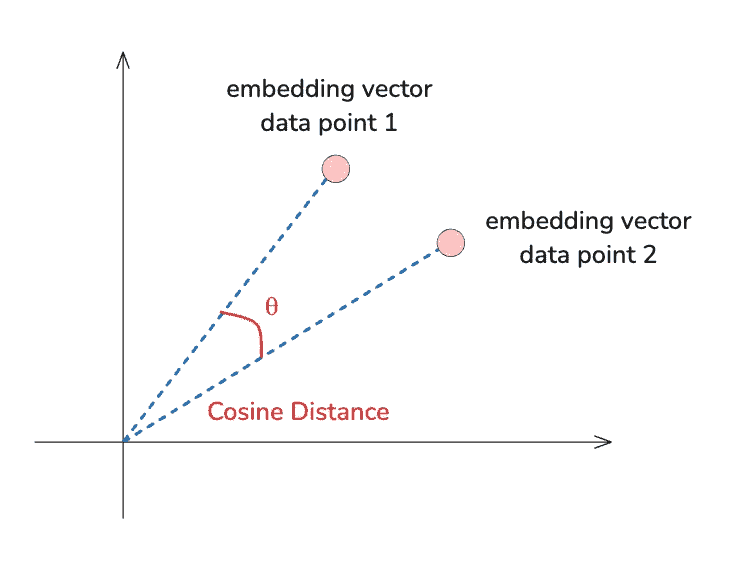
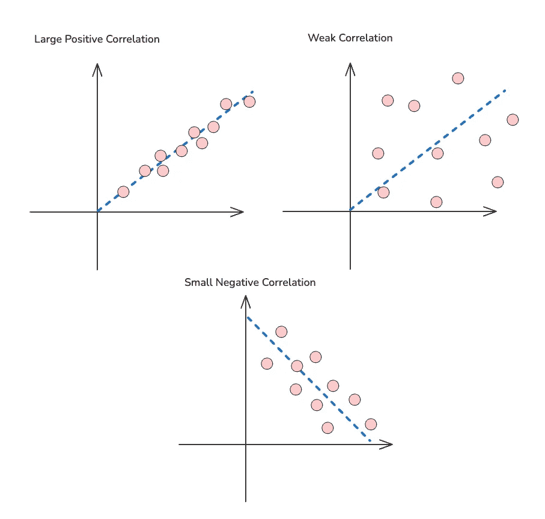

# 如何评估没有地面真实数据的 RAG

> 原文：[`towardsdatascience.com/how-to-evaluate-rag-if-you-dont-have-ground-truth-data-590697061d89?source=collection_archive---------0-----------------------#2024-09-24`](https://towardsdatascience.com/how-to-evaluate-rag-if-you-dont-have-ground-truth-data-590697061d89?source=collection_archive---------0-----------------------#2024-09-24)

## 向量相似度搜索阈值、合成数据生成、LLM 作为判定者以及框架

[](https://medium.com/@jenn-j-dev?source=post_page---byline--590697061d89--------------------------------)[](https://towardsdatascience.com/?source=post_page---byline--590697061d89--------------------------------) [Jenn J.](https://medium.com/@jenn-j-dev?source=post_page---byline--590697061d89--------------------------------)

·发布于 [Towards Data Science](https://towardsdatascience.com/?source=post_page---byline--590697061d89--------------------------------) ·10 分钟阅读·2024 年 9 月 24 日

--

评估检索增强生成（RAG）模型时，如果有地面真实数据可以对比会容易得多。但如果没有呢？这时事情会变得有些棘手。然而，即使没有地面真实数据，仍然有方法来评估你的 RAG 系统表现如何。下面，我们将介绍三种有效策略，如何从零开始创建地面真实数据集，当你拥有数据集时可以使用的度量，以及现有框架如何帮助你完成这个过程。

## 两种类型的 RAG 评估：检索评估和生成评估

以下每种策略都会被标记为检索评估、生成评估或两者兼有。

# 如何评估没有地面真实数据的 RAG？

## 向量相似度搜索阈值

类型：检索评估

如果你正在使用像 Pinecone 这样的向量数据库，可能对向量相似度的概念比较熟悉。本质上，数据库是根据查询的向量与潜在结果的向量之间的接近程度来检索信息的。即使没有“正确”的答案进行对比，你仍然可以依赖像余弦相似度这样的度量来评估检索到的文档质量。



余弦距离。[作者提供的图片]

例如，Pinecone 会返回余弦相似度值，显示每个结果与查询的相似程度。

```py
# Create a pinecone (vector database) index that uses cosine similarity
pc.create_index(
    name=index_name,
    dimension=2,
    metric="cosine",
    spec=ServerlessSpec(
        cloud='aws', 
        region='us-east-1'
    ) 
) 

# Retrieving top 3 closest vectors
query_results = index.query(
    namespace="example-namespace1",
    vector=[1.0, 1.5],
    top_k=3,
    include_values=True
)

# query_results
# The "score" here is the cosine similarity value
# {'matches': [{'id': 'vec1', 'score': 1.0, 'values': [1.0, 1.5]},
# {'id': 'vec2', 'score': 0.868243158, 'values': [2.0, 1.0]},
# {'id': 'vec3', 'score': 0.850068152, 'values': [0.1, 3.0]}],
```

通过展示相似性分数，你可以为检索到的文档设定通过或不通过的标准。较高的阈值（如 0.8 或以上）意味着要求更严格，而较低的阈值则会带入更多的数据，这些数据可能有用，也可能只是噪声。

这个过程并不是要立即找到一个完美的数字——而是关于不断试错。当结果在我们的特定应用中始终感觉有用时，我们就知道找到了最佳点。

## 使用多个 LLM 来评判回应

类型：检索 + 生成评估

评估你的 RAG 系统的另一种创造性方式是通过[利用多个 LLM 来评判回应](https://arxiv.org/html/2402.14860v2)。尽管 LLM 在缺少真实数据的情况下无法提供完美的答案，但你仍然可以利用它们的反馈来比较回应的质量。

通过比较不同 LLM 的回应，并查看它们如何对这些回应进行排名，你可以评估检索和生成的整体质量。这不是完美的，但它是一种创造性的方法，可以从多个角度评估你系统输出的质量。

## 人工反馈：涉及专家

类型：检索 + 生成评估

有时，评估系统的最佳方法是采用传统方式——请人类进行判断。从领域专家那里获取反馈，可以提供即便是最好的模型也无法匹配的洞察。

**设置评分标准**

为了使人工反馈更可靠，帮助建立清晰一致的评分标准很重要。你可以让审稿人对以下方面进行评分：

+   **相关性：** 检索到的信息是否解决了查询？（检索评估）

+   **正确性：** 内容是否事实准确？（检索评估）

+   **流畅度：** 它读起来是否顺畅，还是感觉生硬或强迫？（生成评估）

+   **完整性：** 它是否完全覆盖了问题，还是留下了空白？（检索 + 生成评估）

有了这些标准，你可以更系统地了解你的系统表现如何。

**获取基准**

评估人工反馈质量的一个聪明方法是检查不同审稿人之间的一致性。你可以使用像[Pearson 相关系数](https://en.wikipedia.org/wiki/Pearson_correlation_coefficient)这样的度量，看看他们的判断有多接近。如果审稿人之间意见分歧很大，可能意味着评分标准不够清晰，也可能是任务比你预期的更具主观性。



Pearson 相关系数。[图片由作者提供]

**减少噪声**

人工反馈可能会有噪声，尤其是在评分标准不明确或任务具有主观性的情况下。以下是几种应对方法：

+   **平均评分：** 通过对多位审稿人的评分进行平均，你可以消除个体偏见或不一致性。

+   **专注于一致性：** 另一种方法是只考虑审阅者一致同意的情况。这将为你提供更清晰的评估集，并帮助确保反馈的质量。

# 从零开始创建真实数据集

在评估没有真实数据集的 RAG 系统时，另一种方法是自己创建数据集。听起来可能有些令人生畏，但有几个策略可以简化这个过程，从寻找相似数据集到利用人工反馈，甚至合成生成数据。让我们来看看如何做到这一点。

## 在线寻找相似的数据集

这看起来可能显而易见，大多数得出没有真实数据集结论的人通常已经用尽了这个选项。但仍值得一提的是，可能会有一些数据集与您的需求类似。也许它来自不同的业务领域，但它与您正在使用的问答格式相匹配。像 Kaggle 这样的网站拥有丰富的公共数据集，你可能会惊讶于有多少数据集与你的问题空间对接。

示例：

+   [斯坦福问答数据集](https://www.kaggle.com/datasets/stanfordu/stanford-question-answering-dataset)

+   [亚马逊问答数据集](https://www.kaggle.com/datasets/praneshmukhopadhyay/amazon-questionanswer-dataset)

## 手动创建真实数据集

如果你在线上找不到完全符合需求的内容，你可以手动创建真实数据集。这时，人工反馈（human-in-the-loop）就显得特别有用。还记得我们之前讨论的领域专家反馈吗？你可以利用这些反馈来构建你自己的小型数据集。

通过整理一组人工审核的示例——这些示例的相关性、准确性和完整性已经得到了验证——你为扩展评估数据集打下了基础。

Katherine Munro 还有一篇很好的文章，讲述了敏捷聊天机器人开发的实验方法。

## 训练 LLM 作为评判者

一旦你拥有了最小的真实数据集，你就可以进一步提升，训练一个 LLM 来充当评判者，并评估你模型的输出。

但在依赖大型语言模型（LLM）作为评判者之前，我们首先需要确保它能够准确地评估我们模型的输出，至少是可靠的。你可以按照以下方法来实现：

1.  **构建人工审核的示例：** 根据你的使用场景，20 到 30 个示例应该足够让你了解 LLM 在对比中有多可靠。请参考前一节关于评估标准和如何衡量冲突评分的内容。

1.  **创建您的 LLM 评判者：** 向 LLM 提出问题，要求它根据您提供给领域专家的相同标准给出评分。获取评分并比较 LLM 的评分与人工评分的一致性。您可以使用类似皮尔逊相关系数的度量来帮助评估。高相关性得分将表明 LLM 的表现与评审员一样出色。

1.  **应用** [**提示工程最佳实践**](https://www.bighummingbird.com/blogs/prompt-engineering-best-practices)：提示工程能够决定这个过程的成败。使用像预热 LLM 上下文或提供一些示例（少量学习）等技术，可以显著提高模型在评判时的准确性。

# 创建特定的数据集

提升基础真相数据集质量和数量的另一种方式是将文档按主题或语义分组进行切分。与其整体查看文档，不如将其拆解成更小、更集中的段落。

例如，假设您有一个文档（文档 ID: 123），其中提到：

*“在推出产品 ABC 之后，XYZ 公司在 2024 年第一季度的收入增长了 10%。”*

这句话包含了两条不同的信息：

1.  *推出产品 ABC*

1.  *2024 年第一季度收入增长了 10%*

现在，您可以将每个主题扩展为其自己的查询和上下文。例如：

+   **查询 1:** *“XYZ 公司推出了什么产品？”*

+   **上下文 1:** *“推出产品 ABC”*

+   **查询 2:** *“2024 年第一季度收入变化是多少？”*

+   **上下文 2:** *“XYZ 公司在 2024 年第一季度的收入增长了 10%”*

通过将数据划分为具体的主题，您不仅可以为训练创建更多的数据点，还可以使数据集更加精准和聚焦。此外，如果您希望将每个查询追溯到原始文档以保证可靠性，您可以轻松地为每个上下文段落添加元数据。例如：

+   **查询 1:** *“XYZ 公司推出了什么产品？”*

+   **上下文 1:** *“推出产品 ABC（文档 ID: 123）”*

+   **查询 2:** “2024 年第一季度收入变化是多少？”

+   **上下文 2:** “XYZ 公司在 2024 年第一季度收入增长了 10%（文档 ID: 123）”

这样，每个段落都会与其来源关联，使得您的数据集在评估和训练时更加有用。

# 合成创建数据集

如果其他方法都失败了，或者您需要更多的数据而手动收集不足，合成数据生成可以是一个改变游戏规则的解决方案。使用数据增强或甚至 GPT 模型等技术，您可以基于现有示例创建新的数据点。例如，您可以对基础查询和上下文集进行轻微修改，生成不同的变体。

例如，首先处理查询：

+   *“XYZ 公司推出了什么产品？”*

您可以合成生成类似的变体：

+   *“XYZ 公司推出了哪款产品？”*

+   *“XYZ 公司推出的是什么产品？”*

这将帮助您构建一个更大的数据集，而无需从头开始手动编写新的示例。

还有一些框架可以自动化生成合成数据的过程，我们将在最后一部分进行探讨。

# 一旦你有了数据集：是时候进行评估了

现在你已经收集或创建了数据集，是时候进入评估阶段了。RAG 模型包括两个关键领域：检索和生成。两者都很重要，理解如何评估每个领域将有助于你调整模型，更好地满足需求。

## 评估检索：检索到的数据有多相关？

RAG 中的检索步骤至关重要——如果你的模型不能拉取正确的信息，它将难以生成准确的响应。以下是你需要关注的两个关键指标：

+   **上下文相关性：** 这衡量检索到的上下文与查询的匹配度。本质上，你在问：*这个信息与所提问题相关吗？* 你可以使用数据集来计算相关性分数，可以通过人工判断或通过比较查询与检索文档之间的相似性度量（如余弦相似度）来实现。

+   **上下文召回：** 上下文召回关注的是检索到的相关信息的多少。可能拉取了正确的文档，但只包含了必要信息的一部分。为了评估召回率，你需要检查你的模型检索的上下文是否包含了所有关键信息，以便完全回答查询。理想情况下，你希望得到高召回率：你的检索应该抓取到你需要的信息，且不会遗漏任何关键信息。

## 评估生成：响应是否既准确又有用？

一旦正确的信息被检索到，下一步是生成一个不仅能回答查询，而且能够忠实且清晰地回答的响应。以下是两个关键方面需要评估：

+   **忠实度：** 这衡量生成的响应是否准确地反映了检索到的上下文。本质上，你希望避免“幻觉”——即模型编造了检索数据中没有的信息。忠实度是关于确保答案基于模型检索到的文档所呈现的事实。

+   **答案相关性：** 这指的是生成的答案与查询的匹配程度。即便信息忠实于检索到的上下文，它仍然需要与所提问题相关。你不希望模型提取出正确的信息，但没有准确回答用户的问题。

## 做加权评估

一旦你评估了检索和生成，你可以通过加权方式进一步整合这些评估。也许你更关心相关性而非召回率，或者忠实度是你的首要任务。你可以根据特定的使用场景为每个指标分配不同的权重。

例如：

+   **检索：** 60% 上下文相关性 + 40% 上下文召回率

+   **生成：** 70% 忠实度 + 30% 答案相关性

这种加权评估方法为你提供了在优先考虑应用最重要因素时的灵活性。如果你的模型需要 100%的事实准确性（如法律或医学领域），你可能会更重视忠实度。另一方面，如果完整性更为重要，你可能会关注召回率。

# 简化评估过程的现有框架

如果创建你自己的评估系统让你感到不知所措，不用担心——有一些很好的现有框架，已经为你完成了大部分繁重的工作。这些框架内置了专门用于评估 RAG 系统的指标，使评估检索和生成性能变得更加简单。让我们看看其中一些最有帮助的框架。

## [RAGAS（检索增强生成评估）](https://docs.ragas.io/en/stable/)

RAGAS 是一个专门设计的框架，用于评估 RAG 模型的性能。它包括评估检索和生成的指标，提供了一种全面的方式来衡量系统在每个步骤中的表现。它还通过采用进化生成范式来提供合成测试数据生成。

> *灵感来自于诸如* [***Evol-Instruct***](https://arxiv.org/abs/2304.12244)*等作品，RAGAS 通过采用进化生成范式实现这一点，在这一过程中，具有不同特征的问题，如推理、条件性、多上下文等，会从提供的文档集中系统性地构建出来。——RAGAS 文档*

## [ARES: 使用合成数据和 LLM 裁判的开源框架](https://github.com/stanford-futuredata/ARES)

**ARES** 是另一个强大的工具，它将合成数据生成与基于 LLM 的评估相结合。ARES 使用合成数据——由 AI 模型生成的数据，而不是从现实世界交互中收集的数据——来构建数据集，以便测试和优化你的 RAG 系统。

该框架还包括一个 LLM 裁判，正如我们之前所讨论的，它可以通过将模型输出与人工标注或其他参考数据进行比较来帮助评估模型的表现。

# 结论

即使没有真实数据，这些策略也可以帮助你有效地评估 RAG 系统。无论你是使用向量相似度阈值、多种 LLM、LLM 作为裁判、检索指标还是框架，每种方法都为你提供了一种衡量性能并改进模型结果的方式。关键是找到最适合你特定需求的方法，并且不要害怕在过程中进行调整。🙂

*加入讨论！* [*订阅*](https://medium.com/@jenn-j-dev/subscribe) *获取实用的 AI 技巧、真实案例以及我在公开构建过程中的幕后见解。*

*想了解更多 LLM 的信息吗？查看我们的* [*AI-in-Action 博客*](https://www.bighummingbird.com/blogs) *，了解 AI 代理、提示工程和 LLMOps。*
