# 如何评估你的预测

> 原文：[`towardsdatascience.com/how-to-evaluate-your-predictions-cef80d8f6a69?source=collection_archive---------5-----------------------#2024-05-17`](https://towardsdatascience.com/how-to-evaluate-your-predictions-cef80d8f6a69?source=collection_archive---------5-----------------------#2024-05-17)

## 注意你选择的度量

[](https://medium.com/@jeffrey_85949?source=post_page---byline--cef80d8f6a69--------------------------------)[](https://towardsdatascience.com/?source=post_page---byline--cef80d8f6a69--------------------------------) [Jeffrey Näf](https://medium.com/@jeffrey_85949?source=post_page---byline--cef80d8f6a69--------------------------------)

·发表于[Towards Data Science](https://towardsdatascience.com/?source=post_page---byline--cef80d8f6a69--------------------------------) ·阅读时间 15 分钟·2024 年 5 月 17 日

--


摄影：来自[Isaac Smith](https://unsplash.com/@isaacmsmith?utm_source=medium&utm_medium=referral)在[Unsplash](https://unsplash.com/?utm_source=medium&utm_medium=referral)上的照片

通过比较模型在测试集上的预测结果来测试和基准评估机器学习模型，即使是在部署后，这一点至关重要。为此，需要考虑一种*评分*，它接受一个预测值和一个测试点，并为预测相对于测试点的成功程度分配一个值。然而，在选择适当的评分方法时应该谨慎。特别是，在选择评估预测的方法时，我们应该坚持*适当评分规则*的理念。这里我只给出了这个概念的一个宽泛定义，但基本上，我们希望有一个得分在我们想要衡量的对象上最小化！

> 一般来说：可以使用 MSE 来评估均值预测，使用 MAE 来评估中位数预测，使用分位数得分来评估更一般的分位数预测，使用能量或 MMD 得分来评估分布预测。

考虑你想要预测的变量，比如一个随机变量*Y*，它来源于一个协变量向量***X***。在下面的示例中，*Y*是收入，***X***是某些特征，如*年龄*和*教育水平*。我们在一些训练数据上学到了一个预测器*f*，现在我们用*f(****x****)*来预测*Y*。通常，当我们希望尽可能准确地预测变量*Y*时，我们会预测给定**x**的*Y*的期望值，即*f(****x****)*应该逼近*E[Y |* ***X****=****x****]*。但更一般地，*f(****x****)*可以是中位数的估计值、其他分位数，甚至是完整的条件分布*P(Y |* ***X****=****x****)*。

现在，对于一个新的测试点*y*，我们希望评分你的预测，也就是说，我们需要一个函数*S(y,f(****x****))*，当*f(****x****)*是你能够做出的最佳预测时，*S(y,f(****x****))*在期望值下是最小的。例如，如果我们想预测*E[Y |* ***X****=****x****]*，则这个得分给定为均方误差（MSE）：*S(y, f(****x****))= (y-f(****x****))²*。

这里我们更详细地研究了在测试集*(y_i,****x****_i), i=1,…,ntest*上评分预测器*f*的原理。在所有示例中，我们将比较理想的估计方法和一个明显错误或天真的方法，并展示我们的得分是如何按预期工作的。这里使用的完整代码也可以在[Github](https://github.com/JeffNaef/Medium-Articles/blob/main/HowtoScoreprediction.R)上找到。

## 示例

为了说明问题，我将模拟一个简单的数据集，该数据集应当模拟收入数据。我们将在本文中使用这个简单的示例来说明这些概念。

```py
library(dplyr)

#Create some variables:
# Simulate data for 100 individuals
n <- 5000

# Generate age between 20 and 60
age <- round(runif(n, min = 20, max = 60))

# Define education levels
education_levels <- c("High School", "Bachelor's", "Master's")

# Simulate education level probabilities
education_probs <- c(0.4, 0.4, 0.2)

# Sample education level based on probabilities
education <- sample(education_levels, n, replace = TRUE, prob = education_probs)

# Simulate experience correlated with age with some random error
experience <- age - 20 + round(rnorm(n, mean = 0, sd = 3)) 

# Define a non-linear function for wage
wage <- exp((age * 0.1) + (case_when(education == "High School" ~ 1,
                                 education == "Bachelor's" ~ 1.5,
                                 TRUE ~ 2)) + (experience * 0.05) + rnorm(n, mean = 0, sd = 0.5))

hist(wage)
```

虽然这个模拟可能过于简化，但它反映了这类数据的一些公认特征：较大的年龄、较高的教育水平和更丰富的经验通常与更高的工资相关。使用“exp”运算符会导致工资分布严重偏斜，这是在此类数据集中常见的现象。

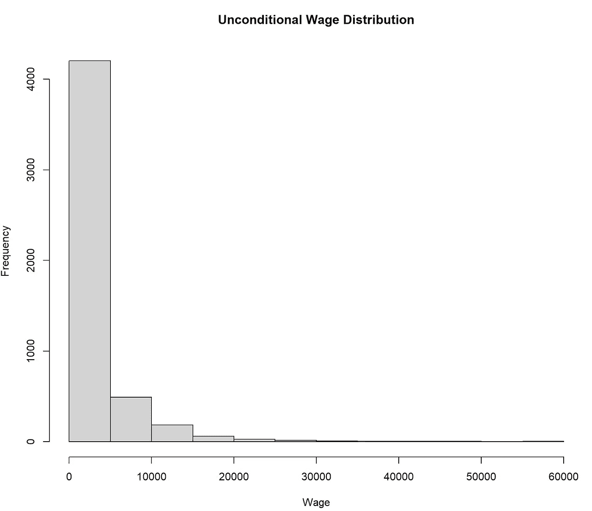

整个模拟人口的工资分布。来源：作者

关键是，即使我们固定年龄、教育和经验为某些特定值，这种偏斜现象仍然存在。假设我们观察一个特定的人，Dave，他 30 岁，拥有经济学学士学位，并有 10 年的工作经验，我们来看看根据我们的数据生成过程他的实际收入分布：

```py
ageDave<-30
educationDave<-"Bachelor's"
experienceDave <- 10

wageDave <- exp((ageDave * 0.1) + (case_when(educationDave == "High School" ~ 1,
                                     educationDave == "Bachelor's" ~ 1.5,
                                     TRUE ~ 2)) + (experienceDave * 0.05) + rnorm(n, mean = 0, sd = 0.5))

hist(wageDave, main="Wage Distribution for Dave", xlab="Wage")
```

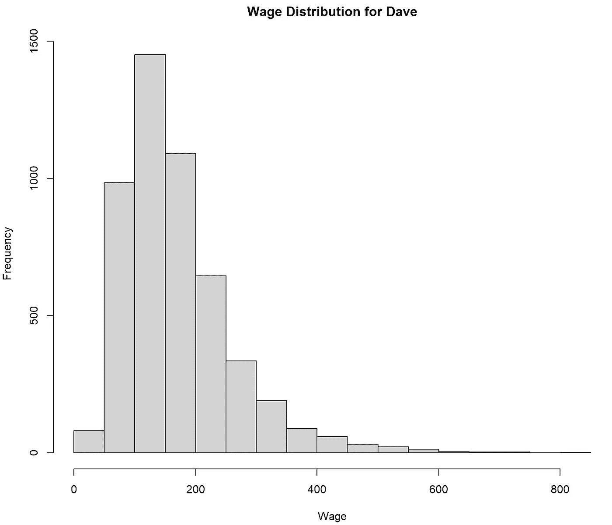

Dave 的工资分布。来源：作者

因此，给定我们对 Dave 的所有信息，Dave 的可能工资分布仍然严重偏斜。

我们还生成了一个由几个人组成的测试集：

```py
 ## Generate test set
ntest<-1000

# Generate age between 20 and 60
agetest <- round(runif(ntest, min = 20, max = 60))

# Sample education level based on probabilities
educationtest <- sample(education_levels, ntest, replace = TRUE, prob = education_probs)

# Simulate experience correlated with age with some random error
experiencetest <- agetest - 20 + round(rnorm(ntest, mean = 0, sd = 3))

## Generate ytest that we try to predict:

wagetest <- exp((agetest * 0.1) + (case_when(educationtest == "High School" ~ 1,
                                             educationtest == "Bachelor's" ~ 1.5,
                                             TRUE ~ 2)) + (experiencetest * 0.05) + rnorm(ntest, mean = 0, sd = 0.5))
```

我们现在从简单开始，首先查看均值和中位数预测的得分。

## 均值和中位数预测的得分

在数据科学和机器学习中，兴趣通常集中在一个单一数字上，这个数字表示我们希望预测的分布的“中心”或“中位数”，即（条件）均值或中位数。为此，我们使用均方误差（MSE）：

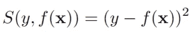

以及平均绝对误差（MAE）：

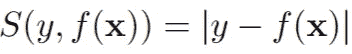

一个重要的结论是，均方误差（MSE）是预测条件均值的适当度量，而平均绝对误差（MAE）则是用于条件中位数的度量。均值和中位数对于像我们在这里研究的偏态分布来说是不同的。

让我们通过非常简单的估计器（在实际生活中我们是无法获得的，仅用于说明）来阐明上述例子：

```py
conditionalmeanest <-
  function(age, education, experience, N = 1000) {
    mean(exp((age * 0.1) + (
      case_when(
        education == "High School" ~ 1,
        education == "Bachelor's" ~ 1.5,
        TRUE ~ 2
      )
    ) + (experience * 0.05) + rnorm(N, mean = 0, sd = 0.5)
    ))
  }

conditionalmedianest <-
  function(age, education, experience, N = 1000) {
    median(exp((age * 0.1) + (
      case_when(
        education == "High School" ~ 1,
        education == "Bachelor's" ~ 1.5,
        TRUE ~ 2
      )
    ) + (experience * 0.05) + rnorm(N, mean = 0, sd = 0.5)
    ))
  }
```

也就是说，我们通过简单地从模型中模拟固定的年龄、教育和经验值来估计均值和中位数（这将是从正确的条件分布中进行模拟），然后我们简单地取这些值的均值/中位数。让我们在 Dave 身上测试这个方法：

```py
 hist(wageDave, main="Wage Distribution for Dave", xlab="Wage")
abline(v=conditionalmeanest(ageDave, educationDave, experienceDave), col="darkred", cex=1.2)
abline(v=conditionalmedianest(ageDave, educationDave, experienceDave), col="darkblue", cex=1.2) 
```

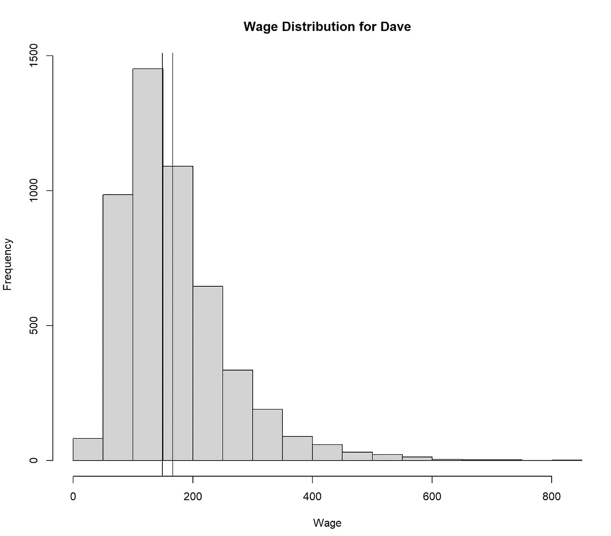

蓝色：Dave 的估计条件中位数，红色：Dave 的估计条件均值。来源：作者

显然，均值和中位数是不同的，这正是我们从这样的分布中预期的结果。事实上，正如收入分布的典型特点，均值比中位数更高（更受高值的影响）。

现在让我们在测试集上使用这些估计器：

```py
Xtest<-data.frame(age=agetest, education=educationtest, experience=experiencetest)

meanest<-sapply(1:nrow(Xtest), function(j)  conditionalmeanest(Xtest$age[j], Xtest$education[j], Xtest$experience[j])  )
median<-sapply(1:nrow(Xtest), function(j)  conditionalmedianest(Xtest$age[j], Xtest$education[j], Xtest$experience[j])  ) 
```

这给出了多种条件均值/中位数的值。现在我们计算 MSE 和 MAE：

```py
(MSE1<-mean((meanest-wagetest)²))
(MSE2<-mean((median-wagetest)²))

MSE1 < MSE2
### Method 1 (the true mean estimator) is better than method 2!

# but the MAE is actually worse of method 1!
(MAE1<-mean(abs(meanest-wagetest)) )
(MAE2<-mean( abs(median-wagetest)))

MAE1 < MAE2
### Method 2 (the true median estimator) is better than method 1!
```

这显示了理论上已知的结果：MSE 在（条件）期望值*E[Y |* ***X****=****x****]*处最小，而 MAE 在条件中位数处最小。*通常，当你尝试评估你的均值预测时，使用 MAE 是没有意义的。* 在许多应用研究和数据科学中，人们使用 MAE 或两者结合来评估均值预测（我知道，因为我也做过）。虽然在某些应用中这可能是合理的，但对于不对称的分布，这可能会带来严重后果，正如我们在这个例子中看到的：当看 MAE 时，方法 1 看起来比方法 2 差，尽管前者正确地估计了均值。事实上，在这个高度偏态的例子中，*方法 1 的 MAE 应该比方法 2 低*。

> 要对条件均值预测进行评分，使用均方误差（MSE），而不是平均绝对误差（MAE）。MAE 在条件中位数处最小。

## 分位数和区间预测的评分

假设我们想要对分位数*q_****x*的估计*f(****x****)*进行评分，使得

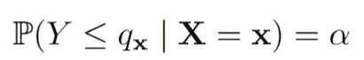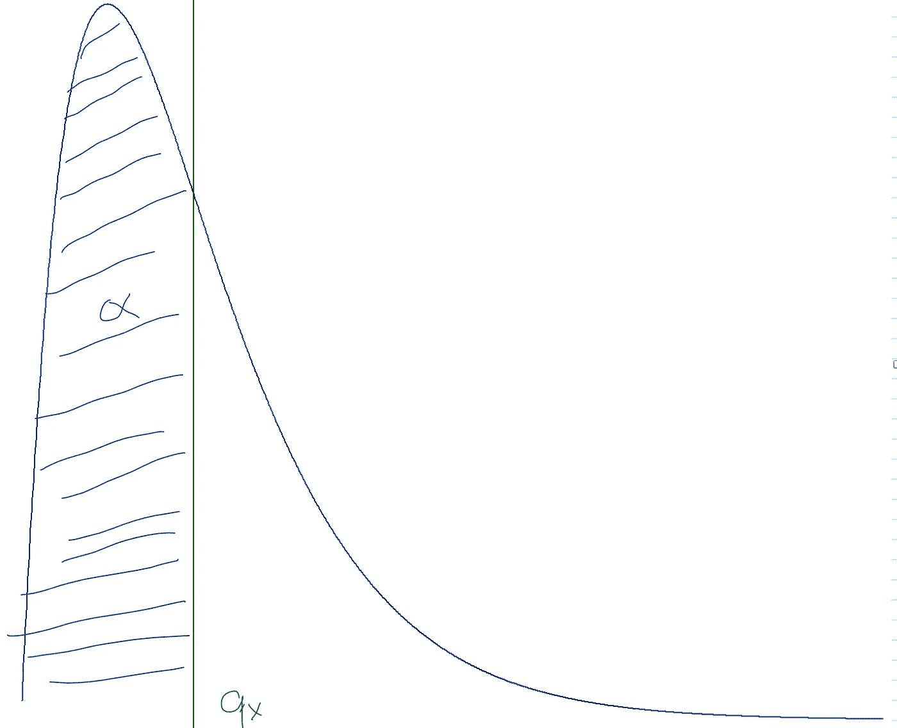

简单的分位数说明。来源：作者

在这种情况下，我们可以考虑分位数得分：

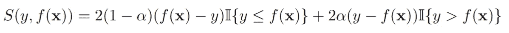

其中

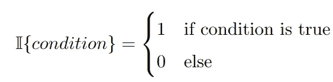

为了解释这个公式，我们可以考虑两种情况：

(1) *y* 小于 *f(****x):***

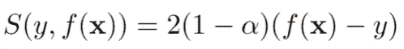

即，我们会遭遇惩罚，这个惩罚随着*y*与*f(****x)***的差距增大而加剧。

(2) *y* 大于 *f(****x):***

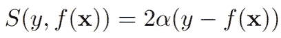

即，如果 *y* 距离 *f(****x****)* 越远，惩罚就越大。

请注意，权重的设置使得对于较高的 *alpha*，如果估计的分位数 *f(****x****)* 小于 *y*，惩罚会更大。这是有意设计的，确保正确的分位数确实是 *S(y, f(****x****))* 的期望值最小化器。这个得分实际上就是 *分位数损失*（最多一个因子 2），例如，请参阅这篇 很棒的文章。它已经在 R 的 *scoringutils* 包中的 *quantile_score* 函数中实现。最后，注意对于 *alpha=0.5*：

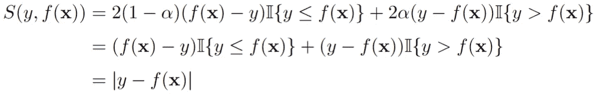

这仅仅是 MAE！这很有道理，因为 0.5 分位数就是中位数。

凭借预测分位数的能力，我们也可以构建预测区间。考虑 (*l_****x****, u_****x***)，其中 *l_****x*** ≤ *u_****x*** 是满足以下条件的分位数：

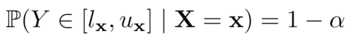

实际上，如果 *l_****x*** 是 *alpha/2* 分位数，而 *u_****x*** 是 *1-alpha/2* 分位数，那么这一条件就满足。因此我们现在估计并评分这两个分位数。考虑 *f(****x****)=(f_1(****x****), f_2(****x****))*, 其中 *f_1(****x****)* 是 *l_****x*** 的估计，*f_2(****x****)* 是 *u_****x*** 的估计。我们提供了两种估计方法，一种是“理想”方法，通过从真实过程再次模拟来估计所需的分位数，另一种是“天真”方法，虽然覆盖率正确，但结果过大：

```py
library(scoringutils)

## Define conditional quantile estimation
conditionalquantileest <-
  function(probs, age, education, experience, N = 1000) {
    quantile(exp((age * 0.1) + (
      case_when(
        education == "High School" ~ 1,
        education == "Bachelor's" ~ 1.5,
        TRUE ~ 2
      )
    ) + (experience * 0.05) + rnorm(N, mean = 0, sd = 0.5)
    )
    , probs =
      probs)
  }

## Define a very naive estimator that will still have the required coverage
lowernaive <- 0
uppernaive <- max(wage)

# Define the quantile of interest
alpha <- 0.05

lower <-
  sapply(1:nrow(Xtest), function(j)
    conditionalquantileest(alpha / 2, Xtest$age[j], Xtest$education[j], Xtest$experience[j]))
upper <-
  sapply(1:nrow(Xtest), function(j)
    conditionalquantileest(1 - alpha / 2, Xtest$age[j], Xtest$education[j], Xtest$experience[j]))

## Calculate the scores for both estimators

# 1\. Score the alpha/2 quantile estimate
qs_lower <- mean(quantile_score(wagetest,
                           predictions = lower,
                           quantiles = alpha / 2))
# 2\. Score the alpha/2 quantile estimate
qs_upper <- mean(quantile_score(wagetest,
                           predictions = upper,
                           quantiles = 1 - alpha / 2))

# 1\. Score the alpha/2 quantile estimate
qs_lowernaive <- mean(quantile_score(wagetest,
                                predictions = rep(lowernaive, ntest),
                                quantiles = alpha / 2))
# 2\. Score the alpha/2 quantile estimate
qs_uppernaive <- mean(quantile_score(wagetest,
                                predictions = rep(uppernaive, ntest),
                                quantiles = 1 - alpha / 2))

# Construct the interval score by taking the average
(interval_score <- (qs_lower + qs_upper) / 2)
# Score of the ideal estimator: 187.8337

# Construct the interval score by taking the average
(interval_scorenaive <- (qs_lowernaive + qs_uppernaive) / 2)
# Score of the naive estimator: 1451.464
```

我们可以清楚地看到，平均而言，正确的估计方法得分远低于天真的方法！

因此，通过分位数得分，我们有了一个可靠的方式来评分单个分位数预测。然而，平均上界和下界分位数得分来评分预测区间的方法可能显得有些随意。幸运的是，事实证明这导致了所谓的 *区间得分*：

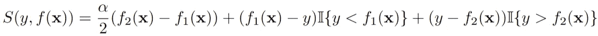

因此，通过一些代数技巧，我们可以通过平均 *alpha/2* 和 *1-alpha/2* 分位数的得分来评分预测区间，正如我们所做的那样。有趣的是，得到的区间得分奖励较窄的预测区间，并且如果观测值未落在区间内，则会施加惩罚，惩罚的大小取决于 *alpha*。除了使用分位数得分的平均值，我们还可以直接使用 *scoringutils* 包来计算这个得分。

```py
alpha <- 0.05
mean(interval_score(
  wagetest,
  lower=lower,
  upper=upper,
  interval_range=(1-alpha)*100,
  weigh = T,
  separate_results = FALSE
))
#Score of the ideal estimator: 187.8337
```

这是我们在上面计算两个区间得分的平均值时得到的完全相同的数字。

> 在 R 的 *scoringutils* 包中实现的分位数得分可以用来评分分位数预测。如果想直接对预测区间进行评分，可以使用 interval_score 函数。

## 分布预测的得分

越来越多的领域必须处理 *分布预测* 问题。幸运的是，针对这个问题已经有了得分方法。特别是在这里，我关注的是所谓的 *能量得分*：

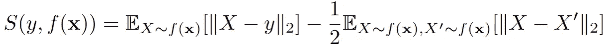

对于 *f(****x****)* 作为分布 *P(Y |* ***X****=****x****)* 的估计，第二项计算两个独立样本间的欧几里得距离期望值，这类似于一个归一化项，用来衡量如果比较的是相同的分布时的值。第一项则将样本点 *y* 与从 *f(****x****)* 中抽取的 *X* 进行比较。在对 *P(Y |* ***X****=****x****)* 从 *Y* 中抽取的期望下，这个值会在 *f(****x****)=P(Y |* ***X****=****x****)* 时最小化。

因此，我们不再仅仅预测均值或分位数，而是尝试预测每个测试点的工资分布。实际上，我们试图预测并评估我们为 Dave 绘制的条件分布。这有点复杂；我们如何表示学习到的分布呢？在实际中，这通过假设我们可以从预测的分布中获得样本来解决。因此，我们将从预测的分布中获得的 *N* 个样本与单个测试点进行比较。这可以通过 R 中的 *scoringRules* 包的 *es_sample* 实现：

```py
library(scoringRules)

## Ideal "estimate": Simply sample from the true conditional distribution 
## P(Y | X=x) for each sample point x
distributionestimate <-
  function(age, education, experience, N = 100) {
    exp((age * 0.1) + (
      case_when(
        education == "High School" ~ 1,
        education == "Bachelor's" ~ 1.5,
        TRUE ~ 2
      )
    ) + (experience * 0.05) + rnorm(N, mean = 0, sd = 0.5))
  }

## Naive Estimate: Only sample from the error distribution, without including the 
## information of each person.
distributionestimatenaive <-
  function(age, education, experience, N = 100) {
    exp(rnorm(N, mean = 0, sd = 0.5))
  }

scoretrue <- mean(sapply(1:nrow(Xtest), function(j)  {
  wageest <-
    distributionestimate(Xtest$age[j], Xtest$education[j], Xtest$experience[j])
  return(scoringRules::es_sample(y = wagetest[j], dat = matrix(wageest, nrow=1)))
}))

scorenaive <- mean(sapply(1:nrow(Xtest), function(j)  {
  wageest <-
    distributionestimatenaive(Xtest$age[j], Xtest$education[j], Xtest$experience[j])
  return(scoringRules::es_sample(y = wagetest[j], dat = matrix(wageest, nrow=1)))
}))

## scoretrue: 761.026
## scorenaive: 2624.713
```

在上述代码中，我们再次将“完美”估计（即从真实分布*P(Y |* ***X****=****x****)*)采样）与一种非常简单的估计进行比较，后者并未考虑工资、教育或经验的任何信息。同样，评分可靠地识别了两种方法中更好的那一个。

> 能够用于对分布预测评分的能量评分，可以通过 R 包 scoringRules 来实现，如果可以从预测的分布中获得一个样本。

## 结论

我们已经研究了不同的预测评分方法。思考正确的度量标准来测试预测是很重要的，因为错误的度量标准可能会使我们选择并保持错误的模型来执行预测任务。

应该注意的是，特别对于分布预测来说，这种评分是一项困难的任务，评分在实际中可能没有多大作用。也就是说，即使一种方法导致了较大的改进，其评分可能只是略微更低。然而，这本身并不是问题，只要评分能够可靠地识别两种方法中更好的那一个。

## 参考文献

[1] Tilmann Gneiting & Adrian E Raftery (2007) 严格适当的评分规则、预测与估计，《美国统计学会期刊》，102:477, 359–378, DOI: [10.1198/016214506000001437](https://doi.org/10.1198/016214506000001437)

## 附录：所有代码汇总

这个文件也可以在[Github](https://github.com/JeffNaef/Medium-Articles/blob/main/HowtoScoreprediction.R)上找到。

```py
library(dplyr)

#Create some variables:
# Simulate data for 100 individuals
n <- 5000

# Generate age between 20 and 60
age <- round(runif(n, min = 20, max = 60))

# Define education levels
education_levels <- c("High School", "Bachelor's", "Master's")

# Simulate education level probabilities
education_probs <- c(0.4, 0.4, 0.2)

# Sample education level based on probabilities
education <- sample(education_levels, n, replace = TRUE, prob = education_probs)

# Simulate experience correlated with age with some random error
experience <- age - 20 + round(rnorm(n, mean = 0, sd = 3)) 

# Define a non-linear function for wage
wage <- exp((age * 0.1) + (case_when(education == "High School" ~ 1,
                                     education == "Bachelor's" ~ 1.5,
                                     TRUE ~ 2)) + (experience * 0.05) + rnorm(n, mean = 0, sd = 0.5))

hist(wage)

ageDave<-30
educationDave<-"Bachelor's"
experienceDave <- 10

wageDave <- exp((ageDave * 0.1) + (case_when(educationDave == "High School" ~ 1,
                                             educationDave == "Bachelor's" ~ 1.5,
                                             TRUE ~ 2)) + (experienceDave * 0.05) + rnorm(n, mean = 0, sd = 0.5))

hist(wageDave, main="Wage Distribution for Dave", xlab="Wage")

## Generate test set
ntest<-1000

# Generate age between 20 and 60
agetest <- round(runif(ntest, min = 20, max = 60))

# Sample education level based on probabilities
educationtest <- sample(education_levels, ntest, replace = TRUE, prob = education_probs)

# Simulate experience correlated with age with some random error
experiencetest <- agetest - 20 + round(rnorm(ntest, mean = 0, sd = 3))

## Generate ytest that we try to predict:

wagetest <- exp((agetest * 0.1) + (case_when(educationtest == "High School" ~ 1,
                                             educationtest == "Bachelor's" ~ 1.5,
                                             TRUE ~ 2)) + (experiencetest * 0.05) + rnorm(ntest, mean = 0, sd = 0.5))

conditionalmeanest <-
  function(age, education, experience, N = 1000) {
    mean(exp((age * 0.1) + (
      case_when(
        education == "High School" ~ 1,
        education == "Bachelor's" ~ 1.5,
        TRUE ~ 2
      )
    ) + (experience * 0.05) + rnorm(N, mean = 0, sd = 0.5)
    ))
  }

conditionalmedianest <-
  function(age, education, experience, N = 1000) {
    median(exp((age * 0.1) + (
      case_when(
        education == "High School" ~ 1,
        education == "Bachelor's" ~ 1.5,
        TRUE ~ 2
      )
    ) + (experience * 0.05) + rnorm(N, mean = 0, sd = 0.5)
    ))
  }

hist(wageDave, main="Wage Distribution for Dave", xlab="Wage")
abline(v=conditionalmeanest(ageDave, educationDave, experienceDave), col="darkred", cex=1.2)
abline(v=conditionalmedianest(ageDave, educationDave, experienceDave), col="darkblue", cex=1.2)

Xtest<-data.frame(age=agetest, education=educationtest, experience=experiencetest)

meanest<-sapply(1:nrow(Xtest), function(j)  conditionalmeanest(Xtest$age[j], Xtest$education[j], Xtest$experience[j])  )
median<-sapply(1:nrow(Xtest), function(j)  conditionalmedianest(Xtest$age[j], Xtest$education[j], Xtest$experience[j])  )

(MSE1<-mean((meanest-wagetest)²))
(MSE2<-mean((median-wagetest)²))

MSE1 < MSE2
### Method 1 (the true mean estimator) is better than method 2!

# but the MAE is actually worse of method 1!
(MAE1<-mean(abs(meanest-wagetest)) )
(MAE2<-mean( abs(median-wagetest)))

MAE1 < MAE2
### Method 2 (the true median estimator) is better than method 1!

library(scoringutils)

## Define conditional quantile estimation
conditionalquantileest <-
  function(probs, age, education, experience, N = 1000) {
    quantile(exp((age * 0.1) + (
      case_when(
        education == "High School" ~ 1,
        education == "Bachelor's" ~ 1.5,
        TRUE ~ 2
      )
    ) + (experience * 0.05) + rnorm(N, mean = 0, sd = 0.5)
    )
    , probs =
      probs)
  }

## Define a very naive estimator that will still have the required coverage
lowernaive <- 0
uppernaive <- max(wage)

# Define the quantile of interest
alpha <- 0.05

lower <-
  sapply(1:nrow(Xtest), function(j)
    conditionalquantileest(alpha / 2, Xtest$age[j], Xtest$education[j], Xtest$experience[j]))
upper <-
  sapply(1:nrow(Xtest), function(j)
    conditionalquantileest(1 - alpha / 2, Xtest$age[j], Xtest$education[j], Xtest$experience[j]))

## Calculate the scores for both estimators

# 1\. Score the alpha/2 quantile estimate
qs_lower <- mean(quantile_score(wagetest,
                                predictions = lower,
                                quantiles = alpha / 2))
# 2\. Score the alpha/2 quantile estimate
qs_upper <- mean(quantile_score(wagetest,
                                predictions = upper,
                                quantiles = 1 - alpha / 2))

# 1\. Score the alpha/2 quantile estimate
qs_lowernaive <- mean(quantile_score(wagetest,
                                     predictions = rep(lowernaive, ntest),
                                     quantiles = alpha / 2))
# 2\. Score the alpha/2 quantile estimate
qs_uppernaive <- mean(quantile_score(wagetest,
                                     predictions = rep(uppernaive, ntest),
                                     quantiles = 1 - alpha / 2))

# Construct the interval score by taking the average
(interval_score <- (qs_lower + qs_upper) / 2)
# Score of the ideal estimator: 187.8337

# Construct the interval score by taking the average
(interval_scorenaive <- (qs_lowernaive + qs_uppernaive) / 2)
# Score of the naive estimator: 1451.464

library(scoringRules)

## Ideal "estimate": Simply sample from the true conditional distribution 
## P(Y | X=x) for each sample point x
distributionestimate <-
  function(age, education, experience, N = 100) {
    exp((age * 0.1) + (
      case_when(
        education == "High School" ~ 1,
        education == "Bachelor's" ~ 1.5,
        TRUE ~ 2
      )
    ) + (experience * 0.05) + rnorm(N, mean = 0, sd = 0.5))
  }

## Naive Estimate: Only sample from the error distribution, without including the 
## information of each person.
distributionestimatenaive <-
  function(age, education, experience, N = 100) {
    exp(rnorm(N, mean = 0, sd = 0.5))
  }

scoretrue <- mean(sapply(1:nrow(Xtest), function(j)  {
  wageest <-
    distributionestimate(Xtest$age[j], Xtest$education[j], Xtest$experience[j])
  return(scoringRules::es_sample(y = wagetest[j], dat = matrix(wageest, nrow=1)))
}))

scorenaive <- mean(sapply(1:nrow(Xtest), function(j)  {
  wageest <-
    distributionestimatenaive(Xtest$age[j], Xtest$education[j], Xtest$experience[j])
  return(scoringRules::es_sample(y = wagetest[j], dat = matrix(wageest, nrow=1)))
}))

## scoretrue: 761.026
## scorenaive: 2624.713 
```
