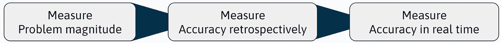
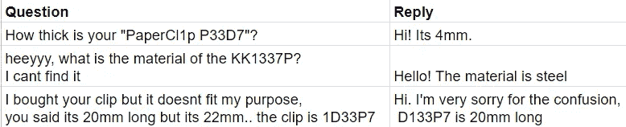
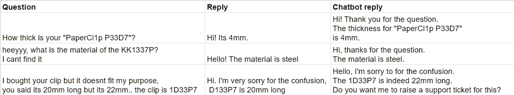
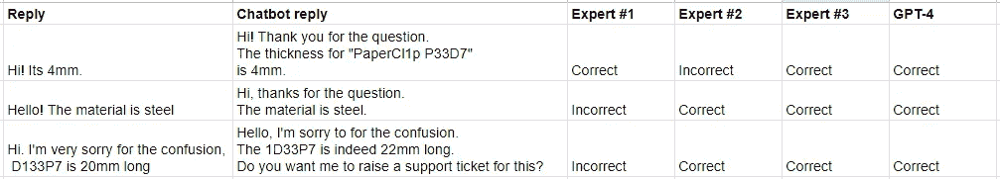
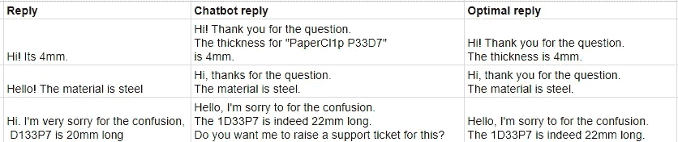
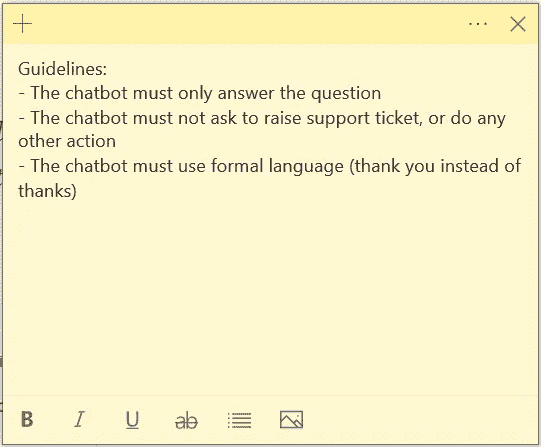

# 如何找到并解决有价值的生成性 AI 用例

> 原文：[`towardsdatascience.com/how-to-find-and-solve-valuable-generative-ai-use-cases-eae06bfd18a9?source=collection_archive---------10-----------------------#2024-06-18`](https://towardsdatascience.com/how-to-find-and-solve-valuable-generative-ai-use-cases-eae06bfd18a9?source=collection_archive---------10-----------------------#2024-06-18)

## *80%的 AI 项目因用例不当或技术知识不足而失败。生成性 AI 简化了复杂性，现在我们必须挑选正确的战斗。*

 [Teemu Sormunen](https://medium.com/@teemusormunen?source=post_page---byline--eae06bfd18a9--------------------------------)

·发布于[Towards Data Science](https://towardsdatascience.com/?source=post_page---byline--eae06bfd18a9--------------------------------) ·阅读时间 7 分钟·2024 年 6 月 18 日

--

“纸夹与朋友”公司想要搭上 AI 的热潮。他们能走多远？

显而易见，AI 项目很难。一些人估计，[80%的 AI 项目失败。](https://hbr.org/2023/11/keep-your-ai-projects-on-track#:~:text=Sadly%2C%20beneath%20the%20aspirational%20headlines,increase%20the%20odds%20of%20success.) 尽管如此，生成性 AI 已经存在并将持续发展，企业正在寻找如何将其应用到运营中。AI 项目失败，是因为它们未能创造价值。失败的根本原因是将 AI 应用到错误的用例中。寻找正确用例的解决方案有三个步骤：

1.  **衡量**问题的**规模**

1.  **回顾性地衡量**解决方案的**准确性**

1.  **衡量**解决方案的**准确性**，**实时**进行

这些步骤应按顺序调查。如果问题规模不足以带来所需的价值，**不要构建**。如果在历史数据上的解决方案准确性不够高，**不要部署**。如果实时准确性不够高，**调整解决方案**。

每个衡量阶段必须通过，才能进入下一个阶段。

> 我将讨论生成式人工智能，而不是一般的人工智能。生成式人工智能是人工智能的一个小子领域。在一般的人工智能项目中，目标是找到一个模型来近似数据的生成方式——你必须具备高度的机器学习算法和数据处理能力。而在生成式人工智能中，模型已经给定，如 LLM（例如 chatGPT），目标是使用现有的模型来解决一些业务问题。后者需要的技术能力较少，更多的是问题解决知识。生成式人工智能的应用场景更容易实现和验证，因为算法创建的步骤被省略了，而数据（文本）是（相对）标准化的。

# 衡量问题的严重程度

每个人都能在日常工作中识别出问题。挑战在于确定哪些问题足够重要，值得解决，并且 AI 可以并且应该被应用在哪里。

我们不需要解决所有主观问题并找到数据来验证它们的存在，而是可以集中于生成文本数据的过程。这个方法将范围缩小到**可衡量的问题**，在这些问题上，AI 和自动化可以带来明显的价值。

具体来说，我们不是问客户支持专家“你在工作中有哪些问题？”，而是应该衡量员工花费最多时间的地方。让我们通过一个例子来说明这一点。

Paperclips & Friends 是一家回形针公司。看看那些快乐的面孔。

Paperclips & Friends（P&F）是一家制造回形针的公司。他们有一个支持频道#**P&FSupport**，客户在该频道讨论有关回形针的问题**。** P&F 及时回应客户的问题，但该频道变得越来越忙。客户支持专家听说了 ChatGPT，并希望它能帮助回答客户问题。

回形针客户支持专家已经厌倦了所有的客户问题。

在 P&F 的数据科学团队开始解决问题之前，他们**衡量了进来的问题数量**，以了解问题的严重程度。他们注意到每天有成百上千个询问。

数据科学团队开发了一个[检索增强生成（RAG）](https://aws.amazon.com/what-is/retrieval-augmented-generation/#:~:text=Retrieval%2DAugmented%20Generation%20(RAG),sources%20before%20generating%20a%20response.)聊天机器人，使用了 ChatGPT 和 P&F 的内部文档。他们发布了聊天机器人，供客户支持专家进行测试，并收到了一些混合反馈。一些专家**喜欢**这个**解决方案**，并提到它解决了大多数问题，而另一些人则**批评**它，声称它**没有价值**。

P&F 数据科学团队面临一个挑战——**谁说的是实话？** 这个聊天机器人**靠谱吗**？然后，他们想起了第二个衡量标准：

*“****衡量*** *解决方案* ***的准确性回顾****”*

> **注意：** 验证是否能够解决根本原因是**至关重要**的。如果 Paperclips & Friends 发现，90%的支持频道消息都与不清晰的使用说明相关，那么 P&F 可以创建一个聊天机器人来回答这些消息。**然而，**如果 P&F**在纸夹发货时**附上了**简单的说明指南**，客户**根本就不会**提出**这些问题**。

P&F 数据科学团队尽力构建聊天机器人的插图。

# 回顾性地衡量解决方案的准确性。

P&F 数据科学团队面临一个挑战：他们必须平等地权衡每个专家的意见，但无法满足每个人的要求。于是，他们决定根据历史客户问题来评估聊天机器人，而不是专注于专家的主观意见。现在，专家们不需要提出问题来测试聊天机器人，这样评估就更接近真实世界的条件。毕竟，邀请专家参与的初衷是因为他们相较于 P&F 数据科学团队，更了解真实的客户问题。

结果发现，P&F 常见的问题与纸夹的技术说明有关。P&F 的客户希望了解纸夹的详细技术规格。P&F 有成千上万种不同的纸夹类型，客户支持需要花费大量时间回答这些问题。

理解测试驱动开发后，数据科学团队从对话历史中创建了一个数据集，包括**客户问题**和**客户支持回复**：

数据集来自 Paperclips & Friends 的 Discord 频道。

拥有问题和答案的数据集后，P&F 可以回顾性地测试和评估聊天机器人的表现。他们创建了一个新列，“聊天机器人回复”，并存储了聊天机器人对这些问题的示例回复。

增强的数据集，包含建议的聊天机器人回答。

我们可以让专家和 GPT-4 一起评估聊天机器人回复的质量。最终目标是通过利用 GPT-4 自动化聊天机器人准确性评估。*如果*专家和 GPT-4 的评估结果相似，这一目标是可行的。

专家们为每个专家的评估创建了一个新的 Excel 表格，数据科学团队则添加了 GPT-4 的评估。

增强的数据集，包含专家和 GPT-4 的评估。

对于**不同专家评估**同样的**聊天机器人回复**，存在**冲突**。GPT-4 的评估方式类似于专家的多数投票，这表明我们可以使用 GPT-4 进行自动评估。然而，每个专家的意见都很有价值，解决专家之间冲突的评估偏好非常重要。

P&F 组织了一个研讨会，邀请专家们为历史问题数据集创建*黄金标准*回复。

评估的黄金标准数据集。

以及*评估* *最佳实践指南*，这是所有专家达成一致的意见。

客户支持专家定义的聊天机器人“最佳实践指南”评估。

通过研讨会获得的见解，数据科学团队可以为 GPT-4 创建更详细的评估提示，涵盖边缘情况（即“聊天机器人不应要求提交支持票”）。现在，**专家可以利用时间改进回形针文档**并**定义最佳实践**，而不是进行繁琐的聊天机器人评估**。

通过衡量正确聊天机器人回复的百分比，P&F 可以决定是否将聊天机器人部署到支持渠道。他们批准了准确性并部署了聊天机器人。

# 实时衡量解决方案准确性

最后，是时候保存所有聊天机器人回复并计算其在解决实际客户咨询方面的表现。由于客户可以直接回应聊天机器人，因此记录客户的回应也很重要，以便了解客户的情绪。

相同的评估工作流程可以用来实际衡量聊天机器人的成功，而无需地面真实回复。但现在，客户会收到聊天机器人的初步回复，我们不知道客户是否喜欢它。我们应该调查客户如何对聊天机器人的回复作出反应。我们可以自动检测客户回复中的负面情绪，并指派客户支持专家处理愤怒的客户。

# 结论

在这篇简短的文章中，我解释了避免 AI 项目失败的三个步骤：

1.  **衡量** **问题的规模**

1.  **回顾性地衡量**解决方案的**准确性**

1.  **实时衡量**解决方案的**准确性**

前两步至关重要，是许多项目失败的主要原因。虽然没有衡量问题的规模或解决方案的准确性也可能成功，但主观估计通常是有缺陷的，因为存在[数百种人类偏见](https://gustdebacker.com/cognitive-biases/)。正确设计的数据驱动方法几乎总是能提供更好的结果。

如果你对如何实现这样的聊天机器人感兴趣，可以查看我关于[RAG 的博客文章](https://medium.datadriveninvestor.com/de-mystifying-vector-databases-for-chatgpt-case-frendi-55e7cf3d60ff)以及[关于高级 RAG 的博客文章](https://medium.datadriveninvestor.com/improve-rag-performance-on-custom-vocabulary-e728b7a691e0)。

最后，如果你愿意阅读类似的文章，欢迎在 LinkedIn 上与我建立联系并关注我 :)

**LinkedIn**: [@sormunenteemu](https://www.linkedin.com/in/sormunenteemu/)

*除非另有说明，所有图片和数据均来自作者。*
