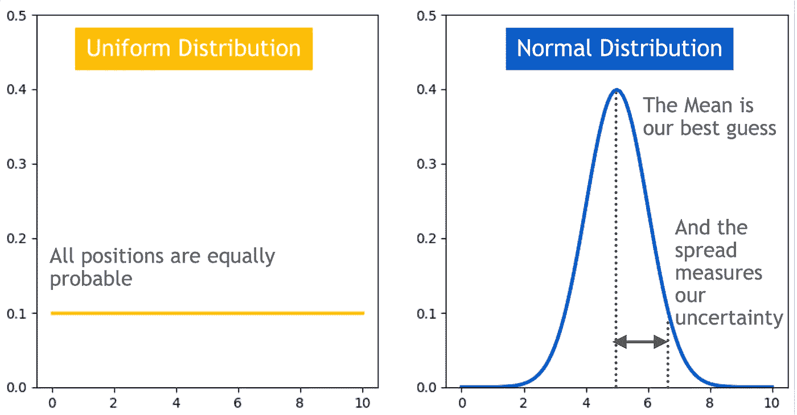

# 如何在数字化世界中找到自我

> 原文：[`towardsdatascience.com/how-to-find-yourself-in-a-digital-world-f58580a69c6a?source=collection_archive---------5-----------------------#2024-03-04`](https://towardsdatascience.com/how-to-find-yourself-in-a-digital-world-f58580a69c6a?source=collection_archive---------5-----------------------#2024-03-04)

## **在不确定性下自我定位的概率方法**

[](https://medium.com/@edenoosh15?source=post_page---byline--f58580a69c6a--------------------------------)[](https://towardsdatascience.com/?source=post_page---byline--f58580a69c6a--------------------------------) [Eden B.](https://medium.com/@edenoosh15?source=post_page---byline--f58580a69c6a--------------------------------)

·发表于[Towards Data Science](https://towardsdatascience.com/?source=post_page---byline--f58580a69c6a--------------------------------) ·阅读时长 8 分钟·2024 年 3 月 4 日

--

## **目录：**

1.  什么是定位，机器人为什么需要它？

1.  为什么使用概率工具来计算定位？

1.  端到端示例：如何使用贝叶斯算法在不确定性下确定机器人的位置？

自动驾驶汽车如何在时速 60 英里下保持在车道内？i-robot 如何避免从楼梯上摔下来？送货机器人如何知道它们是否正朝着正确的饥饿顾客前进？这些只是自动驾驶汽车必须在没有人类干预的情况下回答的一些问题。

## **1\. 什么是定位？机器人为什么需要它？**

正如你可能想象的那样，准确的车辆位置对于自动驾驶汽车是否能有效且安全地完成任务至关重要。**从传感器数据估算车辆位置的过程被称为定位**。随着提供更多信息的传感器加入，定位精度会提高，而随着车辆的运动引入噪声，定位精度会降低。

## **2\. 为什么使用概率工具来计算定位？**

概率工具可以被用来提高定位精度，尤其是在传感器或运动都不是 100%精确的情况下。

**什么是概率？**

根据词典定义，概率是“描述某事件发生可能性的数值”（维基百科）。然而，关于概率的意义，答案并不那么简单。频率主义者和贝叶斯主义者两个主要阵营对概率有不同的解释。

> **频率主义**方法将概率解释为时间的相对频率；如果我多次重复一个实验，我能得到理想结果的次数是多少？

这种方法是客观的，因为任何进行实验的人（例如抛硬币）在长时间内都会得到相同的结果。

> **贝叶斯**方法将概率解释为事件发生的确定性程度。在专家知识和可用数据的基础上，我对自己获得期望结果的确定性有多高？这种方法是主观的，因为它通过结合（主观的）先前知识和实验数据，代表了当前的信念状态。它允许估算我们无法多次实验的单一事件的概率，在这种情况下，频率学派的解释并不适用。

例如，如果约会后第一次见面时对方回复你短信的概率是 0.8，那么我们可以 80%确定你们度过了一段美好时光，并且对方会回复你短信；我们*并不是*指他们会在你不断重复第一次约会时 80%的概率回复短信。

**贝叶斯概率的好处是什么？**

贝叶斯概率让我们既能量化我们的信念程度，又能根据新的证据更新它。


贝叶斯定理：根据来自传感器的证据 E 更新机器人位置的假设 P(H)，也称为先验，返回 P(H|E)，也称为后验。

在我们的背景下，P(H)是我们对机器人当前位置的初步猜测，P(H|E)是我们在测量传感器证据 E 之后更新的猜测。

> 假设概率分布量化了我们对机器人当前位置的确定性。



(1) 均匀分布：如果我们不知道机器人在哪里，所有位置的概率是相等的 (2) 正态分布，均值=最佳猜测，标准差=不确定性

> 假设可以根据证据进行变化

传感器数据越有信息量和准确性，它的影响就越大。如果传感器是完美的，机器人的位置将与传感器的读数一致；否则，如果传感器数据非常嘈杂或缺乏信息量，机器人的位置将保持不变。


更新我们的假设：在证据 P(H|E)之后，假设与我们最初的信念 P(H)有多大不同？

> 更新可以结合多个证据来源

我们可以通过使用链式法则，也叫做一般乘积法则，来将贝叶斯定律应用于多个数据源的结合。它允许将多个证据的联合分布简化为条件概率的乘积。


贝叶斯定理通过应用链式法则，推广到多个证据 E1 和 E2 的情况。

例如，我们通常使用 GPS 从当前位置导航，但 GPS 在晴朗的天空下效果最佳，并且其精度仅限于几米。自动驾驶汽车不能仅仅依赖 GPS 来保持在几米宽的车道上，并在隧道或地下停车场内导航。自动驾驶汽车可以通过添加更多的信息来源，如摄像头，来弥补 GPS 的不足。

## **3\. 端到端示例：如何使用贝叶斯算法在不确定性下确定机器人的位置？**

让我们深入探讨一个贝叶斯滤波器，它通过贝叶斯推断递归地改善定位概率估计。递归特性意味着，在时间 t_0 时，滤波器的输出 P(H|E) 作为下一个时间戳 t_1 时刻 P(H) 的假设输入。

假设一个配送机器人正在太空站内绕着圆形路径运输物资。机器人有一张地图，详细标出了地形和传感器的位置。


机器人的地图显示了路线和传感器的位置，信标 1 用橙色表示，信标 2 用蓝色表示。路线的圆形特性使得机器人在到达最后一个区间时会返回起点。（机器人图像由 Dall-E 生成）

## **- 问题定义：**

我们将估计的机器人位置称为**机器人状态空间**。例如，一个二维向量（即一对有序数字）表示 x 轴位置和 x 轴速度，可以在一维中追踪机器人的位置和变化速度。可以扩展机器人的状态空间到更多维度，以追踪多个位置维度（y，z），方向等。

为了简化起见，我们可以假设机器人以恒定速度移动。运动会增加计算的不确定性，因为它并非 100% 可靠。发动机可能无法以特定的速度运行，或者机器人可能会遇到障碍物，这将导致机器人超越或未达到预期的运动位置。

我们的机器人将通过测量信标的存在来感知其位置。传感器读取数据，也叫做**测量空间**，并不是 100% 精确的。传感器可能会把噪声误认为是信标信号，导致误报，或者根本无法探测到信号。


机器人的向量：（1）表示时间 t 时刻 x 位置的状态空间向量（2）表示时间 t 时刻信标存在的测量空间向量

## **- 算法：直方图滤波器**

使用这个贝叶斯滤波器，机器人状态空间通过有限数量的区间或区域表示为直方图。它是一个离散滤波器，意味着机器人只能位于这些区域中的一个，我们计算机器人位于每个区域的概率。此外，在每个区间内，例如 5 平方米的区域，位于任何特定点的概率是相同的。如果我们想要增加粒度，必须添加更多的区间。

这个滤波器是非参数化的，意味着它不对机器人的状态表示做出任何强假设，也不局限于像高斯分布这样的单一分布类型。它能够表示复杂的位置估计，比如保持多个最佳猜测的多模态假设，但这也带来了计算成本——指数级的复杂性。为了增加一个维度，从 1D 到 2D 同时保持相同的粒度，我们需要 10x10 的垃圾桶；如果要转到 3D，我们需要 10x10x10 的垃圾桶，以此类推。这对于跟踪多个维度且在内存和计算能力上有限的机器人来说，是一个显著的限制。

## - 计算：

1.  **初始猜测：** 我们从一个未知的位置开始，并配有一张地图。一开始，每个区域的概率是相同的，所有垃圾桶的分布是均匀的。


x 位置被分成 10 个离散区域，表示机器人的状态。最初，我们没有关于机器人所在位置的信息，因此每个区域的概率相同，都是 1/10。

**2. 移动函数：** 模拟机器人的运动。机器人的运动是随机的，这意味着它不保证每次都能移动到期望的垃圾桶。在每次移动后，为了更新机器人的位置，我们计算机器人在下一个时间步中位于每个区域的概率。这个计算考虑了机器人保持在同一区域的概率以及移动到其他区域的概率。

```py
For each movement:
  For each region:
    Region probability at time t+1 = 
    Region probability at time t x stay probability + 
    Probability of robot coming from the neighboring region x move probability
```


移动函数：假设机器人每次移动一步，那么成功移动一步的概率是多少？机器人移动到下一个垃圾桶的概率为 95%，停留在当前位置的概率为 5%。

如下面的方程所示，机器人一次移动不会改变位置估计，因为采用的是均匀分布，每个区域保持和移动的概率相等。


机器人在移动一步之后，位于垃圾桶#2 的概率是多少？

即使我们最初从一个完全确定的位置开始（100%），运动中的固有随机性也会逐渐加入噪声，导致我们随着时间推移趋向于均匀分布。我们需要添加信息！

**3. 感知函数：** 结合使用贝叶斯定理，通过测量来增加信息。

```py
After each movement:
    For each region:
      Region probability at time t+1 given measurement at time t+1 = 
      Likelihood of the measurement given the robot is in that region 
      x Region probability at time t+1 after movement
      x normlization to ensure that all the probabilities sum to 1.
```

传感器的可靠性通过概率表示，因为它们不是 100%准确的。下面的方程展示了当传感器检测到橙色时，机器人位于橙色垃圾桶的概率为 90%，而传感器错误的概率为 10%，即机器人实际上位于蓝色垃圾桶中。


感知函数：给定机器人在一个橙色垃圾桶内，机器人感知到“橙色”的概率是多少？

下述计算展示了，与运动相比，传感器提供了信息并改进了我们对机器人位置的理解。例如，因为第 2 号箱子不是橙色的，机器人在其中的概率从 0.1 降低到 0.02。


给定机器人感知到“橙色”，机器人在第二个箱子里的概率是多少？

下图显示了在结合了运动和传感器数据后更新的位置假设。


多亏了在一步之后的感知函数，我们对机器人所在位置有了更多的确定性。我们需要更多的步骤来增加在橙色箱子中的确定性。

# **最后思考**

机器人在哪里？我们可以通过使用递归贝叶斯滤波器，不断细化对这个问题的回答，从一个均匀分布开始，保持所有猜测的概率相等，直到收敛到最可能的答案。

贝叶斯滤波器帮助我们衡量对机器人位置的信心，通过将（有噪声的）传感器数据与先前的信息（即运动后的机器人预估位置）结合来更新这一信念。

来源：

+   这些是我从推荐度很高的 edX 课程“[自驾车的贝叶斯算法](https://learning.edx.org/course/course-v1:IsraelX+ACD_RFP4_ARIEL_Nivut+2T2023/home)”的第一次讲座中整理的总结笔记，讲师是 [Roi Yozevitch 博士](https://www.yozevitch.com/yozevitch-homepage-1)。

+   [概率机器人学](https://calvinfeng.gitbook.io/probabilistic-robotics/basics/nonparametric-filters) GitBook: 非参数滤波器

+   维基百科 [概率](https://en.wikipedia.org/wiki/Probability)、[概率论](https://en.wikipedia.org/wiki/Probability_theory) 和 [贝叶斯定理](https://en.wikipedia.org/wiki/Bayes%27_theorem)

+   Daniel Sabinasz 的个人 [直方图滤波器博客](https://www.sabinasz.net/robot-localization-histogram-filter/)

+   从 [latex 到 png](https://latex2png.com/) 的在线转换器。

+   图片：机器人头像是由 [Dall-E](https://openai.com/dall-e-3) 创建的。本文中使用的其他所有图片均由作者创建。
