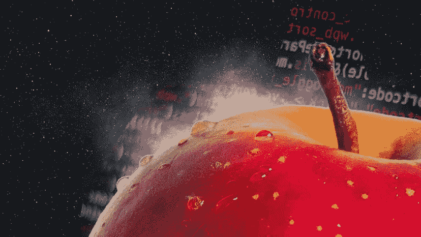

# 如何生成用于目标检测任务的合成图像

> 原文：[`towardsdatascience.com/how-to-generate-synthetic-images-for-object-detection-tasks-ac4c015bb3ff?source=collection_archive---------1-----------------------#2024-03-08`](https://towardsdatascience.com/how-to-generate-synthetic-images-for-object-detection-tasks-ac4c015bb3ff?source=collection_archive---------1-----------------------#2024-03-08)

## 使用 Blender、Python 和 3D 资源的逐步教程

 [Dr. Leon Eversberg](https://medium.com/@leoneversberg?source=post_page---byline--ac4c015bb3ff--------------------------------)

·发表于 [Towards Data Science](https://towardsdatascience.com/?source=post_page---byline--ac4c015bb3ff--------------------------------) ·10 分钟阅读·2024 年 3 月 8 日

--

图像由作者创建

数据不足是当今深度学习中的最大问题之一。

计算机视觉任务的一个有前景的解决方案是自动生成带有标注的合成图像。

在本文中，我将首先概述一些用于合成图像数据的图像生成技术。

然后，我们生成一个不需要手动标注的训练数据集，并用它来训练一个 Faster R-CNN 目标检测模型。

最后，我们在真实图像上测试我们训练的模型。

# 图像生成技术

从理论上讲，合成图像是完美的。**你可以在不需要手动标注的情况下生成几乎无限数量的图像**。

使用真实图像和手动标注的训练数据集可能包含大量人为标注错误，并且它们通常是有偏的数据集（例如，汽车图像大多是从侧面/正面拍摄的，并且是在道路上）。

然而，合成图像存在一个被称为**模拟到真实领域差距**的问题。
