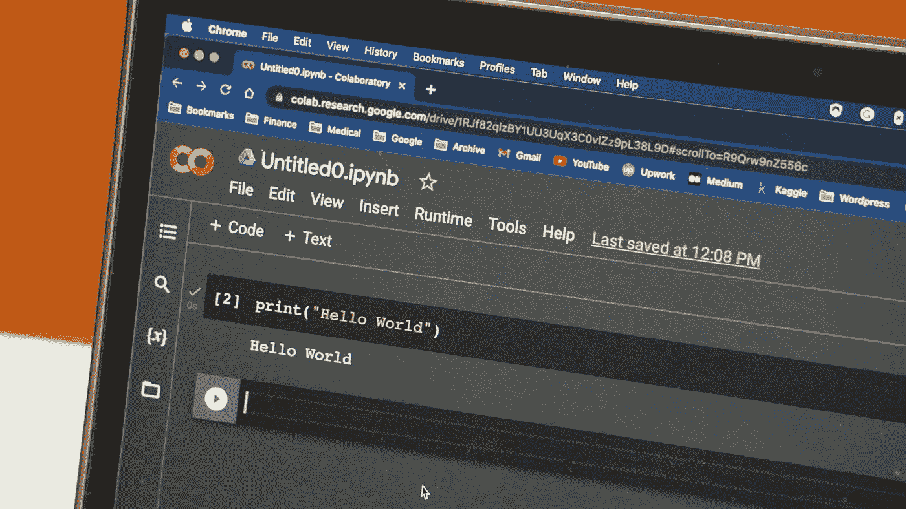
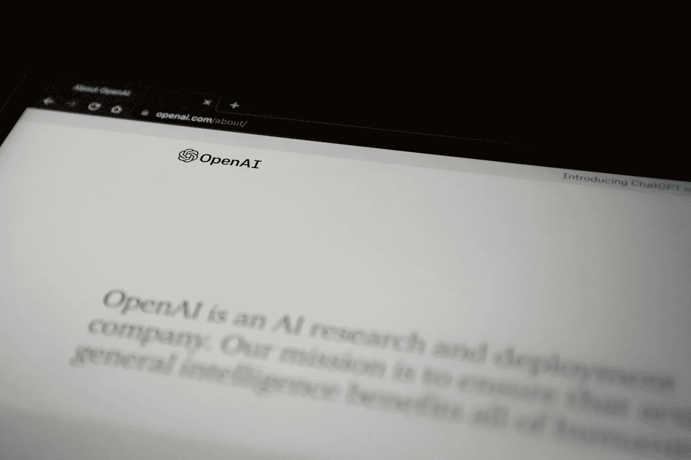
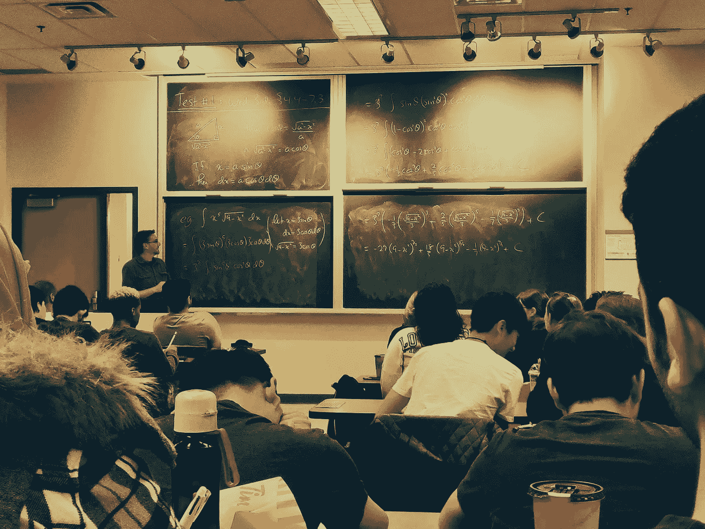
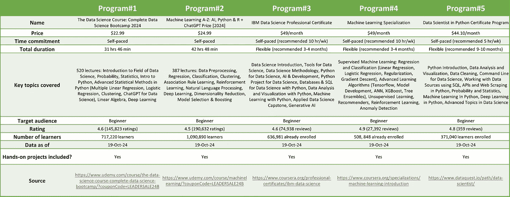

# 如何开始你的数据科学职业之旅

> 原文：[`towardsdatascience.com/how-to-get-started-on-your-data-science-career-journey-e99f450c93c5?source=collection_archive---------4-----------------------#2024-10-20`](https://towardsdatascience.com/how-to-get-started-on-your-data-science-career-journey-e99f450c93c5?source=collection_archive---------4-----------------------#2024-10-20)

## 初学者在选择数据科学及 AI/ML 提升资源时需要考虑的六个要点

 [Ramkumar K](https://medium.com/@rkumar5680?source=post_page---byline--e99f450c93c5--------------------------------)

·发布于[Towards Data Science](https://towardsdatascience.com/?source=post_page---byline--e99f450c93c5--------------------------------) ·6 分钟阅读·2024 年 10 月 20 日

--

图片由[Zach Graves](https://unsplash.com/@zgraves?utm_source=medium&utm_medium=referral)提供，来自[Unsplash](https://unsplash.com/?utm_source=medium&utm_medium=referral)

# 介绍

图片由[Jonathan Kemper](https://unsplash.com/@jupp?utm_source=medium&utm_medium=referral)提供，来自[Unsplash](https://unsplash.com/?utm_source=medium&utm_medium=referral)

显而易见，数据科学在过去十年中已经发展成为市场上最受追捧的技能之一。传统公司、科技公司、咨询公司、初创企业——不管是哪个行业——都在不断招聘数据科学专业人士。高需求和相对较少的经验丰富的专家，使得这一领域成为一个非常有利可图的职业机会。要进入并在这个领域取得成功，你不仅需要深入理解现有的算法和包，还需要培养直觉，理解哪些方法适合哪些使用场景。此外，你还需要学习如何将现实世界的问题转化为数据科学框架。在这篇文章中，我将讨论初学者如何构建对这一领域的基础性和深入理解，以便开启数据科学职业之旅。

# 从哪里开始？

图片由[marianne bos](https://unsplash.com/@mariannebos?utm_source=medium&utm_medium=referral)提供，来自[Unsplash](https://unsplash.com/?utm_source=medium&utm_medium=referral)

鉴于有大量的学习资源可供选择，挑选学习方式可能会让人感到困惑。虽然最终选择会取决于你的个人情况和目标，但在选择学习资源时，你可能需要考虑以下几个标准：

· *内容*：通常，一个全面的资源将涵盖监督学习（例如线性回归、逻辑回归、决策树、集成方法）、无监督学习（例如聚类、PCA），以及统计学和概率学的基础知识。许多课程还专门讲解高级方法，如深度学习、计算机视觉、自然语言处理和生成性 AI。有些课程甚至提供免费的课程内容预览、学习视频和编程项目，帮助学习者做出决定。虽然很难找到包含每个主题细节的课程，但你转向数据科学领域的目的应该决定了课程的选择。

· *受众*：“谁会从这门课程中受益？”是确定一个课程的重要问题。如果你是初学者，那么中级课程可能会成为学习的障碍。相反，对于已经有一定分析方法背景的学习者来说，过于基础的内容可能会显得不太有用。

· *时间投入*：根据你的个人情况和偏好，这一考虑因素可能会缩小你可以选择的选项。例如，如果你是一个在职人士，你可能无法每周花费超过几个小时的时间。许多在线课程提供灵活的时间安排，预计每周需花费 5 到 7 小时的时间，旨在帮助兼职学习者。课程的总体时长也决定了技能发展的程度。虽然大学中的高级课程（例如数据科学硕士课程）可能会在 18 到 24 个月内帮助你深入发展专业知识，并且可能每周需要几个小时的专注努力，但持续 4 到 6 周的短期课程可能不足以帮助你获得启动新职业所需的技能。

· *学习者体验*：你可以在课程页面或其他在线平台上查看用户评价。这些评价有助于了解课程内容和教学质量，尤其是当评价数量较多且有评论时。此外，课程的受欢迎程度也可以通过目前注册的学习者数量和已经完成课程的学习者数量来衡量。有人可能会认为，验证评论的真实性和学习者数量可能存在挑战，但这些评价可以作为一种三角验证点，结合其他信息，从整体上评估一个课程。

· *费用*：课程费用可能是选择时的重要因素。课程费用可以从免费的到数千美元不等。

· *职业资源*：许多项目提供支持，帮助进行新的求职和职业转换，包括面试准备、简历审查以及与行业领域专家建立网络。虽然这可能不是选择一个项目时的首要考虑因素，但这些资源可以在你开始职业转型之旅时帮助你迈出第一步。

# 推荐的学习机制

图片由[Shubham Sharan](https://unsplash.com/@shubhamsharan?utm_source=medium&utm_medium=referral)提供，来自[Unsplash](https://unsplash.com/?utm_source=medium&utm_medium=referral)

虽然有很多在线资源可以帮助你获取特定主题的知识，但我建议初学者考虑一个结构化的学习路径，这样可以全面了解数据科学领域。根据我的经验，我建议至少最初选择三种类型的项目（你可以随时通过额外的材料来补充对单个主题的学习）：

· 专业化或职业证书

· 微硕士/纳米学位

· 训练营

通常，这些项目会持续几个月。我发现这些项目在单一/短期课程可能不足以培养所需的数据科学敏锐度和学制较长的正规教育之间提供了平衡。教育科技公司通常与知名大学合作，提供这些项目。通过选择标准的并排比较有助于决定前进的路径——图 1 展示了专业化和职业证书的比较示例。这里列出的课程仅是在线项目多样性的一个小样本，并不代表全部。此外，每个项目的细节来自某个特定时点，可能会有所变化。

图 1\. 选择的 AI/ML 专业化和职业认证的比较。图片由作者制作。*数据取自某一时点，可能会有所变动。项目价格可能根据促销和计划而有所不同。

虽然建议选择并从一个项目开始，但有时可能需要通过多个课程才能对该领域感到更为熟悉。在我个人的案例中，我首先选择了 Andrew Ng 的《机器学习》[课程](https://www.coursera.org/specializations/machine-learning-introduction)，它详细讲解了基础知识，但由于当时课程中有 Matlab/Octave 的练习，我决定再参加 IBM 的另一门[课程](https://www.coursera.org/professional-certificates/ibm-data-science)，一边学习 Python，一边学习人工智能/机器学习。根据我的个人学习偏好，我认为需要一个更正式的教学机制，于是我选择了得克萨斯大学奥斯汀分校与*Great Learning*合作的 AI/ML 研究生[项目](https://onlineexeced.mccombs.utexas.edu/online-ai-machine-learning-course)。这个项目为我提供了更多的结构化学习，因为我需要通过视频模块学习理论，每周投入 5 到 7 小时，参加每周的测验，参与每个周末由导师主导的在线小组互动课程，以及定期提交编程作业。虽然理论学习和测验帮助我理解了概念，但实际的代码开发练习才是我内化学习的关键。这项练习让我深入了解如何设置问题、清洗和分析原始数据、确定应用哪种算法、完善解决方案并解释结果。

# 总结…

摄影：来自 [Kelly Sikkema](https://unsplash.com/@kellysikkema?utm_source=medium&utm_medium=referral) 于 [Unsplash](https://unsplash.com/?utm_source=medium&utm_medium=referral)

在开始技能提升之旅时，做出明智的决策至关重要。作为初学者，考虑一个更有结构的学习路径可能是明智之选，等你对基础知识有了基本了解后，再深入学习具体领域。在开始时花时间研究和对比不同的学习项目，也能帮助学习者了解数据科学领域中的关键和热门话题。

感谢阅读。希望你觉得这篇文章有用。如果有任何意见，欢迎随时发送至 rkumar5680@gmail.com。让我们在[LinkedIn](https://www.linkedin.com/in/ramkumar-karuppiah-4458414/)上建立联系。
