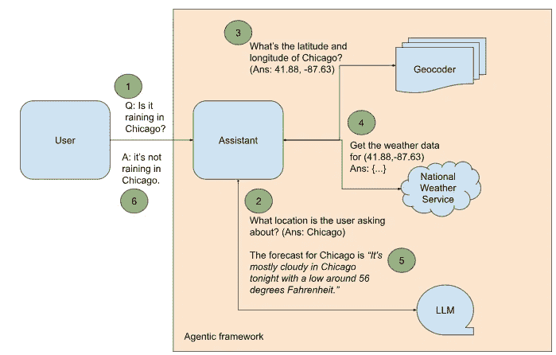
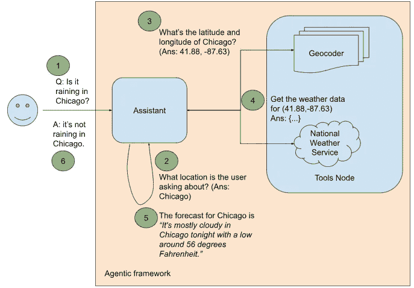
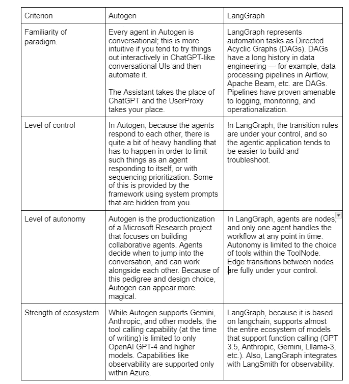

# 如何使用 Autogen 或 LangGraph 实现 GenAI 代理

> 原文：[`towardsdatascience.com/how-to-implement-a-genai-agent-using-autogen-or-langgraph-929135afd34d?source=collection_archive---------1-----------------------#2024-08-01`](https://towardsdatascience.com/how-to-implement-a-genai-agent-using-autogen-or-langgraph-929135afd34d?source=collection_archive---------1-----------------------#2024-08-01)

## 从开发者角度比较 Autogen 和 LangGraph

[](https://lakshmanok.medium.com/?source=post_page---byline--929135afd34d--------------------------------)[](https://towardsdatascience.com/?source=post_page---byline--929135afd34d--------------------------------) [Lak Lakshmanan](https://lakshmanok.medium.com/?source=post_page---byline--929135afd34d--------------------------------)

·发表于 [Towards Data Science](https://towardsdatascience.com/?source=post_page---byline--929135afd34d--------------------------------) ·10 分钟阅读·2024 年 8 月 1 日

--

GenAI 模型擅长一些特定任务，如文本总结、问题回答和代码生成。如果你有一个可以分解为一系列步骤的业务流程，而其中一个或多个步骤涉及这些 GenAI 超能力之一，那么你将能够使用 GenAI 部分自动化你的业务流程。我们称这种自动化步骤的软件应用程序为*代理*。

虽然代理仅使用 LLM 来处理文本并生成响应，但这一基本功能可以提供相当高级的行为，例如能够自动调用后端服务。

# 当前某地的天气

假设你想构建一个能够回答类似“芝加哥下雨吗？”的问题的代理。你不能仅使用 LLM 来回答这样的问题，因为这是一个不能通过记忆大量文本中的模式来完成的任务。相反，要回答这个问题，你需要访问实时的天气信息来源。

美国国家气象局（NWS）提供了一个开放且[免费的 API](https://weather-gov.github.io/api/general-faqs)，用于提供某一地点的短期天气预报。然而，要使用这个 API 来回答类似“芝加哥下雨吗？”这样的问题，涉及几个额外步骤（见图 1）：



图 1. 用于回答关于当前天气问题的代理应用程序，围绕对话代理构建

1.  我们需要设置一个代理框架来协调接下来的步骤。

1.  用户感兴趣的地点是哪里？在我们示例句子中的答案是“芝加哥”。这并不只是简单地提取句子的最后一个词——如果用户问“Orca Island 今天热吗？”，那么感兴趣的地点就是“Orca Island”。因为从问题中提取地点需要能够理解自然语言，所以你可以提示 LLM 来识别用户感兴趣的地点。

1.  NWS API 基于纬度和经度。如果你想获取芝加哥的天气，你需要将字符串“芝加哥”转换为一个点的纬度和经度，然后调用 API。这被称为*地理编码*。Google Maps 提供了一个地理编码 API，给定一个地名，例如“芝加哥”，它将返回相应的纬度和经度。告诉代理使用这个工具来获取地点的坐标。

1.  将地点坐标发送到 NWS 天气 API。你将收到一个包含天气数据的 JSON 对象。

1.  告诉 LLM 提取相应的天气预报（例如，如果问题是关于现在、今晚或下周一），并将其添加到问题的上下文中。

1.  基于这个丰富的上下文，代理最终能够回答用户的问题。

让我们逐步进行这些操作。

# 第一步：设置 Autogen

首先，我们将使用[Autogen](https://microsoft.github.io/autogen/)，这是微软创建的开源代理框架。为了跟随教程，请克隆[我的 Git 仓库](https://github.com/lakshmanok/lakblogs/)，根据[Google Cloud](https://cloud.google.com/api-keys/docs/overview)和[OpenAI](https://openai.com/index/openai-api/)提供的说明获取 API 密钥。切换到 genai_agents 文件夹，并用你的密钥更新[keys.env](https://github.com/lakshmanok/lakblogs/blob/main/genai_agents/keys.env)文件。

```py
GOOGLE_API_KEY=AI…
OPENAI_API_KEY=sk-…
```

接下来，使用 pip 安装所需的 Python 模块：

```py
pip install -r requirements.txt
```

这将安装 Google Maps 和 OpenAI 的 autogen 模块和客户端库。

通过查看[ag_weather_agent.py](https://github.com/lakshmanok/lakblogs/blob/main/genai_agents/ag_weather_agent.py)来跟踪下面的讨论。

Autogen 将代理任务视为代理之间的对话。所以，Autogen 的第一步是创建将执行各个步骤的代理。一个将是终端用户的代理，它将与我们称之为助手的 AI 代理进行对话：

```py
user_proxy = UserProxyAgent("user_proxy",
code_execution_config={"work_dir": "coding", "use_docker": False},
is_termination_msg=lambda x: autogen.code_utils.content_str(x.get("content")).find("TERMINATE") >= 0,
human_input_mode="NEVER",
)
```

上述关于用户代理有三点需要注意：

1.  如果助手回复包含代码，用户代理可以在沙箱中执行该代码。

1.  如果助手的回复包含“TERMINATE”这个词，用户代理将终止对话。这是 LLM 告诉我们用户的问题已经得到完全回答的方式。让 LLM 执行此操作是 Autogen 发送给 LLM 的隐藏系统提示的一部分。

1.  用户代理永远不会向终端用户提问后续问题。如果有后续问题，我们会指定在什么条件下向用户询问更多信息。

尽管 Autogen 来自微软，但它并不限于 Azure OpenAI。AI 助手可以使用 OpenAI：

```py
openai_config = {
"config_list": [
{
"model": "gpt-4",
"api_key": os.environ.get("OPENAI_API_KEY")
}
]
}
```

或者 Gemini：

```py
gemini_config = {
"config_list": [
{
"model": "gemini-1.5-flash",
"api_key": os.environ.get("GOOGLE_API_KEY"),
"api_type": "google"
}
],
}
```

Anthropic 和 Ollama 也受到支持。

提供适当的 LLM 配置以创建助手：

```py
assistant = AssistantAgent(
"Assistant",
llm_config=gemini_config,
max_consecutive_auto_reply=3
)
```

在我们接入其余的智能框架之前，让我们让助手回答我们的示例查询。

```py
response = user_proxy.initiate_chat(
assistant, message=f"Is it raining in Chicago?"
)
print(response)
```

助手通过这段代码响应，调用现有的 Google 网络服务并抓取响应：

```py
```python

# 文件名：weather.py

import requests

从 bs4 导入 BeautifulSoup

url = "https://www.google.com/search?q=weather+chicago"

response = requests.get(url)

soup = BeautifulSoup(response.text, 'html.parser')

weather_info = soup.find('div', {'id': 'wob_tm'})

print(weather_info.text)

```py
```

这展示了由前沿基础模型驱动的智能框架的强大功能——助手已经自动找到了一个提供所需功能的网络服务，并利用其代码生成和执行能力提供类似所需功能的内容！然而，这并不是我们想要的——我们问的是是否下雨，而我们却得到了整个网站，而不是我们想要的答案。

其次，自动化能力并没有真正满足我们的教学需求。我们使用这个示例来说明企业使用场景，而 LLM 很可能不了解你的内部 API 和工具，因此无法自动使用它们。所以，让我们继续构建图 1 所示的框架，来调用我们想要使用的特定 API。

# 第二步：提取位置

因为从问题中提取位置只是文本处理，你可以简单地提示 LLM。让我们通过一个单次示例来做这件事：

```py
SYSTEM_MESSAGE_1 = """
In the question below, what location is the user asking about?
Example:
Question: What's the weather in Kalamazoo, Michigan?
Answer: Kalamazoo, Michigan.
Question:
"""
```

现在，当我们通过询问芝加哥是否在下雨来启动聊天时：

```py
response1 = user_proxy.initiate_chat(
assistant, message=f"{SYSTEM_MESSAGE_1} Is it raining in Chicago?"
)
print(response1)
```

我们得到的结果是：

```py
Answer: Chicago.
TERMINATE
```

所以，图 1 的第二步已经完成。

# 第三步：地理编码位置

第三步是获取用户感兴趣地点的纬度和经度坐标。编写一个 Python 函数，调用 Google Maps API 并提取所需的坐标：

```py
def geocoder(location: str) -> (float, float):
geocode_result = gmaps.geocode(location)
return (round(geocode_result[0]['geometry']['location']['lat'], 4),
round(geocode_result[0]['geometry']['location']['lng'], 4))
```

接下来，注册此函数，以便助手可以在生成的代码中调用它，用户代理可以在其沙箱中执行它：

```py
autogen.register_function(
geocoder,
caller=assistant, # The assistant agent can suggest calls to the geocoder.
executor=user_proxy, # The user proxy agent can execute the geocder calls.
name="geocoder", # By default, the function name is used as the tool name.
description="Finds the latitude and longitude of a location or landmark", # A description of the tool.
)
```

请注意，在撰写本文时，Autogen 仅对 GPT-4 模型支持函数调用。

我们现在扩展提示中的示例，加入地理编码步骤：

```py
SYSTEM_MESSAGE_2 = """
In the question below, what latitude and longitude is the user asking about?
Example:
Question: What's the weather in Kalamazoo, Michigan?
Step 1: The user is asking about Kalamazoo, Michigan.
Step 2: Use the geocoder tool to get the latitude and longitude of Kalmazoo, Michigan.
Answer: (42.2917, -85.5872)
Question:
"""
```

现在，当我们通过询问芝加哥是否在下雨来启动聊天时：

```py
response2 = user_proxy.initiate_chat(
assistant, message=f"{SYSTEM_MESSAGE_2} Is it raining in Chicago?"
)
print(response2)
```

我们得到的结果是：

```py
Answer: (41.8781, -87.6298)
TERMINATE
```

# 第四至六步：获取最终答案

现在我们已经有了纬度和经度坐标，可以调用 NWS API 获取天气数据。第四步，获取天气数据，类似于地理编码，只不过我们调用的是不同的 API，并从网络服务响应中提取不同的对象。请查看 GitHub 上的代码，了解完整细节。

结果是，系统提示扩展到涵盖智能应用中的所有步骤：

```py
SYSTEM_MESSAGE_3 = """
Follow the steps in the example below to retrieve the weather information requested.
Example:
Question: What's the weather in Kalamazoo, Michigan?
Step 1: The user is asking about Kalamazoo, Michigan.
Step 2: Use the geocoder tool to get the latitude and longitude of Kalmazoo, Michigan.
Step 3: latitude, longitude is (42.2917, -85.5872)
Step 4: Use the get_weather_from_nws tool to get the weather from the National Weather Service at the latitude, longitude
Step 5: The detailed forecast for tonight reads 'Showers and thunderstorms before 8pm, then showers and thunderstorms likely. Some of the storms could produce heavy rain. Mostly cloudy. Low around 68, with temperatures rising to around 70 overnight. West southwest wind 5 to 8 mph. Chance of precipitation is 80%. New rainfall amounts between 1 and 2 inches possible.'
Answer: It will rain tonight. Temperature is around 70F.
Question:
"""
```

基于这个提示，关于芝加哥天气的问题回答能够提取正确的信息并给出正确的答案。

在这个示例中，我们允许 Autogen 自动选择对话中的下一个代理。我们还可以指定不同的[下一发言人选择策略](https://microsoft.github.io/autogen/docs/tutorial/conversation-patterns/#group-chat)：特别地，将其设置为“手动”会插入一个人为环节，并允许人类选择工作流中的下一个代理。

# LangGraph 中的代理工作流

在 Autogen 将代理工作流视为对话时，[LangGraph](https://langchain-ai.github.io/langgraph/) 是一个开源框架，允许通过将工作流视为图来构建代理。这一思路受到长期以来将数据处理管道表示为有向无环图（DAG）的启发。

在图的范式中，我们的天气代理如图 2 所示。



图 2\. 基于语言模型图构建的回答当前天气问题的智能应用。

图 1（Autogen）和图 2（LangGraph）之间有一些关键的区别：

+   在 Autogen 中，每个代理都是一个对话代理。工作流被视为代理之间的对话，代理在认为是“轮到自己”的时候跳入对话中。在 LangGraph 中，工作流被视为一个图，工作流根据我们指定的规则循环遍历图中的节点。

+   在 Autogen 中，AI 助手不能执行代码；相反，助手生成代码，由用户代理执行代码。在 LangGraph 中，有一个特殊的工具节点，其中包含提供给助手的功能。

您可以通过参考我 GitHub 仓库中的文件 [lg_weather_agent.py](https://github.com/lakshmanok/lakblogs/blob/main/genai_agents/lg_weather_agent.py) 来跟进本节内容。

我们通过创建工作流图表来设置 LangGraph。我们的图表由两个节点组成：助手节点和工具节点。工作流内的通信通过共享状态进行。

```py
workflow = StateGraph(MessagesState)
workflow.add_node("assistant", call_model)
workflow.add_node("tools", ToolNode(tools))
```

这些工具是 Python 函数：

```py
@tool
def latlon_geocoder(location: str) -> (float, float):
  """Converts a place name such as "Kalamazoo, Michigan" to latitude and longitude coordinates"""
  geocode_result = gmaps.geocode(location)
  return (round(geocode_result[0]['geometry']['location']['lat'], 4),
  round(geocode_result[0]['geometry']['location']['lng'], 4))
  tools = [latlon_geocoder, get_weather_from_nws]
```

助手调用语言模型：

```py
model = ChatOpenAI(model='gpt-3.5-turbo', temperature=0).bind_tools(tools)
def call_model(state: MessagesState):
  messages = state['messages']
  response = model.invoke(messages)
  # This message will get appended to the existing list
  return {"messages": [response]}
```

LangGraph 使用 langchain，因此更换模型提供者非常简单。要使用 Gemini，您可以通过以下方式创建模型：

```py
model = ChatGoogleGenerativeAI(model='gemini-1.5-flash',
temperature=0).bind_tools(tools)
```

接下来，我们定义图表的边：

```py
workflow.set_entry_point("assistant")
workflow.add_conditional_edges("assistant", assistant_next_node)
workflow.add_edge("tools", "assistant")
```

上面第一行和最后一行是显而易见的：工作流以将问题发送给助手开始。每当调用工具时，工作流中的下一个节点是助手，它将使用工具的结果。中间的那行设置了工作流中的条件边，因为助手之后的下一个节点并不是固定的。相反，助手根据最后一条消息的内容调用工具或结束工作流：

```py
def assistant_next_node(state: MessagesState) -> Literal["tools", END]:
  messages = state['messages']
  last_message = messages[-1]
  # If the LLM makes a tool call, then we route to the "tools" node
  if last_message.tool_calls:
    return "tools"
  # Otherwise, we stop (reply to the user)
  return END
```

一旦工作流创建完成，编译图表并通过传入问题来运行：

```py
app = workflow.compile()
final_state = app.invoke(
{"messages": [HumanMessage(content=f"{system_message} {question}")]}
)
```

系统消息和问题正是我们在 Autogen 中使用的：

```py
system_message = """
Follow the steps in the example below to retrieve the weather information requested.
Example:
Question: What's the weather in Kalamazoo, Michigan?
Step 1: The user is asking about Kalamazoo, Michigan.
Step 2: Use the latlon_geocoder tool to get the latitude and longitude of Kalmazoo, Michigan.
Step 3: latitude, longitude is (42.2917, -85.5872)
Step 4: Use the get_weather_from_nws tool to get the weather from the National Weather Service at the latitude, longitude
Step 5: The detailed forecast for tonight reads 'Showers and thunderstorms before 8pm, then showers and thunderstorms likely. Some of the storms could produce heavy rain. Mostly cloudy. Low around 68, with temperatures rising to around 70 overnight. West southwest wind 5 to 8 mph. Chance of precipitation is 80%. New rainfall amounts between 1 and 2 inches possible.'
Answer: It will rain tonight. Temperature is around 70F.
Question:
"""
question="Is it raining in Chicago?"
```

结果是代理框架使用这些步骤来得出我们问题的答案：

```py
Step 1: The user is asking about Chicago.
Step 2: Use the latlon_geocoder tool to get the latitude and longitude of Chicago.
[41.8781, -87.6298]
[{"number": 1, "name": "This Afternoon", "startTime": "2024–07–30T14:00:00–05:00", "endTime": "2024–07–30T18:00:00–05:00", "isDaytime": true, …]
There is a chance of showers and thunderstorms after 8pm tonight. The low will be around 73 degrees.
```

# 在 Autogen 和 LangGraph 之间选择

在 Autogen 和 LangGraph 之间，你应该选择哪一个？以下是一些考虑因素：



当然，随着你阅读本文时的进展，Autogen 对非 OpenAI 模型和其他工具的支持水平可能会有所提高。LangGraph 可能会增加自主能力，而 Autogen 则可能提供更精细的控制。代理领域正在快速发展！

# 资源

1.  ag_weather_agent.py: [`github.com/lakshmanok/lakblogs/blob/main/genai_agents/ag_weather_agent.py`](https://github.com/lakshmanok/lakblogs/blob/main/genai_agents/ag_weather_agent.py)

1.  lg_weather_agent.py: [`github.com/lakshmanok/lakblogs/blob/main/genai_agents/lg_weather_agent.py`](https://github.com/lakshmanok/lakblogs/blob/main/genai_agents/lg_weather_agent.py)

*本文摘自我正在撰写的 O'Reilly 即将出版的书籍《可视化生成型 AI》，与* [*Priyanka Vergadia*](https://www.linkedin.com/in/pvergadia/)* 合作编写。文中的所有图表均由作者制作。*
