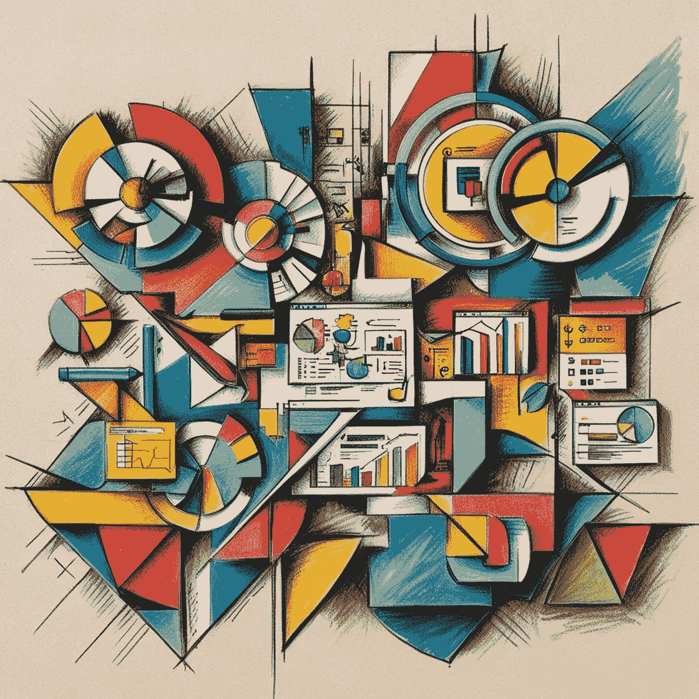
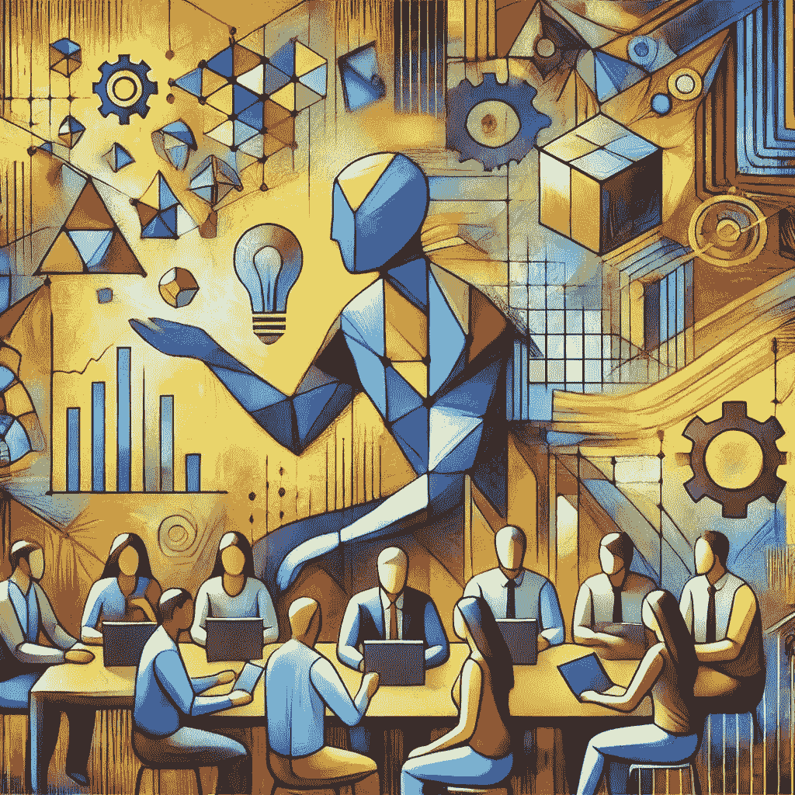
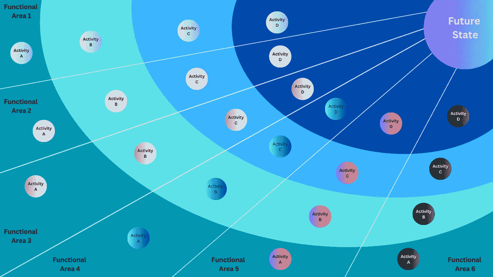

# 如何将 AI 和数据科学融入到您的商业战略中

> 原文：[`towardsdatascience.com/how-to-integrate-ai-and-data-science-into-your-business-strategy-29767ca82b8f?source=collection_archive---------3-----------------------#2024-12-06`](https://towardsdatascience.com/how-to-integrate-ai-and-data-science-into-your-business-strategy-29767ca82b8f?source=collection_archive---------3-----------------------#2024-12-06)

## [数据科学咨询](https://medium.com/@hc.ekne/list/data-science-consulting-bcf6e4b59652)

## 内部咨询指南：如何成功举办为期两天的高管研讨会

 [Hans Christian Ekne](https://medium.com/@hc.ekne?source=post_page---byline--29767ca82b8f--------------------------------)

·发表于 [Towards Data Science](https://towardsdatascience.com/?source=post_page---byline--29767ca82b8f--------------------------------) ·阅读时间 12 分钟·2024 年 12 月 6 日

--

作者通过 Canva 制作的图片

> [“我们的行业不尊重传统 — 只尊重创新。”](https://news.microsoft.com/2014/02/04/satya-nadella-email-to-employees-on-first-day-as-ceo/) — *萨蒂亚·纳德拉，微软首席执行官，2014 年致员工的信*

虽然并非所有行业像软件和云计算行业那样竞争激烈、残酷，但创新并应用最新的技术进展依然是高管们的一个根本主题。经验丰富的商业领袖明白，紧跟相关技术的发展对于成功是必要的。

作为一名数据科学顾问，客户经常问我一些问题：“我们如何有效地将合适的 AI 和机器学习工具整合到我们的业务中？”，以及“我们如何优先考虑 AI 项目，并将其与我们更广泛的公司战略整合？”尤其是在经历了最新的 AI 热潮后，这些问题现在成为议程的重中之重，看起来比以往任何时候都更加紧迫。

使这些问题变得困难的是，好的答案不仅需要了解技术创新，还需要具备领域和商业专业知识。此外，还需要对当前公司的战略有一个基本的理解，以便优先排序并选择合适的举措。因此，与公司高层或某一部门的高层领导进行全面的战略研讨会，是揭示答案的最佳途径之一。

在本文中，我分享了一个蓝图，介绍如何进行为期两天的战略研讨会，目的是找出如何将 AI 和数据科学工具最佳应用于业务。我涵盖了从需要做哪些准备、谁应该参加、如何识别需要深入探讨的主题、研讨会后需要做哪些工作等内容。这个思路是，它可以作为模板，应用于任何行业和几乎任何规模的公司举办研讨会。

在我作为顾问的多年经历中，我与许多能源和金融服务公司合作过，因此你将在文章中看到来自这些行业的案例示例，然而，这个蓝图的设计是行业无关的，方法和原则本质上是通用的。

# 初步工作

由作者使用 DALL-E 生成的图像

与这种类型的研讨会相关的大部分工作实际上是在研讨会开始之前完成的。引用我最喜欢的发明家和政治家的话：

> “不做准备就是准备失败。” — 本杰明·富兰克林

## 功能领域研究与对齐

根据你对行业的了解程度，准备在研讨会前的研究上投入大量时间。有几个主题需要在你能够草拟研讨会大纲之前解决。

+   **行业的高层次理解：** 谁是主要参与者，关键驱动因素是什么，趋势是什么，当前的挑战有哪些

+   **功能业务领域：** 彻底调查你所工作的业务中的关键功能业务领域，然后深入研究每一个领域

尝试将功能领域细分到更细一级，以获得更详细的视角。以能源公用事业为例，典型的功能领域列表可能如下所示：

1.  **电力生产和能源资源管理：** 传统电厂、可再生能源（太阳能、风能、水能）、分布式发电、能源存储系统、发电优化

1.  **电网管理和资产维护：** 输电网络、配电网络、智能电网技术、预测性维护、停运管理、资产生命周期管理

1.  **客户基础管理、营销和销售：** 客户服务、账单与支付、客户关系管理（CRM）、营销活动、销售运营、客户分析

1.  **能源交易、市场运营和风险管理：** 能源采购、批发交易、价格预测、市场分析、对冲策略、风险评估

1.  **供应链管理和运营效率：** 采购、供应商管理、库存管理、物流、流程优化、成本降低

1.  **财务、合规和监管：** 财务规划、预算编制、会计、合规性、审计、政府关系、政策倡导

1.  **人力资源与劳动力管理：** 人才招聘、培训与发展、员工参与、绩效管理、劳动力规划、健康与安全

1.  **信息技术、网络安全与创新：** IT 基础设施、网络安全措施、数据分析、商业智能、创新项目、研究与开发（R&D）、新兴技术（物联网、人工智能、区块链）

1.  **环境可持续性与企业社会责任：** 排放减少计划、可持续性报告、环境合规性、可再生能源证书、社区参与、CSR 项目

你现在已经完成了研究的第一部分，理想情况下，应与客户对齐，确认这份清单是否是他们想要关注的重点，或者他们是否希望在排除某些领域的同时扩展其他领域。上述结构将帮助你更详细地指定工作坊的议程，并有助于引导工作坊的其余研究。

## 功能领域深入分析

在对结构达成一致后，我们可以开始深入研究每个子类别，了解人工智能和数据科学如何应用于创造价值。这通常是我需要花费最多时间进行研究的部分。

我通常从具体查询开始，比如：“人工智能如何在发电中应用，特别是在风力发电中？”这个查询的结果可能会得出以下主题：

+   使用人工智能和量子计算更好地理解如何规划和优化陆上风电场中风机的位置

+   用于风机故障检测和诊断的时间序列建模

+   用于风机预测性维护的时间序列建模

如果可能的话，尽量量化使用该技术带来的潜在价值。例如，如果能源公司 Equinor 在实施预测性维护项目后能够将风机的非计划停机时间减少 40%，这将如何转化为货币价值？如果你拥有一个包含 1000 个风机的风电场，这个例子如何转化到你的具体业务中？量化这一方面非常重要，因为它将有助于后续工作的优先级排序。

在这个研究阶段，思考跳出框框也很重要，或许可以探索如何将某一特定技术从一个行业借用到另一个行业。许多技术起初在某一行业中应用，随后逐步进入具有类似功能领域的其他行业。例如，数据驱动的客户流失管理最初由电信和银行公司使用，但很快在几乎所有行业得到了应用。

## 起草议程

在了解了行业、功能性业务领域和技术可能性之后，便可以开始为工作坊起草议程。

对于为期两天的研讨会，我建议至少预留 30 分钟的时间进行介绍，展示研讨会的目标和计划。我还会安排时间回顾研讨会前的发现，这将为参与者提供对他们的集体先验观点、期望和优先事项的深入了解。接下来的时间将专注于选择的职能领域的会议。最后，用对所涵盖话题的总结和后续步骤结束研讨会。

一个为期两天的研讨会，涵盖 9 个职能领域的深入探讨，可以按照以下结构进行安排：

**第一天**

9:00 AM — 9:30 AM: 欢迎与介绍

9:30 AM — 10:00 AM: 研讨会前发现的回顾

10:15 AM — 11:30 PM: 第一场会议

1:00 PM — 2:15 PM: 第二场会议

2:30 PM — 3:45 PM: 第三场会议

4:00 PM — 5:15 PM: 第四场会议

5:15 PM — 5:30 PM: 第一天总结

**第二天**

9:00 AM — 9:15 AM: 第一日总结

9:15 AM — 10:30 AM: 第五场会议

10:45 AM — 12:00 PM: 第六场会议

1:00 PM — 2:15 PM: 第七场会议

2:30 PM — 3:45 PM: 第八场会议

4:00 PM — 5:15 PM: 第九场会议

5:15 PM — 5:45 PM: 最终总结与后续步骤

上述结构在各场会议之间留出了休息时间，并有效地利用时间覆盖每个不同的职能领域。在每一场会议中，我通常会花时间处理以下内容：

+   对当前流程的互动讨论

+   案例研究和可行性分析的展示

+   就进一步的人工智能和数据科学发展进行头脑风暴

+   优先考虑关键举措

## 涉及正确的人员

鉴于人工智能和数据科学的技术性质，首席技术官（CTO）或类似的高管角色是研讨会的自然联系点。理想情况下，你希望有一个真正从技术角度理解业务的人员，并且足够资深，能够吸引其他高管团队的注意。

此外，为了使研讨会的结果具有意义，通常希望公司的大部分高级领导出席。如果首席执行官（CEO）或常务董事不能参加，那是一个警示信号。如果可能，重新安排时间以确保她至少参加研讨会的一部分。

## 研讨会前的访谈或问卷

为确保研讨会的内容符合公司的成熟度水平、雄心和整体战略，最好进行与领导团队主要成员的访谈。（精心编写的问卷也适用于此目的。）这可以帮助你了解他们在公司各个部门中，人工智能和数据科学的进展情况，从而调整内容的深度。

例如，如果他们已经非常成熟并且拥有一支非常高效的内部数据科学团队，那么你可以采取比从零开始更为激进的策略。

## 幻灯片展示

我从管理咨询转行做数据科学的原因之一，是为了避免做太多 PowerPoint 幻灯片（😅），但即便是数据科学家，也很难摆脱 PowerPoint 的神秘吸引力。也许你现在已经换用 Canva 了；不过，事实是，如果你希望工作坊有效，拥有一个坚实的幻灯片演示文稿是至关重要的。

演示文稿作为工作坊进行中的指南和参考点，帮助你将所探讨的思想和概念以视觉形式展示。一个好的幻灯片演示文稿能够帮助你保持进度，是成功举办工作坊的关键。

## 内容的最终确认

在工作坊开始前，你应该始终确保最终获得对内容的批准。与关键利益相关者达成一致非常重要，原因有几个。首先，确保内容正确且相关，并且能够识别需要覆盖的知识盲点。其次，或许最重要的是，通过在规划过程中让关键参与者参与，你能增加利益相关者的支持度，并提高工作坊成功的机会。

# 主持工作坊

作者使用 DALL-E 生成的图像

一旦完成所有前期步骤，主持工作坊应该相对简单，但仍有一些关键点需要注意。

## 主持人角色

在你作为主持人的角色中，记住你真正需要的是参与者的互动。你希望避免工作坊变成主持人的演讲和独白。参与者的意见对于成功至关重要。他们通常拥有深厚的行业知识，并且作为高管，他们也有能力推动各种举措。

最终，他们的参与将有助于产生对过程的归属感，使未来的步骤更容易实施。

## 时间管理

日程安排作为在各个话题之间如何管理时间的指南，然而，时间管理仍然可能是一个挑战。自然，某些话题会引起比其他话题更多的兴趣，必须考虑到这一点。如果某些讨论时间超出了预期，要允许调整日程，避免为了赶时间而匆忙推动参与者完成话题。

## 远程与现场

尽管可以远程进行工作坊，我仍然强烈建议将关键参与者聚集在同一个房间内。虽然远程工作在很多情况下是个不错的选择，但这不是其中之一。

理想情况下，会议也应在 Teams 或类似平台上进行，这样你可以录制过程并稍后获取工作坊的转录内容。在我们还没有 AI 会议转录之前，我总是会安排专人做记录，以确保我们记录下所有内容。如果没有满意的录音选项，这一点应该考虑到。

## 工具和产物

我之前的一位雇主喜欢使用棕色纸（我们可以挂在墙上的大卷宽纸）和便利贴来激励参与者并记录结果。我认为这种方法不错，但并非必要。像数字白板这样的工具也很适用。关键在于能够激发参与者的积极性，并记录下发现的内容。

# 研讨会后的活动

作者使用 DALL-E 生成的图像。

研讨会结束后，您现在需要分析所有的发现和洞察，并草拟一份战略文档，以作为进一步实施工作的指南。

这份文档需要包含的关键点是：

+   一份优先排序的人工智能和数据科学机会清单。

+   一次数据和基础设施评估。

+   一份人工智能和数据科学路线图。

让我们逐一分析上述各点。

## 一份优先排序的人工智能和数据科学机会清单。

研讨会结束后，您应该能够编制一份优先排序的人工智能和数据科学机会清单，供公司集中关注。这些机会应根据其潜在影响、实施难度、实施成本和与业务目标的一致性进行排名。这样可以更容易选择哪些活动和机会值得追求。

## 数据与基础设施评估

一旦所有的机会被识别出来，您可以开始理解这些机会将如何影响当前的数据和 IT 基础设施。除非组织在使用人工智能和数据科学方面已经达到较高的成熟度，否则可能需要采取重要步骤来升级基础设施。例如，如果其中一项优先活动是开始对风力涡轮机进行预测性维护，那么您需要开始为涡轮机添加传感器——如果它们还没有安装——并创建数据管道和数据基础设施，以便能够处理传感器数据并将其格式化为可操作的时间序列数据。

## 人工智能和数据科学路线图

将所有内容汇总成一个计划后，您可以制定一份路线图，详细列出实施这些机会所需的步骤、时间表和资源。在时间表和资源分配上，我更喜欢使用甘特图。然而，为了更直观地理解不同活动如何在不同职能领域下相互配合，我喜欢使用日射图。下图展示了不同机会如何汇聚成完整的未来转型状态。

作者提供的日射转型图示例

## 跟进研讨会以对齐结果。

我的最后一步是安排另一次研讨会，以对战略文档进行对齐。您发现的人工智能和数据科学计划的路线图及优先排序，现在需要得到领导层的认可，并纳入他们的整体战略中。

拥有一个单独的 AI 和数据科学战略是适得其反的，相反，目标应是将它们的 IT 和 AI 计划整合到公司整体战略中。

# 总结发言

到目前为止，您应该已经拥有了一个全面的指南，用于规划和执行一个战略研讨会，以识别对您的业务最有价值的 AI 和数据科学机会。

我们已经详细讨论了如何准备研讨会，包括：

+   将公司活动划分为职能领域

+   探讨如何将 AI 和数据科学应用于每个领域

+   起草议程以有效分配时间

+   确定参与过程的关键人员

我们还介绍了如何有效地组织研讨会，强调良好的引导、时间管理、使用适当的工具，以及现场与远程举行研讨会的优势。

我们在文章中讨论的这类研讨会可以成为将 AI 和数据科学整合到您的商业战略中的重要第一步。它有助于确保高层的共识，是转型之旅的起点。

感谢阅读！

**想在我发布新文章时收到通知吗？ ➡️** [**在这里订阅我的新闻通讯**](https://ekneconsulting.com/register_subscriber/) **⬅️。它是免费的，您可以随时取消订阅！**

*如果您喜欢阅读这篇文章并希望访问更多我的内容，请随时通过 LinkedIn 与我联系，链接在此：* [*https://www.linkedin.com/in/hans-christian-ekne-1760a259/*](https://www.linkedin.com/in/hans-christian-ekne-1760a259/) *或访问我的网页：* [*https://www.ekneconsulting.com/*](https://www.ekneconsulting.com/) *以了解我提供的一些服务。如有需要，请随时通过电子邮件联系我，邮箱地址：hce@ekneconsulting.com*
