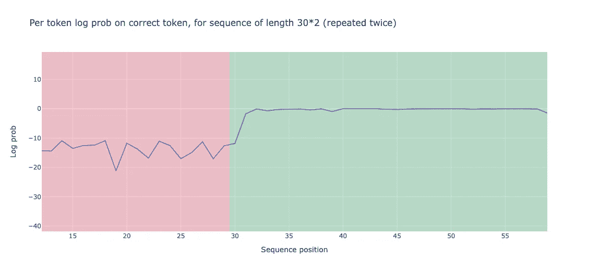
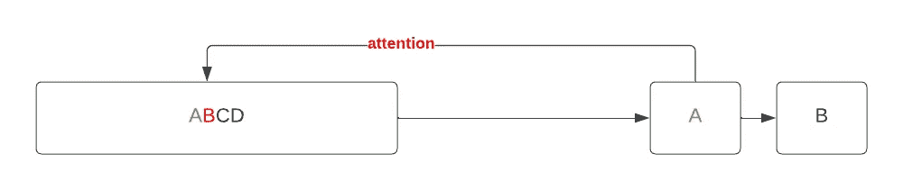
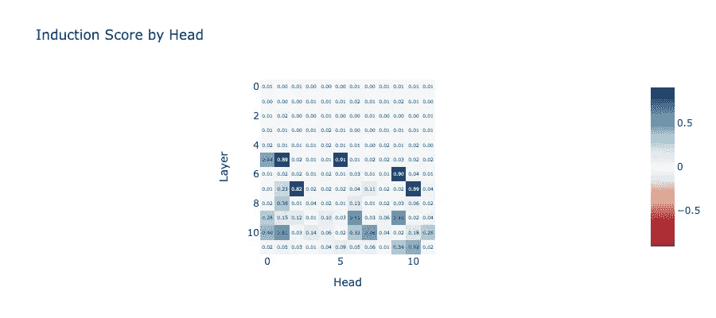
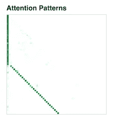
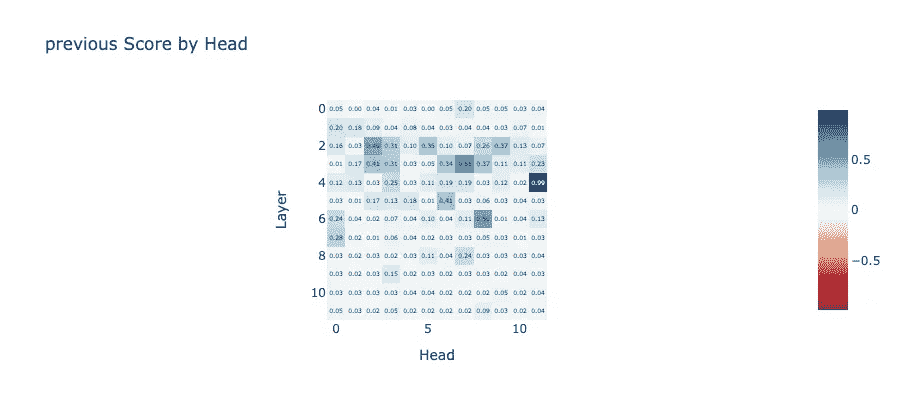
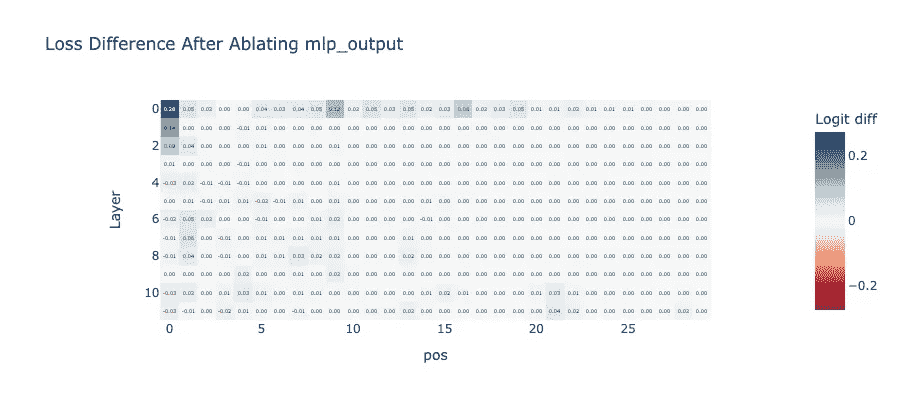

# 如何解释 GPT2-Small

> 原文：[`towardsdatascience.com/how-to-interpret-gpt2-small-76e0536a588a?source=collection_archive---------8-----------------------#2024-03-22`](https://towardsdatascience.com/how-to-interpret-gpt2-small-76e0536a588a?source=collection_archive---------8-----------------------#2024-03-22)

## 预测重复令牌的机制可解释性

[](https://medium.com/@vanillaxiangshuyang?source=post_page---byline--76e0536a588a--------------------------------)[](https://towardsdatascience.com/?source=post_page---byline--76e0536a588a--------------------------------) [Shuyang Xiang](https://medium.com/@vanillaxiangshuyang?source=post_page---byline--76e0536a588a--------------------------------)

·发表于[Towards Data Science](https://towardsdatascience.com/?source=post_page---byline--76e0536a588a--------------------------------) ·阅读时长 7 分钟·2024 年 3 月 22 日

--

大规模语言模型的发展，特别是 ChatGPT，令那些曾经试验过它的人，包括我自己，感到惊讶于它卓越的语言能力和执行各种任务的能力。然而，许多研究人员，包括我自己，虽然对它的能力感到惊叹，但也发现自己感到困惑。尽管我们了解模型的架构以及权重的具体数值，但我们仍然难以理解为何某一特定输入序列会导致特定的输出序列。

在这篇博客文章中，我将尝试通过机制可解释性来揭开 GPT2-small 的神秘面纱，研究一个简单的案例：重复令牌的预测。

# 机制可解释性

传统的数学工具在解释机器学习模型时，并不完全适用于语言模型。

以 SHAP 为例，它是一个有助于解释机器学习模型的工具。它擅长确定哪些特征显著影响了优质葡萄酒的预测。然而，重要的是要记住，语言模型是在令牌级别进行预测的，而 SHAP 值通常是在特征级别计算的，这使得它们可能不适用于令牌。

此外，语言模型（LLM）有大量的参数和输入，形成了一个高维空间。即便在低维空间中，计算 SHAP 值也非常昂贵，而在 LLM 的高维空间中，这一成本则更为庞大。

尽管容忍了高昂的计算成本，SHAP 提供的解释可能显得肤浅。例如，知道“potter”这个词由于之前提到“Harry”而最影响输出预测，但这并没有提供太多的洞见。这让我们无法确定模型的哪一部分或具体机制对这种预测负责。

机制可解释性提供了一种不同的方法。它不仅仅识别模型预测的重要特征或输入。相反，它揭示了模型的底层机制或推理过程，帮助我们理解模型是如何做出预测或决策的。

# GPT2-Small 对重复标记的预测

我们将使用 GPT2-small 进行一个简单的任务：预测一系列重复的标记。我们将使用的库是[TransformerLens](https://neelnanda-io.github.io/TransformerLens/index.html)，该库旨在提供 GPT-2 风格语言模型的[机制可解释性](https://distill.pub/2020/circuits/zoom-in/)。

```py
gpt2_small: HookedTransformer = HookedTransformer.from_pretrained("gpt2-small")
```

我们使用上面的代码加载 GPT2-Small 模型，并对由特定函数生成的序列进行标记预测。该序列包含两个相同的标记序列，后面跟着 bos_token。例如，当 seq_len 为 3 时，序列为“ABCDABCD” + bos_token。为清晰起见，我们将从序列开始到 seq_len 的部分称为前半部分，将剩余部分（不包括 bos_token）称为后半部分。

```py
def generate_repeated_tokens(
    model: HookedTransformer, seq_len: int, batch: int = 1
) -> Int[Tensor, "batch full_seq_len"]:
    '''
    Generates a sequence of repeated random tokens

    Outputs are:
        rep_tokens: [batch, 1+2*seq_len]
    '''
    bos_token = (t.ones(batch, 1) * model.tokenizer.bos_token_id).long()  # generate bos token for each batch

    rep_tokens_half = t.randint(0, model.cfg.d_vocab, (batch, seq_len), dtype=t.int64)
    rep_tokens = t.cat([bos_token,rep_tokens_half,rep_tokens_half], dim=-1).to(device)
    return rep_tokens
```

当我们允许模型在生成的标记上运行时，发现一个有趣的现象：模型在序列的后半部分表现明显优于前半部分。这是通过正确标记的对数概率来衡量的。具体来说，前半部分的性能为-13.898，而后半部分的性能为-0.644。



作者图片：正确标记的对数概率

我们还可以计算预测准确率，定义为正确预测的标记（与生成的标记相同的标记）与总标记数的比率。前半部分序列的准确率为 0.0，这不足为奇，因为我们使用的是没有实际意义的随机标记。与此同时，后半部分的准确率为 0.93，明显优于前半部分。

# 归纳电路

## 寻找归纳头

上述观察可能是由归纳电路的存在所解释的。归纳电路扫描序列中的当前标记的前序实例，识别出它之前跟随的标记，并预测相同的序列将会重复。例如，如果它遇到一个‘A’，它会扫描嵌入空间中与‘A’相似的前一个‘A’或标记，识别出随后的标记‘B’，然后预测‘A’之后的标记将是‘B’或与‘B’非常相似的标记。



作者图片：归纳电路

这个预测过程可以分为两个步骤：

1.  识别之前相同（或相似）的 token。序列后半部分的每个 token 应该“关注”前面 `seq_len` 位置的 token。例如，如果 `seq_len` 为 3，那么位置为 4 的 'A' 应该关注位置为 1 的 'A'。我们可以将执行此任务的注意力头称为“**引导头**”。

1.  识别下一个 token ‘B’。这是从前一个 token（例如，‘A’）复制信息到下一个 token（例如，‘B’）的过程。当 'A' 再次出现时，这些信息将用于“重现”‘B’。我们可以将执行此任务的注意力头称为“**前一个 token 头**”。

这两个头构成了一个完整的引导回路。请注意，有时“引导头”一词也用来描述整个“引导回路”。关于引导回路的更多介绍，我强烈推荐阅读这篇文章 [In-context learning and induction head](https://transformer-circuits.pub/2022/in-context-learning-and-induction-heads/index.html)，这是一篇杰作！

现在，让我们在 GPT2-small 中识别注意力头和前一个头。

以下代码用于查找引导头。首先，我们使用 30 个批次运行模型。然后，我们计算带有`seq_len`偏移量的注意力模式矩阵对角线的平均值。此方法使我们能够衡量当前 token 对 `seq_len` 之前出现的 token 的关注程度。

```py
def induction_score_hook(
    pattern: Float[Tensor, "batch head_index dest_pos source_pos"],
    hook: HookPoint,
):
    '''
    Calculates the induction score, and stores it in the [layer, head] position of the `induction_score_store` tensor.
    '''
    induction_stripe = pattern.diagonal(dim1=-2, dim2=-1, offset=1-seq_len) # src_pos, des_pos, one position right from seq_len
    induction_score = einops.reduce(induction_stripe, "batch head_index position -> head_index", "mean")
    induction_score_store[hook.layer(), :] = induction_score

seq_len = 50
batch = 30
rep_tokens_30 = generate_repeated_tokens(gpt2_small, seq_len, batch)
induction_score_store = t.zeros((gpt2_small.cfg.n_layers, gpt2_small.cfg.n_heads), device=gpt2_small.cfg.device)

    rep_tokens_30,
    return_type=None, 
        pattern_hook_names_filter,
        induction_score_hook
    )]
)
```

现在，让我们检查引导得分。我们会注意到一些头，如第 5 层第 5 头，具有高达 0.91 的引导得分。



作者提供的图片：引导头得分

我们还可以显示该头的注意力模式。你会注意到有一条清晰的对角线，直到 `seq_len` 的偏移量。



作者提供的图片：第 5 层，第 5 头的注意力模式

类似地，我们可以识别前一个 token 头。例如，第 4 层第 11 头展示了对前一个 token 的强烈模式。



作者提供的图片：前一个 token 头得分

## MLP 层如何归因？

让我们考虑这个问题：MLP 层有影响吗？我们知道 GPT2-Small 包含了注意力和 MLP 层。为了解决这个问题，我提出使用消融技术。

消融，顾名思义，是系统地去除模型中的某些组件，并观察性能变化的过程。

我们将用序列前半部分的输出替换序列后半部分的 MLP 层输出，并观察这如何影响最终的损失函数。我们将使用以下代码计算替换 MLP 层输出后的损失与原始后半序列损失之间的差异。

```py
def patch_residual_component(
    residual_component,
    hook,
    pos,
    cache,
):
    residual_component[0,pos, :] = cache[hook.name][pos-seq_len, :]
    return residual_component

ablation_scores = t.zeros((gpt2_small.cfg.n_layers, seq_len), device=gpt2_small.cfg.device)

gpt2_small.reset_hooks()
logits = gpt2_small(rep_tokens, return_type="logits")
loss_no_ablation = cross_entropy_loss(logits[:, seq_len: max_len],rep_tokens[:, seq_len: max_len])

for layer in tqdm(range(gpt2_small.cfg.n_layers)):
  for position in range(seq_len, max_len):
    hook_fn = functools.partial(patch_residual_component, pos=position, cache=rep_cache)
    ablated_logits = gpt2_small.run_with_hooks(rep_tokens, fwd_hooks=[
              (utils.get_act_name("mlp_out", layer), hook_fn)
    ])
    loss = cross_entropy_loss(ablated_logits[:, seq_len: max_len], rep_tokens[:, seq_len: max_len])
    ablation_scores[layer, position-seq_len] = loss - loss_no_ablation
```

我们得出了一个令人惊讶的结果：除了第一个标记外，消融实验并没有产生显著的 logit 差异。这表明，在重复标记的情况下，MLP 层可能没有显著的贡献。



作者提供的图片：消融前后 MLP 层的损失差异

# **一个归纳电路**

鉴于 MLP 层对最终预测没有显著贡献，我们可以手动构建一个归纳电路，使用第 5 层的头部 5 和第 4 层的头部 11。回想一下，这些是归纳头和前一个标记头。我们通过以下代码来实现：

```py
def K_comp_full_circuit(
    model: HookedTransformer,
    prev_token_layer_index: int,
    ind_layer_index: int,
    prev_token_head_index: int,
    ind_head_index: int
) -> FactoredMatrix:
    '''
    Returns a (vocab, vocab)-size FactoredMatrix,
    with the first dimension being the query side
    and the second dimension being the key side (going via the previous token head)

    '''
    W_E = gpt2_small.W_E
    W_Q = gpt2_small.W_Q[ind_layer_index, ind_head_index]
    W_K = model.W_K[ind_layer_index, ind_head_index]
    W_O = model.W_O[prev_token_layer_index, prev_token_head_index]
    W_V = model.W_V[prev_token_layer_index, prev_token_head_index]

    Q = W_E @ W_Q
    K = W_E @ W_V @ W_O @ W_K
    return FactoredMatrix(Q, K.T)
```

计算该电路的 top 1 准确率得到了 0.2283 的值。这对于一个仅由两个头部构建的电路来说相当不错！

有关详细的实现，请查看我的[*notebook*](https://colab.research.google.com/drive/1_Qx67oPB2ZNeKa1ANYhFa9tkKGSZhX6a#scrollTo=ss1yF3e8PNYD)。非常感谢 Neel Nanda，他开发了这个精彩的[TransformerLen](https://neelnanda-io.github.io/TransformerLens/index.html)，这是一个用于大语言模型机制可解释性的伟大工具！
