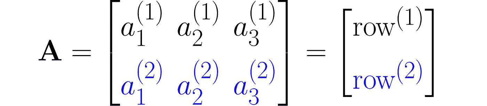
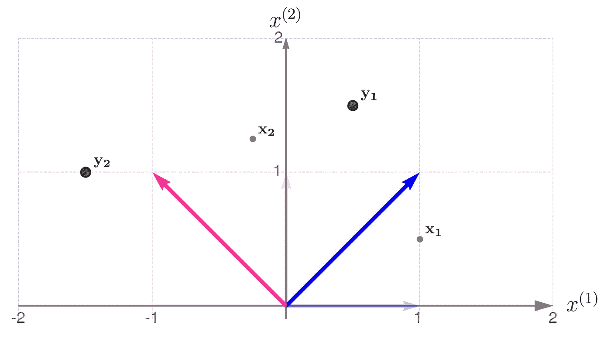
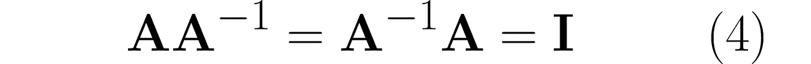
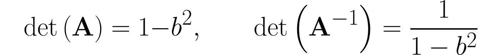

# 如何解释矩阵表达式 — 变换

> 原文：[`towardsdatascience.com/how-to-interpret-matrix-expressions-transformations-a5e6871cd224?source=collection_archive---------2-----------------------#2024-12-04`](https://towardsdatascience.com/how-to-interpret-matrix-expressions-transformations-a5e6871cd224?source=collection_archive---------2-----------------------#2024-12-04)

## 数据科学家的矩阵代数

[](https://medium.com/@jaroslaw.drapala?source=post_page---byline--a5e6871cd224--------------------------------)[](https://towardsdatascience.com/?source=post_page---byline--a5e6871cd224--------------------------------) [Jaroslaw Drapala](https://medium.com/@jaroslaw.drapala?source=post_page---byline--a5e6871cd224--------------------------------)

·发表于[Towards Data Science](https://towardsdatascience.com/?source=post_page---byline--a5e6871cd224--------------------------------) ·阅读时间：23 分钟·2024 年 12 月 4 日

--


图片由[Ben Allan](https://unsplash.com/@ballonandon?utm_source=medium&utm_medium=referral)提供，来源于[Unsplash](https://unsplash.com/?utm_source=medium&utm_medium=referral)

本文开启了一个系列，专为那些觉得矩阵代数让人感到压倒性的人准备。我的目标是将*你害怕的东西*转变为*你着迷的东西*。如果你想**理解机器学习的概念和方法**，你会发现这篇文章特别有帮助。

## **目录：**

1.  介绍

1.  前提条件

1.  矩阵-向量乘法

1.  转置

1.  变换的组合

1.  逆变换

1.  不可逆变换

1.  行列式

1.  非方阵

1.  逆矩阵和转置：相似性与差异

1.  向量平移

1.  结语

# 1\. 介绍

你可能已经注意到，虽然很容易找到解释矩阵计算算法的材料，但要找到教授**如何解释复杂矩阵表达式**的资料却更加困难。我通过我的系列文章来填补这个空白，专注于**数据科学家最常用的矩阵代数部分**。

我们将更多地关注具体的例子，而不是一般的公式。我宁愿牺牲一般性，以确保清晰性和可读性。我将经常启发你的想象力和直觉，希望我的材料能激发你探索这些主题的更正式资源。对于精确的定义和一般公式，我建议你查阅一些优秀的教科书：经典的线性代数书籍¹和专注于机器学习的另一部著作²。

本部分将教授你

> 将矩阵视为对数据应用的变换的表示。

那么让我们开始吧——让我引领你进入矩阵的世界。

# 2\. 前提条件

我猜你可以处理接下来的表达式。

这是使用行向量和列向量表示的**点积**：


**矩阵**是一个按行和列排列符号的矩形数组。以下是一个具有两行三列的矩阵示例：


你可以将其视为**一系列列**


或者**一系列行**一个接一个地堆叠在一起：



如你所见，我使用了上标表示行，使用下标表示列。在机器学习中，明确区分观察值（表示为向量）和特征（按行排列）是非常重要的。

表示该矩阵的其他有趣方式包括**A***₂*ₓ*₃*和**A**[*aᵢ*⁽*ʲ* ⁾]。

**矩阵**A 和**B**的乘积结果是第三个矩阵**C** = **AB**，包含每一行的**A**与每一列的**B**的标量积，按照相应的顺序排列。以下是一个例子，表示**C***₂*ₓ*₂*= **A***₂*ₓ*₃***B***₃*ₓ*₂*。


其中 c*ᵢ*⁽*ʲ* ⁾ 是矩阵**B**的第*i*列与矩阵**A**的第*j*行的标量积：


请注意，这一定义的矩阵乘法要求*左矩阵*的行数与*右矩阵*的列数相匹配。换句话说，**矩阵的内维度必须匹配**。

确保你能够手动进行任意项的矩阵乘法。你可以使用以下代码来检查结果或练习矩阵乘法。

```py
import numpy as np

# Matrices to be multiplied
A = [
    [ 1, 0, 2],
    [-2, 1, 1]
]

B = [
    [ 0, 3],
    [-3, 1],
    [-2, 2]
]

# Convert to numpy array
A = np.array(A)
B = np.array(B)

# Multiply A by B (if possible)
try:
    C = A @ B
    print(f'A B = \n{C}\n')
except:
    print("""ValueError:
The number of rows in matrix A does not match 
the number of columns in matrix B
""")

#  and in the reverse order, B by A (if possible)
try:
    D = B @ A
    print(f'B A =\n{D}')
except:
    print("""ValueError:
The number of rows in matrix B does not match 
the number of columns in matrix A
""")
```

```py
A B = 
[[-4  7]
 [-5 -3]]

B A =
[[-6  3  3]
 [-5  1 -5]
 [-6  2 -2]]
```

# 3\. 矩阵-向量乘法

在本节中，我将解释矩阵乘法对向量的影响。向量**x**与矩阵**A**相乘，产生一个新的向量**y**：


这是数据科学中常见的操作，因为它可以实现**数据的线性变换**。使用矩阵来表示线性变换非常有优势，正如你将在以下示例中看到的那样。

在下方，你可以看到你的网格空间和标准基向量：蓝色代表*x*⁽¹⁾方向，品红色代表*x*⁽²⁾方向。


网格空间中的标准基

一个好的起点是使用将二维向量**x**映射到二维向量**y**的变换，且它们处在同一个网格空间中。

> 描述期望的变换其实是一个简单的技巧。你只需要说明基向量在变换后的坐标是如何变化的，并使用这些新坐标作为矩阵**A**的列。

作为示例，考虑一个线性变换，它产生如下所示的效果。标准基向量绘制得较淡，而变换后的向量则显示得更清晰。


由矩阵**A**变换的标准基底

通过比较变换前后基向量，你可以观察到该变换涉及关于原点的逆时针 45 度旋转，并伴随着向量的伸长。

这个效果可以通过矩阵**A**实现，其构成如下：


矩阵的第一列包含变换后的第一个基向量的坐标，第二列包含第二个基向量的坐标。

方程(1)然后变为如下形式


让我们取两个示例点**x**₁和**x**₂：


并将它们变换为向量**y**₁​和**y**₂：


我建议你先手工计算这些内容，然后再使用像这样的程序：

```py
import numpy as np

# Transformation matrix
A = np.array([
    [1, -1],
    [1,  1]
])

# Points (vectors) to be transformed using matrix A
points = [
    np.array([1, 1/2]),
    np.array([-1/4, 5/4])
]

# Print out the transformed points (vectors)
for i, x in enumerate(points):
    y = A @ x
    print(f'y_{i} = {y}')
```

```py
y_0 = [0.5 1.5]
y_1 = [-1.5  1\. ]
```

下图显示了结果。



由矩阵**A**变换的点

**x**点为灰色且较小，而它们变换后的对应点**y**具有黑色边缘且较大。如果你更愿意将这些点看作箭头的尖端，下面是相应的插图：


由矩阵**A**变换的向量

现在你可以更清楚地看到，点已经围绕原点旋转并略微推远了。

我们来研究另一个矩阵：


并查看变换如何作用


影响网格线上的点：


由矩阵**B**变换的网格线

将结果与使用**B**/2 得到的结果进行比较，后者对应于将矩阵**B**的所有元素除以 2：


由矩阵**B**/2 变换的网格线

一般来说，线性变换：

+   确保直线保持直线，

+   保持平行线平行，

+   按均匀因子缩放它们之间的距离。

为了简洁起见，本文中我将使用“*变换* ***A***”这一表述，而不是完整的“*由矩阵* ***A*** *表示的变换*”。

让我们回到矩阵


并将变换应用于一些示例点。


变换**B**对各种输入向量的作用

注意以下几点：

+   点**x**₁​已被逆时针旋转，并且靠近原点。

+   点**x**₂​，另一方面，已经顺时针旋转并且被推离了原点，

+   点**x**₃​只是被缩小了，意味着它在保持方向不变的情况下移动得更靠近原点，

+   点**x**₄经历了类似的变换，但被缩放了。

该变换在*x*⁽¹⁾方向上进行了压缩，而在*x*⁽²⁾方向上进行了拉伸。你可以把网格线想象成像手风琴一样变化。

像**x**₃和**x**₄所表示的方向在机器学习中扮演着重要角色，但那是另一个话题。

目前，我们可以称它们为***特征方向***，因为沿这些方向的向量可能只会被变换缩放，而不会被旋转。除了旋转之外，每个变换都有一组特征方向。

# 4\. 转置

记住，变换矩阵是通过将变换后的基向量按列堆叠而构建的。也许你想看看如果我们**交换行和列**（即转置）之后会发生什么。

例如，我们考虑矩阵


其中**A**ᵀ表示转置矩阵。

从几何角度来看，*第一个*新基向量的坐标来自于*所有*旧基向量的第一个坐标，第二个新基向量的坐标来自于第二个坐标，依此类推。

在 NumPy 中，这就是这么简单：

```py
import numpy as np

A = np.array([
    [1, -1],
    [1 , 1]
    ])

print(f'A transposed:\n{A.T}')
```

```py
A transposed:
[[ 1  1]
 [-1  1]]
```

我现在必须让你失望，因为我无法用几句话表达变换**A**和**A**ᵀ之间的关系。

但让我向你展示一个原始变换和转置变换都共享的特性，这将在稍后派上用场。

这是由矩阵**A**表示的变换的几何解释。灰色阴影区域被称为**平行四边形**。


由矩阵**A**变换的基向量所生成的平行四边形

将其与应用矩阵**A**ᵀ得到的变换进行比较：


由矩阵**A**ᵀ变换的基向量所生成的平行四边形

现在，让我们考虑另一个变换，它对单位向量应用完全不同的缩放：


与矩阵**B**相关的平行四边形现在变得窄了许多：


由矩阵**B**变换的基向量所生成的平行四边形

但结果证明它与矩阵**B**ᵀ的大小是一样的：


由矩阵**B**ᵀ变换的基向量所生成的平行四边形

让我这样说吧：你有一组数字需要分配给向量的各个分量。如果你给某个分量分配一个较大的数字，那么你就需要给其他分量分配较小的数字。换句话说，构成平行四边形的向量的总长度保持不变。我知道这个推理有点模糊，如果你想要更严谨的证明，可以查阅参考文献部分的相关文献。

这里是这一部分的关键：可以通过计算矩阵的**行列式**来找到平行四边形的面积。更重要的是，*矩阵的行列式与其转置的行列式是相同的*。


更多关于行列式的内容将在接下来的部分中介绍。

# 5\. 变换的组合

你可以应用一系列变换——例如，首先对向量**x**应用**A**，然后将结果传递给**B**。这可以通过先将向量**x**与矩阵**A**相乘，然后将结果与矩阵**B**相乘来完成：


你可以将矩阵**B**和**A**相乘，以获得矩阵**C**供进一步使用：


这是矩阵**C**所表示的变换效果：


由复合矩阵**BA**描述的变换

你可以按相反的顺序进行变换：首先应用**B**，然后应用**A**：


让**D**表示按此顺序执行的乘法序列：


这就是它如何影响网格线的：


由复合矩阵**AB**描述的变换

所以，你可以亲自看到**矩阵乘法的顺序很重要**。

**复合变换的转置**有一个很酷的性质。来看一下当我们将**A**乘以**B**时会发生什么：


然后转置结果，这意味着我们将应用（**AB**)ᵀ：


你可以很容易地将这个观察结果扩展为以下规则：


在结束这一部分之前，我们考虑逆问题：仅给定**C** = **AB**，是否可以恢复矩阵**A**和**B**？

这是**矩阵分解**，正如你所预料的，它没有唯一的解。矩阵分解是一种强大的技术，可以提供对变换的深入理解，因为变换可以表示为多个更简单、基本变换的组合。但这是另一个话题，我们稍后再谈。

# 6\. 逆变换

你可以很容易地构造一个表示**不做任何变换**的矩阵，它不会改变标准基向量：


它通常被称为**单位矩阵**。

取矩阵**A**并考虑一个能够逆转其效果的变换。表示该变换的矩阵是**A**⁻¹。具体来说，当在**A**之后或之前应用时，它会得到单位矩阵**I**：



有很多资源解释如何手动计算逆矩阵。我推荐学习[高斯-约旦法](https://www.mathsisfun.com/algebra/matrix-inverse-row-operations-gauss-jordan.html)，因为它涉及对增广矩阵进行简单的行操作。在每一步中，你可以交换两行、重新缩放任意一行，或者将其余行的加权和加到选定的行上。

以以下矩阵为手动计算的例子：


你应该得到逆矩阵：


手动验证方程(4)是否成立。你也可以在 NumPy 中进行验证。

```py
import numpy as np

A = np.array([
    [1, -1],
    [1 , 1]
    ])

print(f'Inverse of A:\n{np.linalg.inv(A)}')
```

```py
Inverse of A:
[[ 0.5  0.5]
 [-0.5  0.5]]
```

看一下下面的插图，了解这两种变换的区别。


变换**A**


变换**A**⁻¹

乍一看，很难看出一个变换是否能逆转另一个变换的效果。

然而，在这些图表中，你可能会注意到一个迷人且深远的**变换与其逆变换之间的联系**。

仔细看看第一个插图，它展示了变换**A**对基向量的作用。原始单位向量以半透明的方式呈现，而由矩阵**A**乘法得到的变换后向量则清晰、实心地描绘出来。现在，想象这些新画出的向量是你用来描述空间的基向量，你从它们的视角来看待原始空间。那么，原始的基向量会显得更小，第二，它们将朝东偏移。这正是第二个插图所展示的，说明了变换**A**⁻¹的效果。

这是我在下一篇文章中将讨论的一个主题预告，内容是*使用矩阵表示数据的不同视角*。

这一切听起来很棒，但有个问题：**有些变换是无法逆转的**。

# 7\. 不可逆的变换

下一次实验的主力将是对角线上全是 1，反对角线上全是*b*的矩阵：


其中，*b*是区间(0, 1)中的一个分数。根据定义，这个矩阵是对称的，因为它恰好与其自身的转置相同：**A**=**A**ᵀ，但我只是顺便提一下，这在这里并不特别相关。

使用高斯-约旦法逆转这个矩阵，你将得到以下结果：


你可以在网上轻松找到计算 2x2 矩阵行列式的规则，它会给出



这不是巧合。一般来说，成立的是


请注意，当 *b* = 0 时，两个矩阵是相同的。这并不令人惊讶，因为 **A** 退化为单位矩阵 **I**。

当 *b* = 1 时，事情变得棘手，因为 det(**A**) = 0，det(**A**⁻¹) 变为无穷大。因此，**A**⁻¹ 对于一个完全由 1 组成的矩阵 **A** 是不存在的。在代数课程中，老师通常会警告你零行列式的问题。然而，当我们考虑矩阵的来源时，很明显，行列式为无穷大的情况也可能发生，从而导致 *致命错误*。无论如何，

> 行列式为零意味着该变换是不可逆的。

现在，为不同的 *b* 值进行实验的条件已经具备。我们刚刚看到，在极限处计算会失败，现在我们将通过可视化方式，仔细观察当我们接近这些极限时会发生什么。

我们从 *b* = ½ 开始，最终接近 1。

步骤 1)


变换 **A**


变换 **A**⁻¹

步骤 2)


变换 **A**


变换 **A**⁻¹

回想一下，**表示变换的矩阵的行列式对应于由变换后的基向量形成的平行四边形的面积**。

这与插图一致：变换 **A** 的平行四边形面积越小，变换 **A**⁻¹ 的面积就越大。接下来是：变换 **A** 的基向量越窄，其逆变换的基向量就越宽。还要注意，我不得不扩展坐标轴的范围，因为变换 **A** 的基向量变得更长。

顺便说一下，请注意

> 变换 **A** 和 **A**⁻¹ 具有相同的特征方向。

步骤 3) *快完成了……*


变换 **A**


变换 **A**⁻¹

网格线被压得非常紧，几乎重叠，这最终发生在 *b* 达到 1 时。基向量被拉伸得太长，以至于超出了坐标轴的限制。当 *b* 恰好等于 1 时，两个基向量会重合在同一条线上。

看过前面的插图后，你现在可以猜测应用一个不可逆变换到向量上会有什么效果。先花点时间思考一下，然后可以尝试运行一个计算实验，或者查看我下面提供的结果。

.

.

.

这样考虑一下。

当基向量不平行时，意味着它们形成的角度不是 0 度或 180 度，你可以用它们来表示整个平面上的任何点（数学家称这些向量***张成***平面）。否则，整个平面就无法再被张成，只有沿着基向量所覆盖的直线上的点可以被表示。

.

.

.

这就是当你将不可逆变换应用于随机选定的点时的效果：


一个不可逆矩阵**A**会降低数据的维度。

应用不可逆变换的一个后果是，二维空间会塌缩成一个一维子空间。变换后，不再可能唯一恢复点的原始坐标。

看一下矩阵**A**的条目。当*b* = 1 时，两列（或行）是相同的，这意味着变换矩阵实际上表现得像一个 1×2 矩阵，将二维向量映射到一个标量。

你可以轻松验证，如果一行是另一行的倍数，问题将是相同的。这可以进一步推广到任何维度的矩阵：如果任意一行可以表示为其他行的加权和（*线性组合*），则意味着一个维度塌缩。原因是这样的向量位于其他向量张成的空间内，因此不能提供超出已经能表示的点的能力。你可以将这个向量视为***冗余的***。

从第四部分的转置部分可以推断出，**如果有冗余的行，那么必定有相等数量的冗余列**。

# 8\. 行列式

你现在可能会问是否有一种非几何的方式来验证矩阵的列或行是否冗余。

回想一下第四部分中的平行四边形和被称为行列式的标量。我提到过

> 矩阵的行列式表示在变换下，单位平行四边形的面积如何变化。

行列式的精确定义有点棘手，但正如你已经看到的，它的图形解释应该不会引起任何问题。

我将展示由矩阵表示的两种变换的行为：


det(**A**) = 2


det(**B**) = -3/4

行列式的大小表示变换总体上如何拉伸（若大于 1）或缩小（若小于 1）空间。虽然变换可能在一个方向上拉伸，在另一个方向上压缩，但总体效果由行列式的值决定。

此外，负的行列式表示一个反射；注意，矩阵**B**会反转基向量的顺序。

一个面积为零的平行四边形对应一个压缩了一个维度的变换，这意味着**行列式可以用来检测矩阵基向量中的冗余**。

由于行列式衡量的是在变换下平行四边形的面积，我们可以将其应用于一系列的变换。如果 det(**A**)和 det(**B**)分别表示变换**A**和**B**的单位面积的缩放因子，那么在依次应用这两个变换后，单位面积的缩放因子，即**AB**，等于 det(**AB**)。由于这两个变换独立且顺序执行，总效果由 det(**AB**) = det(**A**) det(**B**)给出。将矩阵**A**⁻¹代入矩阵**B**并注意到 det(**I**) = 1，得到了上一节引入的方程（5）。

下面是如何使用 NumPy 计算行列式的方法：

```py
import numpy as np

A = np.array([
    [-1/2, 1/4],
    [2, 1/2]
    ])

print(f'det(A) = {np.linalg.det(A)}')
```

```py
det(A) = -0.75
```

# 9\. 非方阵

到目前为止，我们专注于方阵，并且你已经培养了对它们所代表变换的几何直觉。现在是时候将这些技能扩展到**具有任意行列数的矩阵**了。

## 宽矩阵

这是一个**宽矩阵**的例子，它的列数多于行数：


从方程（1）**y** = **Ax**的角度来看，它将三维向量**x**映射到二维向量**y**。

在这种情况下，一列总是可以表示为另一列的倍数，或者是其他列的加权和。例如，这里第三列等于第一列的 3/4 倍加上第二列的 5/4 倍。

一旦向量**x**被转换为**y**，就无法从**y**中重建原始的**x**。我们说这种变换**降低了输入数据的维度**。这类变换在机器学习中非常重要。

有时，一个宽矩阵会伪装成一个方阵，但你可以通过检查其行列式是否为零来揭示它。我们以前遇到过这种情况，记得吗？

我们可以使用矩阵**A**来创建两个不同的方阵。试着自己推导出以下结果：


以及行列式（我推荐使用简化公式来处理[2×2](https://brilliant.org/wiki/expansion-of-determinants/)和[3×3](https://en.wikipedia.org/wiki/Rule_of_Sarrus)矩阵）：


矩阵**A**ᵀ**A**由矩阵**A**中所有可能列对的点积组成，其中一些列对显然是冗余的，从而将这种冗余转移到**A**ᵀ**A**。

另一方面，矩阵**AA**ᵀ只包含矩阵**A**行的点积，这些行的数量少于列的数量。因此，构成矩阵**AA**ᵀ的向量很可能（虽然不能完全保证）是线性独立的，这意味着一个向量不能表示为另一个向量的倍数或其他向量的加权和。

如果你坚持从之前计算得到的**y** = **Ax**中确定**x**会发生什么？你可以将方程两边左乘**A**⁻¹，得到方程**A**⁻¹**y** = **A**⁻¹**Ax**，并且因为**A**⁻¹**A = I**，得到**x** = **A**⁻¹**y**。但这一切从一开始就会失败，因为矩阵**A**⁻¹是非方阵，肯定是不可逆的（至少在之前所介绍的意义上）。

然而，你可以扩展原始方程**y** = **Ax**，以包含一个在需要的地方使用的方阵。你只需要在方程两边左乘矩阵**A**ᵀ，从而得到**A**ᵀ**y** = **A**ᵀ**Ax**。右边现在是一个方阵**A**ᵀ**A**。不幸的是，我们已经看到它的行列式为零，因此看起来我们再次无法从**y**中重建**x**。

## 高矩阵

这是一个**高矩阵**的例子


它将二维向量**x**映射到三维向量**y**。我通过简单地将第一行的条目平方来创建了第三行。虽然这种扩展并没有给数据添加任何新的信息，但它却能出奇地改善某些机器学习模型的性能。

你可能会认为，与宽矩阵不同，高矩阵允许从**y**中重建原始的**x**，其中**y** = **Bx**，因为没有信息被丢弃——只是添加了信息。

你说得对！看看当我们像之前尝试过的那样左乘矩阵**B**ᵀ时会发生什么，但这次成功了：**B**ᵀ**y** = **B**ᵀ**Bx**。这次，矩阵**B**ᵀ**B**是可逆的，所以我们可以左乘它的逆矩阵：

**(B**ᵀ**B)**⁻¹**B**ᵀ**y** = **(B**ᵀ**B)**⁻¹**(B**ᵀ**B)x**

最终得到：


这就是它在 Python 中的实现方式：

```py
import numpy as np

# Tall matrix
B = [
    [2, -3],
    [1 , 0],
    [3, -3]
]

# Convert to numpy array
B = np.array(B)

# A column vector from a lower-dimensional space
x = np.array([-3,1]).reshape(2,-1)

# Calculate its corresponding vector in a higher-dimensional space
y = B @ x

reconstructed_x = np.linalg.inv(B.T @ B) @ B.T @ y

print(reconstructed_x)
```

```py
[[-3.]
 [ 1.]]
```

总结一下：行列式衡量矩阵列和行的冗余性（或线性独立性）。然而，只有在应用于方阵时，它才有意义。非方阵表示不同维度空间之间的变换，并且必然具有线性相关的列或行。如果目标维度高于输入维度，便有可能从高维向量中重建低维向量。

# 10\. 逆矩阵与转置矩阵：相似性与差异

你肯定已经注意到，逆运算和转置运算在矩阵代数中发挥了关键作用。在本节中，我们将汇总与这些运算相关的最有用的恒等式。

每当我应用逆运算符时，我假设被操作的矩阵是方阵。

我们将从尚未出现的显而易见的那个开始。


这里是先前给出的恒等式（2）和（5），并排放置：


让我们通过以下推理，首先从方程（4）中的恒等式开始，其中**A**被复合矩阵**AB**替代：


右边的括号是多余的。去掉它们后，我将矩阵**B**⁻¹右乘到等式两边，然后是**A**⁻¹。


因此，我们观察到反演和转置之间的下一个相似性（参见方程（3））：


你现在可能会失望，因为接下来的内容只适用于转置。


但是假设**A**和**B**是标量。对于逆操作来说，这将是一个数学丑闻！

为了变化，方程（4）中的恒等式仅适用于逆操作：


我将通过讨论反演和转置之间的相互作用来结束这一部分。

从最后一个方程和方程（3）结合，我们得到以下结果：


请记住，**I**ᵀ = **I**。右乘**A**ᵀ的逆矩阵将得到以下恒等式：


# 11\. 通过一个向量平移

你可能会想，为什么我只关注将向量与矩阵相乘的运算，而忽略了通过加上另一个向量来平移向量的操作。

其中一个原因纯粹是数学上的。线性运算提供了显著的优势，比如变换的便利性、表达式的简洁性和算法的高效性。

线性运算的一个关键特性是，输入的线性组合会导致输出的线性组合：


其中*α*，*β*是实数标量，*Lin*表示一个线性操作。

让我们首先检查方程（1）中的矩阵-向量乘法算子*Lin*[**x**] = **Ax**：


这证实了矩阵与向量相乘是一个线性操作。

现在，让我们考虑一个更一般的变换，它涉及通过向量**b**的平移：


代入一个加权和，看看会得到什么结果。


你可以看到，添加**b**会破坏线性。像这样的操作被称为**仿射**，以区别于线性操作。

不过不用担心——有一种简单的方法可以消除翻译的需要。只需事先对数据进行平移处理，例如通过居中，使得向量**b**变为零。这是数据科学中常用的方法。

因此，数据科学家只需要关注矩阵-向量乘法。

# 12. 结语

我希望现在线性代数看起来更容易理解了，也希望你已经感受到它有多么有趣。

如果我激发了你进一步学习的兴趣，那太好了！但即便只是让你对课程内容更有信心，那也是一种收获。

请记住，这更像是对该主题的半正式介绍。要了解更严谨的定义和证明，您可能需要查阅专门的文献。

*除非另有注明，所有图片均由作者提供*

# 参考文献

[1] Gilbert Strang. *线性代数导论*. 威尔斯利-剑桥出版社, 2022 年。

[2] Marc Peter Deisenroth, A. Aldo Faisal, Cheng Soon Ong. *机器学习中的数学*. 剑桥大学出版社, 2020 年。
