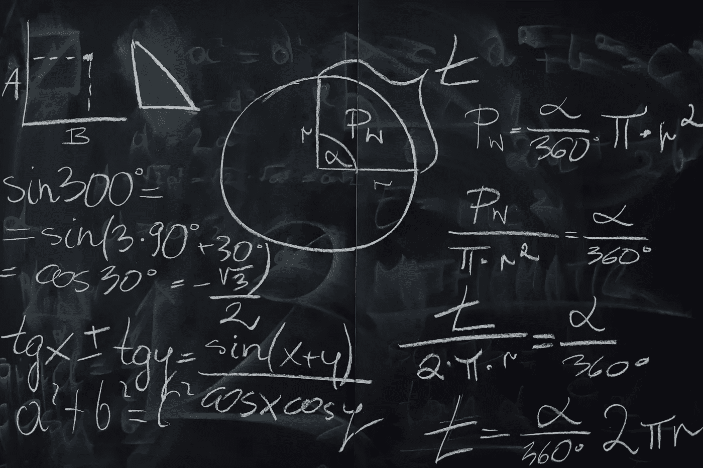

# 如何学习数据科学所需的数学

> 原文：[`towardsdatascience.com/how-to-learn-the-math-needed-for-data-science-86c6643b0c59?source=collection_archive---------0-----------------------#2024-03-04`](https://towardsdatascience.com/how-to-learn-the-math-needed-for-data-science-86c6643b0c59?source=collection_archive---------0-----------------------#2024-03-04)

## 数据科学所需的三大基础数学领域的解析：统计学、线性代数和微积分。

 [Egor Howell](https://medium.com/@egorhowell?source=post_page---byline--86c6643b0c59--------------------------------)

·发表于 [Towards Data Science](https://towardsdatascience.com/?source=post_page---byline--86c6643b0c59--------------------------------) ·阅读时间：8 分钟·2024 年 3 月 4 日

--

图片来源：Karolina Grabowska：[`www.pexels.com/photo/blackboard-with-handwritten-calculations-6256066/`](https://www.pexels.com/photo/blackboard-with-handwritten-calculations-6256066/)

成为数据科学家不仅仅是使用即插即用的机器学习工具包。你首先必须理解算法到底在做什么，并知道何时以及为何使用它。学习算法背后原理的过程就是通过研究其基础数学。

要成为一名高水平的数据科学家，你必须掌握扎实的基础数学。这就是残酷的事实。然而，所需的数学知识并不需要达到博士或甚至硕士学位的水平。大部分内容都在高中后期以及许多本科课程的前几年中涉及。

因此，在本文中，我将详细介绍数据科学所**实际**需要的数学知识，以及你应该学习的内容，并提供有用的资源。

# 你**实际**需要的东西
