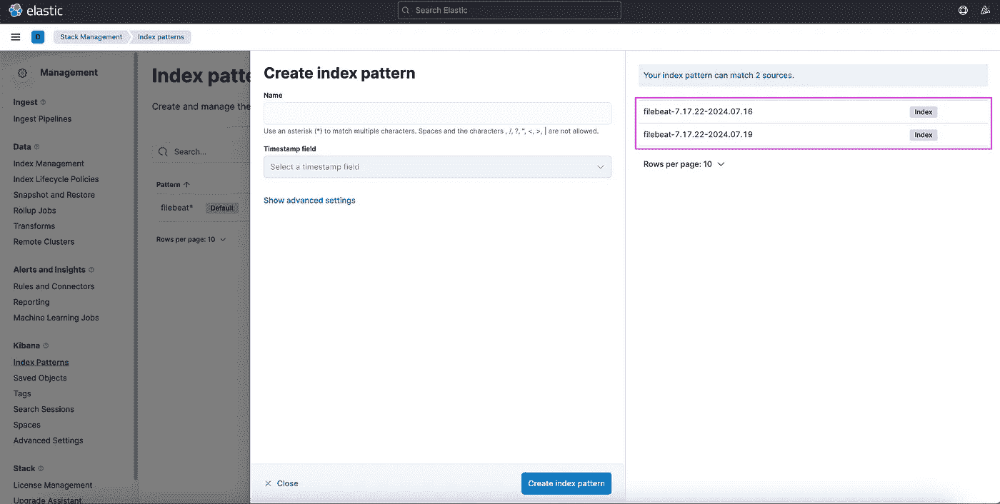
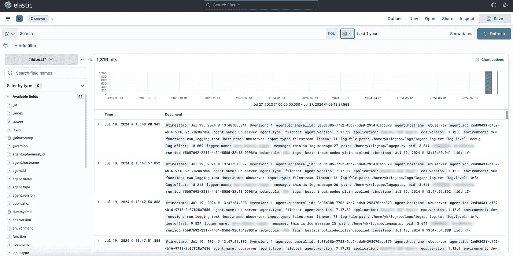

# 如何使用 Elastic (ELK) Stack 记录 Databricks 工作流

> 原文：[`towardsdatascience.com/how-to-log-databricks-workflows-with-the-elastic-elk-stack-a03f940cbc88?source=collection_archive---------7-----------------------#2024-07-30`](https://towardsdatascience.com/how-to-log-databricks-workflows-with-the-elastic-elk-stack-a03f940cbc88?source=collection_archive---------7-----------------------#2024-07-30)

## 一个使用软件工程世界最佳实践来设置数据管道可观察性的实际示例

[](https://medium.com/@yury-kalbaska?source=post_page---byline--a03f940cbc88--------------------------------)[](https://towardsdatascience.com/?source=post_page---byline--a03f940cbc88--------------------------------) [Yury Kalbaska](https://medium.com/@yury-kalbaska?source=post_page---byline--a03f940cbc88--------------------------------)

·发布于 [Towards Data Science](https://towardsdatascience.com/?source=post_page---byline--a03f940cbc88--------------------------------) ·阅读时间：8 分钟 ·2024 年 7 月 30 日

--


图片由 [ThisisEngineering](https://unsplash.com/@thisisengineering?utm_source=medium&utm_medium=referral) 提供，来源于 [Unsplash](https://unsplash.com/?utm_source=medium&utm_medium=referral)

# 介绍

在本文撰写时（2024 年 7 月），Databricks 已成为云端数据工程的标准平台，这一崛起突显了支持强大数据操作（DataOps）功能的重要性。在这些功能中，可观察性能力——日志记录、监控和警报——对一个成熟且适用于生产环境的数据工程工具至关重要。

有许多工具可以记录、监控和警报 Databricks 工作流，包括内建的原生 Databricks 仪表板、Azure Monitor、DataDog 等。

然而，上述内容没有明显涵盖的一个常见场景是需要与现有的企业监控和警报系统进行集成，而不是使用上述提到的专用工具。通常，这将是 Elastic Stack（也称为 ELK）——在软件开发世界中，作为日志记录和监控的事实标准。

## ELK Stack 的组成部分是什么？

ELK 代表 Elasticsearch、Logstash 和 Kibana —— 这是 Elastic 提供的三种产品，提供端到端的可观察性解决方案：

1.  Elasticsearch — 用于日志存储和检索

1.  Logstash — 用于日志摄取

1.  Kibana — 用于可视化和警报

以下部分将展示如何将 ELK Stack 与 Databricks 集成，以实现强大的端到端可观察性解决方案的实际示例。

# 一个实际示例

## 前提条件

在继续实施之前，请确保以下内容已准备好：

1.  **弹性集群** — 需要一个运行中的弹性集群。对于简单的使用场景，这可以是一个单节点的设置。然而，ELK 的一个关键优势是它是完全分布式的，因此在大型组织中，你可能会处理一个在 Kubernetes 中运行的集群。或者，可以使用 Elastic Cloud 的实例，这对于本例来说是等效的。

    如果你正在进行实验，参考 [DigitalOcean 的优秀指南](https://www.digitalocean.com/community/tutorials/how-to-install-elasticsearch-logstash-and-kibana-elastic-stack-on-ubuntu-22-04)，了解如何将 Elastic 集群部署到本地（或云）虚拟机。

1.  **Databricks 工作区** — 确保你有权限配置集群范围的初始化脚本。如果你打算设置全局初始化脚本，则需要管理员权限。

## 存储

对于日志存储，我们将使用 Elasticsearch 自己的存储能力。我们首先进行设置。在 Elasticsearch 中，数据是按索引组织的。每个索引包含多个文档，这些文档是 JSON 格式的数据结构。在存储日志之前，必须创建一个索引。这个任务有时由组织的基础设施或运维团队来处理，但如果没有，也可以通过以下命令来完成：

```py
curl -X PUT "http://localhost:9200/logs_index?pretty"
```

可以根据需要进一步自定义索引。有关详细的配置选项，请参考 REST API 参考文档：[`www.elastic.co/guide/en/elasticsearch/reference/current/indices-create-index.html`](https://www.elastic.co/guide/en/elasticsearch/reference/current/indices-create-index.html)

一旦索引设置完毕，可以通过以下命令添加文档：

```py
curl -X POST "http://localhost:9200/logs_index/_doc?pretty"\
     -H 'Content-Type: application/json'\
     -d'
{
  "timestamp": "2024-07-21T12:00:00",
  "log_level": "INFO",
  "message": "This is a log message."
}'
```

要检索文档，请使用：

```py
curl -X GET "http://localhost:9200/logs_index/_search?pretty"\
     -H 'Content-Type: application/json'\
     -d'
{
  "query": {
    "match": {
      "message": "This is a log message."
    }
  }
}'
```

这涵盖了 Elasticsearch 在我们场景中的基本功能。接下来，我们将设置日志摄取过程。

## 传输 / 摄取

在 ELK 堆栈中，Logstash 是负责将日志摄取到 Elasticsearch 的组件。

Logstash 的功能被组织为 *管道*，这些管道管理从数据摄取到输出的整个流程。

每个管道可以由三个主要阶段组成：

1.  **输入**：Logstash 可以从多个来源摄取数据。在本例中，我们将使用 Filebeat，这是一种轻量级的数据传输工具，作为我们的输入源来收集并转发日志数据——稍后会详细介绍。

1.  **过滤器**：这一阶段处理传入的数据。虽然 Logstash 支持多种过滤器用于解析和转换日志，但在这个场景中我们不会实现任何过滤器。

1.  **输出**：最后阶段将处理过的数据发送到一个或多个目标。在这里，输出目标将是 Elasticsearch 集群。

管道配置在 YAML 文件中定义，并存储在 `/etc/logstash/conf.d/` 目录下。在启动 Logstash 服务时，这些配置文件会自动加载并执行。

你可以参考[Logstash 文档](https://www.elastic.co/guide/en/logstash/current/configuration.html)了解如何设置。下面提供了一个最小的管道配置示例：

```py
input {
  beats {
    port => 5044
  }
}

filter {}

output {
  elasticsearch {
    hosts => ["http://localhost:9200"]
    index => "filebeat-logs-%{+YYYY.MM.dd}"
  }
}
```

最后，确保配置正确：

```py
bin/logstash -f /etc/logstash/conf.d/test.conf --config.test_and_exit
```

## 收集应用日志

ELK 中还有一个组件——Beats。Beats 是轻量级代理（发送器），用于将日志（和其他）数据直接传送到 Logstash 或 Elasticsearch。Beats 有很多种——每种用于不同的场景，但我们将集中讨论**Filebeat**——目前最流行的，它用于收集日志*文件*，处理它们，并直接推送到 Logstash 或 Elasticsearch。

Beats 必须安装在生成日志的机器上。在 Databricks 中，我们需要在每个我们希望采集日志的集群上设置 Filebeat——无论是 All-Purpose（用于原型设计、在笔记本中调试等）还是 Job（用于实际工作负载）。安装 Filebeat 包括三个步骤：

1.  安装本身——下载并执行适用于你的操作系统的分发包（Databricks 集群运行的是 Ubuntu——因此应该使用 Debian 包）

1.  配置已安装的实例

1.  通过 system.d 启动服务并验证其活动状态

这可以通过 Init 脚本来实现。下面建议了一个最小的 Init 脚本示例：

```py
#!/bin/bash

# Check if the script is run as root
if [ "$EUID" -ne 0 ]; then
  echo "Please run as root"
  exit 1
fi

# Download filebeat installation package
SRC_URL="https://artifacts.elastic.co/downloads/beats/filebeat/filebeat-8.14.3-amd64.deb"
DEST_DIR="/tmp"
FILENAME=$(basename "$SRC_URL")
wget -q -O "$DEST_DIR/$FILENAME" "$SRC_URL"

# Install filebeat
export DEBIAN_FRONTEND=noninteractive
dpkg -i /tmp/filebeat-8.14.3-amd64.deb
apt-get -f install -y

# Configure filebeat
cp /etc/filebeat/filebeat.yml /etc/filebeat/filebeat_backup.yml
tee /etc/filebeat/filebeat.yml > /dev/null <<EOL
filebeat.inputs:
- type: filestream
  id: my-application-filestream-001
  enabled: true
  paths:
    - /var/log/myapplication/*.txt
  parsers:
    - ndjson:
      keys_under_root: true
      overwrite_keys: true
      add_error_key: true
      expand_keys: true

processors:
- timestamp:
    field: timestamp
    layouts:
      - "2006-01-02T15:04:05Z"
      - "2006-01-02T15:04:05.0Z"
      - "2006-01-02T15:04:05.00Z"
      - "2006-01-02T15:04:05.000Z"
      - "2006-01-02T15:04:05.0000Z"
      - "2006-01-02T15:04:05.00000Z"
      - "2006-01-02T15:04:05.000000Z"
    test:
      - "2024-07-19T09:45:20.754Z"
      - "2024-07-19T09:40:26.701Z"

output.logstash:
  hosts: ["localhost:5044"]

logging:
  level: debug
  to_files: true
  files:
    path: /var/log/filebeat
    name: filebeat
    keepfiles: 7
    permissions: 0644
EOL

# Start filebeat service
systemctl start filebeat

# Verify status
# systemctl status filebeat
```

## 时间戳问题

注意到在上面的配置中，我们设置了一个处理器来提取时间戳。这是为了解决 Filebeat 的一个常见问题——默认情况下，它会用日志从指定目录采集时的时间戳填充 @timestamp 字段，而不是实际事件的时间戳。虽然对于很多应用程序来说，时间差通常不会超过 2–3 秒，但这会严重影响日志的顺序——更具体地说，它会扰乱日志记录的顺序。

为了解决这个问题，我们将用日志本身的值覆盖默认的 @timestamp 字段。

## 日志记录

一旦 Filebeat 安装并运行，它将自动收集输出到指定目录的所有日志，并将其转发到 Logstash，然后进入后续管道。

在此之前，我们需要配置 Python 日志库。

第一个必要的修改是设置 FileHandler，将日志输出为文件并存放到指定目录。默认的日志 FileHandler 将能正常工作。

然后，我们需要将日志格式化为 NDJSON，这对于 Filebeat 正确解析是必需的。由于标准 Python 库不原生支持此格式，我们需要实现一个自定义的 `Formatter`。

```py
class NDJSONFormatter(logging.Formatter):
    def __init__(self, extra_fields=None):
        super().__init__()
        self.extra_fields = extra_fields if extra_fields is not None else {}

    def format(self, record):
        log_record = {
            "timestamp": datetime.datetime.fromtimestamp(record.created).isoformat() + 'Z',
            "log.level": record.levelname.lower(),
            "message": record.getMessage(),
            "logger.name": record.name,
            "path": record.pathname,
            "lineno": record.lineno,
            "function": record.funcName,
            "pid": record.process,
        }
        log_record = {**log_record, **self.extra_fields}
        if record.exc_info:
            log_record["exception"] = self.formatException(record.exc_info)
        return json.dumps(log_record)
```

我们还将使用自定义的 Formatter 来解决我们之前讨论的时间戳问题。在上面的配置中，向 `LogRecord` 对象添加了一个新的字段 *timestamp*，该字段将包含事件时间戳的副本。这个字段可以在 Filebeat 中的时间戳处理器中使用，用来替换发布日志中的实际 @timestamp 字段。

我们还可以使用格式化器添加额外的字段——如果您的组织使用一个索引来收集多个应用程序的日志，这可能有助于区分日志。

根据需要可以进行额外修改。一旦设置好 Logger，我们可以使用标准的 Python 日志 API —— `.info()` 和 `.debug()`，将日志写入日志文件，它们会自动传播到 Filebeat，再到 Logstash，接着到 Elasticsearch，最后我们就能在 Kibana（或任何其他我们选择的客户端）中访问这些日志。

## 可视化

在 ELK 堆栈中，Kibana 是一个负责可视化日志（或任何其他数据）的组件。为了本示例的目的，我们将其仅作为一个强化版的 Elasticsearch 搜索客户端使用。然而，它也可以（并且旨在）被设置为一个功能完善的监控和告警解决方案，鉴于其丰富的数据展示工具集。

为了最终在 Kibana 中查看我们的日志数据，我们需要设置索引模式：

1.  导航到 Kibana。

1.  打开“汉堡菜单”（≡）。

1.  转到**管理** -> **堆栈管理** -> **Kibana** -> **索引模式**。

1.  点击**创建索引模式**。



Kibana 索引模式创建界面

Kibana 会智能地建议索引模式的可用数据源名称。输入一个能够捕捉源名称的名称。在本示例中，可以是例如`*filebeat**`，然后点击**创建索引模式**。

选择后，进入 Discover 菜单，选择左侧下拉菜单中的新建索引模式，调整时间间隔（一个常见的陷阱——默认设置为 15 分钟），然后开始输入你自己的第一个 KQL 查询以检索日志。



在 Kibana 中可视化的日志流

我们现在已经成功完成了从在 Databricks 上托管的 Python 应用程序中生成日志条目，到使用客户端接口可视化和监控这些数据的多步骤过程。

# 结论

本文已经介绍了使用 ELK 堆栈与 Databricks 配合设置强大日志记录和监控解决方案的入门知识，然而，还有其他需要考虑的事项和高级主题，建议进一步探索：

+   **选择 Logstash 还是直接摄取**：评估是否使用 Logstash 来处理额外的数据处理功能，还是直接将日志从 Filebeat 转发到 Elasticsearch。

+   **架构考虑**：决定是否采用 Elastic Common Schema (ECS)，或者为日志数据实现自定义字段结构。

+   **探索替代解决方案**：调查其他工具，如 Azure EventHubs 和其他可能更适合特定用例的日志收集工具。

+   **扩展范围**：将这些实践扩展到其他数据工程工具和平台，确保整个数据管道的全面可观察性。

这些主题将在后续文章中进一步探讨。

*除非另有注明，所有图片均由作者提供。*
