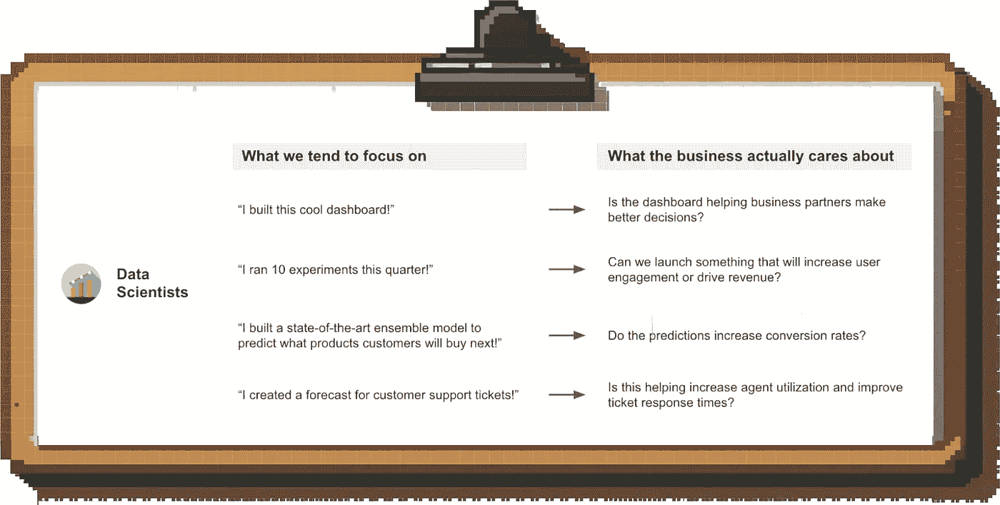
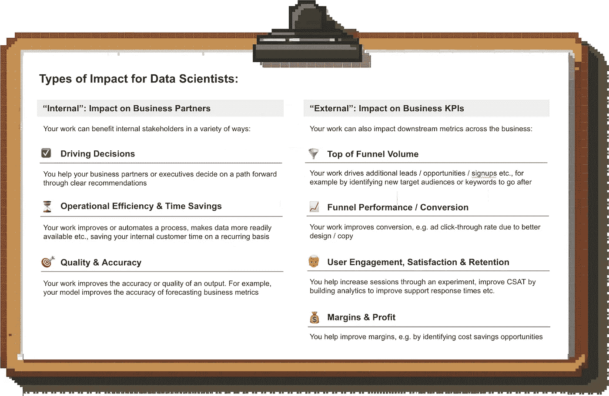
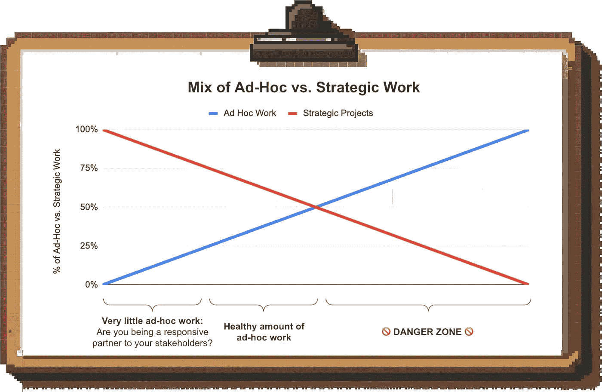
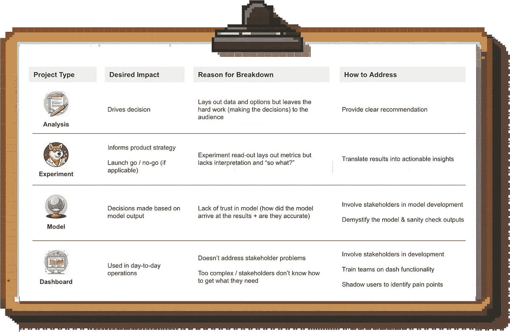

# 如何最大化你作为数据科学家的影响力

> 原文：[`towardsdatascience.com/how-to-maximize-your-impact-as-a-data-scientist-3881995a9cb1?source=collection_archive---------0-----------------------#2024-06-11`](https://towardsdatascience.com/how-to-maximize-your-impact-as-a-data-scientist-3881995a9cb1?source=collection_archive---------0-----------------------#2024-06-11)

## 加速你职业生涯的可操作性建议

 [Torsten Walbaum](https://medium.com/@twalbaum?source=post_page---byline--3881995a9cb1--------------------------------)

·发表于[Towards Data Science](https://towardsdatascience.com/?source=post_page---byline--3881995a9cb1--------------------------------) ·11 分钟阅读·2024 年 6 月 11 日

--

图片来源：作者（部分通过 Midjourney 制作）

作为个人贡献者（IC），最难接受的事实之一就是没人关心你投入的辛勤工作。他们甚至不关心你的输出；他们关心的是你所带来的影响力。

**这有什么区别？** 你的输出是你交付的分析结果，或是你编写的代码行数。你的影响力是你的分析帮助 CEO 做出的决策，或是新产品特性带来的收入。

图片来源：作者

如果你想成为一名高效能的数据科学家并加速你的职业生涯，关键是要专注于影响力。

## 在这篇文章中，我将讨论以下内容：

1.  为什么优先考虑影响力不仅对管理者很重要，对个人贡献者（IC）也同样重要

1.  为什么专注于影响力是困难的

1.  如何最大化你的影响力

1.  如何克服推动实际影响力的常见挑战

让我们深入探讨一下。

 [## 每当 Torsten Walbaum 发布文章时，获取电子邮件通知。

### 每当 Torsten Walbaum 发布文章时，获取电子邮件通知。通过注册，你将创建一个 Medium 账户（如果你还没有的话）……

medium.com](https://medium.com/@twalbaum/subscribe?source=post_page-----3881995a9cb1--------------------------------)

# 为什么我应该专注于影响力？难道这不是我经理的工作吗？

当然，你可以把影响力的事交给你的经理来担心。但主动承担责任对你的职业生涯有一些真实的好处：

+   **减少沮丧感与倦怠**：在一个项目上投入大量工作，却感觉没有任何进展，这种感觉是任何工作中最令人沮丧的。

+   **晋升：** 晋升与影响力息息相关。如果你想成为一名经理，你需要展示你理解什么驱动业务成果，并能够相应地分配资源。

+   **内部机会：** 如果你产生了巨大的影响，身边的人会注意到你，你获得内部机会的几率也会增加。我晋升为总监是因为 CMO 注意到了我在业务运营团队的工作，并要求我转入市场营销部门，建立战略与分析团队。

+   **外部机会：** 潜在雇主关注的不是你承担了什么责任，而是你的影响力。毕竟，他们是想弄清楚你如何能帮助他们的业务。

# 为什么不是每个人都在做这件事？

因为这很难。

我们习惯于在日常生活中思考输入和输出，而非影响力（“我去了健身房”或“我洗了三次衣服”），我们也将这种思维方式带入工作中。

更重要的是，这给了我们***一种掌控感***。你可以完全控制自己在项目上努力工作，甚至可能创造出最终成果，但你无法保证它真的能推动业务前进。

这也可能让我们觉得***在做别人的工作***。你构建了仪表盘；现在是其他团队的问题，他们如何使用它并从中获取价值。你当然可以采取这种立场，但难道你不想看到你的工作推动了进展吗？

最后，有时候我们不清楚***影响力究竟是什么样子***，因为我们感到与业务成果脱节；我将在下面进一步说明。

# 我如何能更加关注影响力？

## 第一步：了解对你角色的影响是什么，并根据此衡量你的成功

不要再思考像“我做了 5 个实验”或“我构建了这个模型”这样的生产力指标，而要让自己对推动影响力负责。

那么数据科学家的影响力是什么样的呢？其他角色很容易定义；客户经理有销售配额，增长营销经理有潜在客户生成目标。

但数据科学本质上是一个支持其他团队的职能。因此，影响力有两个层面：

图片来自作者

**你的工作是否让你的商业伙伴的业务有所改善？** 例如：

+   你的分析是否改变了新产品的推广策略？

+   你的模型是否提高了预测准确性？

+   你的仪表盘是否为团队节省了他们以前每周花在手动拉取数据上的时间？

**你的工作是否帮助推动了下游的业务指标？** 例如：

+   你是市场营销数据科学家？假设你负责实现潜在客户和机会的目标，并提高市场营销效率。

+   你在为客户支持组织做分析？开始关注响应时间和客户满意度得分。

*你不需要为某件事单独负责才能（部分）为其功劳。假如你提供了导致定价变动的分析，从而为公司节省了数百万，那么你也应为这一影响功劳的一部分负责。*

你可能不会像你的利益相关者那样立刻感受到错过下游目标的后果，但由于你的长期职业发展仍然与推动影响力相关，因此采用这种以结果为导向的思维方式是有帮助的。

一旦你开始这样做，你会发现更多的低效问题可以帮助解决，或者发现新的增长机会。

# 第 2 步：确保你的工作解决了一个真正的业务问题

你很可能遇到过这种情况：人们不直接向你提出问题，而是要求你提供一个具体的交付物。一个分析、一份模型、一个仪表盘。

如果你盲目执行他们的要求，你可能会在太晚时意识到这并不会带来实际的业务影响。也许他们试图解决的问题在全局中并不那么重要，或者有更好的解决方法。

## 那么，你能做些什么呢？

像主人一样行动。了解请求背后的实际问题，并问自己这个请求支持的是哪项业务优先事项。

如果你处于职业生涯的早期，你的经理应该理想地帮助你完成这一点。***但不要完全依赖这个：***经理并不总是做到完美，而你将是那个感受到工作范围不清晰后果的人。

这要求你了解公司层面的优先事项以及其他组织和团队的优先事项。在全员大会等会议上做笔记，了解大局，获取其他团队的规划材料，以了解他们在接下来 1 到 2 个季度里想要实现的目标。

# 第 3 步：确保你的工作获得支持

即使你的工作直接支持公司层面的优先事项，如果关键利益相关者没有认同，你也将面临困难。

你不希望处于这样一种情况：完成了工作后才意识到另一个团队因为你没有解决的问题而阻碍了实施。为了避免这种情况，你需要：

1.  需要了解你需要哪些支持，并且

1.  从一开始就让他们参与进来

这是一个复杂的话题；我将在不久的将来写一篇单独的深度分析，讲解如何推动对齐并获得其他团队的支持。

# 第 4 步：将时间集中在最具影响力的事情上

不论你处于什么角色，你很可能需要处理多个优先事项。为了最大化你的影响力，你需要确保将大部分时间花在最重要的事情上。

和许多事情一样，这说起来容易做起来难，所以我们来具体讨论一下这是什么意思。

## 临时请求与战略性工作

很容易被日常事务的忙碌所淹没，结果却意识到自己在真正关心的、重大战略项目上没有取得任何进展。

这非常常见；我们都不能坐在象牙塔里，不受干扰地专心做我们的项目。此外，临时工作同样具有影响力；虽然它不如战略性项目那样令人兴奋，但它是保持业务运转的关键。

然而，如果你发现自己花费***大部分***时间处理这些临时事务，那么是时候和你的经理谈谈了。我相信你的经理宁愿帮助你保护工作时间，而不是让你 1）错过关键项目的截止日期，和 2）最终因挫败感而辞职。

作者插图

## 不要为洒出的牛奶哭泣

另一个常见的挑战来自沉没成本谬论。你在一个项目上投入了大量时间，但它似乎没有任何进展。也许你意识到这个前提并不像你想的那样合理，或者自从你开始做这个工作以来，业务的优先级发生了变化。

与其和经理或利益相关者讨论调整项目范围或完全放弃项目，不如加倍努力把它推进到底。毕竟，你不想让所有的努力都白费吧？听起来是不是很熟悉？

经济学家（和扑克玩家）早就发现了这是一个危险的陷阱。在优先考虑时间时，忽略你已经投入了多少努力，***专注于接下来一个小时的工作能产生最大影响的地方。***

# 需要注意的事项（“影响杀手”）

如何最大限度地减少在一个不会产生影响的项目上浪费时间的可能性？有几个警示信号：

+   **“学术”项目：** 每当有项目向你提出“这个问题值得研究一下”这样的提议时，你就应该小心了；那些纯粹提升对问题理解而没有将其与业务联系起来的项目，按照我的经验，是浪费时间并且会带来挫败感的来源。

+   **过于雄心勃勃的项目范围：** 在 Uber，每个人都想知道什么是“最好的”司机奖励类型。多年来，很多人都在研究这个问题，但始终没有结果。这个问题没有简单的“通用”的答案，真正产生实际影响的项目，往往是更具体、更具战术性的优化。

+   **客户或交付物没有明确界定：** 如果不清楚你的工作的最终用户是谁（你是为你的经理、领导层，还是其他团队做这个工作？），或者你不确定到底应该交付什么内容，那么这应该引起警觉。通常这意味着项目在启动之前需要更多的范围定义工作。

# 常见挑战及应对方式

我们已经讨论了最大化影响的通用框架。那么，如何让实际的具体项目更具影响力呢？

很多时候，项目在快完成时会失败。影响不会自动显现，因此你需要投入最后一点工作，确保你的工作能够被采纳。这样做能带来极高的时间回报，因为你已经完成了艰难的工作，制作出了交付物，并且“仅仅”需要与相关方闭环。

图片由作者提供

为了让事情更加具体化，我将介绍几种常见的交付物类型，讨论它们通常在何处未能产生影响，并提出你可以采取的措施：

## 1\. 你做了全面的分析，但没有人付诸行动

***问题：*** 这在没有明确建议的分析中很常见。如果你只是列出数据和潜在的前进方向，你就是期望你的受众来承担所有艰难的分析工作。

***解决方案：*** 一旦你把这项工作从他们的工作量中解放出来，你的工作就开始为他们带来实际价值。始终给出明确的建议；你可以在附录中说明一些前提条件并展示替代方案，但你需要表明立场。

## 2\. 你进行了实验，但没有人使用结果

***问题：*** 许多实验以数据科学的度量汇总结束。通常，这只是一个“度量汇总”，其中有大量信息，但缺乏解释或上下文。

***解决方案：*** 帮助你的业务合作伙伴解读结果，并**告诉他们它如何影响他们关心的事项。**

+   他们应该如何看待统计显著性或其缺失？

+   与你测试和发布的其他变更相比，观察到的提升效果是否良好？

+   对于接下来的步骤，你有什么建议？这个实验结果对这个人或团队具体意味着什么？

记住，你是主题专家，不应该期望非分析性的受众来解读原始实验数据。告诉你的利益相关者结果*对他们的影响*，这将增加他们采取行动的可能性。

## 3\. 你建立了一个预测模型，但你为其建立的团队没有使用它

***问题：*** 当预测模型未被使用时，往往是因为缺乏对模型输出的信任。

ML 模型本身往往是“黑箱”，如果团队不理解输出是如何生成的，或者输出是否可靠，他们会对依赖它们感到犹豫。即使你的模型没有使用机器学习，只是在电子表格中：如果人们不知道它是如何工作的，他们也会产生怀疑。

***解决方案：*** 这完全取决于在整个过程中涉及利益相关者并建立信任。

+   从一开始就让利益相关者参与模型开发，让他们感到舒适并尽早解决任何疑虑

+   消除输出的神秘感；例如，你可以提取出最重要的模型特征并加以解释

+   对预测进行合理性检查，并与直觉进行比较。例如，如果你预测销售额，但你的模型预测的季节性模式与往年不同，你需要能够解释为什么，否则你会失去信任。根据我的经验，这比仅仅分享模型准确性等性能指标更具影响力。

拥有一个结构化的操作手册可以让你的工作更轻松，因此我将在不久的将来发布一篇单独的文章来详细讲解这一点。

## 4\. 你创建了一个仪表盘，但没有人使用它

***问题：*** 如果仪表盘没有被使用，可能是以下这些情况之一：

1.  这个仪表盘没有直接解决紧急的业务需求

1.  你没有在开发过程中让相关利益方参与（例如，通过分享草图和草案征求反馈），最终的产品并不是他们所期望的

1.  仪表盘很复杂，而你的用户不懂得如何获取他们所需的信息

***解决方案：*** 为了解决第 1 点和第 2 点，首先进行用户研究，了解仪表盘的痛点和潜在用例，并在开发过程中让相关利益方参与其中。

关于第 3 点，用户熟悉的简单仪表盘比一个更复杂但未被使用的仪表盘更好。如果你无法（或不想）进一步简化仪表盘，你需要对用户进行功能培训，并在旁观察他们，了解使用中的摩擦点。

仪表盘并不是你第一次发布时就完成了，它需要根据用户的需求和反馈不断改进。

# 结束语

聚焦于影响力是让人害怕的，因为我们将离开那些可控输入的领域，但这才是最终为你带来升职和新工作机会的关键。

当你的工作真正感觉到有成效时，难道不是很棒吗？

如果你想获得更多实际操作方面的分析建议，可以考虑在 Medium 上关注我，或者在[LinkedIn](http://www.linkedin.com/comm/mynetwork/discovery-see-all?usecase=PEOPLE_FOLLOWS&followMember=torsten-walbaum)和[Substack](https://www.operatorshandbook.com/)上关注我。
