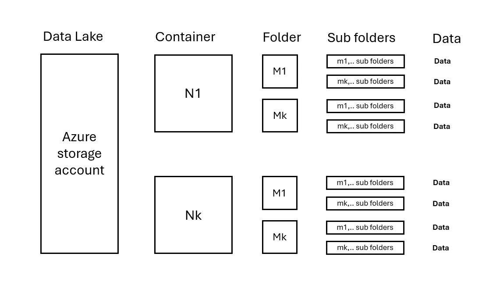

# 如何在 Azure 数据工厂中并行化复制活动

> 原文：[`towardsdatascience.com/how-to-parallelize-copy-activities-in-azure-data-factory-5d21df7b8562?source=collection_archive---------10-----------------------#2024-10-10`](https://towardsdatascience.com/how-to-parallelize-copy-activities-in-azure-data-factory-5d21df7b8562?source=collection_archive---------10-----------------------#2024-10-10)

## 优化企业数据湖的数据传输

 [René Bremer](https://rebremer.medium.com/?source=post_page---byline--5d21df7b8562--------------------------------)

·发布于 [Towards Data Science](https://towardsdatascience.com/?source=post_page---byline--5d21df7b8562--------------------------------) ·阅读时间：7 分钟·2024 年 10 月 10 日

--

数据分布不均 - 图片来自 [Vackground.com 在 Unsplash](https://unsplash.com/@vackground)

# 1. 引言

Azure 数据工厂（ADF）是一个广泛使用的数据迁移工具，特别是在企业数据湖中。它通常用于摄取和转换数据，通常通过将数据从本地复制到 Azure 存储开始。之后，数据根据奖章架构（medallion architecture）通过不同的区域进行移动。ADF 对于在数据损坏、恶意软件或帐户删除等灾难情况下创建和恢复备份也至关重要。

这意味着 ADF 被用来迁移大量数据，通常是 TB 级，有时甚至是 PB 级。因此，优化复制性能至关重要，以缩短吞吐时间。一种常见的提升 ADF 性能的方法是并行化复制活动。然而，应该在数据量最多的地方进行并行化，当数据湖的数据分布不均时，这可能会成为一个挑战。

在这篇博客文章中，讨论了不同的 ADF 并行化策略，适用于数据湖，并且一个项目被部署。可以在以下链接中找到 ADF 解决方案项目：[`github.com/rebremer/data-factory-copy-skewed-data-lake`](https://github.com/rebremer/data-factory-copy-skewed-data-lake)。

# 2. 数据湖数据分布

数据湖有各种规模和形式。理解数据湖中的数据分布对于提升复制性能非常重要。考虑以下情况：

+   一个 Azure 存储帐户有 N 个容器。

+   每个容器包含 M 个文件夹和 m 层子文件夹。

+   数据在文件夹 N/M/.. 中均匀分布。

参见下图：

2.1 数据湖与均匀分布的数据 — 图片由作者提供

在这种情况下，可以在每个容器 N 上并行化复制活动。对于更大的数据量，通过在容器 N 内的文件夹 M 上并行化，可以进一步提高性能。随后，可以为每个复制活动配置使用多少 [数据集成单元 (DIU)](https://learn.microsoft.com/en-us/azure/data-factory/copy-activity-performance-features#data-integration-units) 和 [复制并行化](https://learn.microsoft.com/en-us/azure/data-factory/copy-activity-performance-features#parallel-copy) *在* 复制活动中。

现在考虑以下极端情况：最后一个文件夹 Nk 和 Mk 拥有 99% 的数据，见下图：

2.2 数据湖与倾斜分布的数据 — 图片由作者提供

这意味着并行化应在包含数据的 Nk/Mk 子文件夹中进行。接下来需要更高级的逻辑来确定确切的数据位置。可以使用集成在 ADF 中的 Azure Function 来实现这一点。在下一章中，将部署一个项目并更详细地讨论并行化选项。

# 3\. ADF 项目中的并行化策略

在本部分中，将部署项目并运行并讨论复制测试。整个项目可以在项目中找到：[`github.com/rebremer/data-factory-copy-skewed-data-lake`](https://github.com/rebremer/data-factory-copy-skewed-data-lake)。

## **3.1 部署项目**

运行脚本 `[deploy_adf.ps1](https://github.com/rebremer/data-factory-copy-skewed-data-lake/blob/main/deploy_adf.ps1)`。如果 ADF 成功部署，将会部署两个管道：

3.1.1 包含根管道和子管道的数据工厂项目 — 图片由作者提供

随后，运行脚本 `[deploy_azurefunction.ps1](https://github.com/rebremer/data-factory-copy-skewed-data-lake/blob/main/deploy_azurefunction.ps1)`。如果 Azure Function 成功部署，以下代码将被部署。

3.1.2 使用 Azure Function 查找“数据口袋”，以便 ADF 可以更好地进行并行化

要最终运行该项目，请确保 Azure Function 和数据工厂的系统分配的托管身份可以访问数据复制的存储帐户。

## 3.2 项目中使用的并行化

部署项目后，可以注意到部署了以下工具，以使用并行化来提高性能。

+   **根管道：** 列出存储帐户中容器 N 并为每个容器触发子管道的根管道。

+   **子管道：** 列出容器中文件夹 M 并为每个文件夹触发递归复制活动的子管道。

+   **Switch**：子管道使用开关决定如何确定列出文件夹。对于“default”（均匀）情况，使用 Get Metadata；对于“uneven”（不均匀）情况，使用 Azure Function。

+   **Get Metadata**：列出给定容器 N 中的所有根文件夹 M。

+   **Azure Function**：列出所有包含不超过 X GB 数据的文件夹及子文件夹，并作为一个整体进行复制。

+   **复制活动**：递归地复制给定文件夹中的所有数据。

+   **DIU**：每个复制活动的 Data Integration Units（数据集成单元）数量。

+   **复制并行化**：*在*复制活动中，可以启动的并行复制线程数。每个线程可以复制一个文件，最大可支持 50 个线程。

在均匀分布的数据湖中，数据在 N 个容器和 M 个文件夹中均匀分布。在这种情况下，复制活动可以仅在每个文件夹 M 上进行并行化。这可以通过使用 Get Metadata 列出文件夹 M，使用 For Each 遍历文件夹并对每个文件夹执行复制活动来完成。另见下图。

3.2.1 关注均匀分布数据的子管道结构

使用这种策略意味着每个复制活动将复制相等数量的数据。总共将运行 N*M 个复制活动。

在偏斜分布的数据湖中，数据在 N 个容器和 M 个文件夹中分布不均。在这种情况下，复制活动应动态确定。可以使用 Azure Function 列出数据量大的文件夹，然后通过 For Each 遍历文件夹并进行每个文件夹的复制活动。另见下图。

3.2.2 关注偏斜分布数据的子管道结构

使用这种策略，复制活动将在数据湖中动态扩展，数据可以找到的地方，最需要并行化。尽管该解决方案比前一个更复杂，因为它需要 Azure Function，但它可以用于复制偏斜分布的数据。

## 3.3：并行化性能测试

为了比较不同并行化选项的性能，设置了如下简单测试：

+   使用两个存储帐户和 1 个 ADF 实例，在 westeurope 区域使用 Azure IR。数据从源存储帐户复制到目标存储帐户。

+   源存储帐户包含三个容器，每个容器有 0.72 TB 的数据，数据分布在多个文件夹和子文件夹中。

+   数据在容器中均匀分布，没有偏斜数据。

测试 A：使用 32 DIU 和 16 个线程（均设置为自动）复制 1 个容器，1 个复制活动 => 复制 0.72 TB 数据，复制时间 12 分 27 秒，平均吞吐量为 0.99 GB/s

测试 B：使用 128 DIU 和 32 个线程（在复制活动中）复制 1 个容器，1 个复制活动 => 复制 0.72 TB 数据，复制时间 06 分 19 秒，平均吞吐量为 1.95 GB/s。

测试 C：使用 200 DIU 和 50 个线程（最大）复制 1 个容器，1 个复制活动 => 测试因限流被中止，与测试 B 相比没有性能提升。

测试 D：使用 128 DIU 和每个复制活动 32 个线程并行复制 2 个容器 => 复制了 1.44 TB 的数据，复制时间 07 分钟 00 秒，平均吞吐量为 3.53 GB/s。

测试 E：使用 128 DIU 和每个复制活动 32 个线程并行复制 3 个容器 => 复制了 2.17 TB 的数据，复制时间 08 分钟 07 秒，平均吞吐量为 4.56 GB/s。请参见下方截图。

3.3 测试 E：3 个并行复制活动的复制吞吐量，使用 128 DIU 和 32 个线程，数据大小为 3*0.72TB

在此，需要注意的是，ADF 并不会立即开始复制，因为存在启动时间。对于 Azure IR，这大约是 10 秒。这个启动时间是固定的，对于大规模复制来说，它对吞吐量的影响可以忽略不计。此外，存储帐户的最大入口带宽为[60 Gbps](https://learn.microsoft.com/en-us/azure/storage/common/scalability-targets-standard-account#scale-targets-for-standard-storage-accounts)（即 7.5 GB/s）。除非请求存储帐户额外的容量，否则无法超出这个值。

从测试中可以得出以下结论：

+   通过增加复制活动中的 DIU 和并行设置，已经可以显著提高性能。

+   通过并行运行复制管道，可以进一步提高性能。

+   在此测试中，数据均匀分布在两个容器中。如果数据存在倾斜，即容器 1 中的所有数据都位于容器 2 的子文件夹中，则两个复制活动都需要针对容器 2 进行。这将确保与测试 D 相似的性能。

+   如果数据位置事先未知或数据深度嵌套，则需要使用 Azure Function 来识别数据存储区，以确保复制活动在正确的位置运行。

# 4. 结论

Azure 数据工厂（ADF）是一个流行的大规模数据迁移工具。它广泛用于数据湖中数据的摄取、转换、备份和恢复。考虑到它在大规模数据迁移中的角色，优化复制性能对于最小化吞吐时间至关重要。

在这篇博客中，我们讨论了以下并行化策略，以增强从 Azure 存储复制数据的性能。

+   在复制活动中，利用标准的数据集成单元（DIU）和并行化线程。

+   并行运行复制活动。如果已知数据均匀分布，可以在 ADF 中使用标准功能将复制活动并行化到每个容器（N）和根文件夹（M）中。

+   在数据所在位置运行复制活动。如果事先未知或数据深度嵌套，可以使用 Azure Function 来定位数据。然而，在 ADF 管道中集成 Azure Function 会增加复杂性，除非必要，否则应避免使用。

不幸的是，并没有一种灵丹妙药的解决方案，总是需要通过分析和测试来找到最佳策略，以提高企业数据湖的复制性能。本文旨在为选择最佳策略提供指导。
