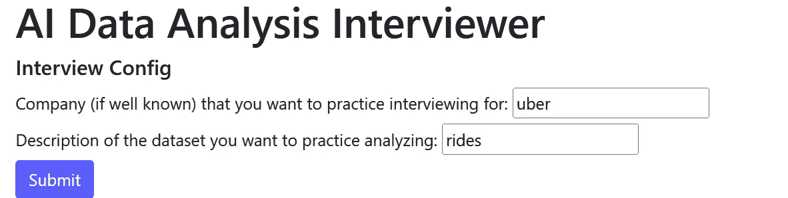
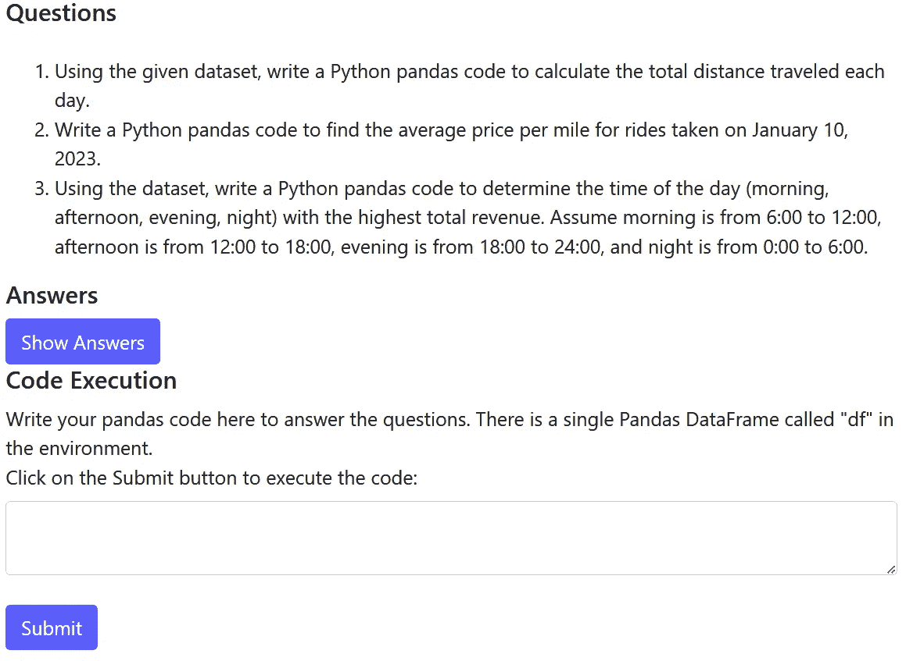
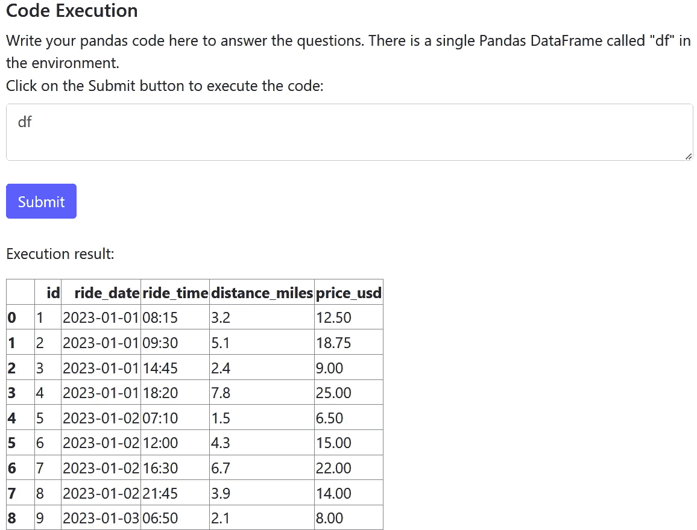
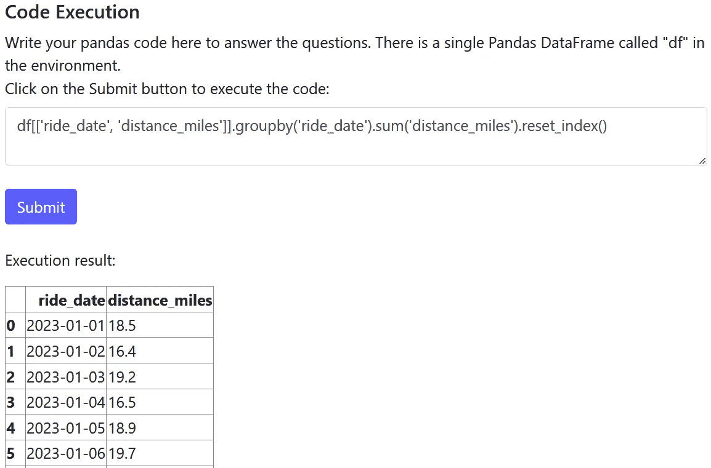
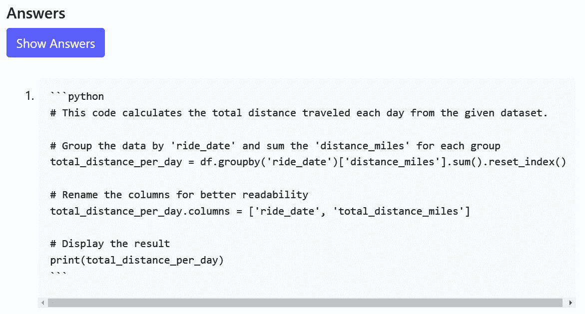
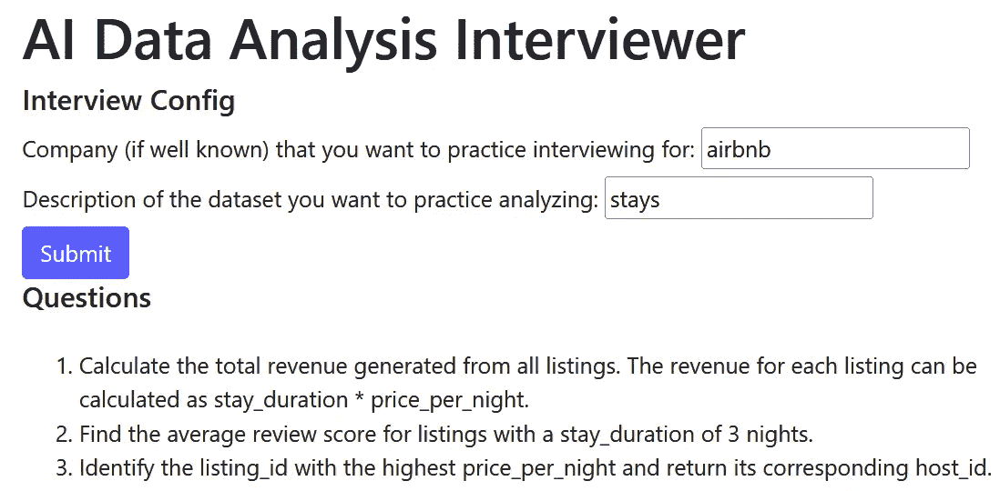
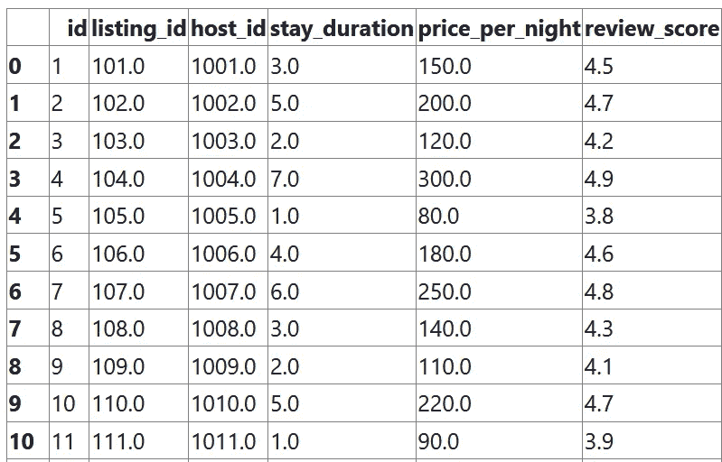

# 如何用 AI 练习数据分析师面试

> 原文：[`towardsdatascience.com/how-to-practice-data-analyst-interviews-with-ai-e933a027e609?source=collection_archive---------12-----------------------#2024-08-12`](https://towardsdatascience.com/how-to-practice-data-analyst-interviews-with-ai-e933a027e609?source=collection_archive---------12-----------------------#2024-08-12)

## 使用大型语言模型（LLMs）生成合成数据和代码

[](https://medium.com/@mathewnxwang?source=post_page---byline--e933a027e609--------------------------------)[](https://towardsdatascience.com/?source=post_page---byline--e933a027e609--------------------------------) [Mathew Wang](https://medium.com/@mathewnxwang?source=post_page---byline--e933a027e609--------------------------------)

·发布于 [Towards Data Science](https://towardsdatascience.com/?source=post_page---byline--e933a027e609--------------------------------) ·阅读时间 8 分钟·2024 年 8 月 12 日

--


图片来源：[Scott Graham](https://unsplash.com/@homajob?utm_source=medium&utm_medium=referral) 于 [Unsplash](https://unsplash.com/?utm_source=medium&utm_medium=referral)

# 简介

我最近一直在做一些周末的 LLM 项目。在考虑要做什么时，两个想法突然浮现：

1.  **与软件工程和产品管理等其他职位相比，练习数据分析面试的资源较少**。在我准备第一次数据分析师面试时，我依赖于行业中的朋友，自己编写 SQL 和 Python 面试问题。

1.  **大型语言模型（LLMs）在生成合成数据集和编写代码方面非常擅长。**

于是，我构建了 **AI 数据分析面试官**，它可以自动生成独特的数据集，并为你生成 Python 面试问题供你解决！

本文概述了其工作原理和技术实现。你可以在 [这里](https://github.com/mathewnxwang/data_analysis_interview_tool/tree/main)查看该项目的代码库。

# 演示

当我启动这个网页应用时，系统会提示我提供关于我想要练习的面试类型的详细信息，具体是公司和数据集描述。假设我正在面试 Uber 的数据分析师职位，重点分析乘车数据：



在点击提交并等待 GPT 执行其魔法后，我收到了 AI 生成的问题、答案，以及一个可以在 AI 生成的数据集上执行代码的输入框：



太棒了！让我们来解决第一个问题：计算每天行驶的总距离。按照良好的分析实践，我们从数据探索开始：



看起来我们需要按 ride_date 字段分组，并对 distance_miles 字段求和。让我们编写并提交这段 Pandas 代码：



看起来不错！AI 的答案是否同意我们的做法？



AI 答案使用略有不同的方法，但本质上以相同的方式解决问题。

我可以反复练习，直到感觉完全准备好再去面试。面试 Airbnb？这个工具能帮你。它会生成这些问题：



以及一个可以执行代码的数据集：



# 如何使用该应用

查看仓库的 readme [这里](https://github.com/mathewnxwang/data_analysis_interview_tool/blob/main/README.md#how-to-run)以在本地运行该应用。不幸的是，我没有托管它，但未来可能会！

# 高层设计

本文接下来将介绍我如何创建 AI 数据分析面试官的技术细节。

## LLM 架构

我使用了 OpenAI 的 gpt-4o，因为它目前是我常用的 LLM 模型（不过换成其他模型也很容易。）

进行的 LLM 调用有 3 种类型：

1.  **数据集生成**：我们请求 LLM 生成一个适合分析面试的数据集。

1.  **问题生成**：我们请求 LLM 从该数据集生成几个分析面试问题。

1.  **答案生成**：我们请求 LLM 为每个面试问题生成答案代码。

## 前端

我使用 Flask 构建了前端。它简单且不太有趣，所以我将重点讲解 LLM 的细节。欢迎查看[仓库中的代码](https://github.com/mathewnxwang/data_analysis_interview_tool/tree/main)！

# 设计细节

## LLM 管理器

LLMManager 是一个简单的类，负责进行 LLM API 调用。它从本地的秘密文件中获取我们的 OpenAI API 密钥，并进行 OpenAI API 调用，将提示传递给 LLM 模型。在每个 LLM 项目中你都会看到类似的形式。

```py
class LLMManager():
    def __init__(self, model: str = 'gpt-4o'):
        self.model = model

        load_dotenv("secrets.env")
        openai_api_key = os.getenv("OPENAI_API_KEY")
        self.client = OpenAI(api_key=openai_api_key)

    def call_llm(self, system_prompt: str, user_prompt: str, temperature: float) -> str:
        print(f"Calling LLM with system prompt: {system_prompt}\n\nUser prompt: {user_prompt}")
        response: ChatCompletion = self.client.chat.completions.create(
            messages=[
                {"role": "system", "content": system_prompt},
                {"role": "user", "content": user_prompt}
            ],
            model=self.model,
            temperature=temperature
        )
        message = response.choices[0].message.content
        print(response)
        return message
```

## 数据集生成

这就是有趣的部分开始！

我们首先通过以下提示请求 LLM 生成一个数据集：

```py
SYSTEM_TEMPLATE = """You are a senior staff data analyst at a world class tech company.
You are designing a data analysis interview for hiring candidates."""

DATA_GENERATION_USER_TEMPLATE = """Create a dataset for a data analysis interview that contains interesting insights.
Specifically, generate comma delimited csv output with the following characteristics:
- Relevant to company: {company}
- Dataset description: {description}
- Number of rows: 100
- Number of columns: 5
Only include csv data in your response. Do not include any other information.
Start your output with the first header of the csv: "id,".
Output: """
```

让我们分解一下：

+   许多 LLM 模型遵循一种提示结构，LLM 接受系统消息和用户消息。系统消息旨在定义一般行为，用户消息则提供具体指令。在这里，我们通过系统消息要求 LLM 成为一位世界级面试官。虽然这听起来有些傻，但激励 LLM 是一个经过验证的提示技巧，可以获得更好的表现。

+   我们通过字符串变量{company}和{description}将用户输入的公司和数据集信息传递到用户模板中，供其练习面试使用。

+   我们提示 LLM 以 csv 格式输出数据。这似乎是 LLM 生成数据的最简单的表格格式，之后我们可以将其转换为 Pandas DataFrame 进行代码分析。JSON 格式也可能可行，但由于其更复杂且冗长的语法，可能会不那么可靠。

+   我们希望 LLM 的输出是可解析的 csv，但 gpt-4o 往往会生成多余的文本，可能是因为它被训练得非常乐于助人。用户模板的结尾强烈指示 LLM 只输出可解析的 csv 数据，但即便如此，我们仍需要对其进行后处理。

DataGenerator 类处理所有数据生成相关的工作，并包含 generate_interview_dataset 方法，该方法进行 LLM 调用以生成数据集：

```py
 def generate_interview_dataset(self, company: str, description: str, mock_data: bool) -> str:
        if not mock_data:
            data_generation_user_prompt = DATA_GENERATION_USER_TEMPLATE.format(company=company, description=description)
            dataset = self.llm_manager.call_llm(
                system_prompt=SYSTEM_TEMPLATE,
                user_prompt=data_generation_user_prompt,
                temperature=0
            )

            dataset = self.clean_llm_dataset_output(dataset)
            return dataset

        return MOCK_DATASET

    def clean_llm_dataset_output(self, dataset: str) -> str:
        cleaned_dataset = dataset[dataset.index("id,"):]
        return cleaned_dataset
```

请注意，clean_llm_dataset_output 方法执行了上面提到的轻度后处理。它去除了“id”之前的任何多余文本，“id”表示 csv 数据的开始。

LLM 只能输出字符串，因此我们需要将字符串输出转换为可分析的 Pandas DataFrame。convert_str_to_df 方法处理了这个问题：

```py
 def convert_str_to_df(self, dataset: str) -> pd.DataFrame:
        csv_data = StringIO(dataset)

        try:
            df = pd.read_csv(csv_data)
        except Exception as e:
            raise ValueError(f"Error in converting LLM csv output to DataFrame: {e}")

        return df
```

## 问题生成

我们可以使用以下提示，提示 LLM 根据生成的数据集生成面试问题：

```py
QUESTION_GENERATION_USER_TEMPLATE = """Generate 3 data analysis interview questions that can be solved with Python pandas code based on the dataset below:

Dataset:
{dataset}

Output the questions in a Python list where each element is a question. Start your output with [".
Do not include question indexes like "1." in your output.
Output: """
```

再次分解：

+   这里使用的是相同的系统提示，因为我们仍然希望 LLM 在编写面试问题时体现出世界级面试官的水平。

+   从数据集生成调用得到的字符串输出被传递到{dataset}字符串变量中。注意，我们必须维护数据集的两种表示方式：1\. 一个 LLM 可以理解的字符串表示，用于生成问题和答案；2\. 一个结构化表示（即 DataFrame），我们可以在其上执行代码。

+   我们提示 LLM 返回一个列表。我们需要输出是结构化的，以便在答案生成步骤中遍历问题，为每个问题生成一个答案。

LLM 调用是通过 DataGenerator 的 generate_interview_questions 方法进行的：

```py
 def generate_interview_questions(self, dataset: str) -> InterviewQuestions:

        question_generation_user_prompt = QUESTION_GENERATION_USER_TEMPLATE.format(dataset=dataset)
        questions = self.llm_manager.call_llm(
            system_prompt=SYSTEM_TEMPLATE,
            user_prompt=question_generation_user_prompt,
            temperature=0
        )

        try:
            questions_list = literal_eval(questions)
        except Exception as e:
            raise ValueError(f"Error in converting LLM questions output to list: {e}")

        questions_structured = InterviewQuestions(
            question_1=questions_list[0],
            question_2=questions_list[1],
            question_3=questions_list[2]
        )

        return questions_structured
```

## 答案生成

在有了数据集和问题之后，我们最终通过以下提示生成答案：

```py
ANSWER_GENERATION_USER_TEMPLATE = """Generate an answer to the following data analysis interview Question based on the Dataset.

Dataset:
{dataset}

Question: {question}

The answer should be executable Pandas Python code where df refers to the Dataset above.
Always start your answer with a comment explaining what the following code does.
DO NOT DEFINE df IN YOUR RESPONSE.
Answer: """
```

+   我们根据问题的数量生成相应数量的答案生成 LLM 调用，因此是 3 次，因为我们将问题生成提示硬编码为请求生成 3 个问题。从技术上讲，你可以要求 LLM 在一次调用中为所有 3 个问题生成所有 3 个答案，但我怀疑这会导致性能下降。我们希望最大化 LLM 生成准确答案的能力。一个（也许显而易见的）经验法则是，任务越难，LLM 完成得越不好。

+   提示指示 LLM 将数据集称为“df”，因为当用户代码通过下面的 CodeExecutor 类执行时，我们的面试数据集以 DataFrame 形式被称为“df”。

```py
class CodeExecutor():

    def execute_code(self, df: pd.DataFrame, input_code: str):

        local_vars = {'df': df}
        code_prefix = """import pandas as pd\nresult = """
        try:
            exec(code_prefix + input_code, {}, local_vars)
        except Exception as e:
            return f"Error in code execution: {e}\nCompiled code: {code_prefix + input_code}"

        execution_result = local_vars.get('result', None)

        if isinstance(execution_result, pd.DataFrame):
            return execution_result.to_html()

        return execution_result
```

# 结论

我希望本文能为如何构建一个简单而有用的 LLM 项目提供一些启示，这个项目在多种方式上利用了 LLM！

如果我继续开发这个项目，我会专注于：

1.  增加对来自 LLMs 的结构化输出（即可解析的 csv 或列表）的更多验证。我已经覆盖了一些边缘案例，但 LLMs 非常不可预测，因此需要加固。

2\. 添加更多功能，如

+   生成多个关系表和需要连接的查询

+   除了 Python 之外的 SQL 面试

+   自定义数据集上传

+   难度设置
