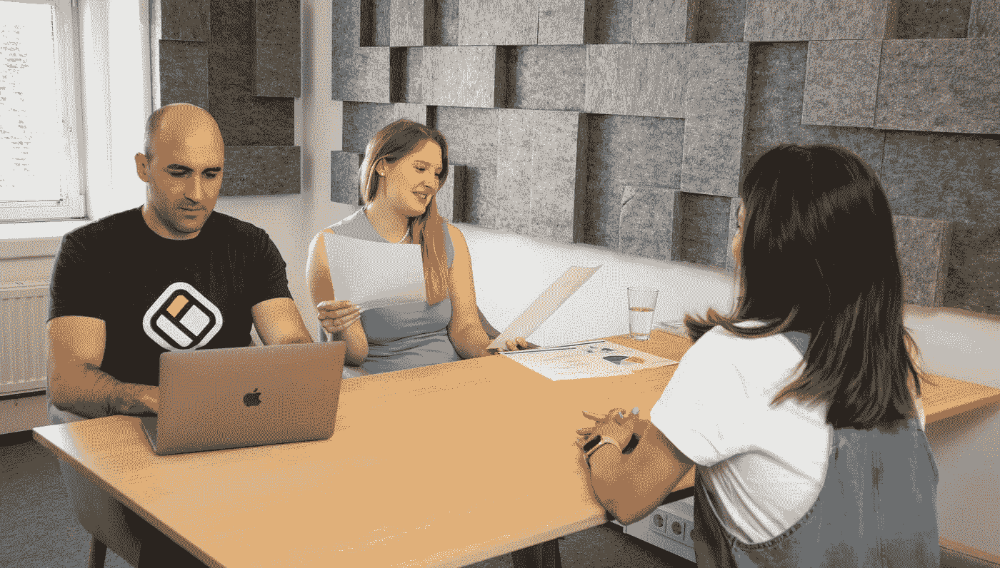

# 如何为您的数据科学行为面试做准备

> 原文：[`towardsdatascience.com/how-to-prepare-for-your-data-science-behavioural-interview-b26b7a2db669?source=collection_archive---------1-----------------------#2024-12-07`](https://towardsdatascience.com/how-to-prepare-for-your-data-science-behavioural-interview-b26b7a2db669?source=collection_archive---------1-----------------------#2024-12-07)

## 我的顶级建议，助您成功通过下一次数据科学行为面试

 [Egor Howell](https://medium.com/@egorhowell?source=post_page---byline--b26b7a2db669--------------------------------)

·发表于 [Towards Data Science](https://towardsdatascience.com/?source=post_page---byline--b26b7a2db669--------------------------------) ·6 分钟阅读·2024 年 12 月 7 日

--

图片由 [Walls.io](https://unsplash.com/@walls_io?utm_source=medium&utm_medium=referral) 提供，来自 [Unsplash](https://unsplash.com/?utm_source=medium&utm_medium=referral)

作为一名数据科学家，您很可能不喜欢行为面试。我们的工作大部分是编程和分析，因此您可能会想，为什么要做这些呢？然而，在团队中工作良好是一个重要的技能，雇主们知道这一点。

这就是为什么在本文中，我想分享一些顶级建议，帮助您成功通过下一次行为面试！

# 永远做好准备

> 准备不足，必定失败

这是一句古老的格言，但也非常真实。我的主要建议是永远做好准备，这适用于工作世界中的任何事情。为您的工作日、会议，尤其是面试做好准备。

您应该花费的时间因人而异，但我至少会在行为面试上花费 4 到 5 个小时。虽然听起来很多，但过度准备总比准备不足好。
