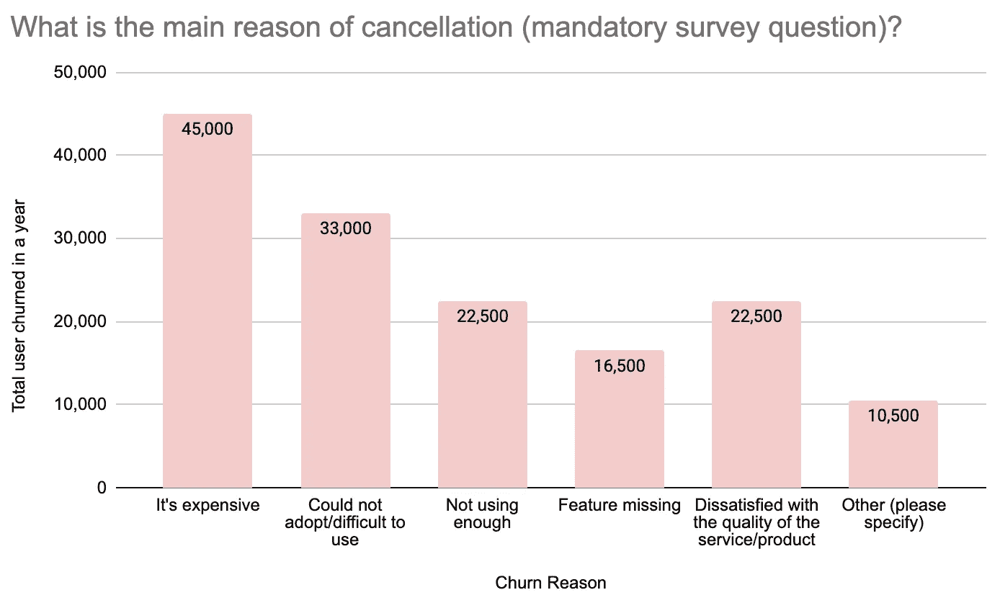
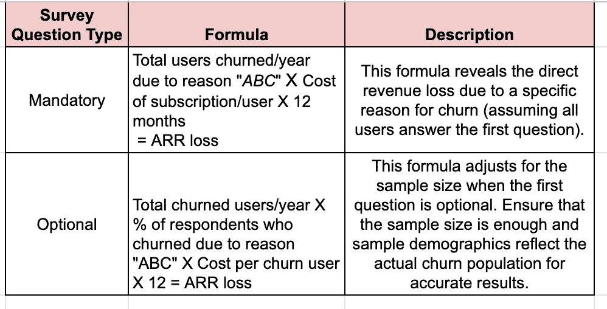
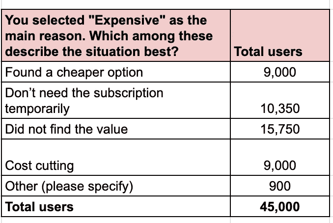

# 如何通过流失调查量化客户问题以便进行优先级排序

> 原文：[`towardsdatascience.com/how-to-quantify-customer-problems-for-prioritization-25c79a99f4f7?source=collection_archive---------15-----------------------#2024-03-14`](https://towardsdatascience.com/how-to-quantify-customer-problems-for-prioritization-25c79a99f4f7?source=collection_archive---------15-----------------------#2024-03-14)

 [Urvashi Jaitley](https://medium.com/@urvashulluniya?source=post_page---byline--25c79a99f4f7--------------------------------)

·发表于 [Towards Data Science](https://towardsdatascience.com/?source=post_page---byline--25c79a99f4f7--------------------------------) ·5 分钟阅读·2024 年 3 月 14 日

--

理解用户的需求和痛点是商业成功的关键组成部分。流失调查是为已停止使用某项服务的客户设计的一种特定类型的调查，它们是客户洞察的宝贵资源。然而，真正的力量在于将这些洞察转化为可以推动可持续增长和收入的具体行动。流失往往源于未满足的客户需求，导致订阅和收入的损失。本文探讨了一种强大的技术：“*将通过流失调查识别的客户问题赋予美元价值*。”你可以将这种方法应用于其他类型的调查，如 CSAT、NPS 和其他 VOC 工具。通过量化这些问题的财务影响，你可以优先处理最重要的问题，最大化你的盈利能力。优先级排序是每个产品开发过程的关键。

**第一步：分析第一个问题——揭示根本原因**

从调查的主要问题开始分析，例如：“取消的主要原因是什么？”

样本流失调查

**量化影响**

现在，让我们来看一下结果，并以美元来量化它。这取决于第一个问题是否为必答问题（所有用户都回答）还是可选问题（只有部分用户回答）。

因此，为了评估一个流失原因，例如“*价格太贵*”，机会大小将是 45,000*$20*12 = $1080 万年化经常性收入（ARR）（假设每个流失用户的订阅费用为 20 美元）。这只是第一年收入的损失，实际上，如果客户不流失，他们将支付 3-5 年（LTV），收入损失将会更大。

> 提示：有统计方法可以确定足够的样本量，Qualtrics 提供了一个免费的[示例](https://www.qualtrics.com/blog/calculating-sample-size/)。
> 
> 提示：如果样本不能代表流失用户群体，则只针对样本所代表的群体（分段用户）进行外推。并且要努力为剩余的人群群体找出与流失相关的见解。例如：如果你有一个产品内的流失调查，并且你的用户群体包含小型中型企业到大型企业的客户，那么很多时候大型企业的客户不会在产品内流失；他们是通过续约经理取消订阅的；因此，为了从他们那里获取见解，可以通过续约经理渠道设计流失调查。

## 第 2 步：分析后续问题 — 深入挖掘

在为高层次问题“价格过高”赋值时，这为我们提供了一个起点；但它过于笼统，无法有效地制定解决方案。为了获得更深入的见解，我们可以在用户选择“价格过高”后，通过分支问题进行后续调查。

> 提示：如果你在产品内取消流程中只有一个单一调查问题，考虑通过电子邮件或在取消流程后使用带有分支问题的后续流失调查，以深入了解客户流失的原因。

对于“订阅太贵”，一个分支问题可以有以下选项：

45K 名选择“价格过高”作为主要流失原因的用户的分支调查问题结果

结果显示，在“价格过高”原因类别中，60%的用户因非价格相关的问题而流失，如“*未找到价值*”和“*暂时不需要订阅*”。这就是为什么深入分析非常重要，以了解真正的问题。现在让我们来计算一些上述流失原因的机会大小：

## **暂时不需要订阅：**

**机会大小估算：** 估算方法与我们在第一步中所做的类似，但我们需要记住，某些用户可能因暂时的原因取消订阅后会自动回来。因此，我们需要将这些用户从计算中去除（自然恢复率）。所以，如果这类用户的自然恢复率是 2%，那么最终的可处理年经常性收入（ARR）将是：（9000 * $20*12）—（9000 * 2% * $20*12）= $220 万 ARR 损失。

**潜在解决方案：** 如我们所知，解决上述使用案例可以节省大量收入；因此，我们可以为这些用户构建解决方案。一个解决方案是引入暂停订阅选项。由于取消订阅的原因是暂时性的（比如旅行、突发天气、疫情，甚至只是忙碌时期都会打乱用户的日常生活），暂停订阅可以让用户在不承担持续费用的情况下保留他们的订阅。这对企业有两个好处：首先，它通过展示灵活性和理解用户需求，促进了客户忠诚度。其次，它增加了用户在忙碌期或暂时性中断过后重新回归服务的可能性，从而带来持续收入。

> 研究表明，提供暂停选项可以显著降低流失率 [[source](https://recurly.com/product/pause-subscription/)]。著名的有声书订阅服务 Audible 提供暂停订阅服务。

## **未找到价值：**

如果用户没有意识到订阅的价值，至关重要的是要了解原因。像上面一样进行相同的分析，计算由于用户未能发现订阅价值而损失的收入，即 15700 * $20 * 12 = $3.78 百万年化经常性收入（ARR）。这是通过保留这些用户可以节省的收入。此外，你还将获得扩展收入（如果你的商业模式有此选项），因为一旦用户意识到服务的价值，他们更可能进行扩展。

**潜在解决方案：**

+   **提醒用户关于价值的内容：** 突出他们所获得的好处。例如，Instacart 展示了每个订单用户节省的购物时间，强调其价值主张。

+   **围绕价值发起营销活动：** 进行用户研究并发布文章，展示你的产品如何改善用户的生活。例如，Asana 分享了如何通过工作管理工具提升团队生产力的故事。

+   **提供分层订阅计划：** 允许用户切换到较低的订阅层级，鼓励他们先采用基本功能，然后再可能在后续销售中升级到更高层级。

+   **提供灵活的计费方式，并提供教育和入职服务与模板**。提供按月或按季度计费，让用户在承诺长期订阅之前有时间感知其价值，并提供入职工具帮助用户快速感知价值。

**找到更便宜的选项或削减成本：** 对于那些价格敏感的客户，纯粹因为价格较低而转向竞争对手，提供折扣作为取消流程的一部分是一个不错的**选项**。通过在取消流程中设置折扣，你可以节省高达 20%的年化经常性收入（ARR）。在取消流程中提供什么样的折扣，将取决于三个因素：1）为客户提供服务的成本；2）接受率；3）在折扣过期后的留存率。

通过分析“太贵了”这一问题的后续提问，我们可以看到超越表面原因理解流失的重要性。了解根本原因使我们能够制定出真正解决用户需求的有针对性的方案，并最大化我们在产品开发上的投资回报。

作为一名产品经理，我总是阅读用户在各种调查中留下的评论，并进行像上面那样的思考练习，理清解决方案并优先处理客户的痛点。如果你有任何问题，随时告诉我。让我们一起制定以客户为中心的解决方案，同时也能创造可持续的业务。
