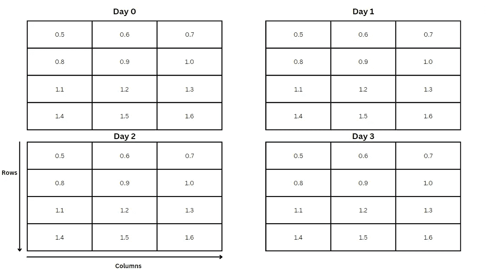

# 如何使用 Python 阅读和分析 GDAT 文件

> 原文：[`towardsdatascience.com/how-to-read-and-analyze-gdat-files-using-python-5c8dece157d4?source=collection_archive---------10-----------------------#2024-04-18`](https://towardsdatascience.com/how-to-read-and-analyze-gdat-files-using-python-5c8dece157d4?source=collection_archive---------10-----------------------#2024-04-18)

## 这是一份关于如何处理这些计算机建模的二进制文件的快速教程。

[](https://madison13.medium.com/?source=post_page---byline--5c8dece157d4--------------------------------)[](https://towardsdatascience.com/?source=post_page---byline--5c8dece157d4--------------------------------) [Madison Hunter](https://madison13.medium.com/?source=post_page---byline--5c8dece157d4--------------------------------)

·发布于 [Towards Data Science](https://towardsdatascience.com/?source=post_page---byline--5c8dece157d4--------------------------------) ·阅读时间 9 分钟·2024 年 4 月 18 日

--


图片来源：[Werclive 👹](https://unsplash.com/@werclive?utm_source=medium&utm_medium=referral) 于 [Unsplash](https://unsplash.com/?utm_source=medium&utm_medium=referral)

数据有各种形式和大小。

尽管我们中的许多人在数据教育和职业生涯中大部分时间都在处理相对“友好”的数据格式，如电子表格和 CSV 文件，但总有一天你可能会遇到一些不太友好的数据。你甚至可能无法直接从这些数据中进行可视化。

这最近发生在我身上，当时我运行的一个计算机模型输出了一个网格化的二进制格式数据。二进制文件的难点在于弄清楚如何读取它们，以便访问和分析其中的数据。在浏览互联网寻找解决方案后，我拼凑出了一个简单的 Python 函数，允许你读取网格化的二进制数据，然后可以使用你喜欢的 Python 库（如 matplotlib 或 NumPy）对其进行分析。

这个专业解决方案将帮助你读取由计算机模型生成的、具有 GDAT 文件扩展名的网格化二进制数据文件，特别是那些建模自然过程的文件，如环境或气象现象。因此，下面的代码假设以下几点：

+   你的 GDAT 文件遵循 [GrADS](http://cola.gmu.edu/grads/) 规范（尽管这也可能适用于其他各种二进制文件）。

+   你的 GDAT 文件表示在指定研究期间内一个网格化的研究区域。

+   在 GDAT 文件中，每一天的数据值都组成一个网格，覆盖指定的研究期间。

+   每个数据值网格中的单元格包含一个值的元组。

+   数据值的网格有固定的行列数，可用于索引单元格。



数据的网格化二进制表示，每个值的网格表示一个按天组织的研究区域（对应研究期内的每一天）。每个网格中的单元格可以通过行列索引来访问。图示由作者使用 [Canva](https://www.canva.com/) 创建。

# 读取二进制 GDAT 文件

```py
import struct

def read_gdat_file(file_path, format_string, number_rows, 
number_columns, number_days):
  data = []
  with open(file_path, 'rb') as f:
    for _ in range(number_days):
      day_data = []
        for _ in range(number_rows):
          row_data = []
          for _ in range(number_columns):
            value = struct.unpack(format_string, f.read(4))[0]
            row_data.append(value)
          day_data.append(row_data)
        data.append(day_data)
  return data
```

上述代码读取一个二进制 GDAT 文件，并将其数据结构化为类似于研究区域网格的形式，便于后续的解释和分析。

1.  **import struct**：[struct](https://docs.python.org/3/library/struct.html) 是一个 Python 模块，允许你处理二进制数据。该模块包含允许你将二进制数据转换为 Python 对象以及反向转换的函数。

1.  **def read_gdat_file(file_path, format_string, number_rows, number_columns, number_days):** 这一行定义了一个函数，用于读取二进制文件。为了使其正常工作，我们需要传入一些参数，详细描述正确 GDAT 文件的路径、GDAT 文件的格式类型、表示研究区域的行和列的数量，以及 GDAT 数据所覆盖的天数。知道 GDAT 文件中表示的天数，能够帮助该函数将二进制数据正确地划分为表示每一天研究区域所需的行和列，这有助于之后的数据分析。你应该能够在用于生成 GDAT 数据的计算机模型参数中找到天数、以及表示研究区域所需的行列数。

1.  **data = []**：这一行初始化一个空的 Python 列表，将用于存储最终网格格式的 GDAT 数据。

1.  **with open(file_path, ‘rb’) as f:** 这一行以读取模式（由**‘rb’** 参数指定）打开二进制文件，允许函数访问其中的数据。使用 **‘with’** 语句打开二进制文件，确保在访问完数据后自动关闭文件。

1.  **for _ in range(number_days):** 这个 for 循环遍历二进制数据，读取每一天的数据。在这个 for 循环（以及接下来的 for 循环）中，我选择使用下划线，因为这个变量不需要命名，因为我后续不会使用它。如果你的编程风格更喜欢，你也可以使用典型的迭代计数器变量，例如 **i** 或 **j**。

1.  **day_data = []**：这一行初始化一个空的 Python 列表，将用于存储每一天的二进制数据。它将包含与特定日期相关的所有行的二进制数据。

1.  **for _ in range(number_rows):** 这个 for 循环在指定日期内遍历指定数量的行。

1.  **row_data = []**：这一行初始化一个空的 Python 列表，将用于存储指定日期内当前行的二进制数据。

1.  **for _ in range(number_columns):** 这个 for 循环会遍历指定行中指定列数的数据。

1.  **value = struct.unpack(format_string, f.read(4))[0]**：这一行初始化了一个名为**value**的变量，并使用**struct**模块中的**unpack**函数，每次从 GDAT 文件中读取一定数量的二进制数据，并根据指定的**format_string**进行解析（阅读[“格式字符”](https://docs.python.org/3/library/struct.html)部分以了解需要指定的格式字符串）。**unpack**函数返回一个元组。在这一行代码中，**[0]**放在末尾，表示函数应该只返回元组中的第一个（在某些情况下是唯一的）值。如果每个单元格中包含一个有多个值的元组，则除非你只对其中一个单元格的值感兴趣，否则末尾无需加上**[0]**。例如，当单元格中的值包含 x 和 y 分量（例如风速）时，可能会有多个值的元组。

1.  **row_data.append(value):** 这一行将解包后的浮动值附加到**row_data**中，**row_data**代表当前行。

1.  **day_data.append(row_data):** 这一行将当前行附加到**day_data**中，**day_data**代表当前的一天。

1.  **data.append(day_data):** 这一行将当前一天的数据附加到**data**中，**data**代表整个数据集。

1.  **return data**：这个函数将继续遍历二进制数据文件，直到它将每一天的网格数据读取到整体数据集**data**中。这一行返回整体数据集，将二进制文件转换为 Python 列表。**data**返回的是按天划分的网格数据。现在可以对这个数据集进行分析了。

# 返回研究区域网格中特定单元格的整个研究期间的数据。

虽然你的计算机模型可能会生成一个大范围研究区域的数据，但你可能只对分析研究期间内网格中特定单元格的数据感兴趣。

比如说，你想看看计算机模型生成的风速值与观测的风速值之间的匹配度。存在一个气象站，它在某个特定单元格中提供风速观测数据。我们将提取该包含气象站的单元格数据，覆盖整个研究周期，之后你可以绘制观测数据与模型数据的对比图，以确定模型的准确度。

下面的 Python 函数使用了从之前的函数返回的 Python 列表数据。

```py
def read_cell_data_for_study_period(data, row_index, column_index):
  cell_data = []
  for day_data in data:
    reversed_day_data = day_data[::-1] #Optional
    cell_value = reversed_day_data[row_index][column_index]
    cell_data.append(cell_value)
  return cell_data
```

上述代码提取了整个研究期间内指定单元格的数据。

1.  **def read_cell_data_for_study_period(data, row_index, column_index)**：这一行定义了一个函数，该函数将使用行索引和列索引提取指定单元格的数据。**data**参数接收包含以最终网格格式存储的 GDAT 数据的列表（这是通过前面的函数创建的）。**row_index**和**column_index**参数接收指定单元格所在行和列的整数值。

1.  **cell_data = []**：这一行初始化了一个空的 Python 列表，用于存储整个研究期间的单元格数据。

1.  **for day_data in data:** 这个 for 循环遍历研究期间每一天的网格数据。

1.  **reversed_day_data = day_data[::-1]**：这一行是可选的，如果在打印指定研究期间的单元格数据时发现网格数据没有从正确的起始点读取，可以使用这一行。在大多数情况下，网格数据是从左上角读取的，因此是“0 索引”。然而，在某些情况下，网格数据是从左下角读取的。这种现象会导致网格索引错误，从而导致使用指定的**row_index**和**column_index**访问到错误的单元格。因此，这一行代码将网格数据垂直翻转，使其从左上角开始读取。**注意：此行代码只应在确定数据网格是从左下角读取时使用。如果你的数据网格被正确读取，避免使用此行以防止错误的数据读取。**

1.  **cell_value = reversed_day_data[row_index][column_index]**：这一行初始化了一个名为**cell_value**的变量，它将存储每一天研究期间指定行和列索引位置的单元格数据。如你所见，指定的**row_index**和**column_index**参数用于访问网格数据中的正确单元格。

1.  **cell_data.append(cell_value)**：这一行将当前一天的单元格数据添加到**cell_data**中，后者表示包含整个研究期间所有单元格值的整体列表。

1.  **return cell_data**：这个函数将继续遍历每一天的数据，并将指定单元格的值添加到名为**cell_data**的列表中。这一行返回该列表，之后你将能够打印并分析研究期间每一天的单元格值。

# 如何分析单元格数据的示例

```py
import struct
import matplotlib.pyplot as plt

#Function that reads the binary file (see above)
def read_gdat_file(file_path, format_string, number_rows, 
number_columns, number_days):
  data = []
  with open(file_path, 'rb') as f:
    for _ in range(number_days):
      day_data = []
        for _ in range(number_rows):
          row_data = []
          for _ in range(number_columns):
            value = struct.unpack('f', f.read(4))[0]
            row_data.append(value)
          day_data.append(row_data)
        data.append(day_data)
  return data

#Function that returns the data for a specific cell for the entire study
# period (see above)
def read_cell_data_for_study_period(data, row_index, column_index):
  cell_data = []
  for day_data in data:
    reversed_day_data = day_data[::-1] #Optional
    cell_value = reversed_day_data[row_index][column_index]
    cell_data.append(cell_value)
  return cell_data

#Specifying the file path to the binary file, wherever it's located
# on your system; also, specifying the format_string for the file.
file_path_binary_data = "file-path-binary-data.gdat"
format_string = 'f'

#Specifying the number of rows, columns, and days represented in the 
# binary file
number_rows_in_gridded_study_area = 45
number_columns_in_gridded_study_area = 108
number_days_in_study_period = 365

#Reading the binary file
data = read_gdat_file(
  file_path=file_path_binary_data, 
  format_string=format_string, 
  row_index=number_rows_in_gridded_study_area,
  column_index=number_columns_in_gridded_study_area,
  day_index=number_days_in_study_period)

#Specifying the day, row, and column index used to read the values from
# a specific cell. These index values must abide by the specified number
# of rows and columns in the study area (above).
day_index = 0
row_index = 30
column_index = 90

#Reading the cell data for each day in the study period
data_for_specific_cell_for_study_period = read_cell_data_for_study_period(
  data=data,
  row_index=row_index,
  column_index=column_index)

#Plotting the cell data for each day in the study period
plt.figure(figsize=(10,6))
plt.plot(1, len(data_for_specific_cell_for_study_period) +1), 
  data_for_specific_cell_for_study_period, 
  label='Simulated Data',
  color='blue')
plt.xlabel('Day')
plt.ylabel('Unit of simulated data')
plt.title('Simulated data at specified cell for study period')
plt.legend()
plt.show()
```

# 故障排除

+   阅读你的计算机模型文档，以了解其输出格式。这将帮助你确定从表示每个单元格的数据元组中提取哪些值，以及单元格数据的格式（例如浮点数等）。

+   如果可能，从您的 GDAT 文件创建 TIF 文件，并在 GIS 程序中打开它们。这将使您能够可视化您的网格数据，并检查用于读取每一天研究期间单元格数据的函数是否从左上角开始读取网格数据。

订阅以直接将我的故事发送到您的收件箱：[故事订阅](https://madison13.medium.com/subscribe)

请成为会员，通过我的推荐链接获得无限访问 Medium 的权限（您无需支付额外费用，我会收到少量佣金）：[Medium 会员](https://madison13.medium.com/membership)

订阅我的新闻通讯，获取更多带有环保主义视角的数据驱动内容：[DataDrivenEnvironmentalist](https://datadrivenenvironmentalist.substack.com/?r=1kyrup&utm_campaign=pub-share-checklist)
