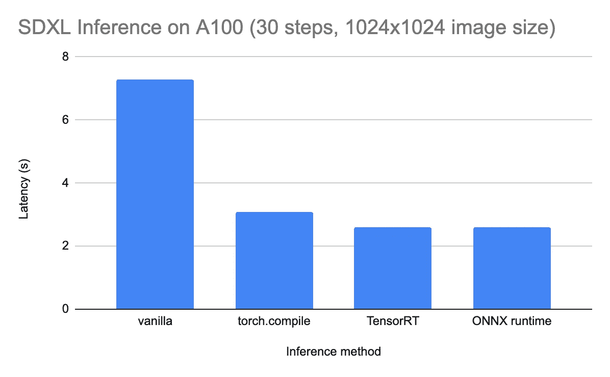

# 如何使用 ONNX 运行 Stable Diffusion

> 原文：[`towardsdatascience.com/how-to-run-stable-diffusion-with-onnx-dafd2d29cd14?source=collection_archive---------4-----------------------#2024-05-13`](https://towardsdatascience.com/how-to-run-stable-diffusion-with-onnx-dafd2d29cd14?source=collection_archive---------4-----------------------#2024-05-13)

## 解决安装过程中的兼容性问题 | ONNX 用于 NVIDIA GPU | Hugging Face 的 Optimum 库

[](https://medium.com/@turc.raluca?source=post_page---byline--dafd2d29cd14--------------------------------)[](https://towardsdatascience.com/?source=post_page---byline--dafd2d29cd14--------------------------------) [Julia Turc](https://medium.com/@turc.raluca?source=post_page---byline--dafd2d29cd14--------------------------------)

·发布于[Towards Data Science](https://towardsdatascience.com/?source=post_page---byline--dafd2d29cd14--------------------------------) ·12 分钟阅读·2024 年 5 月 13 日

--

本文讨论了[ONNX 运行时](https://onnxruntime.ai/)，这是加速 Stable Diffusion 推理的最有效方法之一。在 A100 GPU 上，运行 SDXL 进行 30 个去噪步骤生成 1024 x 1024 的图像，最快可以达到 2 秒。然而，ONNX 运行时依赖于多个动态组件，安装所有依赖项的正确版本在一个不断发展的生态系统中可能会变得很棘手。请将本文视为一份高级调试指南，我将在其中分享我的经验，希望能节省你的时间。尽管具体的版本和命令可能会很快过时，但高层次的概念应该在较长时间内保持相关性。



图片来自作者

# 什么是 ONNX？

ONNX 实际上可以指机器学习堆栈中的两个不同（但相关）部分：

1.  **ONNX 是一种用于存储机器学习模型的*格式*。** 它代表*开放神经网络交换*，正如其名字所示，它的主要目标是实现跨平台的互操作性。ONNX 是一个自包含的格式：它同时存储了模型的*权重*和*架构*。这意味着一个单独的.*onnx*文件包含了运行推理所需的所有信息。无需编写额外的代码来定义或加载模型；你只需将它传递给一个*运行时*（下面将进一步解释）。

1.  **ONNX 也是一个*运行时*，用于运行 ONNX 格式的模型**。它实际上*运行*模型。你可以把它看作是 ONNX 架构无关格式和实际运行推理的硬件之间的中介。每种受支持的加速器类型都有一个单独版本的运行时（请参见[完整列表](https://onnxruntime.ai/docs/execution-providers/#summary-of-supported-execution-providers)）。然而，请注意，ONNX 运行时并不是唯一可以运行 ONNX 格式模型的推理方法——它只是其中的一种方式。制造商可以选择构建针对其硬件进行超优化的自有运行时。例如，[NVIDIA 的 TensorRT](https://docs.nvidia.com/deeplearning/tensorrt/quick-start-guide/index.html)是 ONNX 运行时的替代方案。

本文聚焦于使用**ONNX 运行时**运行 Stable Diffusion 模型。虽然高层次的概念可能是永恒的，但请注意，机器学习工具生态系统在不断变化，因此确切的工作流或代码片段可能会过时（本文写于 2024 年 5 月）。我将特别关注 Python 实现，但请注意，ONNX 运行时也可以在[其他语言](https://onnxruntime.ai/docs/tutorials/api-basics)中运行，如 C++、C#、Java 或 JavaScript。

## ONNX 运行时的优点

+   **推理速度与互操作性的平衡**。虽然 ONNX 运行时并不总是适用于所有硬件类型的最快解决方案，但它对于*大多数*类型的硬件来说是一个*足够快*的解决方案。如果你在一个异构的机器集群上提供模型，并且没有资源对每个不同的加速器进行微调优化，这一点尤其具有吸引力。

+   **广泛的采用和可靠的作者支持**。ONNX 是由微软开源的，并且微软仍在维护它。它被广泛采用，并与更广泛的机器学习生态系统紧密集成。例如，Hugging Face 的[Optimum 库](https://huggingface.co/docs/optimum/en/index)允许你使用类似于其流行的 transformers 和 diffusers 库的语法来定义和运行 ONNX 模型管道。

## ONNX 运行时的缺点

+   **工程开销**。与直接在 PyTorch 中运行推理的替代方案相比，ONNX 运行时需要将你的模型编译为 ONNX 格式（对于 Stable Diffusion 模型，这可能需要 20-30 分钟），并安装运行时本身。

+   **受限的操作集**。ONNX 格式不支持所有 PyTorch 操作（它比[TorchScript](https://pytorch.org/docs/stable/jit.html)还要更具限制性）。如果你的模型使用了不受支持的操作，你将不得不重新实现相关部分，或者完全放弃 ONNX。

+   **脆弱的安装和设置**。由于 ONNX 运行时需要将 ONNX 格式转换为特定架构的指令，因此正确组合软件版本可能会有些棘手。例如，在 NVIDIA GPU 上运行时，你需要确保（1）操作系统，（2）CUDA 版本，（3）cuDNN 版本和（4）ONNX 运行时版本的兼容性。虽然有像[CUDA 兼容矩阵](https://onnxruntime.ai/docs/execution-providers/CUDA-ExecutionProvider.html)这样的有用资源，但你仍然可能会浪费几个小时去找到在某个特定时刻有效的“魔法组合”。

+   **硬件限制**。虽然 ONNX 运行时可以在[多种架构](https://onnxruntime.ai/docs/execution-providers/#summary-of-supported-execution-providers)上运行，但它不能像纯 PyTorch 模型那样在*所有*架构上运行。例如，目前（2024 年 5 月）没有对[Google Cloud TPUs](https://cloud.google.com/tpu?hl=en)或[AWS Inferentia](https://aws.amazon.com/machine-learning/inferentia/)芯片的支持（请参见[FAQ](https://awsdocs-neuron.readthedocs-hosted.com/en/latest/general/faq/onnx-faq.html)）。

初看之下，缺点列表似乎比优点列表长，但不要灰心——如后文所示，模型延迟的改进可能会非常显著，值得付出努力。

# 如何安装 ONNX 运行时

## 选项#1：从[源代码](https://github.com/microsoft/onnxruntime/tree/main)安装

如上所述，ONNX 运行时要求许多软件组件之间保持兼容。如果你想处于技术前沿，获得最新版本的最好方式是按照[官方 Github 仓库](https://github.com/microsoft/onnxruntime/tree/main)中的说明进行操作。特别是对于 Stable Diffusion，[这个文件夹](https://github.com/microsoft/onnxruntime/tree/main/onnxruntime/python/tools/transformers/models/stable_diffusion)包含了安装说明和生成图像的示例脚本。预计从源代码构建可能需要相当长的时间（大约 30 分钟）。

在撰写本文时（2024 年 5 月），这个解决方案在我的 Amazon EC2 实例（`g5.2xlarge`，配备 A10G GPU）上运行非常顺利。通过使用包含正确依赖项的 Docker 镜像，它避免了下面讨论的兼容性问题。

## 选项#2：通过 PyPI 安装

在生产环境中，你可能更希望从 PyPI 安装 ONNX 运行时的稳定版本，而不是从源代码安装最新版本。特别是对于 Python，有两个不同的库（一个用于 CPU，一个用于 GPU）。这是为 CPU 安装的命令：

```py
pip install onnxruntime
```

这是为 GPU 安装 ONNX 运行时的命令：

```py
pip install onnxruntime-gpu
```

**你绝不能同时安装两者**。同时安装这两个版本可能会导致错误信息或行为，这些错误或行为不容易追溯到根本原因。ONNX 运行时可能根本无法识别 GPU 的存在，尽管`onnxruntime-gpu`确实已经安装。

# 解决兼容性问题

在理想的情况下，`pip install onnxruntime-gpu`应该是整个过程的结束。然而，实际上，你的机器上的其他软件（包括操作系统、硬件特定的驱动程序和 Python 版本）之间有很强的兼容性要求。

假设你想使用当前写作时最新的 ONNX 运行时版本（1.17.1）。那么我们需要对齐哪些关键因素才能实现这一目标？

以下是一些最常见的兼容性问题，可以帮助你设置环境。具体细节很快会过时，但高层次的思路应该在一段时间内继续适用。

## CUDA 兼容性

如果你不打算使用 NVIDIA GPU，可以跳过这一部分。CUDA 是一个并行计算平台，位于 NVIDIA GPU 之上，机器学习工作流需要它。ONNX 运行时的每个版本仅与某些 CUDA 版本兼容，正如你在[这个兼容性矩阵](https://onnxruntime.ai/docs/execution-providers/CUDA-ExecutionProvider.html)中看到的。

根据这个矩阵，最新的 ONNX 运行时版本（1.17）与 CUDA 11.8 和 CUDA 12 兼容。但你需要注意细节：**默认情况下，ONNX 运行时 1.17 期望使用 CUDA 11.8**。然而，今天的大多数虚拟机（截至 2024 年 5 月）都配备了 CUDA 12.1（你可以通过运行`nvcc --version`来检查版本）。对于这种特定的设置，你必须用以下命令替换常规的`pip install onnxruntime-gpu`：

```py
pip install onnxruntime-gpu==1.17.1 --extra-index-url https://aiinfra.pkgs.visualstudio.com/PublicPackages/_packaging/onnxruntime-cuda-12/pypi/simple/
```

请注意，与其任由你机器上安装的 CUDA 版本决定一切，不如在 Docker 容器内进行工作。你只需选择一个包含所需 Python 和 CUDA 版本的镜像。例如：

```py
docker run --rm -it --gpus all nvcr.io/nvidia/pytorch:23.10-py3
```

## 操作系统 + Python + pip 兼容性

本节讨论的是与架构无关的兼容性问题（即，无论目标加速器是什么，你都会遇到这些问题）。本质上就是确保你的软件（操作系统、Python 安装和`pip`安装）与你所需版本的 ONNX 运行时库兼容。

**Pip 版本：**除非你正在处理遗留代码或系统，否则最安全的做法是将`pip`升级到最新版本：

```py
python -m pip install --upgrade pip
```

**Python 版本：**截至 2024 年 5 月，最不容易引发问题的 Python 版本是 3.10（这是大多数虚拟机默认配备的版本）。同样，除非你正在处理遗留代码，否则你肯定至少需要 3.8（因为 3.7 已于 2023 年 6 月弃用）。

**操作系统：**操作系统版本也可能妨碍你安装所需库的能力，这让我颇为惊讶，尤其是我使用的是最标准的 EC2 实例。而且，我并没有直接发现是操作系统版本导致的问题。

在这里，我将带你了解我的调试过程，希望这个工作流比今天的版本细节更持久。首先，我使用以下命令安装了 `onnxruntime-gpu`（因为我的机器上安装了 CUDA 12.1）：

```py
pip install onnxruntime-gpu --extra-index-url https://aiinfra.pkgs.visualstudio.com/PublicPackages/_packaging/onnxruntime-cuda-12/pypi/simple/
```

从表面上看，这应该安装 PyPI 上可用的最新版本。但实际上，这将安装与你当前设置（操作系统 + Python 版本 + pip 版本）兼容的最新版本。对我来说，当时那个版本是 `onnxruntime-gpu==1.16.0`（而不是最新的 1.17.1）。无意中安装旧版本最终导致 ONNX 运行时无法检测到 GPU，且没有其他提示。在偶然发现版本较旧后，我明确要求安装更新的版本：

```py
pip install onnxruntime-gpu==1.17.1 --extra-index-url https://aiinfra.pkgs.visualstudio.com/PublicPackages/_packaging/onnxruntime-cuda-12/pypi/simple/
```

这导致了 `pip` 发出一个消息，抱怨我请求的版本实际上不可用（尽管它在[PyPI 上列出](https://pypi.org/project/onnxruntime-gpu/1.17.1/)）：

```py
ERROR: Could not find a version that satisfies the requirement onnxruntime-gpu==1.17.1 (from versions: 1.12.0, 1.12.1, 1.13.1, 1.14.0, 1.14.1, 1.15.0, 1.15.1, 1.16.0, 1.16.1, 1.16.2, 1.16.3)
ERROR: No matching distribution found for onnxruntime-gpu==1.17.1
```

要了解为什么最新版本未能安装，你可以传递一个标志来让 `pip` 输出详细信息：`pip install ... -vvv`。这将显示 `pip` 在查找与系统兼容的最新版本时所遍历的所有 Python wheel 文件。以下是我看到的输出：

```py
Skipping link: none of the wheel's tags (cp35-cp35m-manylinux1_x86_64) are compatible (run pip debug --verbose to show compatible tags): https://files.pythonhosted.org/packages/26/1a/163521e075d2e0c3effab02ba11caba362c06360913d7c989dcf9506edb9/onnxruntime_gpu-0.1.2-cp35-cp35m-manylinux1_x86_64.whl (from https://pypi.org/simple/onnxruntime-gpu/)
Skipping link: none of the wheel's tags (cp36-cp36m-manylinux1_x86_64) are compatible (run pip debug --verbose to show compatible tags): https://files.pythonhosted.org/packages/52/f2/30aaa83bc9e90e8a919c8e44e1010796eb30f3f6b42a7141ffc89aba9a8e/onnxruntime_gpu-0.1.2-cp36-cp36m-manylinux1_x86_64.whl (from https://pypi.org/simple/onnxruntime-gpu/)
Skipping link: none of the wheel's tags (cp37-cp37m-manylinux1_x86_64) are compatible (run pip debug --verbose to show compatible tags): https://files.pythonhosted.org/packages/a2/05/af0481897255798ee57a242d3989427015a11a84f2eae92934627be78cb5/onnxruntime_gpu-0.1.2-cp37-cp37m-manylinux1_x86_64.whl (from https://pypi.org/simple/onnxruntime-gpu/)
Skipping link: none of the wheel's tags (cp35-cp35m-manylinux1_x86_64) are compatible (run pip debug --verbose to show compatible tags): https://files.pythonhosted.org/packages/17/cb/0def5a44db45c6d38d95387f20057905ce2dd4fad35c0d43ee4b1cebbb19/onnxruntime_gpu-0.1.3-cp35-cp35m-manylinux1_x86_64.whl (from https://pypi.org/simple/onnxruntime-gpu/)
Skipping link: none of the wheel's tags (cp36-cp36m-manylinux1_x86_64) are compatible (run pip debug --verbose to show compatible tags): https://files.pythonhosted.org/packages/a6/53/0e733ebd72d7dbc84e49eeece15af13ab38feb41167fb6c3e90c92f09cbb/onnxruntime_gpu-0.1.3-cp36-cp36m-manylinux1_x86_64.whl (from [`pypi.org/simple/onnxruntime-gpu/)`](https://pypi.org/simple/onnxruntime-gpu/))
...
```

方括号中的标签是 *Python 平台兼容性标签*，你可以在[这里](https://packaging.python.org/en/latest/specifications/platform-compatibility-tags/)查看更多信息。简而言之，每个 Python wheel 都带有一个标签，指示它可以运行的系统。例如，`cp35-cp35m-manylinux1_x86_64` 需要 CPython 3.5，一个包含在 `manylinux1` 范围内的（较旧的）Linux 发行版，以及一个 64 位 x86 兼容处理器。

由于我想在一台 Linux 机器上运行 Python 3.10（因此筛选了 `cp310.*manylinux.*`），我只剩下一个可能的 `onnxruntime-gpu` 库的 wheel 文件，其标签如下：

```py
cp310-cp310-manylinux_2_28_x86_64
```

你可以通过运行 `pip debug --verbose` 来获取与系统兼容的标签列表。以下是我输出的一部分：

```py
cp310-cp310-manylinux_2_26_x86_64
cp310-cp310-manylinux_2_25_x86_64
cp310-cp310-manylinux_2_24_x86_64
cp310-cp310-manylinux_2_23_x86_64
cp310-cp310-manylinux_2_22_x86_64
cp310-cp310-manylinux_2_21_x86_64
cp310-cp310-manylinux_2_20_x86_64
cp310-cp310-manylinux_2_19_x86_64
cp310-cp310-manylinux_2_18_x86_64
cp310-cp310-manylinux_2_17_x86_64
...
```

换句话说，我的操作系统稍微有些旧（它支持的最大 linux 标签是 `manylinux_2_26`，而 `onnxruntime-gpu` 库的唯一 Python 3.10 wheel 需要 `manylinux_2_28`）。从 Ubuntu 20.04 升级到 Ubuntu 24.04 解决了这个问题。

# 如何使用 ONNX 运行时运行 Stable Diffusion

一旦 ONNX 运行时（终于）安装完成，使用 Stable Diffusion 生成图像需要以下两个步骤：

1.  将 PyTorch 模型导出为 ONNX（这可能需要超过 30 分钟！）

1.  将 ONNX 模型和输入（文本提示和其他参数）传递给 ONNX 运行时。

## 选项 #1：使用微软的官方脚本

如前所述，直接使用 ONNX 运行时仓库中的 [官方示例脚本](https://github.com/microsoft/onnxruntime/tree/main/onnxruntime/python/tools/transformers/models/stable_diffusion) 对我来说是开箱即用的。如果按照他们的安装说明进行操作，你甚至不需要处理上述提到的兼容性问题。安装完成后，生成图像就像下面这样简单：

```py
python3 demo_txt2img_xl.py "starry night over Golden Gate Bridge by van gogh"
```

在幕后，这个脚本使用 Hugging Face 的 [diffusers](https://huggingface.co/docs/diffusers/en/index) 库定义了一个 SDXL 模型，并将其导出为 ONNX 格式（这可能需要多达 30 分钟！），然后调用 ONNX 运行时。

## 选项 #2：使用 Hugging Face 的 [Optimum](https://huggingface.co/docs/optimum/en/index) 库

[Optimum](https://huggingface.co/docs/optimum/en/index) 库承诺提供很多便利，它允许你在各种加速器上运行模型，同时使用来自知名的 transformers 和 diffusers 库的熟悉管道 API。特别是对于 ONNX，以下是 SDXL 推理代码的样子（更多内容请见 [本教程](https://huggingface.co/docs/optimum/onnxruntime/usage_guides/models#text-to-image)）：

```py
from optimum.onnxruntime import ORTStableDiffusionXLPipeline

model_id = "stabilityai/stable-diffusion-xl-base-1.0"
base = ORTStableDiffusionXLPipeline.from_pretrained(model_id)
prompt = "sailing ship in storm by Leonardo da Vinci"
image = base(prompt).images[0]

# Don't forget to save the ONNX model
save_directory = "sd_xl_base"
base.save_pretrained(save_directory)
```

然而在实践中，我在使用 Optimum 库时遇到了很多困难。首先，安装并不简单；如果仅仅按照 [README 文件](https://github.com/huggingface/optimum)中的安装说明操作，就会遇到上述的不兼容问题。这本身不是 Optimum 的问题，但它确实为已经脆弱的环境增加了另一个抽象层。Optimum 的安装可能会拉取一个与你当前设置不兼容的 `onnxruntime` 版本。

即使我在兼容性问题上取得了胜利，我仍然无法通过 Optimum 的 ONNX 接口在 GPU 上运行 SDXL 推理。上面的代码片段（直接来自 Hugging Face 教程）因形状不匹配而失败，这可能是因为 PyTorch → ONNX 转换中的 bug：

```py
[ONNXRuntimeError] : 1 : FAIL : Non-zero status code returned while running Add node.
Name:'/down_blocks.1/attentions.0/Add'
Status Message: /down_blocks.1/attentions.0/Add: left operand cannot broadcast on dim 3 LeftShape: {2,64,4096,10}, RightShape: {2,640,64,64}
```

有那么一瞬间，我考虑过深入研究并调试 Hugging Face 的代码（至少它是开源的！），但当我意识到 Optimum 存在着 [超过 250 个问题](https://github.com/huggingface/optimum/issues)，且这些问题有时几个星期都没有得到 Hugging Face 团队的回应时，我决定放弃，转而直接使用微软的官方脚本。

# 延迟减少

正如承诺的那样，花时间让 ONNX 运行时工作是值得的。在 A100 GPU 上，推理时间从 7-8 秒（运行原版 PyTorch 时）缩短到 ~2 秒。这与 [TensorRT](https://developer.nvidia.com/tensorrt-getting-started)（NVIDIA 针对 ONNX 的替代方案）相当，并且比 [torch.compile](https://pytorch.org/tutorials/intermediate/torch_compile_tutorial.html)（PyTorch 的本地 JIT 编译）快大约 1 秒。


作者提供的图片

据报道，切换到更高效的 GPU（例如 H100）可以通过使用专用的运行时来获得更高的性能提升。[链接](https://www.baseten.co/blog/sdxl-inference-in-under-2-seconds-the-ultimate-guide-to-stable-diffusion-optimiza/)

# 结论与进一步阅读

ONNX 运行时承诺显著减少延迟，但也带来了不小的工程开销。它还面临着静态编译的经典权衡：推理速度大幅提升，但图形无法动态修改（这与像[peft](https://huggingface.co/docs/peft/en/index)这样的动态适配器相冲突）。ONNX 运行时和类似的编译方法值得在你完成实验阶段并准备投入高效生产代码时加入到你的工作流程中。

如果你对优化推理时间感兴趣，以下是我认为有帮助的一些文章：

+   [SDXL 推理不到 2 秒：Stable Diffusion 优化的终极指南](https://www.baseten.co/blog/sdxl-inference-in-under-2-seconds-the-ultimate-guide-to-stable-diffusion-optimiza/)

+   [通过 NVIDIA TensorRT 使 Stable Diffusion XL 推理速度提升 40%](https://www.baseten.co/blog/40-faster-stable-diffusion-xl-inference-with-nvidia-tensorrt/)

+   [通过 TensorRT 解锁 NVIDIA H100 GPU 在机器学习推理中的全部潜力](https://www.baseten.co/blog/unlocking-the-full-power-of-nvidia-h100-gpus-for-ml-inference-with-tensorrt/)

+   [通过 TensorRT 使 Stable Diffusion 加速 25%](https://www.photoroom.com/inside-photoroom/stable-diffusion-25-percent-faster-and-save-seconds)

+   [通过 AWS Inferentia2 最大化 Stable Diffusion 性能并降低推理成本](https://aws.amazon.com/blogs/machine-learning/maximize-stable-diffusion-performance-and-lower-inference-costs-with-aws-inferentia2/)

+   [在 AWS Inferentia 上使用 Stable Diffusion 模型生成图像](https://huggingface.co/docs/optimum-neuron/en/tutorials/stable_diffusion)

+   [使用 Stable Diffusion 和 OpenVINO 进行文本到图像生成](https://docs.openvino.ai/2022.3/notebooks/225-stable-diffusion-text-to-image-with-output.html)

+   [加速 Intel CPU 上的 Stable Diffusion 推理](https://github.com/huggingface/blog/blob/main/stable-diffusion-inference-intel.md)
