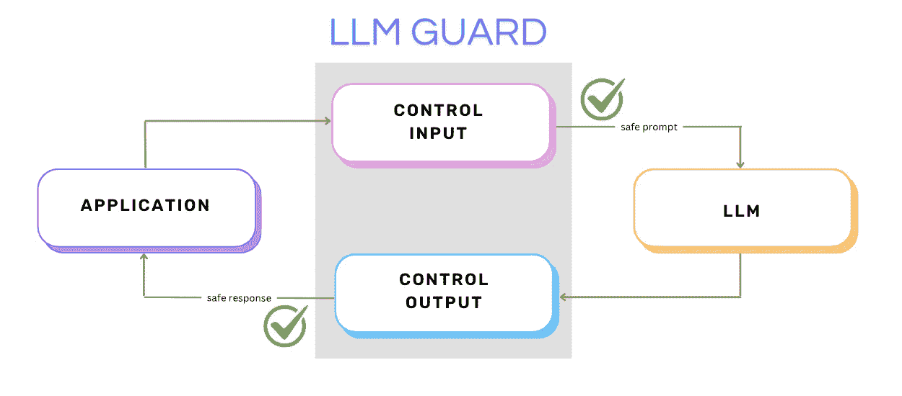
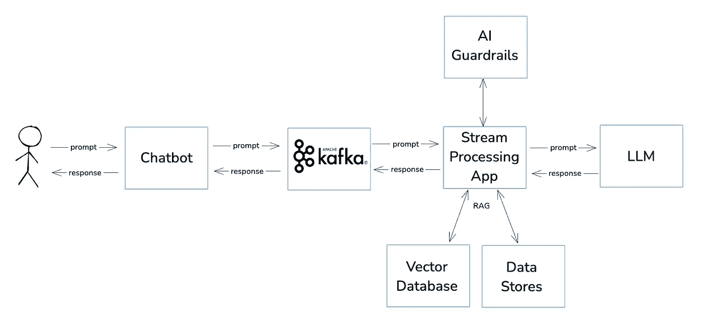
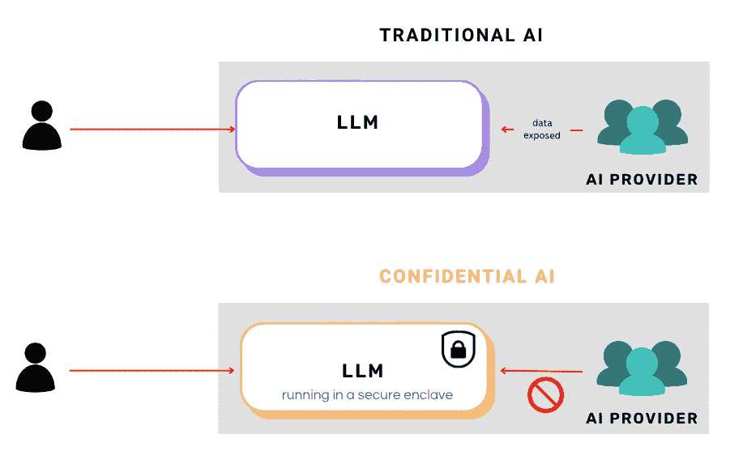

# 如何通过结合 Kafka 和 AI 防护栏取得 AI 成功

> 原文：[`towardsdatascience.com/how-to-succeed-with-ai-combining-kafka-and-ai-guardrails-536124d4fb54?source=collection_archive---------11-----------------------#2024-10-03`](https://towardsdatascience.com/how-to-succeed-with-ai-combining-kafka-and-ai-guardrails-536124d4fb54?source=collection_archive---------11-----------------------#2024-10-03)

## 为什么实时数据和治理对 AI 是不可妥协的

 [Stéphane Derosiaux](https://sderosiaux.medium.com/?source=post_page---byline--536124d4fb54--------------------------------)

·发表于 [Towards Data Science](https://towardsdatascience.com/?source=post_page---byline--536124d4fb54--------------------------------) ·阅读时间：5 分钟 ·2024 年 10 月 3 日

—

图片来自 [Sid Verma](https://unsplash.com/@sidverma?utm_source=medium&utm_medium=referral) 提供的 [Unsplash](https://unsplash.com/?utm_source=medium&utm_medium=referral)

Kafka 很棒，AI 也很棒。当我们将两者结合时，会发生什么？**连续性**。

—

AI 正在改变我们效率和运营方式的许多方面：极致的翻译、客户互动、代码生成器、自动驾驶等。即使我们热爱前沿技术，我们也都在艰难地跟上它的发展。

有一个我们常常忽略的巨大问题：没有适当的**防护栏**，AI 容易脱轨。而当它脱轨时，这不仅仅是一个技术故障，它可能导致企业遭遇灾难性后果。

以我作为首席技术官的个人经验来看，我亲眼见证了真正的 AI 成功不仅仅来自于速度。它来自于**控制**——对 AI 所使用数据的控制，对 AI 操作方式的控制，并确保它不会输出错误的结果（下面会详细讲解）。

成功的另一部分是最大化 AI 的潜力和影响力。这就是**Kafka**和数据流在其中扮演的重要角色。

AI 防护栏和 Kafka 是扩大安全、合规且可靠的 AI 的关键。

## 没有防护栏的 AI 就像一本打开的书

处理 AI 时最大的风险之一是缺乏内建的治理机制。当你依赖 AI/LLMs 来自动化流程、与客户交流、处理敏感数据或做决策时，你正在为一系列风险打开大门：

+   数据泄漏（以及我们习惯看到的提示泄漏）

+   隐私泄露和合规性违规

+   数据偏见和歧视

+   超出领域的提示

+   不良决策

记得 2023 年 3 月吗？[OpenAI 发生了一起事件](https://openai.com/index/march-20-chatgpt-outage/)，一个漏洞导致聊天数据暴露给了其他用户。最重要的一点是，大型语言模型（LLM）并没有内建的安全性、身份验证或授权控制。LLM 就像一本巨大的开放书籍——任何访问它的人都可能检索到不该获得的信息。这就是为什么你需要一个强大的控制和上下文层来管理访问、验证输入，并确保敏感数据保持安全。

这就是 AI 护栏（例如[Nemo](https://github.com/NVIDIA/NeMo-Guardrails)（由 Nvidia 开发）和[LLM Guard](https://llm-guard.com/)）发挥作用的地方。它们对 LLM 的输入和输出提供了必要的检查：

+   提示注入

+   筛选有偏见或有害的内容

+   确保**个人数据**不会从缝隙中漏出。

+   脱离上下文的提示

+   越狱

图片来自作者

[`github.com/leondz/garak`](https://github.com/leondz/garak/)是一个 LLM 漏洞扫描工具。它检查 LLM 是否可能在我们不希望的情况下失败。它会探测幻觉、数据泄露、提示注入、错误信息、有害生成、越狱等许多其他漏洞。

## 这与 Kafka 有什么关联？

Kafka 是一个开源平台，旨在处理组织内部的实时数据流和共享。而 AI 需要依赖实时数据才能保持有用性！

给 AI 输入静态的、过时的数据集是失败的根源——它只能运行到某个程度，之后就没有最新信息了。想想 ChatGPT 总是有一个“截止”日期，停留在过去。如果在客户支持时，例如 AI 没有客户最新的发票，那么它就无法解答客户的问题，因为数据已经过时。

像 RAG（检索增强生成）这样的方式通过在交互中提供相关的实时信息来解决这个问题。RAG 的工作原理是通过“增强”提示内容，加入额外的上下文，LLM 再处理这些内容生成更有用的回答。

猜猜 RAG 通常与什么配对使用？**Kafka**。还有什么比这更好的解决方案，用于获取实时信息并将其无缝整合到 LLM 中？Kafka 持续流式传输新鲜数据，可以通过前端简单的 HTTP API 与 LLM 结合。一个关键方面是确保 Kafka 中流式传输的数据质量得到控制：不能有不良数据进入管道（数据验证），否则它会在你的 AI 流程中传播：输出不准确、决策有偏见、安全漏洞。

结合 Kafka、AI 护栏和 RAG 的典型流媒体架构：

图片来自作者

[Gartner 预测，到 2025 年](https://www.gartner.com/en/documents/3868267)，利用 AI 和自动化的组织将把运营成本降低最多 30%。更快、更智能。

## 我们应该关注 AI 主权吗？是的。

AI 主权关系到确保你完全控制 AI 的运行位置、数据如何被摄取、处理以及谁能访问它。这不仅仅是关于软件，还是关于硬件以及事情发生的物理位置。

**主权关系到虚拟的、物理的基础设施以及你数据所在的地理边界。** 我们生活在一个物理世界中，尽管人工智能看似无形，但它受现实世界法规的约束。

例如，根据你的 AI 基础设施托管的位置，不同的司法管辖区可能要求访问你的数据（例如美国！），即使这些数据是由 AI 模型处理的。这就是为什么确保主权意味着不仅要控制代码，还要控制处理发生的物理硬件和环境。

像**英特尔 SGX**（软件保护扩展）和**AMD SEV**（安全加密虚拟化）这样的技术提供了这种保护。它们创建了隔离的执行环境，保护敏感数据和代码，甚至防范来自宿主系统内部的潜在威胁。像[Mithril Security](https://www.mithrilsecurity.io/)这样的解决方案也在不断提升，提供保密 AI，确保 AI 提供商无法访问其大型语言模型（LLM）处理的数据。

作者提供的图片

# 结论

很明显，AI 防护机制和 Kafka 流处理是使依赖 AI 的用例成功的基础。没有 Kafka，AI 模型只能在过时的数据上运行，这使得它们不可靠且不太有用。而没有 AI 防护机制，AI 就可能犯下危险的错误——危及隐私、安全和决策质量。

这个公式是保持 AI 正常运作和控制的关键。没有它，风险实在是太大了。
