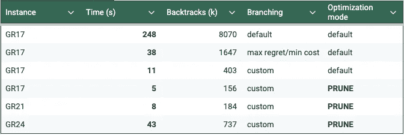

# 如何使用约束编程解决优化问题

> 原文：[`towardsdatascience.com/how-to-tackle-an-optimization-problem-with-constraint-programming-9ae77b4d803d?source=collection_archive---------2-----------------------#2024-12-23`](https://towardsdatascience.com/how-to-tackle-an-optimization-problem-with-constraint-programming-9ae77b4d803d?source=collection_archive---------2-----------------------#2024-12-23)

## 案例研究：旅行推销员问题

[](https://medium.com/@yangeorget?source=post_page---byline--9ae77b4d803d--------------------------------)[](https://towardsdatascience.com/?source=post_page---byline--9ae77b4d803d--------------------------------) [Yan Georget](https://medium.com/@yangeorget?source=post_page---byline--9ae77b4d803d--------------------------------)

·发表于[Towards Data Science](https://towardsdatascience.com/?source=post_page---byline--9ae77b4d803d--------------------------------) ·阅读时间 8 分钟·2024 年 12 月 23 日

--

# TLDR

约束编程是一种解决约束满足问题的首选技术。本文将展示它如何适用于小型到中型的优化问题。以广为人知的[旅行推销员问题](https://en.wikipedia.org/wiki/Travelling_salesman_problem)（TSP）为例，我们将详细说明所有步骤，带你走向一个高效的模型。

为了简化起见，我们将考虑 TSP 的对称情况（两个城市之间的距离在任何反方向上是相同的）。

本文中的所有代码示例使用了[NuCS](https://github.com/yangeorget/nucs)，这是我目前作为副项目正在开发的一个用 100% Python 编写的快速约束求解器。NuCS 发布在[MIT 许可证](https://github.com/yangeorget/nucs/blob/main/LICENSE.md)下。

# 对称旅行推销员问题

引用自维基百科：

> 给定一个城市列表和每对城市之间的距离，如何找到一条最短的路线，访问每个城市一次并返回到起始城市？


[来源：维基百科](https://fr.wikipedia.org/wiki/Probl%C3%A8me_du_voyageur_de_commerce#/media/Fichier:TSP_Deutschland_3.png)

这是一个 NP 难问题。从现在开始，假设有*n*个城市。

这个问题最简单的表述方式是，对于城市之间每条可能的边，决定它是否属于最优解。搜索空间的大小为***2ⁿ⁽ⁿ⁻¹⁾*ᐟ²**，对于*n=30*时大约为*8.8e130*（远大于宇宙中的原子数）。

对每个城市找到其后继是更好的选择。复杂度变为 ***n!***，对于 *n=30*，大约是 *2.6e32*（虽然更小，但仍然非常大）。

在接下来的部分，我们将使用以下小型 TSP 实例对我们的模型进行基准测试：[GR17, GR21 和 GR24](https://github.com/yangeorget/nucs/blob/main/nucs/examples/tsp/tsp_instances.py)。

GR17 是一个 *17* 个节点的对称 TSP，其费用由 *17 x 17* 的对称矩阵定义：

```py
[
    [0, 633, 257, 91, 412, 150, 80, 134, 259, 505, 353, 324, 70, 211, 268, 246, 121],
    [633, 0, 390, 661, 227, 488, 572, 530, 555, 289, 282, 638, 567, 466, 420, 745, 518],
    [257, 390, 0, 228, 169, 112, 196, 154, 372, 262, 110, 437, 191, 74, 53, 472, 142],
    [91, 661, 228, 0, 383, 120, 77, 105, 175, 476, 324, 240, 27, 182, 239, 237, 84],
    [412, 227, 169, 383, 0, 267, 351, 309, 338, 196, 61, 421, 346, 243, 199, 528, 297],
    [150, 488, 112, 120, 267, 0, 63, 34, 264, 360, 208, 329, 83, 105, 123, 364, 35],
    [80, 572, 196, 77, 351, 63, 0, 29, 232, 444, 292, 297, 47, 150, 207, 332, 29],
    [134, 530, 154, 105, 309, 34, 29, 0, 249, 402, 250, 314, 68, 108, 165, 349, 36],
    [259, 555, 372, 175, 338, 264, 232, 249, 0, 495, 352, 95, 189, 326, 383, 202, 236],
    [505, 289, 262, 476, 196, 360, 444, 402, 495, 0, 154, 578, 439, 336, 240, 685, 390],
    [353, 282, 110, 324, 61, 208, 292, 250, 352, 154, 0, 435, 287, 184, 140, 542, 238],
    [324, 638, 437, 240, 421, 329, 297, 314, 95, 578, 435, 0, 254, 391, 448, 157, 301],
    [70, 567, 191, 27, 346, 83, 47, 68, 189, 439, 287, 254, 0, 145, 202, 289, 55],
    [211, 466, 74, 182, 243, 105, 150, 108, 326, 336, 184, 391, 145, 0, 57, 426, 96],
    [268, 420, 53, 239, 199, 123, 207, 165, 383, 240, 140, 448, 202, 57, 0, 483, 153],
    [246, 745, 472, 237, 528, 364, 332, 349, 202, 685, 542, 157, 289, 426, 483, 0, 336],
    [121, 518, 142, 84, 297, 35, 29, 36, 236, 390, 238, 301, 55, 96, 153, 336, 0],
]
```

我们来看看第一行：

*[0, 633, 257, 91, 412, 150, 80, 134, 259, 505, 353, 324, 70, 211, 268, 246, 121]*

这些是节点 *0* 在电路中可能的后继的费用。如果排除第一个值 *0*（我们不希望节点 *0* 的后继是节点 *0*），那么最小值是 *70*（当节点 *12* 是节点 *0* 的后继时），最大值是 *633*（当节点 *1* 是节点 *0* 的后继时）。这意味着节点 *0* 在电路中的后继的费用范围在 *70* 和 *633* 之间。

# 建模 TSP

我们将通过重用 NuCS 中现成的 [**CircuitProblem**](https://github.com/yangeorget/nucs/blob/main/nucs/problems/circuit_problem.py) 来建模我们的任务。但让我们首先了解一下幕后发生了什么。**CircuitProblem** 本身是 [**Permutation**](https://github.com/yangeorget/nucs/blob/main/nucs/problems/permutation_problem.py) 问题的子类，后者是 NuCS 提供的另一个现成模型。

## 排列问题

排列问题定义了两个冗余的模型：后继模型和前驱模型。

```py
 def __init__(self, n: int):
        """
        Inits the permutation problem.
        :param n: the number variables/values
        """
        self.n = n
        shr_domains = [(0, n - 1)] * 2 * n
        super().__init__(shr_domains)
        self.add_propagator((list(range(n)), ALG_ALLDIFFERENT, []))
        self.add_propagator((list(range(n, 2 * n)), ALG_ALLDIFFERENT, []))
        for i in range(n):
            self.add_propagator((list(range(n)) + [n + i], ALG_PERMUTATION_AUX, [i]))
            self.add_propagator((list(range(n, 2 * n)) + [i], ALG_PERMUTATION_AUX, [i]))
```

后继模型（前 n 个变量）为每个节点定义了其在电路中的后继。后继必须不同。前驱模型（后 n 个变量）为每个节点定义了其在电路中的前驱。前驱必须不同。

这两个模型通过规则相连接（请参见 *ALG_PERMUTATION_AUX* 约束）：

+   如果 *succ[i] = j* 那么 *pred[j] = i*

+   如果 *pred[j] = i* 那么 *succ[i] = j*

+   如果 *pred[j] ≠ i* 那么 *succ[i] ≠ j*

+   如果 *succ[i] ≠ j* 那么 *pred[j] ≠ i*

## 电路问题

电路问题细化了后继和前驱节点的领域，并增加了额外的约束以禁止子环（为了简洁起见，我们在此不详细讨论）。

```py
 def __init__(self, n: int):
        """
        Inits the circuit problem.
        :param n: the number of vertices
        """
        self.n = n
        super().__init__(n)
        self.shr_domains_lst[0] = [1, n - 1]
        self.shr_domains_lst[n - 1] = [0, n - 2]
        self.shr_domains_lst[n] = [1, n - 1]
        self.shr_domains_lst[2 * n - 1] = [0, n - 2]
        self.add_propagator((list(range(n)), ALG_NO_SUB_CYCLE, []))
        self.add_propagator((list(range(n, 2 * n)), ALG_NO_SUB_CYCLE, []))
```

## TSP 模型

在电路问题的帮助下，建模 TSP 是一项简单的任务。

假设我们考虑一个节点 *i*，如前所述，*costs[i]* 是节点 *i* 的后继可能费用的列表。如果 *j* 是 *i* 的后继，那么相关费用是 *costs[i]ⱼ*。这通过以下代码实现，其中 *succ_costs* 是后继费用的起始索引：

```py
self.add_propagators([([i, self.succ_costs + i], ALG_ELEMENT_IV, costs[i]) for i in range(n)])
```

对称地，对于前驱的费用，我们得到：

```py
self.add_propagators([([n + i, self.pred_costs + i], ALG_ELEMENT_IV, costs[i]) for i in range(n)])
```

最后，我们可以通过将中间费用求和来定义总费用，得到：

```py
 def __init__(self, costs: List[List[int]]) -> None:
        """
        Inits the problem.
        :param costs: the costs between vertices as a list of lists of integers
        """
        n = len(costs)
        super().__init__(n)
        max_costs = [max(cost_row) for cost_row in costs]
        min_costs = [min([cost for cost in cost_row if cost > 0]) for cost_row in costs]
        self.succ_costs = self.add_variables([(min_costs[i], max_costs[i]) for i in range(n)])
        self.pred_costs = self.add_variables([(min_costs[i], max_costs[i]) for i in range(n)])
        self.total_cost = self.add_variable((sum(min_costs), sum(max_costs)))  # the total cost
        self.add_propagators([([i, self.succ_costs + i], ALG_ELEMENT_IV, costs[i]) for i in range(n)])
        self.add_propagators([([n + i, self.pred_costs + i], ALG_ELEMENT_IV, costs[i]) for i in range(n)])
        self.add_propagator(
            (list(range(self.succ_costs, self.succ_costs + n)) + [self.total_cost], ALG_AFFINE_EQ, [1] * n + [-1, 0])
        )
        self.add_propagator(
            (list(range(self.pred_costs, self.pred_costs + n)) + [self.total_cost], ALG_AFFINE_EQ, [1] * n + [-1, 0])
        )
```

请注意，并不一定需要同时拥有后继和前驱模型（其中一个就足够了），但同时拥有它们效率更高。

# 分支

让我们使用 **BacktrackSolver** 的默认分支策略，我们的决策变量将是后继节点和前驱节点。

```py
solver = BacktrackSolver(problem, decision_domains=decision_domains)
solution = solver.minimize(problem.total_cost)
```

在一台运行 Python 3.12、Numpy 2.0.1、Numba 0.60.0 和 NuCS 4.2.0 的 MacBook Pro M2 上，最优解在 **248s** 内找到。NuCS 提供的详细统计数据如下：

```py
{
    'ALG_BC_NB': 16141979,
    'ALG_BC_WITH_SHAVING_NB': 0,
    'ALG_SHAVING_NB': 0,
    'ALG_SHAVING_CHANGE_NB': 0,
    'ALG_SHAVING_NO_CHANGE_NB': 0,
    'PROPAGATOR_ENTAILMENT_NB': 136986225,
    'PROPAGATOR_FILTER_NB': 913725313,
    'PROPAGATOR_FILTER_NO_CHANGE_NB': 510038945,
    'PROPAGATOR_INCONSISTENCY_NB': 8070394,
    'SOLVER_BACKTRACK_NB': 8070393,
    'SOLVER_CHOICE_NB': 8071487,
    'SOLVER_CHOICE_DEPTH': 15,
    'SOLVER_SOLUTION_NB': 98
}
```

特别地，存在 8 070 393 次回溯。让我们尝试改善这一点。

NuCS 提供了一种基于遗憾（最佳成本与次佳成本之差）的启发式方法来选择变量。我们将选择最小化成本的值。

```py
solver = BacktrackSolver(
  problem, 
  decision_domains=decision_domains,
  var_heuristic_idx=VAR_HEURISTIC_MAX_REGRET,
  var_heuristic_params=costs,
  dom_heuristic_idx=DOM_HEURISTIC_MIN_COST,
  dom_heuristic_params=costs
)
solution = solver.minimize(problem.total_cost)
```

使用这些新的启发式方法，最优解在 **38s** 内找到，统计数据如下：

```py
{
    'ALG_BC_NB': 2673045,
    'ALG_BC_WITH_SHAVING_NB': 0,
    'ALG_SHAVING_NB': 0,
    'ALG_SHAVING_CHANGE_NB': 0,
    'ALG_SHAVING_NO_CHANGE_NB': 0,
    'PROPAGATOR_ENTAILMENT_NB': 12295905,
    'PROPAGATOR_FILTER_NB': 125363225,
    'PROPAGATOR_FILTER_NO_CHANGE_NB': 69928021,
    'PROPAGATOR_INCONSISTENCY_NB': 1647125,
    'SOLVER_BACKTRACK_NB': 1647124,
    'SOLVER_CHOICE_NB': 1025875,
    'SOLVER_CHOICE_DEPTH': 36,
    'SOLVER_SOLUTION_NB': 45
}
```

特别地，存在 1 647 124 次回溯。

我们可以继续改进，通过设计一个[自定义启发式方法](https://github.com/yangeorget/nucs/blob/main/nucs/examples/tsp/tsp_var_heuristic.py)，该方法结合最大遗憾和最小领域来进行变量选择。

```py
tsp_var_heuristic_idx = register_var_heuristic(tsp_var_heuristic)
solver = BacktrackSolver(
  problem, 
  decision_domains=decision_domains,
  var_heuristic_idx=tsp_var_heuristic_idx,
  var_heuristic_params=costs,
  dom_heuristic_idx=DOM_HEURISTIC_MIN_COST,
  dom_heuristic_params=costs
)
solution = solver.minimize(problem.total_cost)
```

最优解现在在 **11s** 内找到，统计数据如下：

```py
{
    'ALG_BC_NB': 660718,
    'ALG_BC_WITH_SHAVING_NB': 0,
    'ALG_SHAVING_NB': 0,
    'ALG_SHAVING_CHANGE_NB': 0,
    'ALG_SHAVING_NO_CHANGE_NB': 0,
    'PROPAGATOR_ENTAILMENT_NB': 3596146,
    'PROPAGATOR_FILTER_NB': 36847171,
    'PROPAGATOR_FILTER_NO_CHANGE_NB': 20776276,
    'PROPAGATOR_INCONSISTENCY_NB': 403024,
    'SOLVER_BACKTRACK_NB': 403023,
    'SOLVER_CHOICE_NB': 257642,
    'SOLVER_CHOICE_DEPTH': 33,
    'SOLVER_SOLUTION_NB': 52
}
```

特别地，存在 403 023 次回溯。

# 顺便问一下，最小化是如何工作的？

最小化（更一般地说，优化）依赖于一个[分支限界](https://en.wikipedia.org/wiki/Branch_and_bound)算法。回溯机制允许通过做出选择（**分支**）来探索搜索空间。通过**限界**目标变量，部分搜索空间被修剪掉。

> 在最小化变量 *t* 时，每当找到一个中间解 s，可以添加额外的约束 t < s。

NuCS 提供两种优化模式，对应两种利用 *t < s* 的方式：

+   **RESET** 模式会从头开始重新搜索，并更新目标变量的边界

+   **PRUNE** 模式会修改选择点，以考虑目标变量的新边界

现在让我们尝试 **PRUNE** 模式：

```py
 solution = solver.minimize(problem.total_cost, mode=PRUNE)
```

最优解在 **5.4s** 内找到，统计数据如下：

```py
{
    'ALG_BC_NB': 255824,
    'ALG_BC_WITH_SHAVING_NB': 0,
    'ALG_SHAVING_NB': 0,
    'ALG_SHAVING_CHANGE_NB': 0,
    'ALG_SHAVING_NO_CHANGE_NB': 0,
    'PROPAGATOR_ENTAILMENT_NB': 1435607,
    'PROPAGATOR_FILTER_NB': 14624422,
    'PROPAGATOR_FILTER_NO_CHANGE_NB': 8236378,
    'PROPAGATOR_INCONSISTENCY_NB': 156628,
    'SOLVER_BACKTRACK_NB': 156627,
    'SOLVER_CHOICE_NB': 99143,
    'SOLVER_CHOICE_DEPTH': 34,
    'SOLVER_SOLUTION_NB': 53
}
```

特别地，只有 156 627 次回溯。

# 结论

下表总结了我们的实验：



NuCS 的 TSP 实验

你可以在[这里](https://github.com/yangeorget/nucs/tree/main/nucs/examples/tsp)找到所有对应的代码。

当然，我们还可以探索许多其他路径，以改善这些结果：

+   设计一个[冗余约束](https://github.com/yangeorget/nucs/blob/main/nucs/examples/tsp/total_cost_propagator.py)来控制总成本

+   通过探索新的启发式方法来改善分支策略

+   使用不同的一致性算法（NuCS 提供了 *shaving*）

+   使用其他技术计算上下界

旅行商问题一直是广泛研究的主题，并且有大量的文献。在这篇文章中，我们希望能说服读者，事实上可以在非常短的时间内找到中等规模问题的最优解，而不需要深入了解旅行商问题。

一些有用的链接可以进一步了解 NuCS：

+   源代码： [`github.com/yangeorget/nucs`](https://github.com/yangeorget/nucs)

+   文档： [`nucs.readthedocs.io/en/latest/index.html`](https://nucs.readthedocs.io/en/latest/index.html)

+   Pip 包： [`pypi.org/project/NUCS/`](https://pypi.org/project/NUCS/)

如果你喜欢这篇关于 NuCS 的文章，请**鼓掌 50**次！
