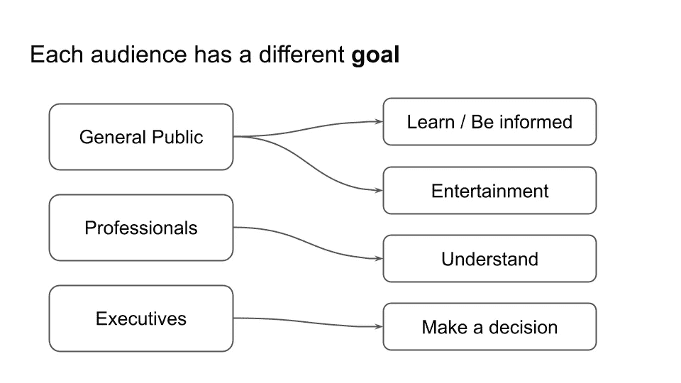

# 如何根据专业观众定制图表

> 原文：[`towardsdatascience.com/how-to-tailor-a-chart-to-an-audience-of-professionals-51bd3198ac03?source=collection_archive---------11-----------------------#2024-05-28`](https://towardsdatascience.com/how-to-tailor-a-chart-to-an-audience-of-professionals-51bd3198ac03?source=collection_archive---------11-----------------------#2024-05-28)

## 数据可视化，数据讲故事

## 一个现成的教程，展示了如何使用 Python 和 Altair 将全球温度异常数据集调整为适合专业人士的格式

[](https://alod83.medium.com/?source=post_page---byline--51bd3198ac03--------------------------------)[](https://towardsdatascience.com/?source=post_page---byline--51bd3198ac03--------------------------------) [Angelica Lo Duca](https://alod83.medium.com/?source=post_page---byline--51bd3198ac03--------------------------------)

·发布于[Towards Data Science](https://towardsdatascience.com/?source=post_page---byline--51bd3198ac03--------------------------------) ·阅读时间 8 分钟·2024 年 5 月 28 日

--


图片来自[wes lewis](https://unsplash.com/@westhmus?utm_source=medium&utm_medium=referral)于[Unsplash](https://unsplash.com/?utm_source=medium&utm_medium=referral)

你知道吗，同一数据集可以根据我们面前的观众以不同的方式进行图形表示？这是因为每个观众有不同的需求，意味着每个观众在数据中寻找的东西不同。了解观众在图表中寻找什么，对于构建适合该类型观众的图表至关重要。

我们将涵盖：

+   观众分类

+   专业人士的基本要求

+   案例研究

# 观众分类

让我们从头开始。我们考虑三种基本的观众类型：

+   **大众**既不了解数据，也不了解主题。最多，他们对主题有一些粗浅的了解。他们的目标是了解该主题或获取娱乐。

+   **专业人士**——这些是非常专业的技术人员。他们对主题和数据都非常了解，他们的目标是更好地理解数据以及数据所揭示的某一现象背后的动机。

+   **决策者**——是那些做出决策的人。他们了解主题，但不了解特定的数据。他们的目标是基于数据做出决策。

下图展示了各种类型的观众及其具体目标。



图片由作者提供

在本文中，我们将重点关注**专业观众**。在接下来的文章中，我们将分析其他类型的观众。我们将使用一个示例数据集，并构建一个特别针对这一观众群体的图表。如果将同一个图形展示给不同类型的观众，可能只会产生负面效果，降低信息的理解程度。

# 专业人士的基本要求

如前所述，专业人士非常了解该主题，并希望更好地理解数据。因此，我们在图表中包含的越多数据细节，越能满足他们的需求。事实上，在这种情况下，最好提供具体的数值，而不是过度四舍五入。

在图表中包含一些邀请他们进行反思、计算或讨论的元素也是适当的。例如，专业人士可能会对以下内容感兴趣：

我们希望专业观众做什么？

+   趋势分析与异常检测

+   与其他因素的关联

+   未来趋势预测

+   讨论。

总结来说，对于这类观众，我们在图表中提供以下信息：

+   数据细节

+   进一步分析的思路。

# 案例研究

我们使用了[全球温度异常](https://www.ncei.noaa.gov/access/monitoring/global-temperature-anomalies/anomalies)数据集，该数据集由 NOAA 发布，并根据[创意共享 1.0 全球公共领域捐赠（CC0-1.0）许可证](https://nauticalcharts.noaa.gov/data/data-licensing.html)进行授权。我们构建了一个专门针对专业观众的图表来表示该数据集。作为图表构建工具，我们使用了 Python Altair，但你也可以使用其他工具，如 Tableau、Power BI 或 Matplotlib。

我们将按照以下步骤进行：

+   加载数据集

+   绘制初步图表

+   为专业观众添加细节

+   添加鼓励进一步分析的元素。

## 加载数据集

首先加载数据集，但由于日期不正确，该数据集尚未准备好使用。数据预处理不属于数据可视化的范围，但在此，我们仅为方便起见提供了转换的代码。

```py
import pandas as pd

df = pd.read_csv('source/1850-2024.csv')
```

以下图表展示了输出结果：


图片由作者提供

定义一个转换函数，该函数从单元格的前四个字符提取年份，从接下来的两个字符提取日期：

```py
# Function to convert YYYYMM to YYYY-MM-DD
def convert_to_date(yyyymm):
    year = int(str(yyyymm)[:4])
    month = int(str(yyyymm)[4:6])
    return pd.Timestamp(year=year, month=month, day=1)

# Apply the conversion function to the Date column
df['Date'] = df['Date'].apply(convert_to_date)
```

## 绘制初步图表

我们可以做的第一件事是绘制原始图表，以了解我们拥有的数据。使用折线图表示数据，如下代码所示：

```py
import altair as alt

chart = alt.Chart(df
).mark_line(
).encode(
    x='Date',
    y='Anomaly'
).properties(
    width=800
)

chart
```

以下图表展示了结果：


图片由作者提供

我们有一个非常基础的图表，展示了从 1850 年到 2023 年的温度异常。所表示的值不是温度，而是温度的异常值，单位为度。例如，在 1850 年，温度异常为比预期值低 0.4 度，预期值被设为 0。这个基础图表需要进一步阐明。

让我们通过根据专业观众的需求改进基本图表。

## 为专业观众添加详细信息

专业人士是非常技术性的人群，他们已经了解了主题，并希望了解与数据相关的细节。

为了将图表定制为专业人士的需求，首先将图表转换为条形图，只需使用 `mark_bar()` 函数。

```py
chart = alt.Chart(df
).mark_bar(
).encode(
    x='Date',
    y='Anomaly'
).properties(
    width=900
)

chart
```

下图展示了生成的图表。


图示由作者提供

现在，改变颜色，通过设置颜色通道。使用颜色方案属性来设置颜色方案。还要设置 `reverse` 属性来反转颜色，将红色调与较热的温度关联，蓝色调与较冷的温度关联。

```py
chart = alt.Chart(df
).mark_bar(
).encode(
    x='Date',
    y='Anomaly',
    color=alt.Color('Anomaly', scale=alt.Scale(scheme='redblue', reverse=True))
).properties(
    width=800
)

chart
```

下图展示了生成的图表：


图示由作者提供

现在的问题是许多条形重叠，显示不正确。一个可能的解决方案是扩展图表宽度或减少条形的大小。另一种解决方案是按十年分组数据。让我们应用这个最后的解决方案：按十年分组数据，并移除最后一个十年（2020 年代），因为它是不完整的。使用与转换相关的 Altair 函数：

+   `transform_calculate()`，用于计算一个新的字段——“十年”

+   `transform_aggregate()`，用于按十年聚合异常值

+   `transform_filter()`，用于移除最后一个十年（从 2020 年开始）。

以下代码展示了如何实现该图表：

```py
chart = alt.Chart(df
).mark_bar(
).encode(
    x='Decade:N',
    y='Anomaly',
    color=alt.Color('Anomaly', scale=alt.Scale(scheme='redblue', reverse=True))
).properties(
    width=800
).transform_filter(
    "year(datum.Date) < 2020"
).transform_calculate(
     Decade = "(year(datum.Date) - year(datum.Date) % 10)"  # Calculate the decade
).transform_aggregate(
    Anomaly='mean(Anomaly)',
    groupby=['Decade']
)

chart
```

下图展示了生成的图表：


图示由作者提供

现在，我们可以调整轴，通过设置 y 轴的标题并旋转 x 轴标签：

```py
chart = chart.encode(
    x=alt.X('Decade:O', axis=alt.Axis(
        title='',
        labelAngle=0,
        labelExpr="datum.value + 's'",  # Add 's' to the end of each decade label
        )
    ),
    y=alt.Y('Anomaly', title='Global Surface Temperature Anomalies (°C)'),
    color=alt.Color('Anomaly', scale=alt.Scale(scheme='redblue', reverse=True))
)

chart
```

这是生成的图表：


图示由作者提供

我们已经完成了基本图表。现在，我们可以添加针对专业观众的细节，例如每个条形的数值。

让我们使用 `mark_text()` 函数为每个条形添加标签：

```py
text = chart.mark_text(
    align='center',
    baseline='top',
    dy = alt.expr(alt.expr.if_(alt.datum.Anomaly > 0, -15, 5))
).encode(
    text=alt.Text('mean(Anomaly):Q', format='.2f'),  # Format the anomaly value with 2 decimal places

)

chart + text
```

同时，调整 y 轴范围，使标签更清晰可见。

下图展示了生成的图表：


图示由作者提供

我们的观众可能希望从图表中提取的其他有用信息包括：

+   2010 年代与 1850 年代之间的间隙

+   温度什么时候开始上升的？

让我们将第一个答案作为图表的副标题，如以下代码所示：

```py
chart = chart.properties(
    title=alt.TitleParams(
        text='Global Surface Temperature Anomalies',
        subtitle='Between the 1850s and the 2010s, surface temperatures increased by 0.94°C.',    
    )
)

chart + text
```

让我们将第二个答案作为参考垂直线，标注在 1977 年，温度开始上升时：

```py
# reference line

rl_df = pd.DataFrame({
    'x'     : [1970],
    'text'  : [['Since 1977 temperatures', 'slowly started to increase.']]
})

rl = alt.Chart(rl_df).mark_rule(
    color='red',
).encode(
    x='x:N'
)

text_rl = rl.mark_text(
    color = 'red',
    baseline='top',
    align='left',
    y=10,
    dx=10
).encode(
    text='text'
)

chart + text + rl + text_rl
```

请注意，我们将参考值的 x 值设置为 1970，因为 x 轴不包含 1977，但为了更具体，我们添加了一段文本来指明确切的年份（1977）。下图展示了生成的图表：


图示由作者提供

## 添加鼓励进一步分析的元素

我们希望我们的专业观众做什么？对此问题的可能回答包括：

+   趋势分析与异常检测

+   与其他因素的相关性

+   未来趋势的预测

+   讨论。

让我们集中精力预测未来趋势，并假设我们希望鼓励观众开始进行预测分析。例如，我们可以在图表中添加一个新的条形图，表示 2050 年代的黑色框，标签为问号。这应该能鼓励观众进行分析。

要实现该图表，请执行以下操作：

+   将黑色框添加为新的条形图

+   添加一个带有问号标签的新文本标记

+   将标题设置为一个问题，询问观众采取某种行动。

以下代码实现了所描述的步骤：

```py
pred_df = pd.DataFrame({
    'x'     : ['2050'],
    'y'     : [1.2],
    'text'  :  '?'
})

pred =  alt.Chart(pred_df
).mark_bar(
    color = 'black'
).encode(
    x = 'x:N',
    y = 'y'
)

pred_text = pred.mark_text(
    color = 'black',
    dy=-15
).encode(
    text = 'text'
)

chart = chart.properties(
    title=alt.TitleParams(
        text='How big will the temperature anomaly be in 2050?',
        subtitle='Between the 1850s and the 2010s, surface temperatures increased by 0.94°C.'
    )
)

final = (chart + text + rl + text_rl + pred + pred_text)
final 
```

下图展示了生成的图表：


作者提供的图片

现在，你已经准备好向你的专业观众展示你的图表了！

# 总结

在本教程中，你已经学习了如何为专业观众定制图表。专业人士是那些希望理解数据的技术人员，因此他们需要数字。

为他们做数学运算并回答他们可能的问题。同时，邀请他们进行某种下一步操作，比如进一步分析。

你可以在[这个 GitHub 仓库](https://github.com/alod83/dsw-2024/tree/main)找到本教程的代码。

你也可以通过以下链接观看该教程：

如果你已经阅读到这里，对我来说，今天已经足够了！感谢，期待下次再见！

# 附加内容

如果你想增大标题字体大小，可以使用以下命令：

```py
final.configure_title(
    fontSize = 30,
    subtitleFontSize= 20
)
```

# 离开之前，你可能还会对以下内容感兴趣……

[](https://www.manning.com/books/data-storytelling-with-generative-ai?source=post_page-----51bd3198ac03--------------------------------) [## 数据讲故事与生成性 AI

### 优秀的数据展示讲述了一个故事。学习如何使用 Python、生成性 AI 等来组织、可视化和展示数据……

[www.manning.com](https://www.manning.com/books/data-storytelling-with-generative-ai?source=post_page-----51bd3198ac03--------------------------------) [](https://pub.towardsai.net/using-vega-lite-for-data-visualization-546020f46be2?source=post_page-----51bd3198ac03--------------------------------) [## 使用 Vega-Lite 进行数据可视化

### 关于如何开始使用 Vega-Lite 绘制图表的教程。

[pub.towardsai.net](https://pub.towardsai.net/using-vega-lite-for-data-visualization-546020f46be2?source=post_page-----51bd3198ac03--------------------------------) [](/three-charts-to-represent-a-percentage-you-may-not-know-84cc7d5c62a3?source=post_page-----51bd3198ac03--------------------------------) ## 三种你可能不知道的百分比表示图表

### 一个现成可运行的 Python Altair 教程，用于构建表示百分比的图表。

[towardsdatascience.com
