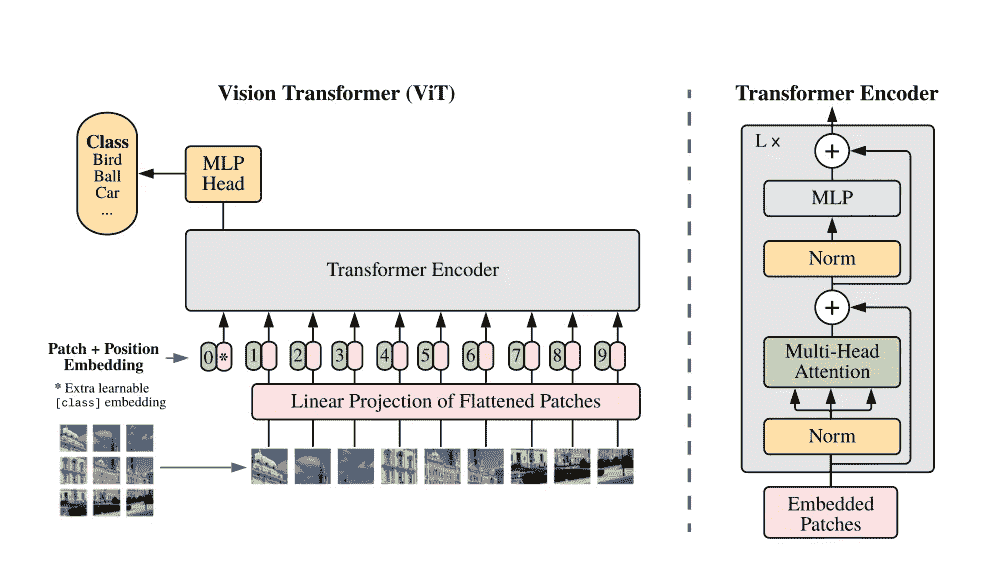
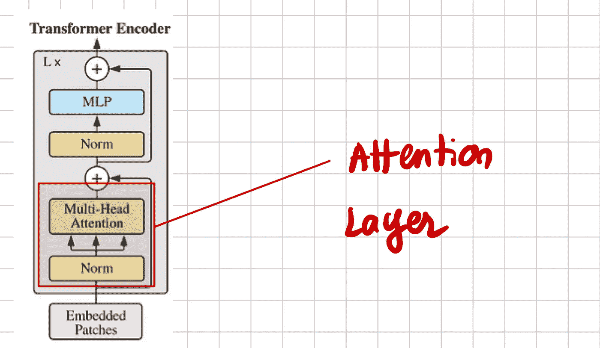

# 如何从零开始训练 Vision Transformer（ViT）

> 原文：[`towardsdatascience.com/how-to-train-a-vision-transformer-vit-from-scratch-f26641f26af2?source=collection_archive---------3-----------------------#2024-09-04`](https://towardsdatascience.com/how-to-train-a-vision-transformer-vit-from-scratch-f26641f26af2?source=collection_archive---------3-----------------------#2024-09-04)

## 实现 Vision Transformer（ViT）的实用指南

[](https://medium.com/@francoisporcher?source=post_page---byline--f26641f26af2--------------------------------)[](https://towardsdatascience.com/?source=post_page---byline--f26641f26af2--------------------------------) [François Porcher](https://medium.com/@francoisporcher?source=post_page---byline--f26641f26af2--------------------------------)

·发布于[Towards Data Science](https://towardsdatascience.com/?source=post_page---byline--f26641f26af2--------------------------------) ·12 分钟阅读·2024 年 9 月 4 日

--

大家好！对于那些还不认识我的朋友们，我叫 Francois，我是 Meta 的研究科学家。我热衷于解释先进的人工智能概念，并使其变得更加易懂。

今天，让我们深入探讨计算机视觉领域最重要的贡献之一：**视觉 Transformer（ViT）**。

本文重点介绍自 Vision Transformer 发布以来的最新实现。为了深入理解 ViT 的工作原理，我强烈建议阅读我关于其理论基础的另一篇文章：[Vision Transformer 终极指南](https://medium.com/towards-data-science/the-ultimate-guide-to-vision-transformers-0a6df32cb248)

# 如何从零开始训练 ViT？



ViT 架构，图片来自[原始文章](https://arxiv.org/pdf/2010.11929)

# 1\. 注意力层



注意力层，图片由作者提供

让我们从 Transformer 编码器中最著名的构建模块——注意力层开始。

```py
class Attention(nn.Module):
    def __init__(self, dim, heads=8, dim_head=64, dropout=0.):
        super().__init__()
        inner_dim = dim_head * heads  # Calculate the total inner…
```
