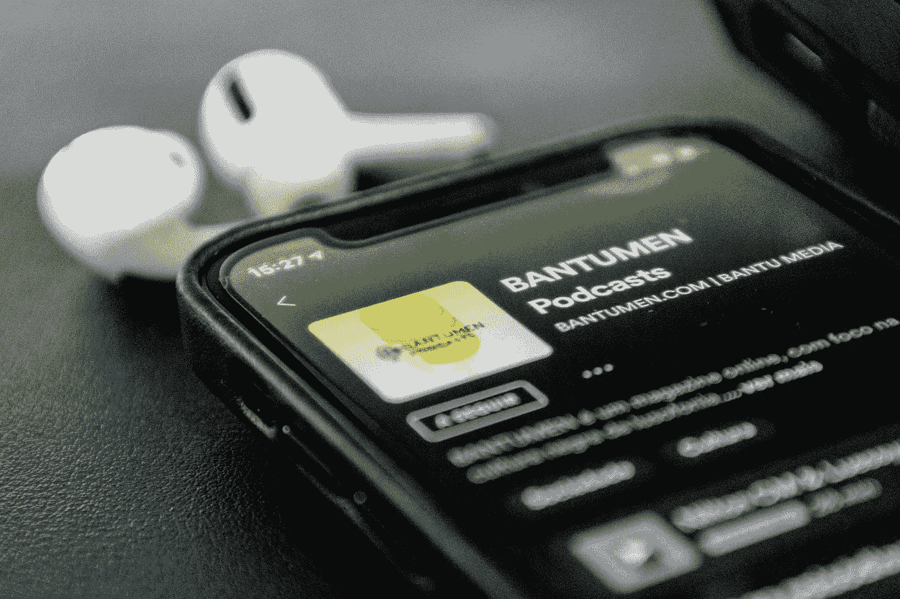
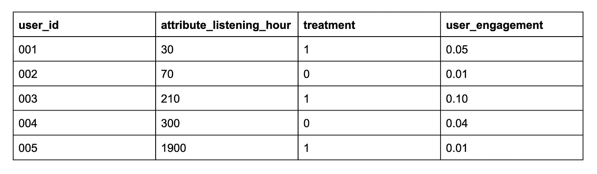
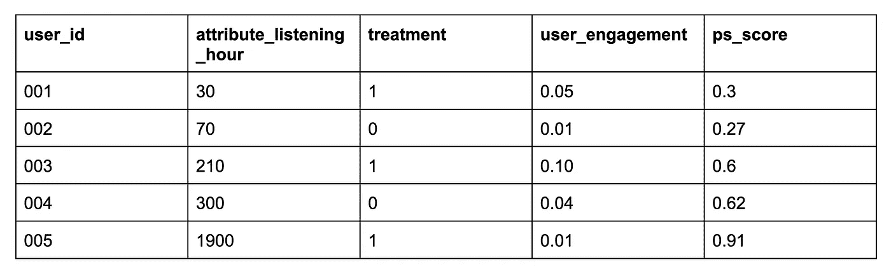
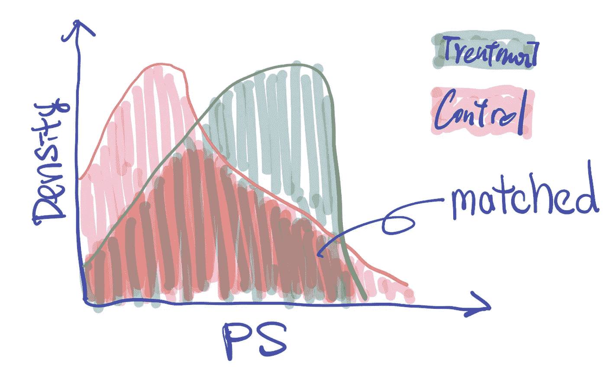
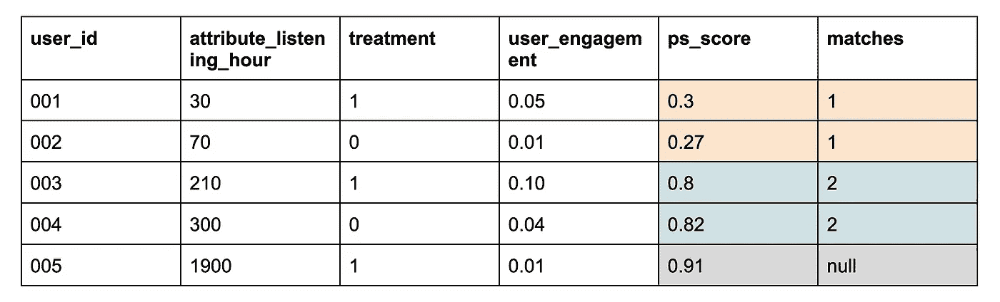

# 如何在 A/B 测试不可用时使用因果推断

> 原文：[`towardsdatascience.com/how-to-use-causal-inference-when-a-b-testing-is-not-possible-c87c1252724a?source=collection_archive---------2-----------------------#2024-01-08`](https://towardsdatascience.com/how-to-use-causal-inference-when-a-b-testing-is-not-possible-c87c1252724a?source=collection_archive---------2-----------------------#2024-01-08)

## 使用因果推断评估广告定向产品：倾向评分匹配！

 [Harry Lu](https://medium.com/@chinheng.h.lu?source=post_page---byline--c87c1252724a--------------------------------)

·发布于 [Towards Data Science](https://towardsdatascience.com/?source=post_page---byline--c87c1252724a--------------------------------) ·7 分钟阅读·2024 年 1 月 8 日

--

图片来源：[Tech Daily](https://unsplash.com/@techdailyca?utm_source=medium&utm_medium=referral) 在 [Unsplash](https://unsplash.com/?utm_source=medium&utm_medium=referral)

曾经在收听回顾昨晚精彩 NBA 对决的播客时，看到那些煽动性十足的耐克广告吗？或者在 YouTube 观看球鞋评测视频时，不小心碰到新百伦的广告？这就是情境定向的魔力——根据时刻的氛围，将内容和广告完美匹配的“媒人”！告别尴尬的广告体验，迎接量身定制的广告体验，让你不禁舞动起来。试想一下：“你是愿意在篮球播客里感受耐克广告的节奏，还是在政治播客里让它更有趣一些？”

随着科技巨头加大在保护用户隐私方面的投资，传统的行为定向（你知道的，就是依赖 IP 地址和用户设备的那种）可能会面临困境。随着更少的 Cookies 和神秘的 IP 地址在四周游荡，传统的定向广告就像进入了西部荒野！

# 衡量情境广告定向产品

让我们为情境广告产品的衡量游戏增添一些趣味——通常，它主要关注的是广告商。我们谈论的是典型的成功指标：广告商的采用率、留存率、推荐率，以及那丰厚的广告收入。但事情变得复杂了——我的假设是，提供更相关的广告能将广告体验变成一种畅快的体验。试想一下：广告期间减少上下文切换，意味着用户能够在不打断的情况下享受类似的内容。

然而，进行 A/B 测试以查看用户如何反应情境定向广告并不容易。为什么？当广告主在广告中购买情境定向时，不仅仅是情境定向——他们会在同一广告活动中使用所有其他定向方式，导致我们无法将情境定向随机分配为处理组。因此，无法将用户随机分配到两组中。

进入替代方案的超级英雄：因果推断！当 A/B 测试不可行，因为你不能像洗牌一样随机分配用户时，我们转向使用历史数据和因果推断！

在这篇博客中，我将介绍如何通过因果推断评估广告定向产品。所以，如果你：

1.  在 A/B 测试尚未准备好的领域中导航——无论是因为不道德、成本高昂还是根本不可能。

1.  踏入广告/社交领域的惊险水域，这里聚焦于广告如何与特定用户及其内容亲密接触。

# 假设与指标

设计因果推断研究时，设置假设和指标是非常重要的！

**假设：** 我们认为，当用户听到通过情境定向的广告时，会更有参与感，计划通过广告完成率（越高越好）和离焦跳过（越低越好）来衡量这一点。

**指标：** 我们开始使用广告完成率，这是广告领域中常见的标准指标。然而，这个指标噪声较大，最终我们选择了“离焦跳过”作为我们的指标。

**我们的实验单位：** 90 天的用户数据，这些用户要么是（过滤掉的，接受了处理广告和控制广告的用户）。值得一提的是，我们也尝试了展示层级的数据分析。我们做了两者。

**人群：** 我们收集了 90 个用户/展示窗口。

照片由[Eddie Pipocas](https://unsplash.com/@eddiepipocas?utm_source=medium&utm_medium=referral)提供，来源于[Unsplash](https://unsplash.com/?utm_source=medium&utm_medium=referral)

# 使用倾向得分匹配（PSM）

在这项研究中，我们将使用倾向得分匹配（PSM），因为我们有两个样本组，只需要合成一些随机化。你可以在[这里](https://en.wikipedia.org/wiki/Propensity_score_matching)了解更多关于 PSM 的信息，我对 PSM 的总结是：让我们的样本在控制组和处理组之间找到配对，然后我们测量每对之间的平均差异，将我们发现的任何差异归因于处理效应。所以，让我们开始为我们的 PSM 模型准备原料吧！

# 第一步：确定因果关系

有许多因素可能影响用户的广告体验，以下是三大类别：

1.  用户属性（例如，年龄/性别/LHR）

1.  广告主属性（例如，公司过去的广告支出）

1.  发布者属性（例如，公司过去的广告收入/内容元数据）

我们认为，控制上述因素能将处理效应隔离为情境定向广告与非情境定向广告之间的差异。下面是一个示例数据框，帮助理解数据可能的样子！

作者提供的图片：用户属性、处理方法和用户参与度（y）

# 步骤 2：为用户分配匹配分数

以逻辑回归为例，当处理（暴露）状态与观察到的特征（协变量）回归时，我们将得到一个预测值，表示用户处于处理组的可能性。这个数值就是我们用来匹配每一对处理组和对照组的方法。请注意，你也可以使用其他分类器！最终，你需要做的是使用你的分类器为用户打标签，然后在接下来的步骤中匹配他们。

> Y = 处理组 [0, 1]
> 
> X = 用户属性 + 广告主属性 + 发布者属性

作者提供的图片：数据框架现在有一个来自分类器模型的新字段 ps_score。

如果我们绘制两个组的 PS 分数分布，我们会看到两个重叠的分布，正如我下面的图示所示。PS 分数的分布在两个组中可能会有所不同，这是预期的！我们想要比较的“苹果对苹果”的部分就是“匹配”区域。

作者提供的图片：处理组和对照组之间的 PS 分数分布。

# 步骤 3：匹配处理组和对照组

当我们为用户分配了倾向得分后，我们将匹配处理组和对照组之间的配对。这里的示例中，我们开始看到配对形成。我们的样本量也会开始变化，因为有些样本可能找不到匹配项。（PS：如果你使用 Python 环境，可以使用 [psmpy](https://pypi.org/project/psmpy/) 包。）

作者提供的图片：数据框架有一个新列，表示处理组和对照组之间的配对。

当我们匹配了这两个组时，两个组的用户属性将开始变得比之前更相似！这是因为无法匹配的用户将被从这两个组中移除。

# 步骤 4：测量匹配组的处理效应

现在我们已经根据 PS 匹配了它们，接下来我们可以开始测量工作了！主要计算过程如下：

> MEAN(处理组 Y 变量) — MEAN(对照组 Y 变量) = 处理效应

我们将得到一个可以测试统计显著性和实际显著性的处理效应数据。通过将鸭子配对，计算每一对的平均变化量，我们来衡量处理效应。

# 步骤 5：通过 AA 测试进行结果的合理性检查

所以，如果到目前为止一切设置正确，我们已经测量了两个组的处理效应。但需要特别注意的是，因果推断会因为漏掉混杂变量或其他我们没有意识到的潜在原因而增加风险。因此，为了进一步验证我们的研究，让我们进行一个 AA 测试！

AA 测试是一种测试方法，其中我们并没有使用真实的处理，而是随机地给数据分配“虚假”处理，并再次进行因果推断。由于是虚假处理，我们不应该检测到任何处理效应！进行 AA 测试可以提供很好的代码审核，同时确保我们的过程最小化偏差（当真实处理效应为 0 时，我们应该检测到 0）。

一旦我们完成了 AA 测试并没有检测到处理效应，就可以与工程和产品管理团队沟通这个见解！在我的项目中，我最终将我的工作发布，并在公司范围的洞察论坛上分享了第一个用来衡量 Spotify 播客广告定向的因果推断工作。

# 结论 / 总结

本文解释了因果推断的每一个步骤，用于评估一个由于随机化限制而难以实验的广告定向产品。内容涵盖了如何确定因果关系、分配用户倾向匹配分数、匹配用户并计算处理效应，以及如何对结果进行合理性检查。希望这篇文章对你有所帮助，如果有任何问题，欢迎与我联系！

PS：由于保密原因，我无法分享针对 Spotify 上下文定向产品的具体测试结果，但你仍然可以利用这篇博客构建你的因果推断！

# 关于我：

**Harry Lu (**[**Linkedin**](https://www.linkedin.com/in/chinhengharrylu/) **/** [**Instagram**](https://www.instagram.com/chinhenglu/) **/ >>** [**Podcast Page**](https://www.instagram.com/quittinginnewyork/) **<</** [**Youtube**](https://www.youtube.com/@quittinginnewyork7660)**)** 是一位经验丰富的数据科学家，专长于机器学习、统计建模和产品决策。擅长广告技术、货币化和上下文定向产品。以全面的数据视角、领导力和战略思维著称。积极参与数据科学社区，进行演讲、研讨会，并为硕士论文提供咨询。曾在《The Data Standard》播客中亮相。
