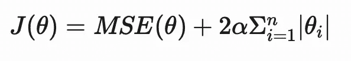

# 如何使用弹性网回归

> 原文：[`towardsdatascience.com/how-to-use-elastic-net-regression-85a6a393222b?source=collection_archive---------9-----------------------#2024-03-14`](https://towardsdatascience.com/how-to-use-elastic-net-regression-85a6a393222b?source=collection_archive---------9-----------------------#2024-03-14)

## 投放一个灵活的网，只保留大鱼

[](https://medium.com/@cjtayl2?source=post_page---byline--85a6a393222b--------------------------------)[](https://towardsdatascience.com/?source=post_page---byline--85a6a393222b--------------------------------) [Chris Taylor](https://medium.com/@cjtayl2?source=post_page---byline--85a6a393222b--------------------------------)

·发布于[Towards Data Science](https://towardsdatascience.com/?source=post_page---byline--85a6a393222b--------------------------------) ·阅读时长 9 分钟·2024 年 3 月 14 日

--

*注意：本文使用的代码利用了三个自定义脚本，*`data_cleaning`*，*`data_review`*，和*`eda`*，这些脚本可以通过公共的[*GitHub 仓库*](https://github.com/CJTAYL/elastic_net_medium)访问。*


图片由[Eric BARBEAU](https://unsplash.com/@ericbarbeau?utm_source=medium&utm_medium=referral)提供，来源于[Unsplash](https://unsplash.com/?utm_source=medium&utm_medium=referral)

> 它就像一个可伸缩的渔网，能够保留“所有的大鱼” Zou & Hastie (2005) p. 302

# **背景**

线性回归是数据科学中常用的教学工具，在适当的条件下（例如，自变量和因变量之间存在线性关系，且不存在多重共线性），它可以是一种有效的预测响应的方法。然而，在某些场景中（例如，当模型结构变得复杂时），其使用可能会存在问题。

为了应对一些算法的局限性，提出了惩罚或正则化技术[1]。两种常见的正则化方法是岭回归和套索回归，但对于数据科学新手来说，选择这两种方法可能会很困难。

选择岭回归和套索回归的一种方法是检查特征与响应变量之间的相关性[2]。当模型中的大多数特征是相关的（即有助于模型的预测能力）时，应在线性回归中添加岭回归惩罚（或 L2 惩罚）。

当添加岭回归惩罚时，模型的代价函数为：


图片由作者提供

+   θ = 模型的参数或系数向量

+   α = 正则化的整体强度

+   *m* = 训练样本的数量

+   *n* = 数据集中特征的数量

当大多数特征无关时（即不贡献于模型的预测能力），应将套索回归惩罚项（或 L1 惩罚项）添加到线性回归中。

当添加套索回归惩罚项时，模型的成本函数为：



图片来源：作者

相关性可以通过人工审查或交叉验证来确定；然而，当涉及多个特征时，过程会变得耗时且计算开销较大。

解决此问题的高效且灵活的方法是使用弹性网回归，它结合了岭回归和套索回归的惩罚项。

弹性网回归的成本函数为：


图片来源：作者

+   r = 岭回归和套索回归之间的混合比率。

当 r 为 1 时，仅使用套索惩罚项；当 r 为 0 时，仅使用岭惩罚项。当 r 介于 0 和 1 之间时，使用两种惩罚项的混合。

除了非常适合包含多个特征的数据集外，弹性网回归还具有其他使其成为数据科学家有吸引力的特性[1]：

+   自动选择相关特征，从而生成简洁易解释的模型

+   连续收缩，逐渐将不太相关特征的系数减少到零（与直接减少到零相对）

+   能够选择相关特征的组，而不是随意选择组中的一个特征

由于其效用和灵活性，Zou 和 Hastie（2005）将该模型与“…一种可拉伸的渔网，能够捕捉所有的大鱼”进行了比较（第 302 页），其中“大鱼”类比为相关特征。

现在我们有了一些背景知识，可以继续在实际数据集上实现弹性网回归。

# **实现**

一个很好的数据资源是加利福尼亚大学欧文分校的机器学习库（UCI ML Repo）。在本教程中，我们将使用葡萄酒质量数据集[3]，该数据集采用[创作共用 4.0 国际许可协议](https://creativecommons.org/licenses/by/4.0/legalcode)。

下方显示的函数可以通过输入识别号作为参数，从 UCI 机器学习库中获取数据集和变量信息。

```py
pip install ucimlrepo # unless already installed
```

```py
from ucimlrepo import fetch_ucirepo
import pandas as pd

def fetch_uci_data(id):
    """
    Function to return features datasets from the UCI ML Repository.

    Parameters
    ----------
    id: int
        Identifying number for the dataset

    Returns
    ----------
    df: df
        Dataframe with features and response variable 
    """
    dataset = fetch_ucirepo(id=id) 

    features = pd.DataFrame(dataset.data.features)
    response = pd.DataFrame(dataset.data.targets)
    df = pd.concat([features, response], axis=1)

    # Print variable information
    print('Variable Information')
    print('--------------------')
    print(dataset.variables)

    return(df)
```

```py
# Wine Quality's identification number is 186
df = fetch_uci_data(186)
```

一个 pandas 数据框已被分配给变量“df”，并打印了数据集的信息。

## 探索性数据分析

```py
Variable Information
--------------------
                    name     role         type demographic  \
0          fixed_acidity  Feature   Continuous        None   
1       volatile_acidity  Feature   Continuous        None   
2            citric_acid  Feature   Continuous        None   
3         residual_sugar  Feature   Continuous        None   
4              chlorides  Feature   Continuous        None   
5    free_sulfur_dioxide  Feature   Continuous        None   
6   total_sulfur_dioxide  Feature   Continuous        None   
7                density  Feature   Continuous        None   
8                     pH  Feature   Continuous        None   
9              sulphates  Feature   Continuous        None   
10               alcohol  Feature   Continuous        None   
11               quality   Target      Integer        None   
12                 color    Other  Categorical        None   

               description units missing_values  
0                     None  None             no  
1                     None  None             no  
2                     None  None             no  
3                     None  None             no  
4                     None  None             no  
5                     None  None             no  
6                     None  None             no  
7                     None  None             no  
8                     None  None             no  
9                     None  None             no  
10                    None  None             no  
11  score between 0 and 10  None             no  
12            red or white  None             no
```

根据变量信息，我们可以看到数据集中有 11 个“特征”、1 个“目标”和 1 个“其他”变量。这是一个有趣的信息——如果我们没有提取变量信息，我们可能不知道有关于葡萄酒家族（或颜色）的数据。目前，我们不会将“颜色”变量纳入模型，但知道它存在对于项目未来的迭代很有帮助。

变量信息中的“描述”列表明，“质量”变量是类别型的。数据可能是有序的，这意味着它们有层级结构，但数据之间的间隔不一定相等或已知。实际上，这意味着一个评分为 4 的葡萄酒并不比评分为 2 的葡萄酒好两倍。为了解决这个问题，我们将把数据转换为正确的数据类型。

```py
df['quality'] = df['quality'].astype('category')
```

为了更好地理解数据，我们可以使用`seaborn`包中的`countplot()`方法来可视化“质量”变量的分布。

```py
import seaborn as sns
import matplotlib.pyplot as plt 

sns.set_theme(style='whitegrid') # optional

sns.countplot(data=df, x='quality')
plt.title('Distribution of Wine Quality')
plt.xlabel('Quality')
plt.ylabel('Count')
plt.show()
```


图像来源：作者

在进行探索性数据分析时，为数值型特征绘制直方图是非常有益的。此外，将变量按类别变量分组可以提供新的见解。最好的分组方式是“质量”。然而，考虑到质量有 7 个组别，图表可能会变得难以阅读。为了简化分组，我们可以创建一个新的特征，“评级”，将“质量”分为三个类别：低、中、高。

```py
def categorize_quality(value):
 if 0 <= value <= 3:
    return 0 # low rating
 elif 4 <= value <= 6:
    return 1 # medium rating
 else:
    return # high rating

# Create new column for 'rating' data
df['rating'] = df['quality'].apply(categorize_quality)
```

为了确定每个组别中有多少葡萄酒，我们可以使用以下代码：

```py
df['rating'].value_counts()
```

```py
rating
1    5190
2    1277
0      30
Name: count, dtype: int64
```

根据代码输出，我们可以看到大多数葡萄酒被归类为“中等”。

现在，我们可以绘制按“评级”分组的数值特征的直方图。为了绘制直方图，我们需要使用`eda`脚本中的`gen_histograms_by_category()`方法，GitHub 上共享的该脚本在文章开头已提供。

```py
import eda 

eda.gen_histograms_by_category(df, 'rating')
```


图像来源：作者

上面是该方法生成的一个图表。对图表的回顾表明，数据存在一定的偏斜。为了更精确地衡量偏斜度以及其他统计信息，我们可以使用`get_statistics()`方法，这个方法来自`data_review`脚本。

```py
from data_review import get_statistics

get_statistics(df)
```

```py
-------------------------
Descriptive Statistics
-------------------------
          fixed_acidity  volatile_acidity  citric_acid  residual_sugar    chlorides  free_sulfur_dioxide  total_sulfur_dioxide      density           pH    sulphates      alcohol      quality
count       6497.000000       6497.000000  6497.000000     6497.000000  6497.000000          6497.000000           6497.000000  6497.000000  6497.000000  6497.000000  6497.000000  6497.000000
mean           7.215307          0.339666     0.318633        5.443235     0.056034            30.525319            115.744574     0.994697     3.218501     0.531268    10.491801     5.818378
std            1.296434          0.164636     0.145318        4.757804     0.035034            17.749400             56.521855     0.002999     0.160787     0.148806     1.192712     0.873255
min            3.800000          0.080000     0.000000        0.600000     0.009000             1.000000              6.000000     0.987110     2.720000     0.220000     8.000000     3.000000
25%            6.400000          0.230000     0.250000        1.800000     0.038000            17.000000             77.000000     0.992340     3.110000     0.430000     9.500000     5.000000
50%            7.000000          0.290000     0.310000        3.000000     0.047000            29.000000            118.000000     0.994890     3.210000     0.510000    10.300000     6.000000
75%            7.700000          0.400000     0.390000        8.100000     0.065000            41.000000            156.000000     0.996990     3.320000     0.600000    11.300000     6.000000
max           15.900000          1.580000     1.660000       65.800000     0.611000           289.000000            440.000000     1.038980     4.010000     2.000000    14.900000     9.000000
skew           1.723290          1.495097     0.471731        1.435404     5.399828             1.220066             -0.001177     0.503602     0.386839     1.797270     0.565718     0.189623
kurtosis       5.061161          2.825372     2.397239        4.359272    50.898051             7.906238             -0.371664     6.606067     0.367657     8.653699    -0.531687     0.23232
```

与直方图一致，标记为“fixed_acidity”的特征具有 1.72 的偏斜度，表明存在显著的右偏。

为了确定变量之间是否存在相关性，我们可以使用`eda`脚本中的另一个函数。

```py
eda.gen_corr_matrix_hmap(df)
```


图像来源：作者

尽管特征之间存在一些中等和强关系，弹性网回归在处理相关变量时表现良好，因此无需采取任何措施[2]。

## **数据清洗**

为了使弹性网回归算法正确运行，数值型数据必须进行缩放，并且类别变量必须进行编码。

为了清洗数据，我们将执行以下步骤：

1.  使用 `data_cleaning` 脚本中的 `scale_data()` 方法对数据进行缩放

1.  使用 `pandas` 中的 `get_dummies()` 方法对“quality”和“rating”变量进行编码

1.  使用 `separate_data()` 方法将特征（即 X）和响应变量（即 y）分离

1.  使用 `train_test_split()` 方法将数据拆分为训练集和测试集

```py
from sklearn.model_selection import train_test_split
from data_cleaning import scale_data, separate_data

df_scaled = scale_data(df)
df_encoded = pd.get_dummies(df_scaled, columns=['quality', 'rating'])

# Separate features and response variable (i.e., 'alcohol')
X, y = separate_data(df_encoded, 'alcohol')

# Create test and train sets 
X_train, X_test, y_train, y_test = train_test_split(X, y, test_size =0.2, random_state=0)
```

## **模型构建与评估**

为了训练模型，我们将使用 `ElasticNetCV()`，它有两个参数，`alpha` 和 `l1_ratio`，并且内置了交叉验证。`alpha` 参数决定应用于模型的正则化强度，`l1_ratio` 决定套索回归和岭回归惩罚项的混合（它相当于在*背景*部分回顾的变量 *r*）。

+   当 `l1_ratio` 设置为 0 时，使用的是岭回归惩罚项。

+   当 `l1_ratio` 设置为 1 时，使用的是套索回归惩罚项。

+   当 `l1_ratio` 设置为介于 0 和 1 之间的值时，使用的是两者惩罚项的混合。

选择 `alpha` 和 `l1_ratio` 的值可能具有挑战性；然而，通过使用内置的交叉验证功能，`ElasticNetCV()` 方法可以简化这一任务。为了简化过程，你不需要提供 `alpha` 和 `l1_ratio` 的一系列值——你可以让该方法来完成繁重的工作。

```py
from sklearn.linear_model import ElasticNet, ElasticNetCV

# Build the model
elastic_net_cv = ElasticNetCV(cv=5, random_state=1)

# Train the model
elastic_net_cv.fit(X_train, y_train)

print(f'Best Alpha: {elastic_net_cv.alpha_}')
print(f'Best L1 Ratio:{elastic_net_cv.l1_ratio_}')
```

```py
Best Alpha: 0.0013637974514517563
Best L1 Ratio:0.5
```

根据打印输出，我们可以看到 `alpha` 和 `l1_ratio` 的最佳值分别是 0.001 和 0.5。

为了判断模型表现如何，我们可以计算模型的均方误差（Mean Squared Error）和决定系数（R-squared）得分。

```py
from sklearn.metrics import mean_squared_error

# Predict values from the test dataset
elastic_net_pred = elastic_net_cv.predict(X_test)

mse = mean_squared_error(y_test, elastic_net_pred)
r_squared = elastic_net_cv.score(X_test, y_test)

print(f'Mean Squared Error: {mse}')
print(f'R-squared value: {r_squared}')
```

```py
Mean Squared Error: 0.2999434011721803
R-squared value: 0.7142939720612289
```

## **结论**

根据评估指标，模型表现一般。然而，模型的表现可以通过一些额外步骤进行提升，例如检测和去除异常值、进一步的特征工程，及在 `ElasticNetCV()` 中为 `alpha` 和 `l1_ratio` 提供特定的值。不幸的是，这些步骤超出了这个简单教程的范围；然而，它们可能为其他人如何改进该项目提供一些思路。

感谢你花时间阅读这篇文章。如果你有任何问题或反馈，请留言评论。

# 参考文献

[1] H. Zou 和 T. Hastie，Elastic Net 通过正则化和变量选择，《皇家统计学会系列 B：统计方法论》期刊，第 67 卷，第 2 期，2005 年 4 月，第 301–320 页，[`doi.org/10.1111/j.1467-9868.2005.00503.x`](https://doi.org/10.1111/j.1467-9868.2005.00503.x)

[2] A. Géron，《动手学深度学习：使用 Scikit-Learn、Keras 和 TensorFlow 构建智能系统的概念、工具和技术》（2021），O’Reilly 出版。

[3] P. Cortez, A. Cerdeira, F. Almeida, T. Matos 和 Reis, J.（2009）。葡萄酒质量数据集。UCI 机器学习库。[`doi.org/10.24432/C56S3T`](https://doi.org/10.24432/C56S3T)。
