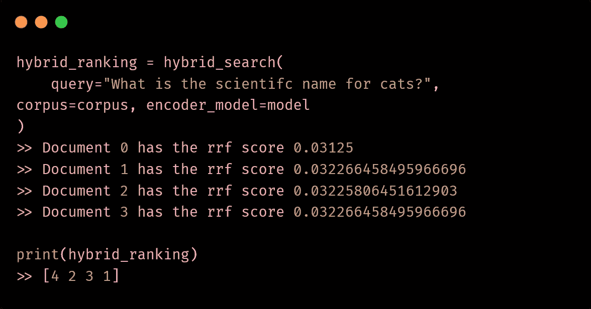

# 如何使用混合搜索来优化 LLM RAG 检索

> 原文：[`towardsdatascience.com/how-to-use-hybrid-search-for-better-llm-rag-retrieval-032f66810ebe?source=collection_archive---------0-----------------------#2024-08-11`](https://towardsdatascience.com/how-to-use-hybrid-search-for-better-llm-rag-retrieval-032f66810ebe?source=collection_archive---------0-----------------------#2024-08-11)

## 通过将密集嵌入与 BM25 结合，构建一个先进的本地 LLM RAG 管道

 [Dr. Leon Eversberg](https://medium.com/@leoneversberg?source=post_page---byline--032f66810ebe--------------------------------)

·发布于[Towards Data Science](https://towardsdatascience.com/?source=post_page---byline--032f66810ebe--------------------------------) ·阅读时长 11 分钟·2024 年 8 月 11 日

--

我们将在本文中实现的混合搜索的代码片段。图像来自作者

基本的检索增强生成（RAG）管道使用编码器模型，在给定查询时搜索相似的文档。

这也被称为**语义搜索**，因为编码器将文本转换为高维向量表示（称为嵌入），在该表示中，语义相似的文本会靠得很近。

在我们拥有大型语言模型（LLM）来创建这些向量嵌入之前，BM25 算法曾是非常流行的搜索算法。BM25 专注于重要的关键词，并在可用文档中寻找精确匹配。这种方法被称为**关键词搜索**。

如果你想将你的 RAG 管道提升到一个新的层次，你可以尝试**混合搜索**。混合搜索结合了关键词搜索和语义搜索的优点，以提高搜索质量。

在本文中，我们将介绍这三种搜索方法的理论，并在 Python 中实现它们。

## 目录

· RAG 检索

∘ 带有 BM25 的关键词搜索

∘ 带有密集嵌入的语义搜索

∘ 语义搜索还是混合搜索？

∘ 混合搜索

∘ 将一切整合在一起

·…
