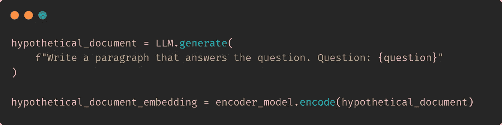
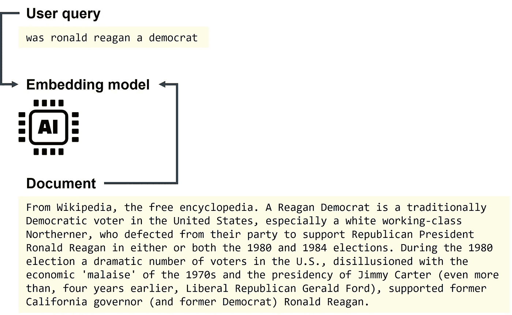

# 如何使用 HyDE 优化 LLM 的 RAG 检索

> 原文：[`towardsdatascience.com/how-to-use-hyde-for-better-llm-rag-retrieval-a0aa5d0e23e8?source=collection_archive---------2-----------------------#2024-10-04`](https://towardsdatascience.com/how-to-use-hyde-for-better-llm-rag-retrieval-a0aa5d0e23e8?source=collection_archive---------2-----------------------#2024-10-04)

## 构建一个包含假设文档嵌入的高级本地 LLM RAG 管道

 [Dr. Leon Eversberg](https://medium.com/@leoneversberg?source=post_page---byline--a0aa5d0e23e8--------------------------------)

·发表于[Towards Data Science](https://towardsdatascience.com/?source=post_page---byline--a0aa5d0e23e8--------------------------------) ·9 分钟阅读·2024 年 10 月 4 日

--

在 Python 中实现 HyDE 非常简单。图片来自作者

通过向大语言模型（LLMs）提供访问外部知识的文档，它们可以得到改善。

基本的检索增强生成（RAG）管道由用户查询、将文本转换为嵌入（高维数值向量）的嵌入模型、在嵌入空间中搜索与用户查询相似的文档的检索步骤，以及使用检索到的文档生成答案的生成器 LLM 组成[1]。

实际上，RAG 检索部分至关重要。如果检索器在文档库中找不到正确的文档，LLM 就无法生成一个有效的答案。

检索步骤中的一个问题可能是用户的查询是一个非常简短的问题——可能存在语法、拼写和标点符号的不完美——而对应的文档则是一段长篇的写得很好的文字，其中包含了我们需要的信息。

一个查询和对应的来自[MS MARCO 数据集](https://huggingface.co/datasets/microsoft/ms_marco#)的段落，说明通常查询和文档具有不同的长度和格式。图片来自作者

**HyDE 是一种提出的技术，通过将用户问题转化为**…
