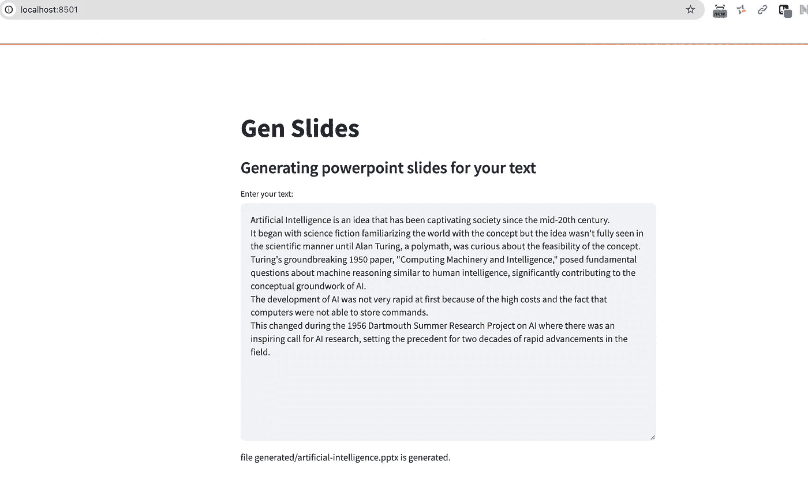
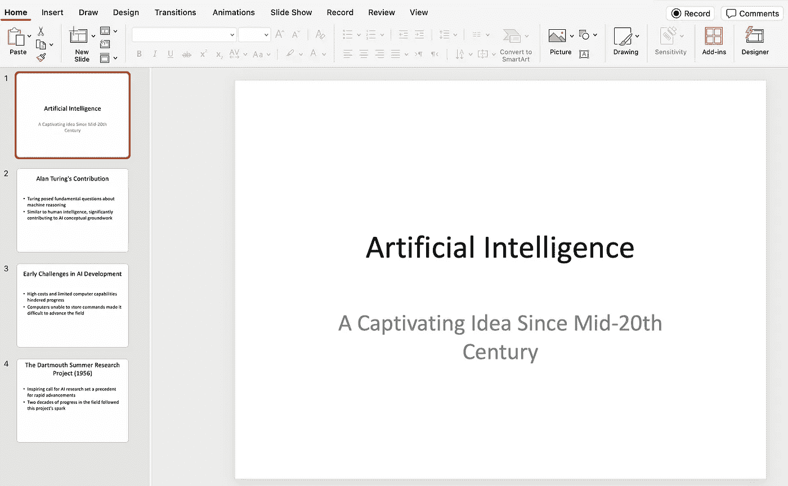

# 如何创建一个 LLM 驱动的应用程序，将文本转换为演示文稿幻灯片：GenSlide——一步一步的指南

> 原文：[`towardsdatascience.com/how-to-use-llms-to-create-presentation-slides-genslide-a-step-by-step-guide-31f7588ffb5e?source=collection_archive---------1-----------------------#2024-07-29`](https://towardsdatascience.com/how-to-use-llms-to-create-presentation-slides-genslide-a-step-by-step-guide-31f7588ffb5e?source=collection_archive---------1-----------------------#2024-07-29)

[](https://medium.com/@mehdi.mka?source=post_page---byline--31f7588ffb5e--------------------------------)[](https://towardsdatascience.com/?source=post_page---byline--31f7588ffb5e--------------------------------) [Mehdi Mohammadi](https://medium.com/@mehdi.mka?source=post_page---byline--31f7588ffb5e--------------------------------)

·发布于[Towards Data Science](https://towardsdatascience.com/?source=post_page---byline--31f7588ffb5e--------------------------------) ·阅读时间：8 分钟·2024 年 7 月 29 日

--


图片由[Mitchell Luo](https://unsplash.com/@mitchel3uo?utm_source=medium&utm_medium=referral)提供，来源于[Unsplash](https://unsplash.com/?utm_source=medium&utm_medium=referral)

在这篇文章中，我将分享如何创建一个简单而强大的应用程序，利用 LLM 将你的书面内容转换为简洁的 PowerPoint 幻灯片。好处是：你甚至可以运行自己的 LLM 服务，因此

+   保持你的数据私密，并且

+   调用 LLM API 不收费。

# 开始使用

使用 GenSlide 的功能非常简单。只需按照以下步骤在你的计算机上设置并运行此工具。

# 步骤 1：创建项目文件夹

首先，在本地计算机上创建项目文件夹：

```py
mkdir GenSlide
```

完成所有步骤后，最终的文件结构应如下所示：

```py
GenSlide
├── frontend
│   ├── llm_call.py
│   ├── slide_deck.py
│   ├── slide_gen.py
│   └── ui.py
├── llm-service
│   ├── consts.py
│   └── gpt.py
└── requirements.txt
```

我们创建的第一个文件包含软件包列表。创建一个名为`requirements.txt`的文件，并将以下软件包依赖项添加到该文件中。

```py
pillow==10.3.0
lxml==5.2.2
XlsxWriter==3.2.0
python-pptx==0.6.23
gpt4all==2.7.0
Flask==2.2.5
Flask-Cors==4.0.0
streamlit==1.34.0
```

具体来说，我们利用`gpt4all`包在本地计算机上运行大型语言模型（LLM）服务器。若要深入了解`gpt4all`，请参考他们的[**官方文档**](https://docs.gpt4all.io/)。

我们还使用`[streamlit](https://streamlit.io/)`包来创建用户界面。

# 步骤 2：设置环境

接下来，创建一个虚拟环境并安装必要的软件包：

```py
python -m venv ./venv
source ./venv/bin/activate
pip install -r requirements.txt
```

*注意：* 请确保你使用的 Python 版本不是`3.9.7`，因为`streamlit`与该版本不兼容。在本教程中，我使用的是 Python 版本`3.12`。

# 步骤 3：实现 LLM 服务

我们的 LLM 服务应该能够接收文本作为输入，并生成文本关键点的摘要作为输出。它应该将输出组织成 JSON 对象列表。我们将在提示定义中指定这些细节。首先，创建一个用于 LLM 服务的文件夹。

```py
mkdir llm-service
```

我们将实现代码分成两个**.py**文件，存放在这个文件夹内。

1.  **consts.py**

在这里，我们需要定义想要使用的 LLM 模型的名称。你可以在这里查看可用的模型列表：[`docs.gpt4all.io/gpt4all_python/home.html#load-llm`](https://docs.gpt4all.io/gpt4all_python/home.html#load-llm)。Meta 的 Llama 模型在这个任务中表现良好。

```py
LLM_MODEL_NAME = "Meta-Llama-3-8B-Instruct.Q4_0.gguf"
```

我们还在这里定义了提示消息，其中包含对 LLM 的指令以及一些期望输出的示例。我们要求输出为 JSON 格式，这样便于我们处理并创建演示文稿。

```py
PROMPT = """
Summarize the input text and arrange it in an array of JSON objects to to be suitable for a powerpoint presentation. 
                    Determine the needed number of json objects (slides) based on the length of the text. 
                    Each key point in a slide should be limited to up to 10 words. 
                    Consider maximum of 5 bullet points per slide. 
                    Return the response as an array of json objects. 
                    The first item in the list must be a json object for the title slide. 
                    This is a sample of such json object:
{
"id": 1,
"title_text": "My Presentation Title",
"subtitle_text": "My presentation subtitle",
"is_title_slide": "yes"
}
 And here is the sample of json data for slides:
{"id": 2, title_text": "Slide 1 Title", "text": ["Bullet 1", "Bullet 2"]},
{"id": 3, title_text": "Slide 2 Title", "text": ["Bullet 1", "Bullet 2", "Bullet 3"]}

Please make sure the json object is correct and valid. 
Don't output explanation. I just need the JSON array as your output.
"""
```

2\. **gpt.py**

在这里，我们想创建一个 Flask 应用，它接收来自客户端的 HTTP POST 请求，并调用 LLM 模型来提取 JSON 格式的摘要。

首先，导入依赖项。

```py
from flask import Flask, request
from flask_cors import CORS
import traceback
import logging
import os
from consts import LLM_MODEL_NAME, PROMPT

from gpt4all import GPT4All
```

定义主机 IP、端口、Flask 应用，并允许跨域资源共享。

```py
logger = logging.getLogger()

HOST = '0.0.0.0'
PORT = 8081

app = Flask(__name__)
CORS(app)
```

定义一个基础文件夹来存储 LLM 模型。这里通过*“MODEL_PATH”*环境变量覆盖 gpt4all 设置的默认模型存储位置。现在，模型将存储在项目文件夹下的*“gpt_models/gpt4all/”*目录中。当首次实例化 GPT4All 类时，它会在*model_path*（它的参数）中查找*model_name*，如果没有找到，则会在*MODEL_PATH*中查找。如果仍然没有找到，它会开始下载该模型。

```py
try:
    base_folder = os.path.dirname(__file__)
    base_folder = os.path.dirname(base_folder)
    gpt_models_folder = os.path.join(base_folder, "gpt_models/gpt4all/")
    if not os.path.exists(gpt_models_folder):
        os.makedirs(gpt_models_folder, exist_ok=True)
    model_folder = os.environ.get("MODEL_PATH", gpt_models_folder)
    llm_model = GPT4All(model_name=LLM_MODEL_NAME, model_path=model_folder)
except Exception:
    raise ValueError("Error loading LLM model.")
```

定义一个函数来调用 LLM 模型的*generate()*函数并返回响应。我们可以设置一些可选参数，如*temperature*和*max_tokens*。

```py
def generate_text(content):
    prompt = PROMPT + f"\n{content}"

    with llm_model.chat_session():
        output = llm_model.generate(prompt, temp=0.7, max_tokens=1024)
        output = output.strip()

        return output
```

定义一个 POST API 来接收客户端的请求。请求以 JSON 对象*{“content”:”…”}*的形式传入。我们将使用这个*“content”*值并调用上面定义的*generate_text()*方法。如果一切顺利，我们将发送输出，并附带 200 HTTP（OK）状态码。否则，将返回“Error”消息和 500 状态码。

```py
@app.route('/api/completion', methods=['POST'])
def completion():
    try:
        req = request.get_json()
        words = req.get('content')
        if not words:
            raise ValueError("No input word.")
        output = generate_text(words)
        return output, 200
    except Exception:
        logger.error(traceback.format_exc())
        return "Error", 500
```

运行 Flask 应用。

```py
if __name__ == '__main__':
    # run web server
    app.run(host=HOST,
            debug=True,  # automatic reloading enabled
            port=PORT)
```

# 第 4 步：实现前端

前端是我们获取用户输入、与 LLM 服务交互并最终创建 PowerPoint 幻灯片的地方。

在项目文件夹内，创建一个名为 frontend 的文件夹。

```py
mkdir frontend
```

实现分为 4 个 Python 文件。

1.  **llm_call.py**

这里是我们向 LLM 服务器发送 POST 请求的地方。我们将 LLM 服务器设置在*localhost*的*8081*端口。我们将输入文本封装为一个 JSON 对象，键名为*“content”*。调用的输出应该是一个 JSON 字符串。

```py
import requests

URL = "http://127.0.0.1:8081"

CHAT_API_ENDPOINT = f"{URL}/api/completion"

def chat_completion_request(content):
    headers = {'Content-type': 'application/json'}
    data = {'content': content}

    req = requests.post(url=CHAT_API_ENDPOINT, headers=headers, json=data)
    json_extracted = req.text
    return json_extracted
```

2\. **slide_deck.py**

在这里，我们使用`pptx`包来创建 PowerPoint 幻灯片。JSON 对象列表包含添加幻灯片到演示文稿的信息。有关`pptx`包的详细信息，请参考其[文档](https://python-pptx.readthedocs.io/en/latest/)。

```py
import os

from pptx import Presentation
from pptx.util import Inches

class SlideDeck:

    def __init__(self, output_folder="generated"):
        self.prs = Presentation()
        self.output_folder = output_folder

    def add_slide(self, slide_data):
        prs = self.prs
        bullet_slide_layout = prs.slide_layouts[1]
        slide = prs.slides.add_slide(bullet_slide_layout)
        shapes = slide.shapes

        # Title
        title_shape = shapes.title
        title_shape.text = slide_data.get("title_text", "")

        # Body
        if "text" in slide_data:
            body_shape = shapes.placeholders[1]
            tf = body_shape.text_frame
            for bullet in slide_data.get("text", []):
                p = tf.add_paragraph()
                p.text = bullet
                p.level = 0

                if "p1" in slide_data:
                    p = tf.add_paragraph()
                    p.text = slide_data.get("p1")
                    p.level = 1

        if "img_path" in slide_data:
            cur_left = 6
            for img_path in slide_data.get("img_path", []):
                top = Inches(2)
                left = Inches(cur_left)
                height = Inches(4)
                pic = slide.shapes.add_picture(img_path, left, top, height=height)
                cur_left += 1

    def add_title_slide(self, title_page_data):
        # title slide
        prs = self.prs
        title_slide_layout = prs.slide_layouts[0]
        slide = prs.slides.add_slide(title_slide_layout)
        title = slide.shapes.title
        subtitle = slide.placeholders[1]
        if "title_text" in title_page_data:
            title.text = title_page_data.get("title_text")
        if "subtitle_text" in title_page_data:
            subtitle.text = title_page_data.get("subtitle_text")

    def create_presentation(self, title_slide_info, slide_pages_data=[]):
        try:
            file_name = title_slide_info.get("title_text").\
                lower().replace(",", "").replace(" ", "-")
            file_name += ".pptx"
            file_name = os.path.join(self.output_folder, file_name)
            self.add_title_slide(title_slide_info)
            for slide_data in slide_pages_data:
                self.add_slide(slide_data)

            self.prs.save(file_name)
            return file_name
        except Exception as e:
            raise e
```

3\. **slide_gen.py**

让我们将它拆分成更小的片段。

在这里，在导入必要的包后，创建一个文件夹来存储生成的*.pptx*文件。

```py
import json
import os

from slide_deck import SlideDeck
from llm_call import chat_completion_request

FOLDER = "generated"

if not os.path.exists(FOLDER):
    os.makedirs(FOLDER)
```

然后定义这两个方法：

+   一种方法，用于调用`chat_completion_request`并将请求发送到 LLM 并解析 JSON 字符串，

+   一种方法，它获取前一个方法的输出并实例化一个`SlideDeck`来填充 PowerPoint 幻灯片。

```py
def generate_json_list_of_slides(content):
    try:
        resp = chat_completion_request(content)
        obj = json.loads(resp)
        return obj
    except Exception as e:
        raise e

def generate_presentation(content):
    deck = SlideDeck()
    slides_data = generate_json_list_of_slides(content)
    title_slide_data = slides_data[0]
    slides_data = slides_data[1:]
    return deck.create_presentation(title_slide_data, slides_data)
```

4. **ui.py**

我们创建了一个简单的 UI，带有输入框。用户可以在其中输入或复制/粘贴文本，然后按回车开始幻灯片生成。幻灯片生成完成后，输入框下方会显示一条消息。`streamlit`在这里非常方便。

```py
import traceback
import streamlit as st

from slide_gen import generate_presentation

def create_ui():
    st.write("""
# Gen Slides
### Generating powerpoint slides for your text
""")

    content = st.text_area(label="Enter your text:", height=400)
    try:
        if content:
            filename = generate_presentation(content)
            st.write(f"file {filename} is generated.")
    except Exception:
        st.write("Error in generating slides.")
        st.write(traceback.format_exc())

if __name__ == "__main__":
    create_ui()
```

# 第 5 步：运行 LLM 服务

导航到`llm-service`文件夹并运行`gpt.py`文件：

```py
cd llm-service
python gpt.py
```

*注意：* 第一次运行时，LLM 模型将被下载，这可能需要几分钟才能完成。

# 第 6 步：启动用户界面（UI）

现在，是时候启动 UI 了。导航到`frontend`文件夹并使用 Streamlit 运行`ui.py`文件：

```py
cd ..
cd frontend
streamlit run ui.py
```

此命令将在您的默认网页浏览器中启动用户界面（UI）。

# 创建您的 PowerPoint 演示文稿

UI 已启动并运行后，按照以下简单步骤生成您的演示文稿：

**1\. 输入文本：** 在提供的文本框中，输入您想要转换成演示文稿的内容。您可以使用以下示例：

```py
Artificial Intelligence is an idea that has been captivating society since the mid-20th century.
It began with science fiction familiarizing the world with the concept but the idea wasn't fully seen in the scientific manner until Alan Turing, a polymath, was curious about the feasibility of the concept.
Turing's groundbreaking 1950 paper, "Computing Machinery and Intelligence," posed fundamental questions about machine reasoning similar to human intelligence, significantly contributing to the conceptual groundwork of AI.
The development of AI was not very rapid at first because of the high costs and the fact that computers were not able to store commands.
This changed during the 1956 Dartmouth Summer Research Project on AI where there was an inspiring call for AI research, setting the precedent for two decades of rapid advancements in the field.
```

**2\. 生成幻灯片：** 一旦输入文本（在 Mac 上按下 Command ⌘ + Enter 键），GenSlide 将处理它并创建演示文稿`.pptx`文件。

**3\. 获取您的幻灯片：** 新创建的 PowerPoint 文件将保存在`frontend/generated`文件夹中。



用户界面用于输入文本



生成的 PowerPoint 幻灯片

恭喜！自动生成幻灯片的能力不仅是一个技术成就；它对专业人士和学生来说都是一个节省时间的奇迹。在接下来的步骤中，应用程序可以扩展为读取来自其他格式的文本，如 PDF 文件、MS Word 文档、网页等。我很高兴听到您如何使用或扩展这个项目。

若要进一步增强功能和贡献，欢迎在[GitHub](https://github.com/mehdimo/GenSlide)上浏览该代码库。您还可以查看教程视频。
