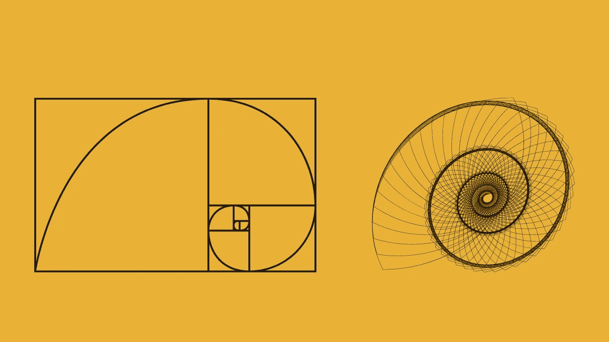

# 如何使用 Python 内置装饰器显著提高性能

> 原文：[`towardsdatascience.com/how-to-use-python-built-in-decoration-to-improve-performance-significantly-4eb298f248e1?source=collection_archive---------1-----------------------#2024-04-14`](https://towardsdatascience.com/how-to-use-python-built-in-decoration-to-improve-performance-significantly-4eb298f248e1?source=collection_archive---------1-----------------------#2024-04-14)

图像由作者在 Canva 中制作

## 如何在 Python 中实现缓存机制，及何时不使用它？

 [Christopher Tao](https://christophertao.medium.com/?source=post_page---byline--4eb298f248e1--------------------------------)

·发表于 [Towards Data Science](https://towardsdatascience.com/?source=post_page---byline--4eb298f248e1--------------------------------) ·阅读时长 9 分钟·2024 年 4 月 14 日

--

当谈到提高 Python 执行性能时，特别是在数据处理方面，有太多的第三方库可以帮助我们。如果我们思考它们的机制，大多数库都依赖于优化数据结构或内存使用来实现性能提升。

例如，Dask 利用并行计算和内存优化，Pandas 依赖于数据集的矢量化，而 Modin 也优化了多核 CPU 和内存的使用。

在本文中，我不会介绍任何库。实际上，Python 本身有一个内置的装饰器，可以显著提高性能。我们无需安装任何东西，因为它是 Python 自带的。当然，它并不适用于所有场景。所以，在最后一节中，我还会讨论我们什么时候不应该使用它。

# 1\. 缓存装饰器的使用案例

图像由作者在 Canva 中制作
