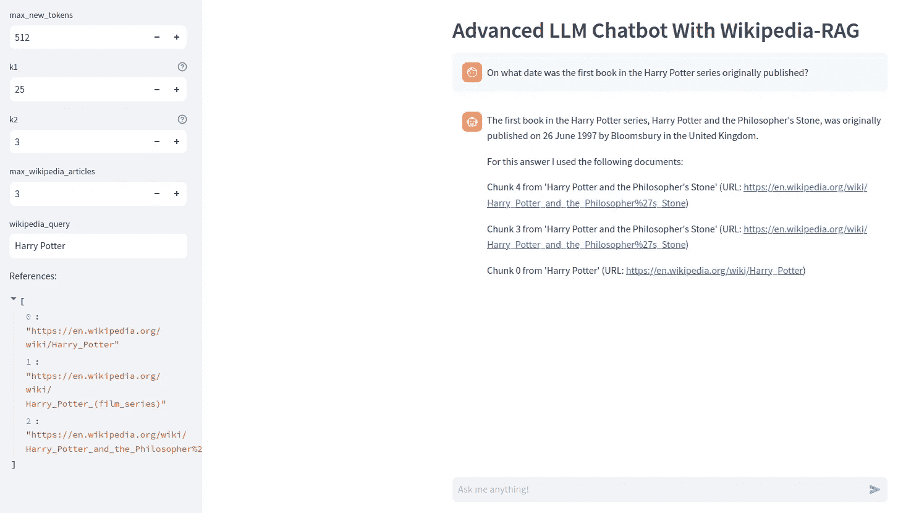
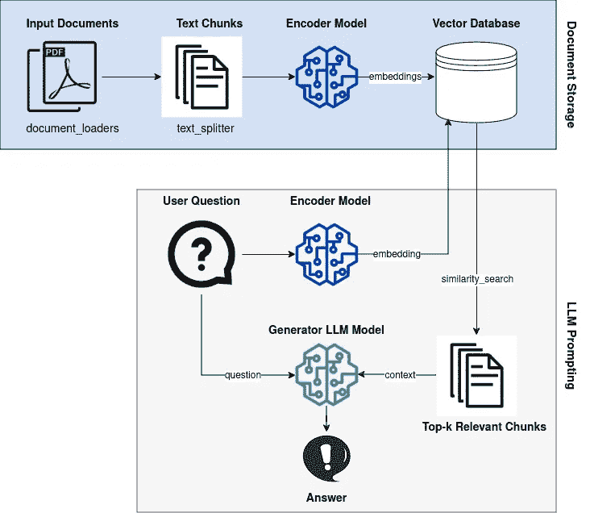

# 如何使用重新排序提高 LLM RAG 检索效果

> 原文：[`towardsdatascience.com/how-to-use-re-ranking-for-better-llm-rag-retrieval-243f89414266?source=collection_archive---------0-----------------------#2024-05-02`](https://towardsdatascience.com/how-to-use-re-ranking-for-better-llm-rag-retrieval-243f89414266?source=collection_archive---------0-----------------------#2024-05-02)

## 使用开源双编码器和交叉编码器构建一个先进的本地 LLM RAG 流水线，采用两步检索

 [Dr. Leon Eversberg](https://medium.com/@leoneversberg?source=post_page---byline--243f89414266--------------------------------)

·发布于 [Towards Data Science](https://towardsdatascience.com/?source=post_page---byline--243f89414266--------------------------------) ·阅读时间：9 分钟·2024 年 5 月 2 日

--

我构建的具有两阶段 RAG 检索的 LLM 聊天机器人，可以访问 Wikipedia。图片来自作者

基于大型语言模型（LLM）的聊天机器人可以通过检索增强生成（RAG）提供外部知识来进行改进。

这些外部知识可以减少错误答案（幻觉），并且还可以让模型访问到其训练数据中没有的信息。

使用 RAG，我们将信息（如 PDF 文档或 Wikipedia 文章）作为额外的上下文输入到提示中，提供给 LLM。

基本的 RAG 流水线：编码器模型和向量数据库用于高效地搜索相关的文档片段。图片来自我的文章 [如何构建本地开源 LLM 聊天机器人与 RAG](https://medium.com/towards-data-science/how-to-build-a-local-open-source-llm-chatbot-with-rag-f01f73e2a131)

然而，RAG 聊天机器人遵循数据科学的老原则：**垃圾进，垃圾出**。如果文档检索失败，LLM 模型就没有机会提供好的答案。

对基本 RAG 流水线的改进是使用 **重新排序器**。重新排序器将用户的问题和所有最初检索到的文档作为输入，并根据这些文档与问题的匹配程度重新排序。
