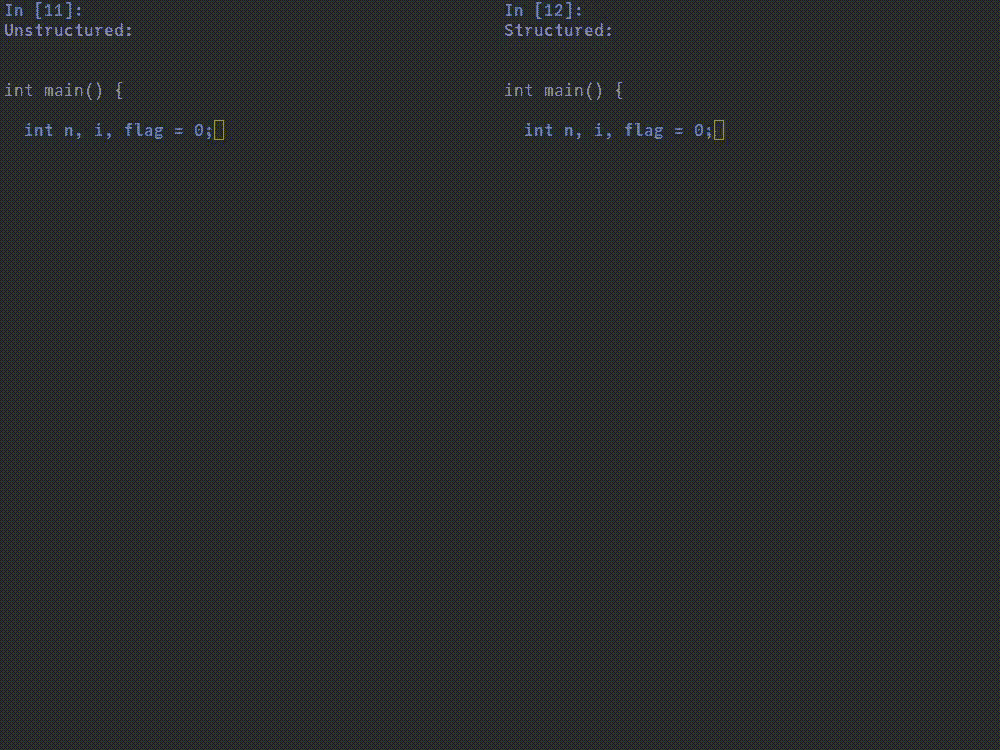
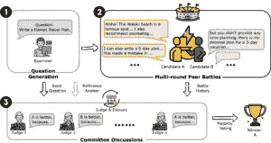

# 如何使用结构化生成进行 LLM 作为裁判的评估

> 原文：[`towardsdatascience.com/how-to-use-structured-generation-for-llm-as-a-judge-evaluations-c6018cdab8be?source=collection_archive---------10-----------------------#2024-11-27`](https://towardsdatascience.com/how-to-use-structured-generation-for-llm-as-a-judge-evaluations-c6018cdab8be?source=collection_archive---------10-----------------------#2024-11-27)

## 结构化生成是构建复杂的多步骤推理代理的基础，尤其是在 LLM 评估中——尤其是对于开源模型

[](https://medium.com/@calebkaiser?source=post_page---byline--c6018cdab8be--------------------------------)[](https://towardsdatascience.com/?source=post_page---byline--c6018cdab8be--------------------------------) [Caleb Kaiser](https://medium.com/@calebkaiser?source=post_page---byline--c6018cdab8be--------------------------------)

·发表于 [Towards Data Science](https://towardsdatascience.com/?source=post_page---byline--c6018cdab8be--------------------------------) ·阅读时间 20 分钟·2024 年 11 月 27 日

--


来源：[通过 SDXL 1.0 生成](https://huggingface.co/stabilityai/stable-diffusion-xl-base-1.0)

*声明：我是* [*Opik*](https://github.com/comet-ml/opik)*的维护者之一，该项目是本文后面提到的开源项目。*

在过去的几个月里，我一直在致力于基于大型语言模型（LLM）的评估（“LLM 作为裁判”指标）。到目前为止，结果非常令人鼓舞，特别是在一些难以通过启发式方法量化的评估中，比如幻觉检测或内容审核。

然而，基于 LLM 的度量工程一直出奇地具有挑战性。评估和单元测试，特别是那些包含更复杂逻辑的测试，要求你了解数据的结构。而对于 LLM 及其概率输出，可靠地输出特定格式和结构是非常困难的。一些托管模型提供商现在提供`结构化输出`模式，但这些模式仍然存在限制，并且如果你使用的是开源或本地模型，这些模式对你帮助不大。

这个问题的解决方案是使用**结构化生成**。除了使基于 LLM 的评估更可靠之外，它还解锁了一个全新的复杂且强大的多阶段评估类别。

在这一部分，我想介绍一下结构化生成及其背后的一些大思想，然后再深入探讨使用 LLM 评判器进行幻觉检测的具体示例。下面所有的代码示例都可以在这个[Colab 笔记本](https://colab.research.google.com/drive/1-lQn0qvJMN1BBuDjRuCzySA7gLhpcdBo#scrollTo=8QOySg8J5AcT)中运行，因此在跟随的过程中，欢迎你运行这些示例。

# 使用上下文无关文法（CFG）进行结构化生成简要介绍

结构化生成是机器学习的一个子领域，专注于通过将输出限制为符合某个特定模式来引导生成模型的输出。举个例子，与其微调一个模型使其输出有效的 JSON，你可能会限制一个更通用模型的输出，只匹配有效的 JSON 模式。

你可以通过不同的策略来限制模型的输出，但最常见的方法是在采样阶段直接干预，使用某些外部模式来防止采样到“不正确”的标记。

此时，结构化生成已经成为 LLM 服务器中相当常见的特性。vLLM、NVIDIA NIM、llama.cpp 和 Ollama 都支持它。如果你没有在使用模型服务器，像[Outlines](https://github.com/dottxt-ai/outlines)这样的库使得对任何模型的实现变得非常简单。OpenAI 也提供了一种“结构化输出”模式，类似地，允许你从他们的 API 中指定响应模式。

不过，我发现尝试从零开始做一个简单的实现有助于我对概念的直观理解，所以我们将从这里开始。

结构化生成有两个主要组成部分：

+   定义模式

+   解析输出

对于模式，我将使用上下文无关文法（CFG）。如果你不熟悉，文法是解析语言的一种模式。简单地说，它定义了在语言中什么是“有效”的，什么不是。如果你有兴趣深入了解，*极好的*兔子洞是，上下文无关语言是乔姆斯基语言层级的一部分。令人惊叹的 Kay Lack 在[这里](https://www.youtube.com/watch?v=ENKT0Z3gldE)有一段关于文法和解析的精彩入门视频，感兴趣的话可以观看。

用于解析和构建上下文无关文法（CFG）的最流行的库是 Lark。在下面的代码中，我使用该库编写了一个简单的 JSON 语法：

```py
from lark import Lark

grammar = r"""
?start: value

?value: object
       | array
       | ESCAPED_STRING
       | SIGNED_NUMBER      -> number
       | "true"             -> true
       | "false"            -> false
       | "null"             -> null

array  : "[" [value ("," value)*] ["]"]
object : "{" [pair ("," pair)*] ["}"]
pair   : ESCAPED_STRING ":" value

%import common.ESCAPED_STRING
%import common.SIGNED_NUMBER
%import common.WS_INLINE
%ignore WS_INLINE
"""

parser = Lark(grammar, start="start", parser="lalr", debug=True)
```

如果你不熟悉 CFG 或 Lark，以上内容可能会让你觉得有点让人畏惧，但其实它非常直接。`?start` 行表示我们从一个 `value` 开始。接着，我们定义 `value` 为一个对象、一个数组、一个转义字符串、一个带符号的数字、一个布尔值或一个 null 值。`->` 符号表示我们将这些字符串值映射到字面值。接下来，我们进一步指定了 `array`、`object` 和 `pair` 的含义，然后最后指示我们的解析器忽略内联空格。你可以把它看作是我们不断地“扩展”每个高级概念，如 `start` 或 `value`，直到达到如此低的抽象级别，以至于无法再扩展。在语法学的术语中，这些“无法再扩展的低级符号”被称为“终结符”。

你会立即遇到的一个问题是，上面的代码只能确定字符串是否是有效的或无效的 JSON。由于我们使用的是语言模型并且一次生成一个标记，我们将会有很多技术上无效的中间字符串。有更优雅的处理方法，但为了提高速度，我只是定义了一个简单的函数来检查我们是否正在生成一个字符串：

```py
def is_incomplete_string(input_string):
    quote_count = input_string.count('"')
    if quote_count % 2 != 0:
        return True
    return False
```

定义好这一切之后，让我们进行一个小测试，看看我们的解析器是否能够准确地区分有效、无效和不完整的 JSON 字符串：

```py
from lark import UnexpectedCharacters, UnexpectedToken

# We will use this method later in constraining our model output
def try_and_recover(json_string):
    try:
        parser.parse(json_string)
        return {"status": "valid", "message": "The JSON is valid."}
    except UnexpectedToken as e:
        return {"status": "incomplete", "message": f"Incomplete JSON. Error: {str(e)}"}
    except UnexpectedCharacters as e:
        if is_incomplete_string(json_string):
            return {"status": "incomplete", "message": "Incomplete string detected."}
        return {"status": "invalid", "message": f"Invalid JSON. Error: {str(e)}"}
    except Exception as e:
        return {"status": "invalid", "message": f"Unknown error. JSON is invalid. Error: {str(e)}"}

# Test cases
test_cases = [
    '{"key": "value", "key2": ',  # Incomplete JSON
    '[1, 2, 3',                   # Incomplete JSON
    '{"key": "value"}',           # Complete JSON
    'true',                       # Valid JSON
    '{"key": true, "nested": {',  # Incomplete JSON
    '{"answer": "Paris',          # Incomplete JSON
    'invalid syntax'              # Invalid JSON
]

# Test and display results
results = []
for test in test_cases:
    result = try_and_recover(test)
    results.append({"input": test, "result": result})

for test in results:
  print(test)
```

```py
{'input': '{"key": "value", "key2": ', 'result': {'status': 'incomplete', 'message': "..."}}
{'input': '[1, 2, 3', 'result': {'status': 'valid', 'message': '...'}}
{'input': '{"key": "value"}', 'result': {'status': 'valid', 'message': '...'}}
{'input': 'true', 'result': {'status': 'valid', 'message': '...'}}
{'input': '{"key": true, "nested": {', 'result': {'status': 'valid', 'message': '...'}}
{'input': '{"answer": "Paris', 'result': {'status': 'incomplete', 'message': '...'}}
{'input': 'invalid syntax', 'result': {'status': 'invalid', 'message': "..."}}
```

它有效！

作为最后的测试，让我们使用 `try_and_recover()` 函数来引导我们使用相对较小模型的解码过程。在下面的代码中，我们将使用一个经过指令调优的 Qwen 2.5 模型，参数为 30 亿，我们将问它一个简单的问题。首先，让我们初始化模型和分词器：

```py
from transformers import AutoModelForCausalLM, AutoTokenizer
model_name = "Qwen/Qwen2.5-3B-Instruct"

tokenizer = AutoTokenizer.from_pretrained(model_name)
model = AutoModelForCausalLM.from_pretrained(model_name, device_map="auto")
```

现在，我们想定义一个函数来递归地从模型中采样，使用我们的 `try_and_recover()` 函数来约束输出。下面，我定义了这个函数，它通过递归地从最可能的前 20 个下一个标记中采样，并选择第一个满足有效或不完整 JSON 字符串的标记：

```py
import torch

def sample_with_guidance(initial_text):
    """
    Generates a structured response from the model, guided by a validation function.

    Args:
        initial_text (str): The initial input text to the model.

    Returns:
        str: The structured response generated by the model.
    """
    response = ""  # Accumulate the response string here
    next_token = None  # Placeholder for the next token

    while next_token != tokenizer.eos_token:  # Continue until the end-of-sequence token is generated
        # Encode the current input (initial_text + response) for the model
        input_ids = tokenizer.encode(initial_text + response, return_tensors="pt").to(device)

        with torch.no_grad():  # Disable gradients for inference
            outputs = model(input_ids)

            # Get the top 20 most likely next tokens
            top_tokens = torch.topk(outputs.logits[0, -1, :], 20, dim=-1).indices
            candidate_tokens = tokenizer.batch_decode(top_tokens)

        for token in candidate_tokens:
            # Check if the token is the end-of-sequence token
            if token == tokenizer.eos_token:
                # Validate the current response to decide if we should finish
                validation_result = try_and_recover(response)
                if validation_result['status'] == 'valid':  # Finish if the response is valid
                    next_token = token
                    break
                else:
                    continue  # Skip to the next token if invalid

            # Simulate appending the token to the response
            extended_response = response + token

            # Validate the extended response
            validation_result = try_and_recover(extended_response)
            if validation_result['status'] in {'valid', 'incomplete'}:
                # Update the response and set the token as the next token
                response = extended_response
                next_token = token
                print(response)  # Just to see our intermediate outputs
                break

    return response
```

这不是最具性能或最稳健的方法，但对于我们的目的来说已经足够好。如果你想更好地了解更优化的方法，可以看看 [llama.cpp 如何实现结构化生成](https://github.com/ggerganov/llama.cpp/blob/master/grammars/README.md)，或者像 [Outlines 这样的库是如何处理的](https://github.com/dottxt-ai/outlines)。

使用以下代码，我们可以测试这个结构化生成函数的性能：

```py
import json

messages = [
    {
     "role": "user", 
     "content": "What is the capital of France? Please only answer using the following JSON schema: { \\"answer\\": str }."
     }
]

# Format the text for our particular model
input_text = tokenizer.apply_chat_template(messages, tokenize=False, add_generation_prompt=True)

output = sample_with_guidance(input_text)

print("Parsed JSON Object:")
print(json.loads(output))
```

```py
{
{ "
{ "answer
{ "answer":
{ "answer": "
{ "answer": "Paris
{ "answer": "Paris"
{ "answer": "Paris" }

Parsed JSON Object:
{ "answer": "Paris" }
```

这种方法显然会给你的代码增加一些计算开销，但一些更优化的实现实际上能够在最小的延迟影响下结构化模型的输出。下面是使用 llama.cpp 的语法结构化生成功能进行非结构化生成与结构化生成的并排对比：



来源：[语法结构化生成的速度有多快？](https://blog.dottxt.co/how-fast-cfg.html)

这个对比是由 Brandon Willard 从.txt（Outlines 背后的公司）记录的，作为[他关于结构化生成延迟的精彩文章的一部分](https://blog.dottxt.co/how-fast-cfg.html)。如果你有兴趣深入了解这个领域，我强烈推荐阅读这篇文章。

好的，在这个简单介绍之后，让我们来看看如何将结构化生成应用于 LLM 作为评判标准的度量，比如幻觉检测。

# 如何通过结构化生成来检测幻觉

幻觉检测是基于 LLM 评估的“经典”应用之一。传统的启发式方法在幻觉的细微差别上存在困难，这在很大程度上是因为“幻觉”并没有一个普遍公认的定义。为了本文的目的，我们将采用[伊利诺伊大学香槟分校最近发表的一篇论文中的定义](https://arxiv.org/html/2403.16527v1)，我认为它既具描述性又具有可用性：

*幻觉是模型生成的输出，与实际部署中的约束冲突，或偏离期望行为，或者与当前任务完全无关，但在特定情况下可能被认为在语法上是可行的。*

换句话说，幻觉是一个看起来似乎合理的输出。它语法正确，参考了周围的上下文，看起来符合任务的“流程”。然而，它也与任务的一些基本指令相矛盾。这可能意味着得出错误的结论，引用不存在的数据，或者完全忽视任务的实际指令。

显然，为了分析像幻觉这样模糊的概念，需要编码一个离散的规则系统，这本身就是一个挑战。然而，LLM 非常适合这种复杂的任务。

使用 LLM 来执行幻觉分析并不难设置。我们需要做的只是提示模型分析输出文本中的幻觉。在[Opik 内置的 Hallucination()度量](https://github.com/comet-ml/opik)中，我们使用了以下提示：

```py
context_hallucination_template = """You are an expert judge tasked with evaluating the faithfulness of an AI-generated answer to the given context. Analyze the provided INPUT, CONTEXT, and OUTPUT to determine if the OUTPUT contains any hallucinations or unfaithful information.

Guidelines:
1\. The OUTPUT must not introduce new information beyond what's provided in the CONTEXT.
2\. The OUTPUT must not contradict any information given in the CONTEXT.
2\. The OUTPUT should not contradict well-established facts or general knowledge.
3\. Ignore the INPUT when evaluating faithfulness; it's provided for context only.
4\. Consider partial hallucinations where some information is correct but other parts are not.
5\. Pay close attention to the subject of statements. Ensure that attributes, actions, or dates are correctly associated with the right entities (e.g., a person vs. a TV show they star in).
6\. Be vigilant for subtle misattributions or conflations of information, even if the date or other details are correct.
7\. Check that the OUTPUT doesn't oversimplify or generalize information in a way that changes its meaning or accuracy.

Analyze the text thoroughly and assign a hallucination score between 0 and 1, where:
- 0.0: The OUTPUT is entirely faithful to the CONTEXT
- 1.0: The OUTPUT is entirely unfaithful to the CONTEXT

INPUT (for context only, not to be used for faithfulness evaluation):
{input}

CONTEXT:
{context}

OUTPUT:
{output}

Provide your verdict in JSON format:
{{
    "score": <your score between 0.0 and 1.0>,
    "reason": [
        <list your reasoning as bullet points>
    ]
}}"""
```

然而，困难的部分是如何通过程序化的方式进行分析。在实际应用中，我们希望能够自动解析模型的输出，并收集幻觉得分，无论是作为模型评估的一部分，还是作为推理管道的一部分。做到这一点将需要我们编写针对模型输出的代码，而如果 LLM 的输出格式不正确，评估过程将会中断。

这是一个即使对于最先进的基础模型来说也存在的问题，但在使用较小的语言模型时，这个问题会被大大夸大。它们的输出是概率性的，无论你在提示中多么细致，都不能保证它们总是以正确的结构做出回应。

*除非*，当然，你使用的是结构化生成。

让我们通过一个简单的例子来使用 Outlines 和 Opik。首先，我们希望使用 Outlines 初始化我们的模型。在这个示例中，我们将使用 Qwen2.5 的 5 亿参数版本。虽然这个模型的规模令人印象深刻，且足够小，可以在 Colab 笔记本中快速运行，但为了更准确的结果，你可能希望使用更大的模型。

```py
import outlines

model_kwargs = {
    "device_map": "auto"
}

model = outlines.models.transformers("Qwen/Qwen2.5-0.5B-Instruct", model_kwargs=model_kwargs)
```

当你的模型下载完成后，你可以创建一个`generator`。在 Outlines 中，`generator`是一个推理管道，它将输出模式与模型结合。在下面的代码中，我们将使用 Pydantic 定义一个模式，并初始化我们的生成器：

```py
import pydantic
from typing import List

class HallucinationResponse(pydantic.BaseModel):
    score: int
    reason: List[str]

generator = outlines.generate.json(model, HallucinationResponse)
```

现在，如果我们将一个字符串传递给生成器，它将输出一个格式正确的对象。

接下来，让我们在 Opik 中设置我们的幻觉度量。使用 Opik 的 baseMetric 类创建度量非常简单：

```py
from typing import Optional, List, Any
from opik.evaluation.metrics import base_metric

class HallucinationWithOutlines(base_metric.BaseMetric):
    """
    A metric that evaluates whether an LLM's output contains hallucinations based on given input and context.
    """

    def __init__(
        self,
        name: str = "hallucination_metric",
    ):
        super().__init__(name=name)

    def score(
        self,
        input: str,
        output: str,
        context: Optional[List[str]] = None,
        **ignored_kwargs: Any,
    ) -> HallucinationResponse:
        """
        Calculate the hallucination score for the given input, output, and optional context field.

        Args:
            input: The original input/question.
            output: The LLM's output to evaluate.
            context: A list of context strings. If not provided, the presence of hallucinations will be evaluated based on the output only.
            **ignored_kwargs: Additional keyword arguments that are ignored.

        Returns:
            HallucinationResponse: A HallucinationResponse object with a score of 1.0 if hallucination
                is detected, 0.0 otherwise, along with the reason for the verdict.
        """
        llm_query = context_hallucination_template.format(input=input, output=output, context=context)

        with torch.no_grad():
            return generator(llm_query)
```

我们在上面所做的实际上只是使用先前定义的模板字符串生成我们的提示，然后将其传递给生成器。

现在，让我们在一个实际的幻觉数据集上试试我们的度量，了解它是如何工作的。我们将使用 HaluEval 数据集中的一个拆分，这个数据集可以通过 HuggingFace 免费下载并具有宽松的许可，我们将把它上传为 Opik 数据集用于实验。我们会使用一些额外的逻辑，确保数据集在幻觉和非幻觉样本之间保持平衡：

```py
import opik
import pandas as pd

client = opik.Opik()

# Create dataset

dataset = client.get_or_create_dataset(
    name="HaluEval-qa-samples Balanced", 
    description="HaluEval-qa-samples dataset"
)

# Insert items into dataset
df = pd.read_parquet(
    "hf://datasets/pminervini/HaluEval/qa_samples/data-00000-of-00001.parquet"
)

n_per_class = 100  # 100 each to get 200 total
df_balanced = pd.concat([
    df[df['hallucination'] == 'yes'].sample(n=n_per_class, random_state=42),
    df[df['hallucination'] == 'no'].sample(n=n_per_class, random_state=42)
])
df = df_balanced

dataset_records = [
    {
        "input": x["question"],
        "context": x['knowledge'],
        "output": x["answer"],
        "hallucination_label": x["hallucination"],
    }
    for x in df.to_dict(orient="records")
]

dataset.insert(dataset_records)
```

现在，我们只需使用我们的 HallucinationWithOutlines()度量定义一个评估任务，并将其应用于我们的数据集：

```py
from opik.evaluation import evaluate
from opik.evaluation.metrics import Equals
from typing import Dict

# Define the evaluation task
def evaluation_task(x: Dict):
    metric = HallucinationWithOutlines()
    try:
        metric_score = metric.score(
            input=x["input"], context=x["context"], output=x["output"]
        )
        hallucination_score = metric_score.score
        hallucination_reason = metric_score.reason
    except Exception as e:
        print(e)
        hallucination_score = None
        hallucination_reason = str(e)

    return {
        "output": "yes" if hallucination_score == 1 else "no",
        "hallucination_reason": hallucination_reason,
        "reference": x["hallucination_label"],
    }

# Define the scoring metric
check_hallucinated_metric = Equals(name="Correct hallucination score")

res = evaluate(
    dataset=dataset,
    task=evaluation_task,
    scoring_metrics=[check_hallucinated_metric],
)
```

```py
Evaluation: 100%|██████████| 200/200 [09:34<00:00,  2.87s/it]
╭─   HaluEval-qa-samples Balanced (200 samples)  ─╮
│                                                 │
│ Total time:        00:09:35                     │
│ Number of samples: 200                          │
│                                                 │
│ Correct hallucination score: 0.4600 (avg)       │
│                                                 │
╰─────────────────────────────────────────────────╯
Uploading results to Opik ... 
View the results in your Opik dashboard.
```

就是这么简单！请注意，没有任何样本因为输出结构不正确而失败。现在让我们尝试运行相同的评估，但不使用结构化生成。为了实现这一点，我们可以更改生成器类型：

```py
generator = outlines.generate.text(model)
```

并修改我们的度量来解析模型输出中的 JSON：

```py
from typing import Optional, List, Any
from opik.evaluation.metrics import base_metric
import json

class HallucinationUnstructured(base_metric.BaseMetric):
    """
    A metric that evaluates whether an LLM's output contains hallucinations based on given input and context.
    """

    def __init__(
        self,
        name: str = "hallucination_metric",
    ):
        super().__init__(name=name)

    def score(
        self,
        input: str,
        output: str,
        context: Optional[List[str]] = None,
        **ignored_kwargs: Any,
    ) -> HallucinationResponse:
        """
        Calculate the hallucination score for the given input, output, and optional context field.

        Args:
            input: The original input/question.
            output: The LLM's output to evaluate.
            context: A list of context strings. If not provided, the presence of hallucinations will be evaluated based on the output only.
            **ignored_kwargs: Additional keyword arguments that are ignored.

        Returns:
            HallucinationResponse: A HallucinationResponse object with a score of 1.0 if hallucination
                is detected, 0.0 otherwise, along with the reason for the verdict.
        """
        llm_query = context_hallucination_template.format(input=input, output=output, context=context)

        with torch.no_grad():
            return json.loads(generator(llm_query)) # Parse JSON string from response
```

保持代码其余部分不变，现在运行结果为：

```py
Evaluation:   0%|          | 0/200 [00:00<?, ?it/s]Unterminated string starting at: line 5 column 9 (char 47)
Evaluation:   2%|▏         | 1/200 [00:56<46:15, 56.63s/it]Expecting value: line 1 column 2 (char 1)
Expecting value: line 1 column 2 (char 1)
Evaluation:   6%|▌         | 3/200 [00:57<10:09, 12.96s/it]Unterminated string starting at: line 4 column 9 (char 45)
Expecting value: line 1 column 2 (char 1)
Evaluation:  12%|█▏        | 6/200 [00:57<03:01,  4.12s/it]Unterminated string starting at: line 4 column 9 (char 45)
```

几乎每个字符串都未能正确解析。推理时间也大大增加，因为响应的长度是可变的，而结构化输出有助于保持响应简洁。

没有结构化生成，这种评估就无法实现，尤其是在一个这么小的模型上。作为实验，尝试用更大的模型运行这段代码，看看平均准确度分数是如何提高的。

# 我们能否通过结构化生成构建更复杂的 LLM 法官？

上面的幻觉检测示例非常直接。然而，结构化生成给 LLM 法官带来的真正价值在于，它使我们能够构建更复杂的多轮评估。

为了给出一个极端的多步骤评估示例，最近有一篇论文通过为不同的 LLM 代理构建多个“人格”，并让[代理在实际法庭结构中辩论](https://arxiv.org/html/2405.20267v4)，在 LLM 评估中取得了成功：



[来源：Auto-Arena: 用代理对抗战和委员会讨论自动化 LLM 评估](https://arxiv.org/html/2405.20267v4)

强制不同的代理支持不同的立场并审查彼此的论点，同时让另一个代理充当“法官”做出最终决定，显著提高了评估的准确性。

为了使这种系统正常工作，不同代理之间的交接必须顺利。如果一个代理需要在 5 个可能的行动中做出选择，我们必须 100%确信模型只会输出这 5 个有效行动中的一个。通过结构化生成，我们可以实现这种可靠性。

让我们尝试一个实际示例，扩展我们之前的幻觉度量方法。我们将尝试以下改进：

+   在第一次运行时，模型将生成 3 个候选的幻觉，并为每个幻觉提供推理过程。

+   对于每个候选项，模型将单独评估它们，并判断它们是否为幻觉，同时提供扩展的推理过程。

+   如果模型发现任何候选项是幻觉，它将为整个样本返回 1.0。

通过赋予模型生成更长上下文链的能力，我们为它提供了更多的“中介计算”空间，并希望能得到更准确的最终输出。

首先，让我们为这个任务定义一系列提示：

```py
generate_candidates_prompt = """
You are an expert judge tasked with evaluating the faithfulness of an AI-generated answer to a given context. Your goal is to determine if the provided output contains any hallucinations or unfaithful information when compared to the given context.

Here are the key elements you'll be working with:

1\. <context>{context}</context>
   This is the factual information against which you must evaluate the output. All judgments of faithfulness must be based solely on this context.

2\. <output>{output}</output>
   This is the AI-generated answer that you need to evaluate for faithfulness.

3\. <input>{input}</input>
   This is the original question or prompt. It's provided for context only and should not be used in your faithfulness evaluation.

Evaluation Process:
1\. Carefully read the CONTEXT and OUTPUT.
2\. Analyze the OUTPUT for any discrepancies or additions when compared to the CONTEXT.
3\. Consider the following aspects:
   - Does the OUTPUT introduce any new information not present in the CONTEXT?
   - Does the OUTPUT contradict any information given in the CONTEXT?
   - Does the OUTPUT contradict well-established facts or general knowledge?
   - Are there any partial hallucinations where some information is correct but other parts are not?
   - Is the subject of statements correct? Ensure that attributes, actions, or dates are correctly associated with the right entities.
   - Are there any subtle misattributions or conflations of information, even if dates or other details are correct?
   - Does the OUTPUT oversimplify or generalize information in a way that changes its meaning or accuracy?

4\. Based on your analysis, create a list of 3 statements in the OUTPUT which are potentially hallucinations or unfaithful. For each potentially hallucinated or unfaithful statement from the OUTPUT, explain why you think it violates any of the aspects from step 3.

5\. Return your list of statements and associated reasons in the following structured format:

{{
  "potential_hallucinations": [
    {{
      "output_statement": string,
      "reasoning": string,
    }},
  ]
}}

Here is an example output structure (do not use these specific values, this is just to illustrate the format):

{{
  "potential_hallucinations": [
    {{
      "output_statement": "The company was founded in 1995",
      "reasoning": "There is no mention of a founding date in the CONTEXT. The OUTPUT introduces new information not present in the CONTEXT.
    }},
    {{
      "output_statement": "The product costs $49.99.",
      "reasoning": "The CONTEXT lists the flagship product price at $39.99\. The OUTPUT directly contradicts the price given in the CONTEXT."
    }},
    {{
      "output_statement": "The flagship product was their most expensive item.",
      "reasoning": "The CONTEXT lists mentions another product which is more expensive than the flagship product. The OUTPUT directly contradicts information given in the CONTEXT."
    }}
  ]
}}

Now, please proceed with your analysis and evaluation of the provided INPUT, CONTEXT, and OUTPUT.
"""

evaluate_candidate_prompt = """
Please examine the following potential hallucination you detected in the OUTPUT:

{candidate}

You explained your reasons for flagging the statement like so:

{reason}

As a reminder, the CONTEXT you are evaluating the statement against is:

{context}

Based on the above, could you answer "yes" to any of the following questions?
  - Does the OUTPUT introduce any new information not present in the CONTEXT?
  - Does the OUTPUT contradict any information given in the CONTEXT?
  - Does the OUTPUT contradict well-established facts or general knowledge?
  - Are there any partial hallucinations where some information is correct but other parts are not?
  - Is the subject of statements correct? Ensure that attributes, actions, or dates are correctly associated with the right entities.
  - Are there any subtle misattributions or conflations of information, even if dates or other details are correct?
  - Does the OUTPUT oversimplify or generalize information in a way that changes its meaning or accuracy?

Please score the potentially hallucinated statement using the following scale:

  - 1.0 if you answered "yes" to any of the previous questions, and you believe the statement is hallucinated or unfaithful to the CONTEXT.
  - 0.0 if you answered "no" to all of the previous questions, and after further reflection, you believe the statement is not hallucinated or unfaithful to the CONTEXT.

Before responding, please structure your response with the following format

{{
  "score": float,
  "reason": string

}}

Here is an example output structure (do not use these specific values, this is just to illustrate the format):

{{
  "score": 1.0,
  "reason": "The CONTEXT and OUTPUT list different prices for the same product. This leads me to answer 'yes' to the question, 'Does the OUTPUT contradict any information given in the CONTEXT?'"
}}

Now, please proceed with your analysis and evaluation.

""" 
```

现在，我们可以为不同的模型输出定义一些 Pydantic 模型：

```py
# Generated by generate_candidates_prompt
class PotentialHallucination(pydantic.BaseModel):
    output_statement: str
    reasoning: str

class HallucinationCandidates(pydantic.BaseModel):
    potential_hallucinations: List[PotentialHallucination]

# Generated by evaluate_candidate_prompt
class HallucinationScore(pydantic.BaseModel):
    score: float
    reason: str
```

有了这一切，我们可以组合两个生成器，一个用于生成候选幻觉，另一个用于为单个候选项打分：

```py
import outlines

model_kwargs = {
    "device_map": "auto"
}

model = outlines.models.transformers("Qwen/Qwen2.5-0.5B-Instruct", model_kwargs=model_kwargs)

candidate_generator = outlines.generate.json(model, HallucinationCandidates)
generator = outlines.generate.json(model, HallucinationScore)
```

最后，我们可以构建一个 Opik 度量方法。我们将使其代码保持简洁：

```py
class HallucinationMultistep(base_metric.BaseMetric):
    """
    A metric that evaluates whether an LLM's output contains hallucinations using a multi-step appraoch.
    """

    def __init__(
        self,
        name: str = "hallucination_metric",
    ):
        super().__init__(name=name)

    def score(
        self,
        input: str,
        output: str,
        context: Optional[List[str]] = None,
        **ignored_kwargs: Any,
    ) -> HallucinationScore:
     # Generate candidates
        candidates_query = generate_candidates_prompt.format(input=input, output=output, context=context)
        output = candidate_generator(candidates_query)

        # Initialize to zero, in case the model simply finds no candidates for hallucination
        score = HallucinationScore(score=0.0, reason="Found no candidates for hallucination")

        for candidate in output.potential_hallucinations:
          followup_query = evaluate_candidate_prompt.format(candidate=candidate.output_statement, reason=candidate.reasoning, context=context)
          new_score = generator(followup_query)
          score = new_score
          if new_score.score > 0.0:
           # Early return if we find a hallucination
            return new_score

        return score
```

我们这里所做的只是生成第一个提示，当它传递给候选生成器时，应产生几个幻觉候选项。然后，我们将每个候选项（按照候选评估提示格式化）传入候选评估生成器。

如果我们使用与之前相同的代码运行它，并对新度量进行些微修改：

```py
# Define the evaluation task
def evaluation_task(x: Dict):
  # Use new metric
    metric = HallucinationMultistep()
    try:
        metric_score = metric.score(
            input=x["input"], context=x["context"], output=x["output"]
        )
        hallucination_score = metric_score.score
        hallucination_reason = metric_score.reason
    except Exception as e:
        print(e)
        hallucination_score = None
        hallucination_reason = str(e)

    return {
        "output": "yes" if hallucination_score == 1 else "no",
        "hallucination_reason": hallucination_reason,
        "reference": x["hallucination_label"],
    }

# Define the scoring metric
check_hallucinated_metric = Equals(name="Correct hallucination score")

res = evaluate(
    dataset=dataset,
    task=evaluation_task,
    scoring_metrics=[check_hallucinated_metric],
) 
```

```py
Evaluation: 100%|██████████| 200/200 [19:02<00:00,  5.71s/it]
╭─  HaluEval-qa-samples Balanced (200 samples)   ─╮
│                                                 │
│ Total time:        00:19:03                     │
│ Number of samples: 200                          │
│                                                 │
│ Correct hallucination score: 0.5200 (avg)       │
│                                                 │
╰─────────────────────────────────────────────────╯
Uploading results to Opik ... 
View the results in your Opik dashboard.
```

我们看到了很大的改进。记住，在相同数据集上运行这个相同的模型，并使用非常相似的初始提示，得到了 0.46 的评分。通过简单地添加这个额外的候选评估步骤，我们立即将评分提高到了 0.52。对于这么小的模型，这是非常好的！

# 结构化生成在 LLM 评估未来中的作用

大多数基础模型提供商，如 OpenAI 和 Anthropic，提供某种类型的`结构化输出`模式，通过预定义的模式响应您的查询。然而，LLM 评估的领域远远超出了这些提供商 API 的封闭生态系统。

例如：

+   所谓的“白盒”评估，通过将模型的内部状态纳入评估，是不可能在像 GPT-4o 这样的托管模型中实现的。

+   针对您的特定评估用例对模型进行微调，要求您使用开源模型。

+   如果您需要在本地运行评估管道，显然不能使用托管 API。

这还不包括对特定开源模型与流行基础模型的比较。

LLM 评估的未来将涉及更复杂的评估套件，将白盒指标、经典启发式方法和 LLM 评审结合成强大的多回合系统。开源，或者至少是本地可用的 LLM，是这一未来的重要组成部分——而结构化生成是实现这一未来的基础设施的关键部分。

*最初发表于* [*https://www.comet.com*](https://www.comet.com/site/blog/structured-generation-llm-as-a-judge/) *2024 年 11 月 27 日。*
