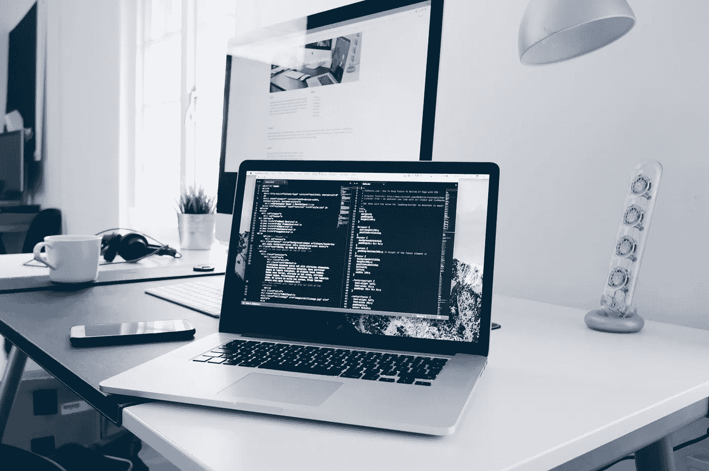

# 如何在 Python 中编写干净的代码

> 原文：[`towardsdatascience.com/how-to-write-clean-code-in-python-d1ffb9d9f042?source=collection_archive---------2-----------------------#2024-02-24`](https://towardsdatascience.com/how-to-write-clean-code-in-python-d1ffb9d9f042?source=collection_archive---------2-----------------------#2024-02-24)

## 《Clean Code》一书中的主要收获

 [Patrick Brus](https://brus-patrick63.medium.com/?source=post_page---byline--d1ffb9d9f042--------------------------------)

·发表于[Towards Data Science](https://towardsdatascience.com/?source=post_page---byline--d1ffb9d9f042--------------------------------) ·阅读时间 21 分钟 ·2024 年 2 月 24 日

--

图片由[Christopher Gower](https://unsplash.com/@cgower?utm_source=medium&utm_medium=referral)提供，来源于[Unsplash](https://unsplash.com/?utm_source=medium&utm_medium=referral)

编写干净的代码不仅仅是一个值得拥有的好习惯。当你运行生产就绪的代码时，编写干净的代码是必需的。

作为一名数据科学家，我主要使用 Jupyter Notebooks，旨在开发一个与现有数据兼容的模型。刚开始时，关键是证明一般来说，AI 可以根据数据提供价值。

但一旦证明了这一点，模型就需要投入生产。这也是问题开始的地方。

大部分代码都很丑陋，难以阅读和维护。作为数据科学家，我坦率地说，我并不在乎。

但现在，作为一名机器学习工程师，写干净代码是最重要的事情，尤其是当你编写的代码将被重用并投入生产时。

这就是为什么我阅读了《***Clean Code: A Handbook of Agile Software Craftsmanship***》这本书。这本书是编写干净代码的宣言。它的原则适用于所有编程语言，即使本书总是以 Java 为例。

在这篇文章中，我将强调最重要的干净代码规则，并希望将这些原则应用于 Python，以便你可以将它们直接与日常编程联系起来。
