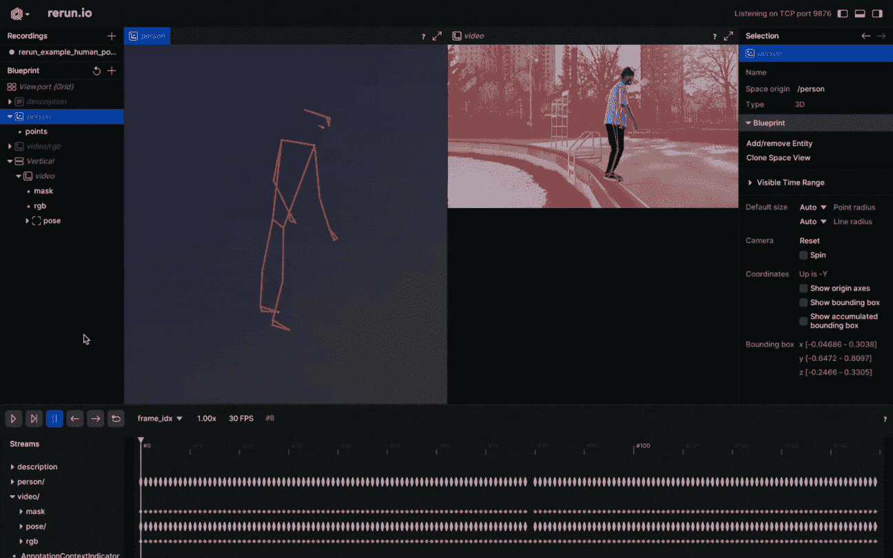

# 使用 MediaPipe 进行 2D 和 3D 的人体姿势跟踪：Rerun 展示

> 原文：[`towardsdatascience.com/human-pose-tracking-with-mediapipe-rerun-showcase-125053cfe64f?source=collection_archive---------1-----------------------#2024-03-11`](https://towardsdatascience.com/human-pose-tracking-with-mediapipe-rerun-showcase-125053cfe64f?source=collection_archive---------1-----------------------#2024-03-11)

## 如何轻松地使用 Rerun 可视化 MediaPipe 的人体姿势跟踪

[](https://andreasnaoum.medium.com/?source=post_page---byline--125053cfe64f--------------------------------)[](https://towardsdatascience.com/?source=post_page---byline--125053cfe64f--------------------------------) [Andreas Naoum](https://andreasnaoum.medium.com/?source=post_page---byline--125053cfe64f--------------------------------)

·发布于[Towards Data Science](https://towardsdatascience.com/?source=post_page---byline--125053cfe64f--------------------------------) ·7 分钟阅读·2024 年 3 月 11 日

--


人体姿势跟踪 | 作者图片

# 概述

我们探索了一个利用[MediaPipe](https://developers.google.com/mediapipe)跟踪 2D 和 3D 人体姿势的应用案例。更吸引人的是，使用开源可视化工具[Rerun](https://www.rerun.io)的可视化功能，为人体姿势提供了全景式的动态展示。

在这篇博客中，您将学习如何使用 MediaPipe 进行 2D 和 3D 人体姿势跟踪，并探索 Rerun 的可视化功能。

# 人体姿势跟踪

人体姿势跟踪是计算机视觉中的一项任务，重点是识别关键的身体位置、分析姿势并分类动作。这项技术的核心是一种预训练的机器学习模型，用于评估视觉输入并识别图像坐标和 3D 世界坐标中的身体关键点。该技术的应用案例包括但不限于人机交互、运动分析、游戏、虚拟现实、增强现实、健康等。

拥有一个完美的模型固然好，但遗憾的是，目前的模型仍不完善。尽管数据集可能包含各种人体类型，但每个人的身体差异很大。每个人体态的独特性带来了挑战，尤其是对于那些具有非标准臂长和腿长的人群，这可能会导致使用此技术时准确度降低。在考虑将这项技术整合到系统时，必须认识到可能存在的不准确性。希望科学界的持续努力能够为开发更强大的模型铺平道路。

除了缺乏准确性，利用这项技术还涉及到伦理和法律方面的问题。例如，在公共场所捕捉人体姿势可能会侵犯隐私权，尤其是在个人未同意的情况下。 在将这项技术应用于实际场景之前，考虑任何伦理和法律问题是至关重要的。

# 前置条件与设置

首先安装所需的库：

```py
# Install the required Python packages 
pip install mediapipe
pip install numpy
pip install opencv-python<4.6
pip install requests>=2.31,<3
pip install rerun-sdk

# or just use the requirements file
pip install -r examples/python/human_pose_tracking/requirements.txt
```

# 使用 MediaPipe 跟踪人体姿势


图片来自[姿势标记检测指南](https://developers.google.com/mediapipe/solutions/vision/pose_landmarker) [Google](https://about.google/brand-resource-center/) [1]

[**MediaPipe Python**](https://mediapipe-studio.webapps.google.com/home)是一个方便的工具，适用于希望将设备端机器学习解决方案集成到计算机视觉和机器学习中的开发者。

在下面的代码中，使用了[MediaPipe 姿势标记检测](https://developers.google.com/mediapipe/solutions/vision/pose_landmarker)来检测图像中的人体标记。此模型可以检测人体姿势标记，既可以作为图像坐标，也可以作为 3D 世界坐标。一旦成功运行了机器学习模型，就可以使用图像坐标和 3D 世界坐标来可视化输出结果。

```py
import mediapipe as mp
import numpy as np
from typing import Any
import numpy.typing as npt
import cv2

"""
    Read 2D landmark positions from Mediapipe Pose results.

    Args:
        results (Any): Mediapipe Pose results.
        image_width (int): Width of the input image.
        image_height (int): Height of the input image.

    Returns:
        np.array | None: Array of 2D landmark positions or None if no landmarks are detected.
"""
def read_landmark_positions_2d(
        results: Any,
        image_width: int,
        image_height: int,
) -> npt.NDArray[np.float32] | None:
    if results.pose_landmarks is None:
        return None
    else:
        # Extract normalized landmark positions and scale them to image dimensions
        normalized_landmarks = [results.pose_landmarks.landmark[lm] for lm in mp.solutions.pose.PoseLandmark]
        return np.array([(image_width * lm.x, image_height * lm.y) for lm in normalized_landmarks])

"""
    Read 3D landmark positions from Mediapipe Pose results.

    Args:
        results (Any): Mediapipe Pose results.

    Returns:
        np.array | None: Array of 3D landmark positions or None if no landmarks are detected.
"""
def read_landmark_positions_3d(
        results: Any,
) -> npt.NDArray[np.float32] | None:
    if results.pose_landmarks is None:
        return None
    else:
        # Extract 3D landmark positions
        landmarks = [results.pose_world_landmarks.landmark[lm] for lm in mp.solutions.pose.PoseLandmark]
        return np.array([(lm.x, lm.y, lm.z) for lm in landmarks])

"""
    Track and analyze pose from an input image.

    Args:
        image_path (str): Path to the input image.
"""
def track_pose(image_path: str) -> None:
    # Read the image, convert color to RGB
    image = cv2.imread(image_path)
    image = cv2.cvtColor(image, cv2.COLOR_BGR2RGB)

    # Create a Pose model instance
    pose_detector = mp.solutions.pose.Pose(static_image_mode=True)

    # Process the image to obtain pose landmarks
    results = pose_detector.process(image)
    h, w, _ = image.shape

    # Read 2D and 3D landmark positions
    landmark_positions_2d = read_landmark_positions_2d(results, w, h)
    landmark_positions_3d = read_landmark_positions_3d(results)
```

# 使用 Rerun 可视化 MediaPipe 的输出


Rerun 观察器 | 图片来自 [Rerun 文档](https://www.rerun.io/docs/reference/viewer/overview) [2]

[Rerun](https://www.rerun.io)作为一个多模态数据可视化工具，通过[Rerun 观察器](https://www.rerun.io/docs/reference/viewer/overview)，你可以构建布局、定制可视化效果，并与数据进行交互。 本节的其余部分将详细介绍如何使用 Rerun SDK 记录和呈现数据，并在 Rerun 观察器中进行可视化。


姿势标记模型 | 图片来自[姿势标记检测指南](https://developers.google.com/mediapipe/solutions/vision/pose_landmarker) [Google](https://about.google/brand-resource-center/) [1]

在 2D 和 3D 点中，指定点之间的连接是至关重要的。定义这些连接会自动渲染它们之间的线条。利用 MediaPipe 提供的信息，你可以从`POSE_CONNECTIONS`集合中获取姿势点连接，然后通过[Annotation Context](https://www.rerun.io/docs/concepts/annotation-context)将它们设置为关键点连接。

```py
rr.log(
        "/",
        rr.AnnotationContext(
            rr.ClassDescription(
                info=rr.AnnotationInfo(id=0, label="Person"),
                keypoint_annotations=[rr.AnnotationInfo(id=lm.value, label=lm.name) for lm in mp_pose.PoseLandmark],
                keypoint_connections=mp_pose.POSE_CONNECTIONS,
            )
        ),
        timeless=True,
    )
```

## 图像坐标 — 2D 位置


以 2D 点可视化人体姿势 | 图片作者

在视频上可视化身体姿势关键点似乎是一个不错的选择。为了实现这一点，你需要遵循 Rerun 文档中的实体和组件部分。[实体路径层次结构](https://www.rerun.io/docs/concepts/entity-path)页面描述了如何在同一实体上记录多个组件。例如，你可以创建“video”实体，并包括‘video/rgb’（视频）和‘video/pose’（身体姿势）组件。如果你打算将其用于视频，你需要使用[时间线](https://www.rerun.io/docs/concepts/timelines)的概念。每一帧都可以与适当的数据关联。

这里是一个可以在视频上可视化 2D 点的函数：

```py
def track_pose_2d(video_path: str) -> None:
    mp_pose = mp.solutions.pose  

    with closing(VideoSource(video_path)) as video_source, mp_pose.Pose() as pose:
        for idx, bgr_frame in enumerate(video_source.stream_bgr()):
            if max_frame_count is not None and idx >= max_frame_count:
                break

            rgb = cv2.cvtColor(bgr_frame.data, cv2.COLOR_BGR2RGB)

            # Associate frame with the data
            rr.set_time_seconds("time", bgr_frame.time)
            rr.set_time_sequence("frame_idx", bgr_frame.idx)

            # Present the video
            rr.log("video/rgb", rr.Image(rgb).compress(jpeg_quality=75))

            # Get the prediction results
            results = pose.process(rgb)
            h, w, _ = rgb.shape

            # Log 2d points to 'video' entity
            landmark_positions_2d = read_landmark_positions_2d(results, w, h)
            if landmark_positions_2d is not None:
                rr.log(
                    "video/pose/points",
                    rr.Points2D(landmark_positions_2d, class_ids=0, keypoint_ids=mp_pose.PoseLandmark),
                )
```

## 3D 世界坐标 — 3D 点


以 3D 点可视化人体姿势 | 图片作者

为什么要满足于 2D 点，当你可以使用 3D 点呢？创建一个新的实体，命名为“Person”，并记录 3D 点。完成！你刚刚创建了一个人类身体姿势的 3D 展示。

以下是如何实现的：

```py
def track_pose_3d(video_path: str, *, segment: bool, max_frame_count: int | None) -> None:
    mp_pose = mp.solutions.pose  

    rr.log("person", rr.ViewCoordinates.RIGHT_HAND_Y_DOWN, timeless=True)

    with closing(VideoSource(video_path)) as video_source, mp_pose.Pose() as pose:
        for idx, bgr_frame in enumerate(video_source.stream_bgr()):
            if max_frame_count is not None and idx >= max_frame_count:
                break

            rgb = cv2.cvtColor(bgr_frame.data, cv2.COLOR_BGR2RGB)

            # Associate frame with the data
            rr.set_time_seconds("time", bgr_frame.time)
            rr.set_time_sequence("frame_idx", bgr_frame.idx)

            # Present the video
            rr.log("video/rgb", rr.Image(rgb).compress(jpeg_quality=75))

            # Get the prediction results
            results = pose.process(rgb)
            h, w, _ = rgb.shape

            # New entity "Person" for the 3D presentation
            landmark_positions_3d = read_landmark_positions_3d(results)
            if landmark_positions_3d is not None:
                rr.log(
                    "person/pose/points",
                    rr.Points3D(landmark_positions_3d, class_ids=0, keypoint_ids=mp_pose.PoseLandmark),
                )
```

# 源代码

本教程专注于人体姿势追踪示例的主要部分。对于那些喜欢动手实践的人来说，这个示例的完整源代码可以在[GitHub](https://github.com/rerun-io/rerun/tree/latest/examples/python/human_pose_tracking)上找到。随意探索、修改并理解实现的内部工作原理。

# 提示与建议

## 1\. 为了提高效率，压缩图像

你可以通过压缩记录的图像来提升整体处理速度：

```py
rr.log(
  "video", 
  rr.Image(img).compress(jpeg_quality=75)
)
```

## 2\. 限制内存使用

如果你记录的数据超出了 RAM 的容量，系统会开始丢弃旧数据。默认的限制是系统 RAM 的 75%。如果你希望增加该限制，可以使用命令行参数—memory-limit。更多关于内存限制的信息可以在 Rerun 的[如何限制内存使用](https://www.rerun.io/docs/howto/limit-ram)页面找到。

## 3\. 根据需求定制可视化



自定义 Rerun Viewer | 图片作者

# 超越人体姿势追踪

*如果你觉得这篇文章有用并富有洞察力，那么还有更多内容！*

*类似的文章：*

[](https://ai.gopubby.com/real-time-face-and-face-landmark-detection-with-mediapipe-rerun-showcase-40481baa1763?source=post_page-----125053cfe64f--------------------------------) [## 实时人脸与面部关键点检测与 MediaPipe：Rerun 展示

### 如何轻松使用 Rerun 可视化 MediaPipe 的人脸和面部地标检测（2D 和 3D）

ai.gopubby.com](https://ai.gopubby.com/real-time-face-and-face-landmark-detection-with-mediapipe-rerun-showcase-40481baa1763?source=post_page-----125053cfe64f--------------------------------) [](/real-time-hand-tracking-and-gesture-recognition-with-mediapipe-rerun-showcase-9ec57cb0c831?source=post_page-----125053cfe64f--------------------------------) ## 使用 MediaPipe 进行实时手部跟踪和手势识别：Rerun 展示

### 如何使用 Rerun 可视化 MediaPipe 的手部跟踪和手势识别

towardsdatascience.com 

[Andreas Naoum](https://andreasnaoum.medium.com/?source=post_page-----125053cfe64f--------------------------------)

## 多模态数据可视化

[查看列表](https://andreasnaoum.medium.com/list/multimodal-data-visualizations-48083691fa4b?source=post_page-----125053cfe64f--------------------------------)5 个故事

*我定期分享计算机视觉和机器人学的可视化教程。请关注我以获取未来更新！*

*此外，你还可以在* [***LinkedIn***](http://www.linkedin.com/in/andreas-naoum)***上找到我。***

# 来源

[1] [姿势地标检测指南](https://developers.google.com/mediapipe/solutions/vision/pose_landmarker)由[Google](https://about.google/brand-resource-center/)提供，部分内容转载自由[Google](https://developers.google.com/readme/policies)创建并共享的作品，使用符合[创意共享 4.0 姓名标注许可协议](https://creativecommons.org/licenses/by/4.0/)的条款。

[2] [Rerun 文档](https://www.rerun.io/docs/reference/viewer/overview)由[Rerun](https://www.rerun.io)提供，采用[MIT 许可证](https://github.com/rerun-io/rerun/blob/main/LICENSE-MIT)
