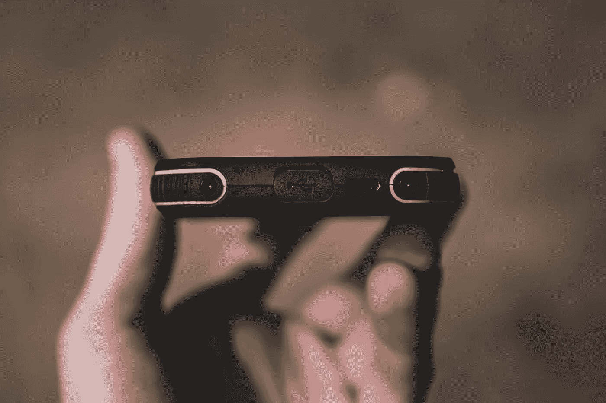

# 我发明了一种与 AI 对话的方式，既能保持隐私

> 原文：[`towardsdatascience.com/i-invented-a-way-to-speak-to-an-ai-keeping-your-privacy-ddbca5f24e4a?source=collection_archive---------17-----------------------#2024-06-28`](https://towardsdatascience.com/i-invented-a-way-to-speak-to-an-ai-keeping-your-privacy-ddbca5f24e4a?source=collection_archive---------17-----------------------#2024-06-28)

## 这项技术叫做“Silent Voice”。

 [Rafe Brena, 博士](https://rafebrena.medium.com/?source=post_page---byline--ddbca5f24e4a--------------------------------)

·发布于 [Towards Data Science](https://towardsdatascience.com/?source=post_page---byline--ddbca5f24e4a--------------------------------) ·阅读时长：7 分钟·2024 年 6 月 28 日

--

图片由 [Jonathan Kemper](https://unsplash.com/@jupp?utm_source=medium&utm_medium=referral) 提供，来源于 [Unsplash](https://unsplash.com/?utm_source=medium&utm_medium=referral)

尖端的智能助手，比如 GPT-4o，在与 AI 进行语音交互时非常棒，但有时语音交互本身也有其缺点：

+   你可能会对在别人面前与设备对话感到不自在，担心自己看起来很傻。

+   有时你不应该说话，比如在办公室会议中（更不用说在电话中说话了）。

+   你不希望别人偷听到私人信息，比如在一列满是人的火车车厢里背诵一个电话号码。

我在思考这些问题时，想也许正是那个带来问题的 AI，能帮助找到解决办法。于是我想到了一个主意，我把它称为“*Silent Voice*”。

使用 Silent Voice 时，你将手机放在嘴前，说出你的请求，但无需发出声音——甚至连耳语都不需要。

那怎么可能呢？这是一种唇读吗？不是。这是一种放大你口中发出的任何声音的方法吗？也不是。那么它到底是什么呢？

# Silent Voice 是如何工作的

Silent Voice 由一个超声波发生器和扬声器组成，能够发出短促的超声波脉冲。你必须先激活 Silent Voice……
