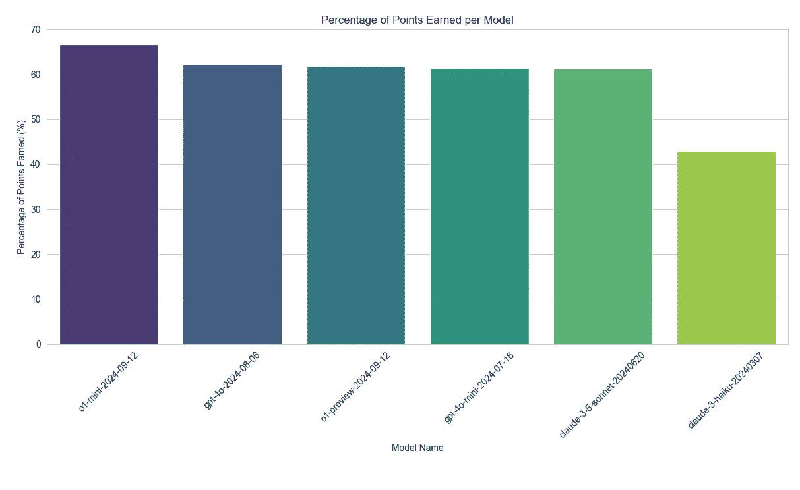

# 我花钱对荷兰语考试进行 LLM 基准测试，这样你就不必花钱了。

> 原文：[`towardsdatascience.com/i-spent-my-money-on-benchmarking-llms-on-dutch-exams-so-you-dont-have-to-57a4a35ff3d1?source=collection_archive---------4-----------------------#2024-09-25`](https://towardsdatascience.com/i-spent-my-money-on-benchmarking-llms-on-dutch-exams-so-you-dont-have-to-57a4a35ff3d1?source=collection_archive---------4-----------------------#2024-09-25)

## OpenAI 的新 o1-preview 在结果上的表现，价格却过于昂贵。

 [Maarten Sukel](https://medium.com/@maartensukel?source=post_page---byline--57a4a35ff3d1--------------------------------)

·发布于[Towards Data Science](https://towardsdatascience.com/?source=post_page---byline--57a4a35ff3d1--------------------------------) ·阅读时间 10 分钟·2024 年 9 月 25 日

--

我的许多客户会询问，应该使用哪种 LLM（大语言模型）来构建针对荷兰语用户的产品。然而，大多数现有的基准测试都是多语言的，并没有特别关注荷兰语。作为一名机器学习工程师，并且在阿姆斯特丹大学从事机器学习博士研究的研究员，我知道基准测试在人工智能发展中的关键作用——但我也理解盲目依赖基准测试的风险。这就是为什么我决定亲自进行一些荷兰语特定的基准测试。

在这篇文章中，你将深入了解我首次尝试对多个大型语言模型（LLM）进行真实荷兰语考试题目的基准测试。我将引导你完成整个过程，从收集超过 12,000 个考试 PDF 文件，到提取问题-答案对，再到使用 LLM 自动评估模型的表现。你将看到像 o1-preview、o1-mini、GPT-4o、GPT-4o-mini 和 Claude-3 等模型在不同荷兰教育水平（从 VMBO 到 VWO）上的表现，以及某些模型的更高成本是否能带来更好的结果。这只是我对这个问题的初步尝试，将来我可能会深入探讨，发布更多类似的文章，探索其他模型和任务。我还将讨论过程中遇到的挑战与成本，并分享一些关于哪些模型在荷兰语任务中提供最佳价值的见解。如果你正在为荷兰市场构建或扩展基于 LLM 的产品，那么这篇文章将为你提供有价值的见解，帮助你在 2024 年 9 月做出决策。

像 OpenAI 这样的公司越来越常见大胆甚至奢侈的声明，关于他们模型的能力，然而这些声明往往缺乏足够的现实验证作为支持。这就是为什么基准测试这些模型如此重要——尤其是在它们被宣传为解决从复杂推理到细致语言理解的所有问题时。面对如此宏大的宣称，进行客观测试是至关重要的，看看它们的实际表现如何，特别是它们如何应对荷兰语的独特挑战。

我很惊讶地发现，关于荷兰语大规模语言模型（LLM）基准测试的研究并不广泛，这也促使我在一个雨天的下午亲自动手。随着越来越多的机构和公司依赖这些模型，我觉得现在是时候深入研究并开始验证这些模型了。所以，这是我首次尝试填补这一空白，希望能为任何从事荷兰语工作的人员提供有价值的见解。

# 为什么荷兰语特定基准测试很重要

我的许多客户都在使用荷兰语产品，他们需要既具成本效益又能高效理解和处理荷兰语的 AI 模型。尽管大规模语言模型（LLMs）取得了显著进展，但大多数现有的基准测试侧重于英语或多语言能力，常常忽略了像荷兰语这样较小语言的细微差别。对荷兰语的忽视是非常重要的，因为语言差异可能导致当模型需要理解非英语文本时，出现巨大的性能差距。

五年前，荷兰语的自然语言处理（NLP）——深度学习模型远未成熟（比如 BERT 的早期版本）。当时，像 TF-IDF 配合逻辑回归等传统方法在我从事的荷兰语任务中常常优于早期的深度学习模型。尽管自那时以来，模型（和数据集）得到了极大的改进，特别是随着变换器（transformers）和多语言预训练 LLM 的崛起，但仍然至关重要的是验证这些进展如何在荷兰语等特定语言中转化。假设英语中的性能提升可以迁移到其他语言并非总是有效，尤其是在复杂的任务如阅读理解时。

这也是为什么我专注于为荷兰语创建一个定制基准，使用荷兰语“荷兰语”（Nederlands）考试中的真实考试数据（这些考试在发布后会进入公共领域）。这些考试不仅仅涉及简单的语言处理；它们还测试“begrijpend lezen”（阅读理解），要求学生理解各种文本背后的意图，并回答有关它们的细致问题。这种类型的任务尤其重要，因为它反映了现实世界的应用，如处理和总结荷兰语的法律文件、新闻文章或客户查询。

通过在这个特定任务上对大语言模型（LLMs）进行基准测试，我希望能深入了解模型如何处理荷兰语的复杂性，特别是在被要求解释意图、得出结论并给出准确答案时。这对于为荷兰语用户量身定制产品的企业至关重要。我的目标是创建一个更具针对性和相关性的基准，以帮助识别哪些模型在荷兰语任务中表现最佳，而不是依赖那些无法完全捕捉荷兰语复杂性的通用多语言基准。

荷兰考试的示例，这些考试在发布后进入公共领域。

# 基准测试如何运作

让我为您详细讲解一下我是如何构建和执行这个基准测试的：

1.  **PDF 收集**：我首先收集了超过 12,000 份荷兰国家考试的 PDF 文件。这些考试包含阅读理解段落和问题，用于测试学生理解和解读书面荷兰语的能力。

1.  **数据提取**：接下来，我使用 LLMs 从 PDF 中提取相关信息，将文本转化为结构化的问答（Q&A）对。例如，来自 PDF 中的一个典型问题可能是：“Wat is de hoofdgedachte van de schrijver in alinea 3 van tekst 2?” 提取后，这个问题变成了一个结构化的问答对，如下所示：**问题**：作者在文本 2 的第 3 段中的主要观点是什么？

    **正确答案**：作者认为，技术进步带来了积极和消极的后果（2 分）

1.  **模型选择**：这个基准测试中选择的模型包括一系列知名的大语言模型（LLMs），从像**o1-mini**和**gpt-4o-mini**这样的小型、成本效益较高的模型，到像**o1-preview**这样更昂贵的选项。这些模型在荷兰语任务上进行了测试，评估它们处理荷兰语“阅读理解”（“begrijpend lezen”）任务的能力，这些任务来自荷兰的“荷兰语”考试。值得注意的是，**Claude-3–5-sonnet**和**Claude-3-haiku**也被包括在内，提供了对 Anthropic 的 AI 模型与 GPT 系列模型对比的洞察。我选择了几个模型进行这个初步的基准测试，虽然还不够全面。如果你希望我在未来加入更多模型，请告诉我！

1.  **问答**：最有趣的部分！我将大语言模型（LLM）的 API 连接起来，给它们提供问题和相应的文本，并让它们回答问题。当更昂贵的模型参与测试时，过程就不那么有趣了，我的信用卡也开始告诉我，它并不很兴奋参与这些尝试。我为读者所做的努力可见一斑！

1.  **自动评分**：使用已知正确答案的提示，我要求模型对其给出的答案进行客观判断，检查答案中是否包含正确答案。通过这种方法，LLM 生成的答案与官方答案进行比较，每个问题的得分取决于模型的答案与正确答案的匹配程度。  

1.  **评分与报告**：在评分之后，模型根据每个考试的最大可能得分与实际得分的比值进行评估。通过这一评分，可以清晰地了解哪些模型在荷兰语阅读理解任务中表现优异，哪些则存在困难。  

当你想到这一点时，感觉有些超现实——LLM 基准测试其他 LLM，由 LLM 评分，没有人类参与（除了我在一个雨天下午编写代码让它们执行这个任务）。这种方法允许可扩展和自动化的比较，但也并非没有局限性。虽然这种方法为比较模型提供了坚实的基础，但它并非最终结论。不过，我还是想整理一些内容，以便专门了解这些模型在荷兰语环境中的表现。  

# API 费用困境  

进行这些基准测试需要付出相当大的成本。每次请求时处理完整的考试问题会迅速消耗代币，我在这轮初步测试中仅 API 费用就花费了超过 100 欧元。这迫使我对能够处理的问题数量进行了限制，虽然如此，仍然足以发现一些有价值的见解。  

如果有任何荷兰机构有兴趣合作进行更广泛的基准测试工作，我非常愿意一起合作以扩大该项目的规模。通过扩大范围，我们可以深入研究更广泛的考试，显著增加回答的问题数量，并基准测试更多的模型。这将为我们提供更全面的模型性能洞察，帮助我们更加准确地了解各种 LLM 在处理荷兰语任务时的表现，跨越不同的教育水平和复杂度，并帮助公司选择最佳的 LLM，而不是被营销所迷惑。

我进行了两次独立的基准测试：一次使用较小、较便宜的模型，另一次使用较大、较昂贵的模型，直到达到每日 API 限制。便宜模型使用了 329 个考试问题，而更昂贵的“巨人”模型使用了 104 个考试问题。为了更直观地理解，这相当于一个人完成大约 4 到 13 场完整的考试。  

以下是模型定价的详细信息（截至 9 月 25 日，通过[LLM 价格检查](https://llmpricecheck.com/)提供）：  

  

来自[`llmpricecheck.com/`](https://llmpricecheck.com/)（检查日期：9 月 25 日） 图片由作者提供  

+   “o1-preview”每百万个代币的输入费用为 10 美元，输出费用为 30 美元。  

+   “o1-mini”则每百万个代币的输入费用仅为 0.10 美元，输出费用为 0.25 美元。  

这意味着“o1-preview”比“o1-mini”贵大约 114 倍。那么，关键问题是额外的成本是否能够带来更好的性能，如果有的话，提升的幅度有多大。那么，它值得这额外的费用吗？

# 模型基准测试：快速、便宜，且……更好？

自从**o1-preview**发布以来，我对它的性能一直持怀疑态度，因为它似乎比其他模型更慢，且显著更贵。因此，我迫切想知道它在这次基准测试中的表现如何。

有趣的是，**o1-mini**模型实际上超越了更昂贵的选项，如**GPT-4o**和**o1-preview**。具体来说，**o1-mini**获得了可能得分的**66.75%**，而**GPT-4O**为**62.32%**，**o1-preview**为**61.91%**。根据这些结果，我现在考虑将荷兰语任务的工作从**GPT-4O-mini**（得分为**61.36%**）转向**o1-mini**，因为它在提供更好的性能的同时，成本明显更低。

其他模型的表现如下：

+   **Claude-3–5-sonnet**得分为**61.28%**，而

+   **Claude-3-haiku**的表现较差，仅为**42.91%**。

看来选择 Claude 模型会导致性能较差且更昂贵的产品。

性能分析还显示，所有这些模型在处理**VMBO 级别**的考试时较为轻松，但在处理更复杂的**VWO 级别**问题时表现较差——考虑到考试难度的逐步增加，这是预期中的情况。这突出了像**o1-mini**这样更具成本效益的模型的价值，它不仅在各种任务中表现良好，而且在更高难度的教育内容上也能取得出色的成绩。

6 个 LLM 在回答 104 道荷兰语考试题目的竞争结果。图片由作者提供

3 个大型语言模型（LLM）在回答 329 道荷兰语考试题目的竞争结果。图片由作者提供

**应对不同考试等级**：这些考试被分为不同的教育等级，如 VMBO、HAVO 和 VWO。我的系统会跟踪模型在这些不同等级中的表现。毫不奇怪，模型在较简单的 VMBO 级别问题上表现较好，而在复杂的 VWO 级别问题上则显得较为吃力。

六个模型在不同教育水平和模型表现之间的对比。图片由作者提供

三个更便宜模型在不同教育水平上的得分百分比。图片由作者提供

# 局限性与下一步

需要提到的是，这些荷兰语考试题目中的某些文本可能已作为某些 LLM 的训练数据，这可能会影响结果。然而，这些基准测试仍然为从事荷兰语产品开发的开发者提供了宝贵的见解。

也就是说，到目前为止处理的问题数量相对较少。在未来的版本中，我计划运行更全面的基准测试，以便对模型的表现产生更深入的洞察。

这种基准测试方法可以扩展到其他科目，我还筛选出了纯文本问题。为多模态模型（可以同时分析图像和文本）设置基准测试将特别有趣，因为许多考试（如历史和地理）涉及到诸如图表、地图或图示等视觉元素。

在未来，这种方法可以轻松应用于其他荷兰语课程，例如**生物学**、**自然科学**、**化学**、**数学 A/B/C**、**地理学**、**企业经济学**、**经济学**、**哲学**、**历史**、**社会科学**、**艺术**、**音乐**、**技术应用**，以及像**阿拉伯语**、**德语**、**英语**、**法语**、**弗里斯兰语**、**希腊语**、**拉丁语**、**俄语**、**西班牙语**和**土耳其语**等语言。将其扩展到如**自然与化学 1 & 2**、**数学**、**社会学**，甚至艺术（例如**舞蹈**、**戏剧**、**视觉艺术**）等科目，可以提供一个跨学科的模型性能广泛视角。

如果你有兴趣支持这个项目，请随时联系我或[请我喝杯咖啡](https://buymeacoffee.com/maartensukel)! 我开发的代码是可扩展的，能够在有足够资源的情况下处理更多荷兰语考试和课题。与我合作，探索这些额外的科目和多模态基准，将为我们提供关于 AI 模型在荷兰教育中表现的更深入的见解。

# 最后的思考

如果你需要帮助，负责地构建或扩展 AI 或机器学习产品，或者你对哪些 LLM 在荷兰语等特定语言中的表现最好感兴趣，我很乐意通过我的公司**The AI Factory**为你提供帮助。随时联系我！如果你觉得这个基准测试有用，可以通过[LinkedIn](https://www.linkedin.com/in/maartensukel/)关注我，获取关于未来 AI 和性能的更新。
