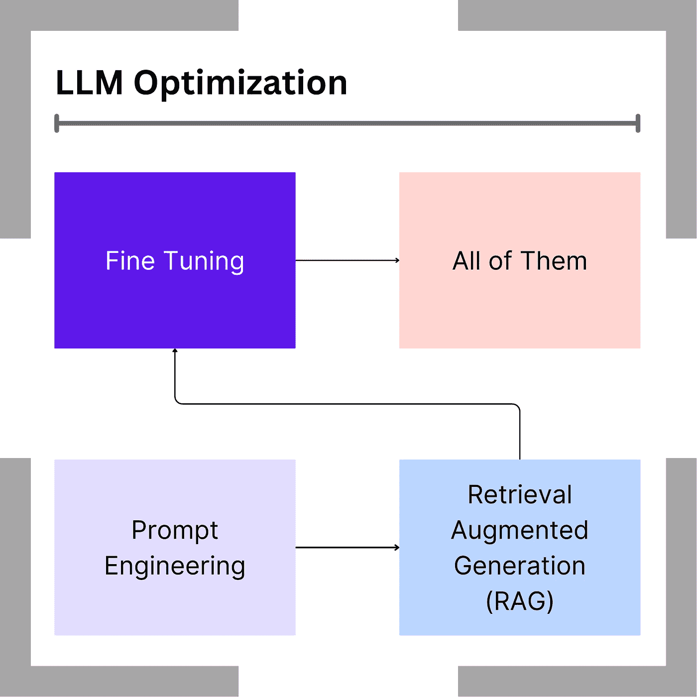

# 我参加了人工智能认证课程。这是它让我学到的关于提示工程的知识。

> 原文：[`towardsdatascience.com/i-took-a-certification-in-ai-heres-what-it-taught-me-about-prompt-engineering-679a01dd6183?source=collection_archive---------0-----------------------#2024-06-22`](https://towardsdatascience.com/i-took-a-certification-in-ai-heres-what-it-taught-me-about-prompt-engineering-679a01dd6183?source=collection_archive---------0-----------------------#2024-06-22)

## 人工智能

## 一名软件开发人员学习了大型语言模型不仅仅是魔法。

 [Kory Becker](https://medium.com/@KoryBecker?source=post_page---byline--679a01dd6183--------------------------------)

·发表于 [Towards Data Science](https://towardsdatascience.com/?source=post_page---byline--679a01dd6183--------------------------------) ·12 分钟阅读·2024 年 6 月 22 日

--

训练大型语言模型的步骤。来源：作者。

# 迈向现代人工智能的精通之路

为了确保我的技术技能始终保持相关性，我目前正在通过一项新的认证，进一步拓展我的人工智能经验。

*一切都在快速变化。*

这是尤其体现在人工智能的最新进展以及对整个行业的广泛影响上。当我查看 Nvidia、Microsoft、Google、Meta 以及许多其他科技公司的股票估值时，显而易见的是，人工智能正对金融市场产生巨大的影响。

这一扩展的大部分原因是**生成式人工智能**。

# 零-shot 提示、RAG 和微调 — 哦我的天！

尽管关于大型语言模型的术语可能看起来令人害怕，但不用担心！

我将分享我在提示工程和高级技术方面的所学，帮助大家充分利用**大型语言模型**（LLMs）。
