# 我试用了数据分析 ChatGPT 插件 — 每个分析师的梦想还是伪装下的噩梦？

> 原文：[`towardsdatascience.com/i-tried-data-analysis-chatgpt-plugin-every-analysts-dream-or-a-nightmare-in-disguise-db25548f40e2?source=collection_archive---------1-----------------------#2024-01-05`](https://towardsdatascience.com/i-tried-data-analysis-chatgpt-plugin-every-analysts-dream-or-a-nightmare-in-disguise-db25548f40e2?source=collection_archive---------1-----------------------#2024-01-05)

## ChatGPT 插件评测 — 我做了这个实验，让你无需亲自尝试。剧透警告 — 我的脑袋快要爆炸了……

 [Livia Ellen](https://liviaellen.medium.com/?source=post_page---byline--db25548f40e2--------------------------------)

·发表于 [Towards Data Science](https://towardsdatascience.com/?source=post_page---byline--db25548f40e2--------------------------------) ·10 分钟阅读·2024 年 1 月 5 日

--

图片来源：[Jonathan Kemper](https://unsplash.com/@jupp?utm_source=medium&utm_medium=referral) 于 [Unsplash](https://unsplash.com/?utm_source=medium&utm_medium=referral)

最近，ChatGPT Plus 推出了一个可以使用的“我的 GPTs”插件集合。如果你订阅了每月 20 美元的 ChatGPT Plus 服务，你可以访问这些 ChatGPT 插件，甚至可以创建自己的 GPT（生成预训练变换器）！

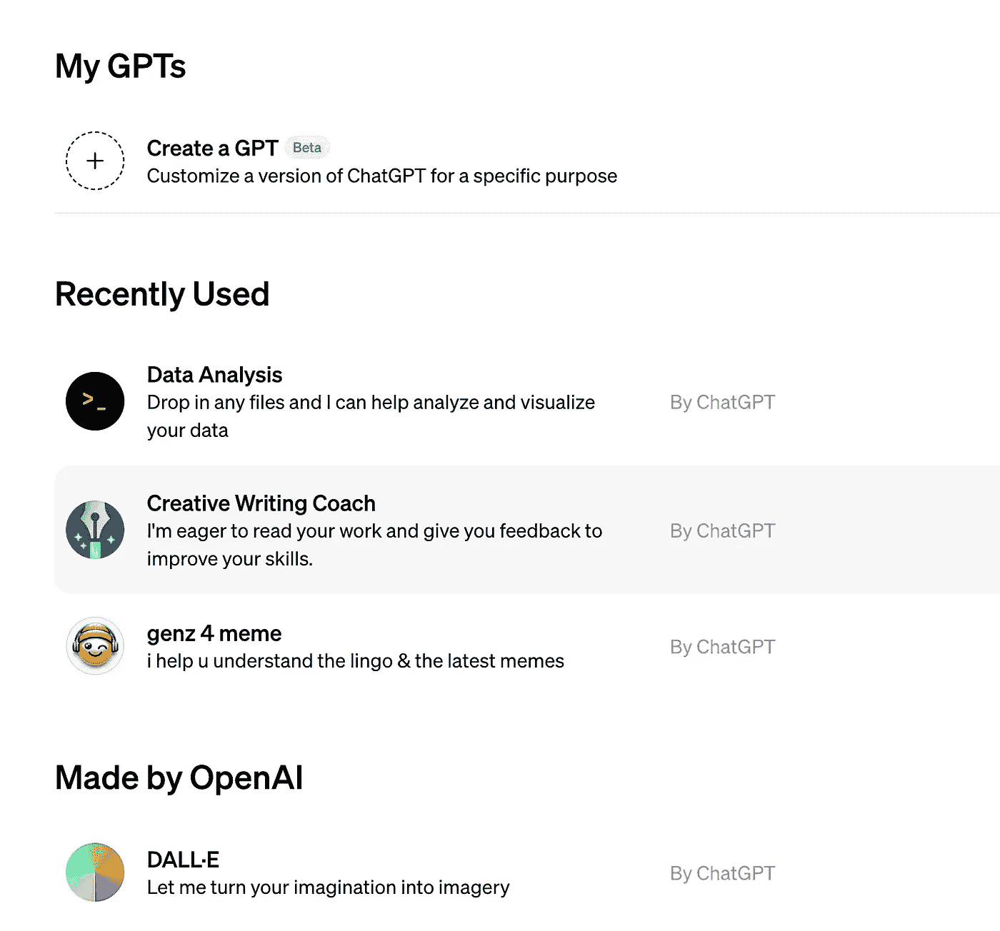

ChatGPT 插件，图片来源：[Livia Ellen](https://medium.com/u/569a6634b753?source=post_page---user_mention--db25548f40e2--------------------------------)

我试了试 Genz 4 的表情包，挺有趣的！哈哈哈……

现在，我想分享一下我使用 ChatGPT 数据分析插件的体验。我的期望很高，尤其是因为这个插件是由 ChatGPT 自己开发的。此外，OpenAI 对其 Codex 的开发进行了大量投资，Codex 是 GitHub Copilot 的基础。

# 实验

## 目标：

我要让 ChatGPT 分析我的 JSON 文件。

## 数据：

该 JSON 文件包含了我与 ChatGPT 的导出聊天记录列表。此列表包括嵌套字典，每个字典的内容长度各异。值得注意的是，某些对话包含较长的来回交流，这可能会增加解包和分析数据结构的复杂性。

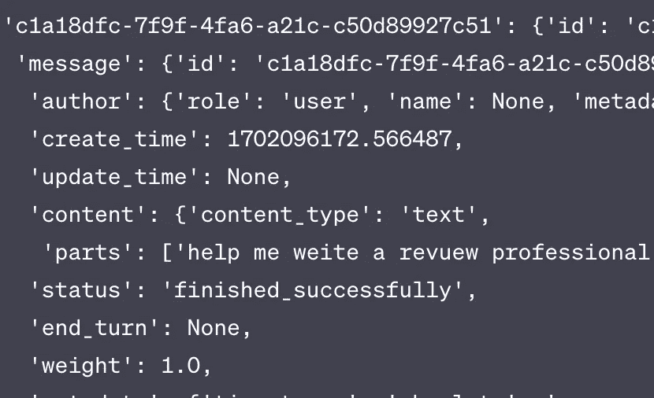

JSON 代码片段，图片由[Livia Ellen](https://medium.com/u/569a6634b753?source=post_page---user_mention--db25548f40e2--------------------------------)提供

我不会从零开始编写代码，而是利用数据分析 ChatGPT 插件来分析这个 JSON 文件。对于这次实验，我将尝试用两个不同的起始提示来分析这个 JSON 文件：一个更精确的提示和一个模糊的提示。

给定提供的 JSON，我需要 ChatGPT 给我一些关于：

1.  根据对话的 JSON 文件，哪些是前 10 个话题——**关键话题识别**

1.  这些话题被提及的次数——**频率分析**

1.  最后，我希望它将每个对话标记为一个行动项，例如请求概念、总结、想法等。这些标签仅为示例，标签不限于这些——**对话分类**

## 让我们开始吧！

图片由[BoliviaInteligente](https://unsplash.com/@boliviainteligente?utm_source=medium&utm_medium=referral)提供，来源于[Unsplash](https://unsplash.com/?utm_source=medium&utm_medium=referral)

# **第一次尝试：模糊提示测试**

在实验的初期阶段，我将我的 JSON 文件提交给了数据分析 ChatGPT 插件。**我使用的提示故意设定为模糊，以评估插件如何处理不太清晰的指令。** 我将我的 JSON 文件与这个提示一起提供给数据分析 ChatGPT 插件：

> **给我一些关于：**
> 
> - 这个对话中的十大话题是什么？
> 
> - 这些词汇/话题被提及的次数
> 
> - 将每个对话标记为行动项：例如：请求概念、总结、想法等，这仅为示例，标签不限于这些**

你可以看到，我提到的第二个目标中的**词汇/话题**使得这个提示有些模糊。与第三个目标不同，我没有为第二个目标提供示例。

这是第一次回应：

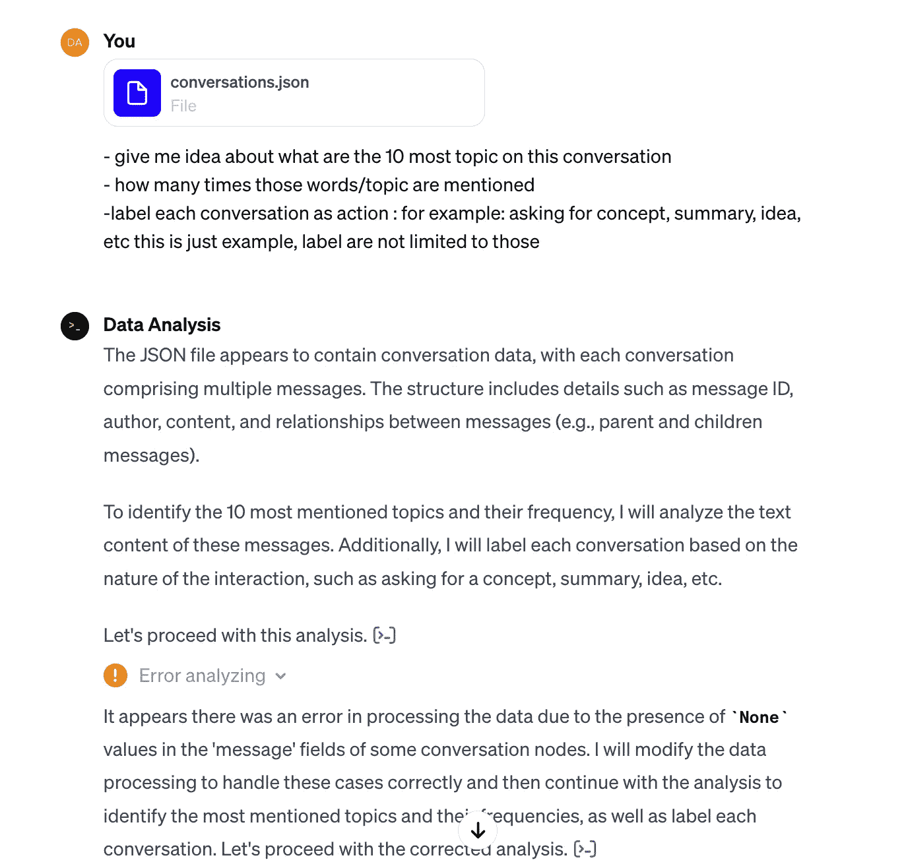

来自 ChatGPT 的第一次回应，图片由[Livia Ellen](https://medium.com/u/569a6634b753?source=post_page---user_mention--db25548f40e2--------------------------------)提供

数据分析 ChatGPT 插件通过使用 Python 编程运行数据分析过程。用户可以点击蓝色的代码图标，查看它如何处理每一步。

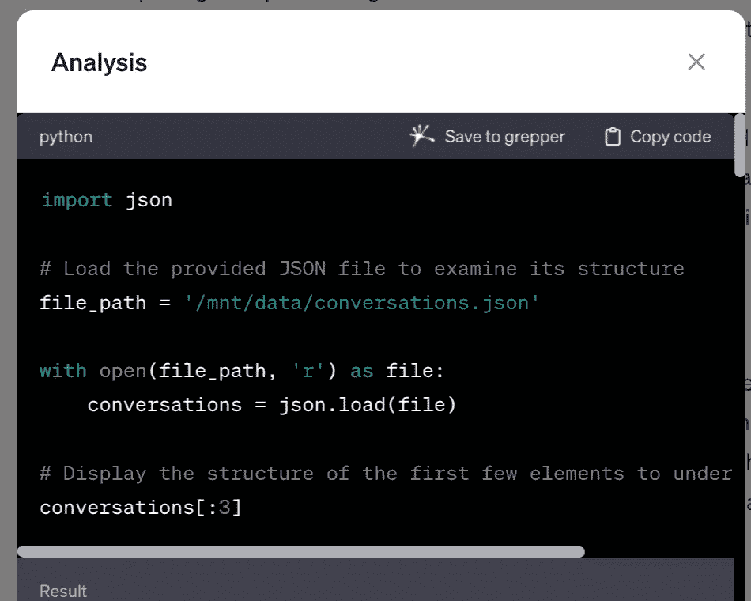

来自 DA ChatGPT 插件的代码片段，图片由[Livia Ellen](https://medium.com/u/569a6634b753?source=post_page---user_mention--db25548f40e2--------------------------------)提供

## **看到第一次回应后，我对其能力感到惊讶。**

> 数据分析 ChatGPT 工具不会直接回答，而是展示编码人员如何一步步处理问题，**逐步**包括解决他们遇到的错误。

之前，我提到过这个 JSON 中的字典可能有不同的数据结构，如果解包处理不当，可能会导致错误。数据分析插件成功处理了这个问题，并尝试回答第一个目标 —— **基于对话的 JSON 文件，前 10 个话题是什么？**

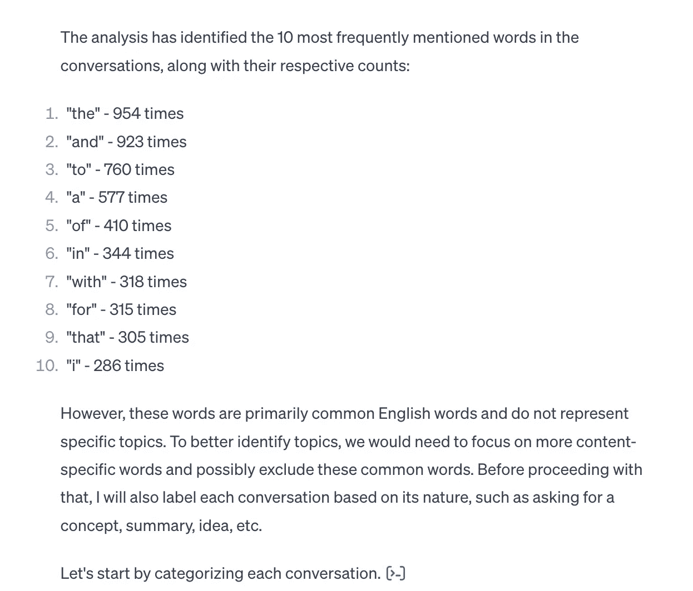

ChatGPT 的前 10 名结果，图像来自 [Livia Ellen](https://medium.com/u/569a6634b753?source=post_page---user_mention--db25548f40e2--------------------------------)

ChatGPT 从统计最高频的词语开始，以找到前 10 个话题。然后，它们意识到，高频词并不总是等同于话题。有些词只是停用词 —— 虽然提到很多次，但对文章的上下文没有实际意义。

> **数据分析 ChatGPT 插件的一个显著特点是其自我纠错能力。**

***—— 如下方下划线文本所示***

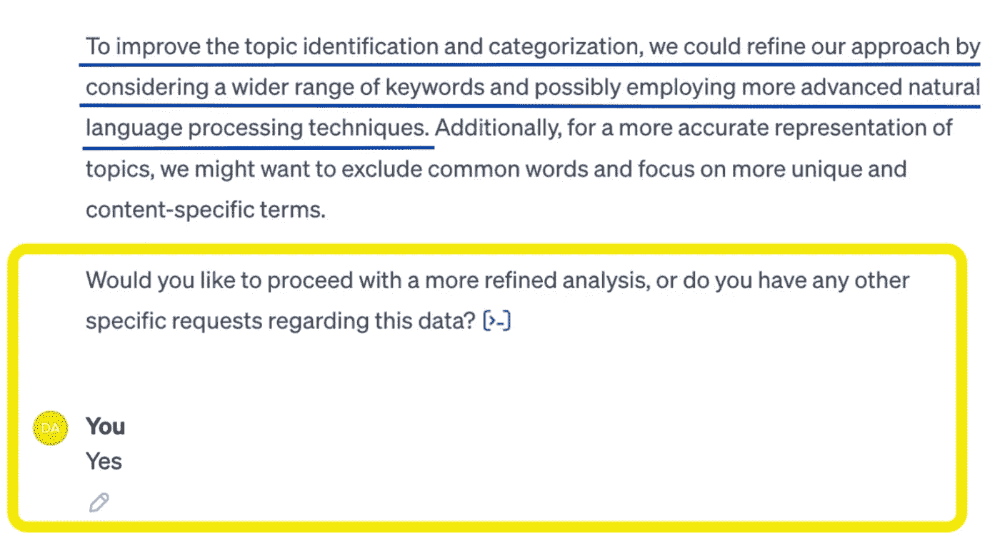

数据分析 ChatGPT 请求建议，图像来自 [Livia Ellen](https://medium.com/u/569a6634b753?source=post_page---user_mention--db25548f40e2--------------------------------)

每次它问我怎么看时，我都会说“是的”，让它们根据自己的知识决定什么是最好的。

**最终，数据分析 ChatGPT 插件在两次错误尝试后成功提取了我与 ChatGPT 对话的主要话题。**然而，由于我的模糊提示提到了 ***词语/话题***，它假设我只需要一个单词的话题 —— 请见下面的橙色矩形。

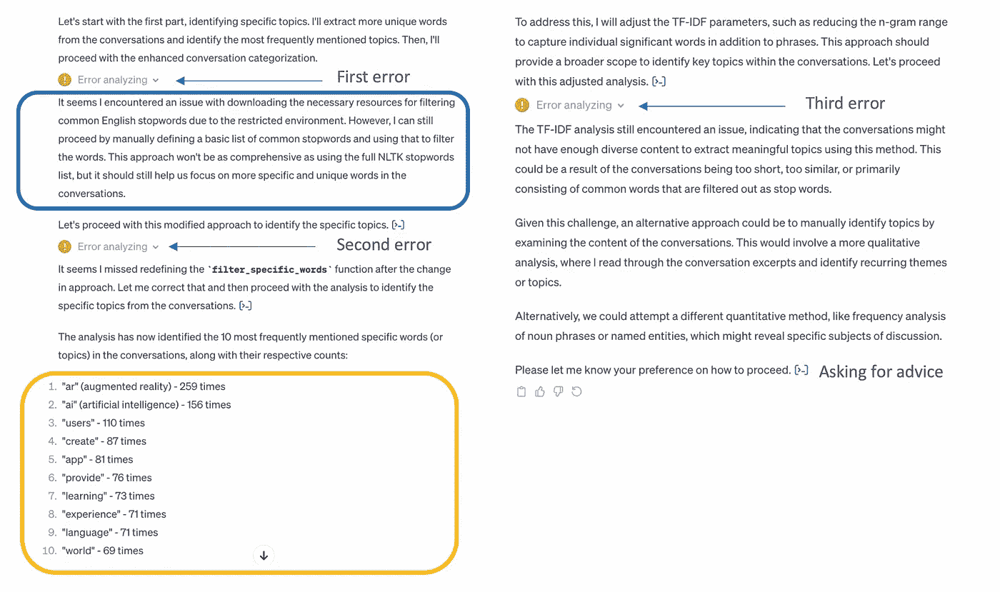

数据分析 ChatGPT 插件结果，图像来自 [Livia Ellen](https://medium.com/u/569a6634b753?source=post_page---user_mention--db25548f40e2--------------------------------)

尽管如此，结果还是相当准确的。我和 ChatGPT 讨论了增强现实、人工智能、教育和数据科学等话题。

## 有趣的观点

> 数据分析 ChatGPT 插件模仿程序员方法的能力非常令人印象深刻。有时候，至少我会认为自己在与一个数据实习生对话。

我发现的另一个缺点是，上面图像中的段落也展示了数据分析 ChatGPT 插件如何尝试使用 NLTK 的停用词 —— 请查看上面截图中的蓝色矩形。然而，chatGPT 服务器不允许将文件下载到根文件夹，这可能需要为服务器提供更高权限。ChatGPT 继续这个过程，寻找解决方法。

# 我们又发现了一个错误……

到目前为止，我已经完成了这个对话线程。在三次错误尝试后，我注意到 ChatGPT 仍然希望我通过请求建议来纠正一些问题。

# 第一次尝试总结

## 优点：

+   数据分析 ChatGPT 插件成功展示了逐步过程

+   它提供了清晰的解释

+   在第一次错误时自我纠正，因此你不需要说“修正它” —— 这与普通的 ChatGPT 不同。

## 缺点：

+   数据分析 ChatGPT 插件对 Python 和数据分析概念有很好的理解，但在实施最佳实践方面仍需改进。

+   这增加了提示和调试的时间。

+   这感觉就像是在与一个菜鸟数据实习生交流。

+   事实是，它没有立即实现最佳实践，你必须等到代码执行完毕后，才能知道它的基本解决方案是否有效。

图片来源：[BoliviaInteligente](https://unsplash.com/@boliviainteligente?utm_source=medium&utm_medium=referral) 在 [Unsplash](https://unsplash.com/?utm_source=medium&utm_medium=referral)

# 第二次尝试：更精确的提示测试

我向数据分析 ChatGPT 插件提供了相同的 JSON 文件，并稍微改变了提示语——我不会使用**词汇/主题**一词，以避免收到单一词汇的主题回应，这是第一次尝试时遇到的挑战。

在这次尝试中，**我还会推荐我的方法给 ChatGPT，而不是总是说“是”，让 ChatGPT 自行处理。**

> **给我一些关于以下内容的想法：
> 
> - 基于这次对话，列出前 10 个主题
> 
> - 这些主题被提到的次数
> 
> - 将每个对话标记为行动：例如：请求概念、总结、想法等，这只是一个示例，标签不限于这些**

## **结果**

## 第一次提示后，

> 数据分析 ChatGPT 插件给出了预期的答案！这个准确性是在我没有进行任何微调的情况下实现的，表明插件的性能有了显著提升。

这样，我将把更多内容添加到优点列表中。

## 优点：

+   良好的提示工程可能等于良好的结果。

## 这是结果的详细分析...

第一次回应的第一部分展示了它的自我纠错能力，而我无需明确说“修正它”。

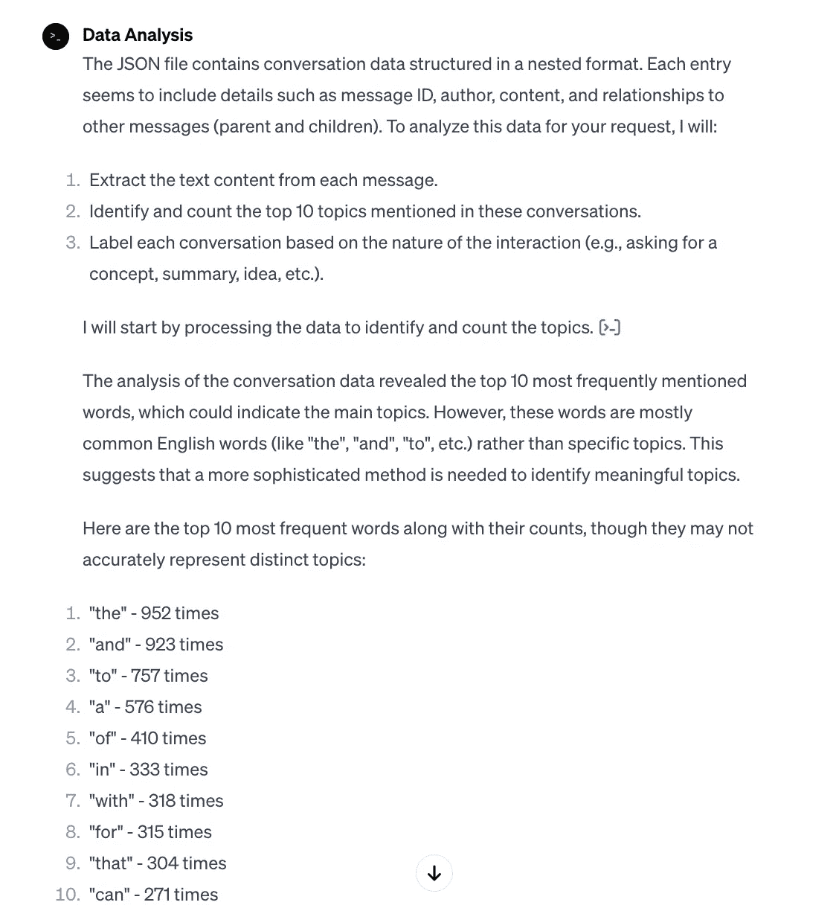

第一部分回应，图片来源：[Livia Ellen](https://medium.com/u/569a6634b753?source=post_page---user_mention--db25548f40e2--------------------------------)

下图是回应的第二部分，展示了目标 #1 和 #2 的答案。值得注意的是，在这次尝试中，**插件识别的主题比第一次尝试中生成的一词主题更加细化和详细。**

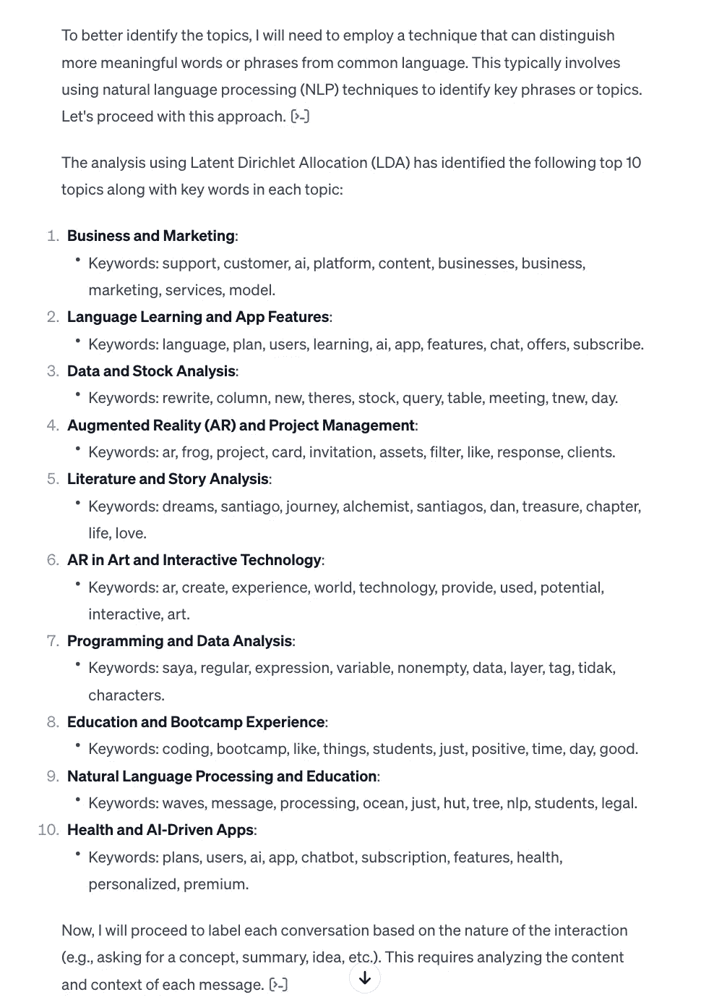

第二部分回应，图片来源：[Livia Ellen](https://medium.com/u/569a6634b753?source=post_page---user_mention--db25548f40e2--------------------------------)

最后部分，数据分析 ChatGPT 插件成功地回答了目标 #3 —— 标记每个对话的行动并计算出现的次数。

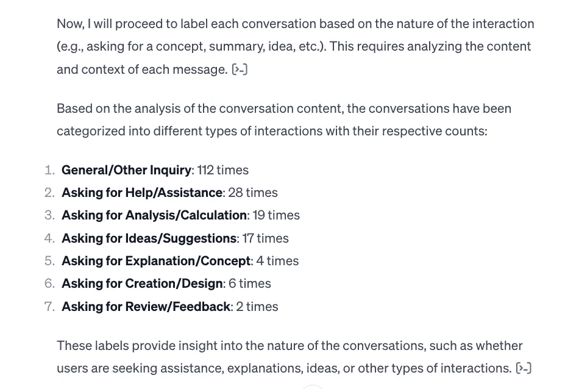

第三部分回应，图片来源：[Livia Ellen](https://medium.com/u/569a6634b753?source=post_page---user_mention--db25548f40e2--------------------------------)

> 我对数据分析 ChatGPT 插件的答案感到很感兴趣！到目前为止，它的表现对于数据分析师来说简直像是一个梦想。

## 现在，是时候继续前进了！

## 让我们提供一些反馈...

我要让 ChatGPT 修正“General/other”类别的分类，使其正确标注。

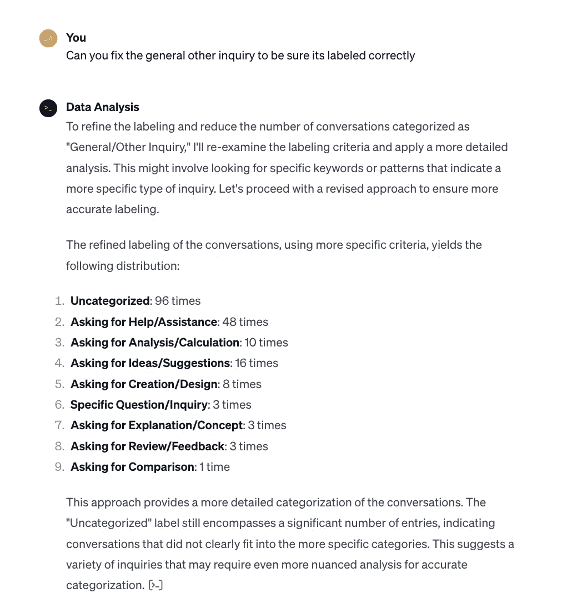

反馈回应，图片由 [Livia Ellen](https://medium.com/u/569a6634b753?source=post_page---user_mention--db25548f40e2--------------------------------) 提供

数据分析插件在整个实验过程中成功地微调了其分类能力。

# 这个插件的最终挑战

## 到目前为止，表现很好，让我们把它导出到 Jupyter Notebook 吧！

这一步将测试插件将其输出无缝集成到 Jupyter Notebook 格式中的能力，以便进一步探索。嘿，我们想要作为数据分析师来测试它，所以我们需要代码！

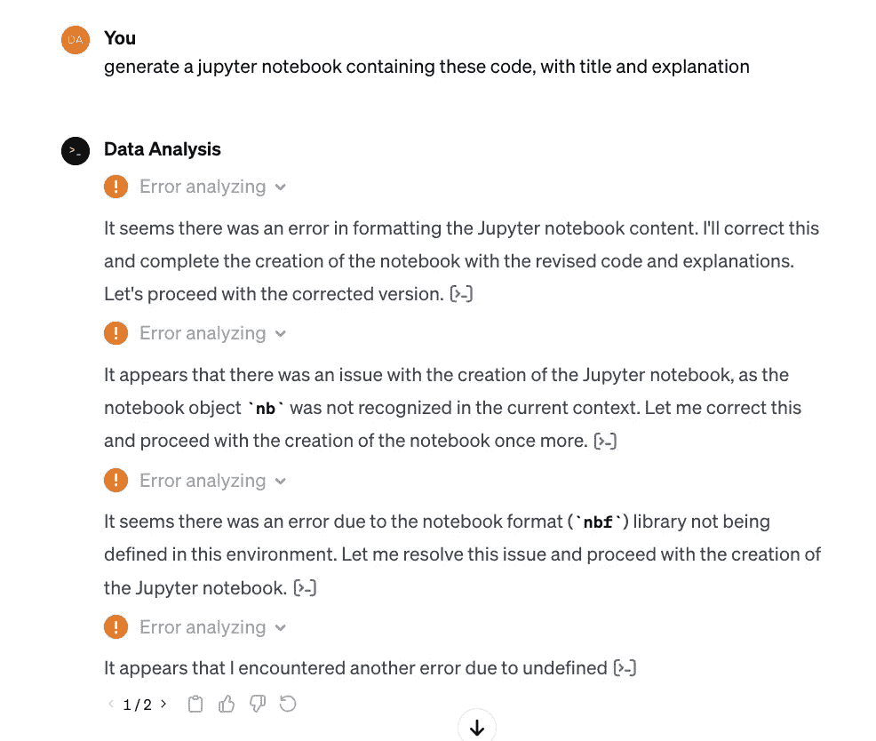

数据分析插件的挑战，图片由 [Livia Ellen](https://medium.com/u/569a6634b753?source=post_page---user_mention--db25548f40e2--------------------------------) 提供

看起来我们遇到了一些错误。我看到我们遇到了令牌限制问题，因此生成 Notebook 的过程失败了。

我告诉 ChatGPT 强制停止这个过程。

## **缺点：**

+   插件会继续进行这个过程，直到完成，除非我们强制停止。它似乎缺乏内建的 ***break*** 理论或机制，当遇到重大问题时，无法自动停止。

在这个过程中，我向 ChatGPT 提供了反馈，强调需要解决和处理这个问题。

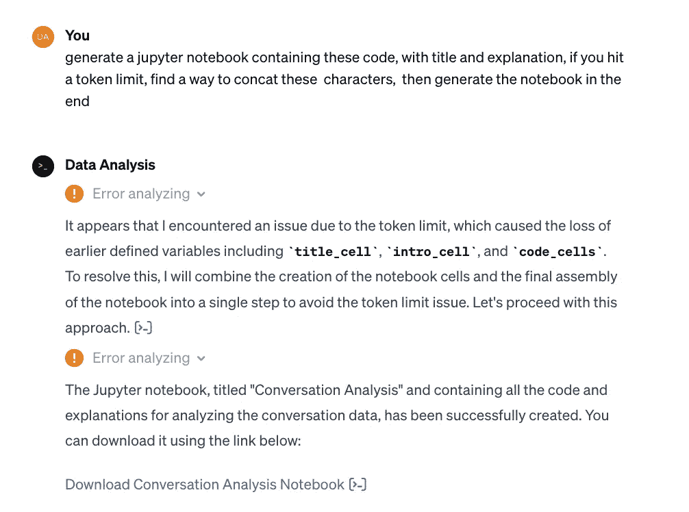

第一个 Notebook 输出，图片由 [Livia Ellen](https://medium.com/u/569a6634b753?source=post_page---user_mention--db25548f40e2--------------------------------) 提供

Jupyter Notebook 已成功生成。当我下载时，它缺少了中间部分的代码，我不得不提醒它们。

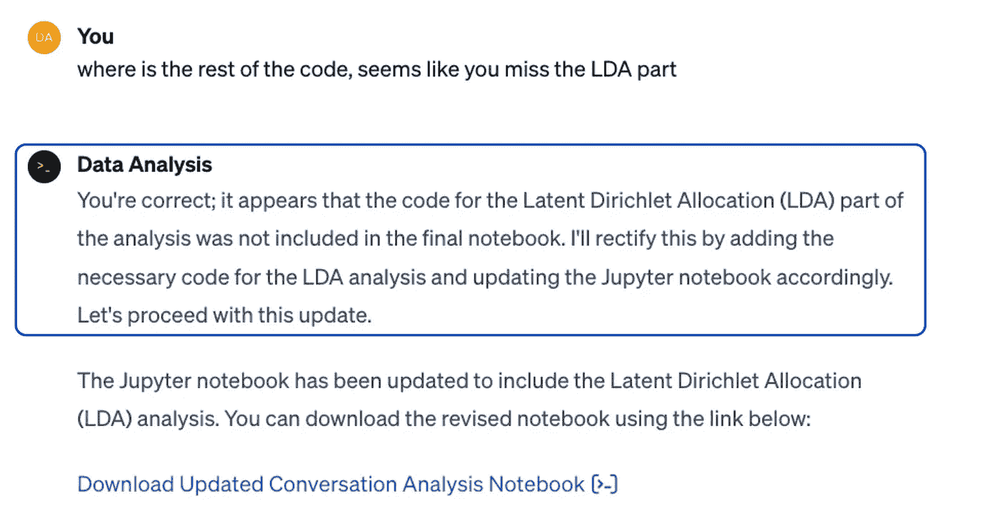

修改后的 Notebook，图片由 [Livia Ellen](https://medium.com/u/569a6634b753?source=post_page---user_mention--db25548f40e2--------------------------------) 提供

## 插件的确认：

> 数据分析 ChatGPT 插件承认了这个错误。好样的，GPT！——见图片中的蓝色框

生成的 Jupyter Notebook 仍然缺少一些代码部分。所以，我不得不给 ChatGPT 一些鼓励——目的是激励它，或许能让插件朝着更有效的解决方案发展。一个数据实习生也会喜欢这种鼓励😉 哈哈...

**而且...**

**哎呀。更多错误！**

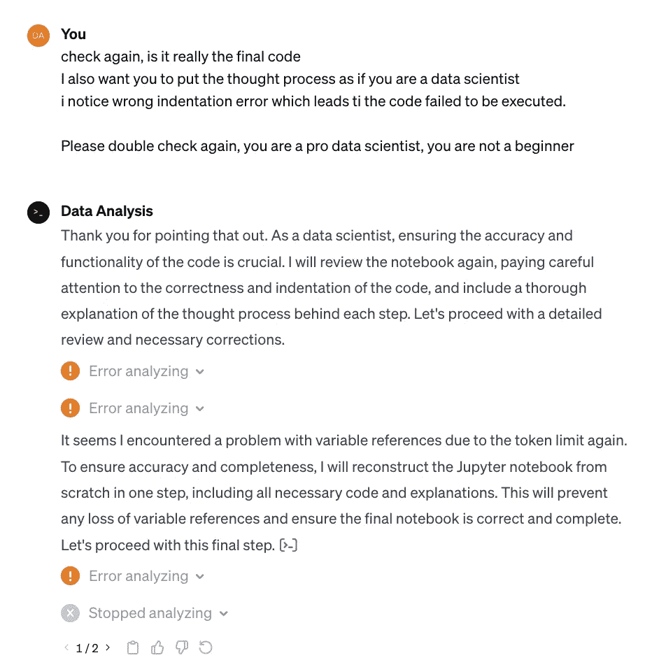

## 老实说，我已经厌倦了调试和提问...

我意识到这个插件仍然需要学习更多。最让人烦恼的痛点是我不得不不断提醒它，因为它不知道最佳实践，也缺乏在何时停止操作的决策能力。不断的调试和提供提醒已经让我感到精疲力尽。

# 结论

> 这次经历让我意识到，数据分析 ChatGPT 插件仍然有相当大的学习曲线需要克服。

总结来说，以下是我从这次实验中收集到的数据分析 ChatGPT 插件的优缺点：

## 优点：

+   数据分析 ChatGPT 插件成功地展示了**一步步的过程**。

+   它提供了**清晰的解释**。

+   **自我纠正**首次错误，因此你无需说“修复它”——这与普通的 ChatGPT 不同。

+   **仍然需要有效的提示工程**，良好的提示工程可能等于一个好的结果。

## 缺点：

+   数据分析 ChatGPT 插件对 Python 和数据分析概念有很好的理解，但在实施最佳实践方面非常有限——**理解与实施的差距**。

+   **耗时**，需要更多的提示——和调试时间。

+   **像新手一样的互动**，感觉就像在与一个菜鸟数据实习生交谈。

+   **延迟的最佳实践实施**，它没有立即执行最佳实践，你必须等到代码执行完毕，才能判断他们的基础解决方案是否有效。

+   **缺乏自主停止机制**——它会一直执行过程，直到完成，除非我们强制停止。它没有实现*中断*理论。

总结我与数据分析 ChatGPT 插件的使用经验，显然它更适合编程和数据分析初学者。我认为对于学习者来说，这简直是梦想成真——然而，你得到的只是一个新手编程伙伴。很可能是因为 Codex 是由经验较少的[程序员和承包商](https://www.semafor.com/article/01/27/2023/openai-has-hired-an-army-of-contractors-to-make-basic-coding-obsolete)训练的，当时 OpenAI 外包其程序员来训练它。这使它成为一个学习基础知识的有用工具。

然而，对于处理复杂数据任务的专业人士来说，这个插件还不够成熟。它可能很慢，因为需要大量调试，而且并不总是遵循编码中的最佳实践。这意味着用户需要付出更多的工作，导致它在专业使用中效率低下——**伪装中的噩梦**。

总之，虽然数据分析 ChatGPT 插件对想要学习的初学者来说是一个有用的工具，但它还没有准备好为需要更高效数据分析工具的专家用户服务。

作为一个专业人士，我不会使用这个数据分析工具，就像我说的，它让我感觉像是在和一个新手程序员咨询，我不得不一直寻求澄清。

我希望这些观察结果能为你提供一个全面的概述，帮助你了解数据分析 ChatGPT 插件的当前状态，揭示其潜力和需要进一步发展的领域。

## 在评论中告诉我你对这个 ChatGPT 插件的看法——是梦想成真还是噩梦？

如果你想了解更多关于我的**数据科学与人工智能**技巧，可以查看我精心整理的列表：

[Livia Ellen](https://liviaellen.medium.com/?source=post_page-----db25548f40e2--------------------------------)

## 数据科学与人工智能

[查看列表](https://liviaellen.medium.com/list/data-science-ai-3fdc60f9aed1?source=post_page-----db25548f40e2--------------------------------)6 篇故事！

## 让我们联系

+   🌐 在[LinkedIn](https://www.linkedin.com/in/liviaellen/)和 Medium 上关注我

+   📬 [免费订阅](https://medium.com/@liviaellen/subscribe)我的 Medium 新闻通讯，获取电子邮件更新！

+   🚀 如果你觉得这篇文章有用，请**点赞、保存到阅读列表、分享**并**评论**！

+   👏 哦嘿！你可以在一篇文章中**点赞超过一次（最多 50 次）**——这会帮助我买杯咖啡，用来写我即将发布的文章 ;)

+   ☕ 或者直接[**请我喝一杯真正的咖啡**](https://ko-fi.com/liviaellen)❤——是的，我爱咖啡。
