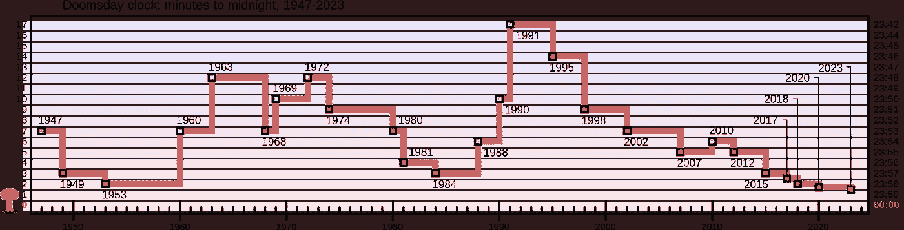

# 如果世界末日来临，你有多大可能目睹这一切？

> 原文：[`towardsdatascience.com/if-the-world-ends-whats-the-likelihood-you-witnessed-it-3fcfb2ca0dec?source=collection_archive---------9-----------------------#2024-01-17`](https://towardsdatascience.com/if-the-world-ends-whats-the-likelihood-you-witnessed-it-3fcfb2ca0dec?source=collection_archive---------9-----------------------#2024-01-17)

## 快速成功数据科学

## 使用 SciPy 插值填补数据空缺

 [Lee Vaughan](https://medium.com/@lee_vaughan?source=post_page---byline--3fcfb2ca0dec--------------------------------)

·发表于[Towards Data Science](https://towardsdatascience.com/?source=post_page---byline--3fcfb2ca0dec--------------------------------) ·9 分钟阅读·2024 年 1 月 17 日

--

图片来自 Hugo Jehanne，来自 Unsplash

当俄罗斯在 2022 年入侵乌克兰时，我产生了一个奇怪的想法。***如果世界今天就要结束，所有曾经活过的人当中，我有多大的概率在这里目睹这一切？***

这个问题并不奇怪，考虑到第三次世界大战可能已经在进行当中。而且我并不是唯一担心的人。"[末日时钟](https://en.wikipedia.org/wiki/Doomsday_Clock)"在 2023 年被设定为距离午夜 90 秒。这是历史上最接近的时刻。

末日时钟图表（来自[Wikipedia](https://en.wikipedia.org/wiki/Doomsday_Clock)（CC BY-SA 4.0 许可））

值得注意的是，这是一个我们可以触及的问题。在这个*快速成功数据科学*项目中，我们将使用 Python 来计算现在仍然活着的概率，通过估算曾经生活过的所有人总数。在这个过程中，我们将使用 SciPy 库中有价值的`interpolate`模块，它有助于解决一个常见的数据科学问题：数据集中的空缺。

# 过程

要计算现在仍然活着的概率，我们需要以下输入：

1.  人类“开始”的年份。
