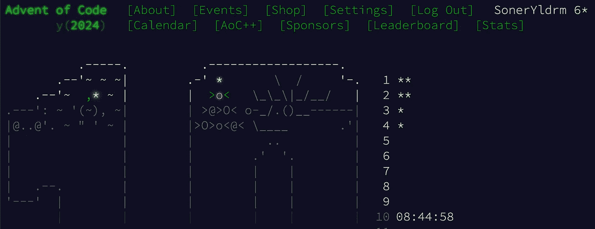

# 我正在做 2024 年 Advent of Code —— 第 2 天

> 原文：[`towardsdatascience.com/im-doing-the-advent-of-code-2024-in-python-day-2-6d452447ba0f?source=collection_archive---------6-----------------------#2024-12-11`](https://towardsdatascience.com/im-doing-the-advent-of-code-2024-in-python-day-2-6d452447ba0f?source=collection_archive---------6-----------------------#2024-12-11)

## 让我们看看我们会收集多少颗星。

 [Soner Yıldırım](https://sonery.medium.com/?source=post_page---byline--6d452447ba0f--------------------------------)

·发布于 [Towards Data Science](https://towardsdatascience.com/?source=post_page---byline--6d452447ba0f--------------------------------) ·6 分钟阅读·2024 年 12 月 11 日

--

图片来自 [Nong](https://unsplash.com/@californong?utm_content=creditCopyText&utm_medium=referral&utm_source=unsplash) 在 [Unsplash](https://unsplash.com/photos/white-and-brown-elephant-figurine-3XisDwg6jAE?utm_content=creditCopyText&utm_medium=referral&utm_source=unsplash)

请查看 第 1 天 以了解介绍和第一个谜题的解决方案。

Advent of Code 是一场竞赛，但我想强调的是，我的主要动机并不是为了竞争或在排行榜上获得名次。

这些谜题非常适合学习 Python 中的数据结构以及如何创建更好的算法。它们也是非常好的脑力训练。最后但同样重要的是，完成谜题并收集星星真的很有趣。

截至本文写作时，前 9 个谜题已经发布，每个谜题有两部分。我已完成前两个谜题的两部分，以及第二、第三和第四个谜题的第一部分。每部分计为一颗星。让我们看看我们会收集多少颗星。

（图像来自作者）

# 第 2 天 — 第一部分

在第 2 天的谜题中，我们给出的数据格式如下：
