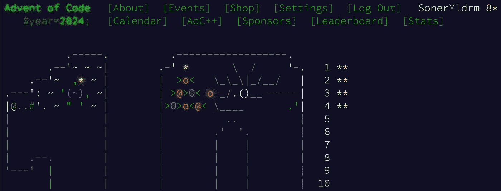
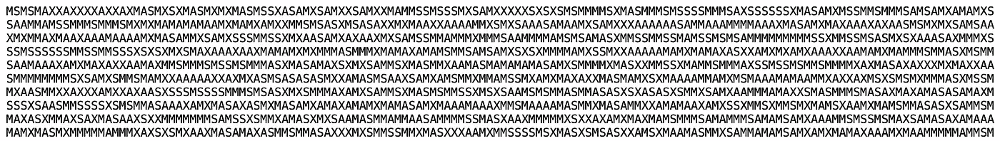

# 我正在做 2024 年的圣诞编程挑战 — 第 4 天

> 原文：[`towardsdatascience.com/im-doing-the-advent-of-code-2024-in-python-day-4-f0dacf4529a6?source=collection_archive---------5-----------------------#2024-12-24`](https://towardsdatascience.com/im-doing-the-advent-of-code-2024-in-python-day-4-f0dacf4529a6?source=collection_archive---------5-----------------------#2024-12-24)

## 让我们看看我们能收集多少颗星星。

 [Soner Yıldırım](https://sonery.medium.com/?source=post_page---byline--f0dacf4529a6--------------------------------)

·发表于 [Towards Data Science](https://towardsdatascience.com/?source=post_page---byline--f0dacf4529a6--------------------------------) ·6 分钟阅读·2024 年 12 月 24 日

--

图片来源：[Nong](https://unsplash.com/@californong?utm_content=creditCopyText&utm_medium=referral&utm_source=unsplash) 来自 [Unsplash](https://unsplash.com/photos/white-and-brown-elephant-figurine-3XisDwg6jAE?utm_content=creditCopyText&utm_medium=referral&utm_source=unsplash)

欢迎来到第 4 天！

+   [第 1 天](https://medium.com/towards-data-science/im-doing-the-advent-of-code-2024-in-python-day-1-8a9ea6ca6d3f) 介绍了如何获取自己谜题的输入，以及第一天谜题的解决方案。

+   [第 2 天](https://medium.com/towards-data-science/im-doing-the-advent-of-code-2024-in-python-day-2-6d452447ba0f), [第 3 天](https://medium.com/towards-data-science/im-doing-the-advent-of-code-2024-in-python-day-3-3a3bdf845685)

在第 4 天的谜题中，我们将学习以下内容：

+   Python 中的列表推导式

+   如何处理一维和二维 NumPy 数组

+   如何转置和翻转 NumPy 数组

在写这篇文章时，已经发布了 22 个谜题，每个谜题有两个部分，每个部分都会获得一个星星，以下是我当前的进度：

（图片由作者提供）

# 第 4 天 — 第一部分

第 4 天的谜题输入是一长串包含字母 X、M、A 和 S 的字符串。我的谜题输入的前 10 行如下所示：

（图片由作者提供）
