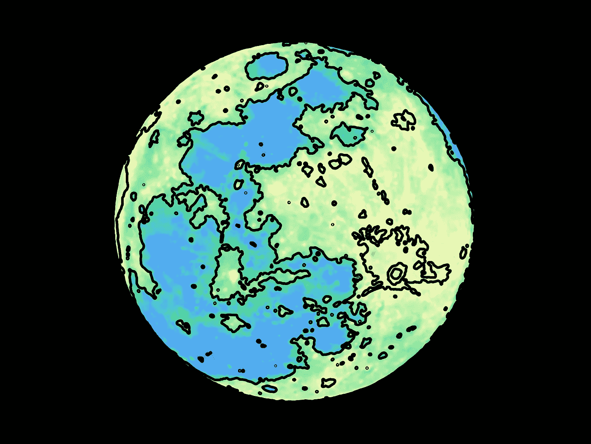

# 使用 OpenCV 进行图像轮廓化

> 原文：[`towardsdatascience.com/image-contouring-with-opencv-5b18f17a8386?source=collection_archive---------7-----------------------#2024-04-15`](https://towardsdatascience.com/image-contouring-with-opencv-5b18f17a8386?source=collection_archive---------7-----------------------#2024-04-15)

## 快速成功的数据科学

## 初学者的第一步

 [Lee Vaughan](https://medium.com/@lee_vaughan?source=post_page---byline--5b18f17a8386--------------------------------)

·发表于[Towards Data Science](https://towardsdatascience.com/?source=post_page---byline--5b18f17a8386--------------------------------) ·阅读时间：7 分钟·2024 年 4 月 15 日

--

“轮廓化图像”是指生成包围具有相似颜色或强度的连续区域的边界。在计算机科学中，轮廓通常由*点列表*表示，这些点定义了这些边界。

轮廓在计算机视觉应用中被广泛使用，包括物体检测、图像分割和计算形状描述符，如面积和质心。

在这个*快速成功的数据科学*项目中，我们将使用全球最流行的计算机视觉库，[*OpenCV*](https://opencv.org/)，在月球图像上生成轮廓。我们的目标是创造一些有趣的艺术作品，但同样的一般过程也可以应用于更复杂的应用程序。

# 安装库

对于这个项目，我们将使用[NumPy](https://numpy.org/)、[Matplotlib](https://matplotlib.org/stable/users/installing/index.html)和 OpenCV 库。OpenCV 在很大程度上依赖于 NumPy 数组，我们可以使用 Matplotlib 作为一个快速简便的方式来可视化轮廓化后的图像（尽管 OpenCV 也包含了直接可视化图像的方法）。

你可以在前面的链接中找到有关 NumPy 和 Matplotlib 的安装说明，OpenCV 的安装说明请点击[这里](https://opencv.org/get-started/)。
