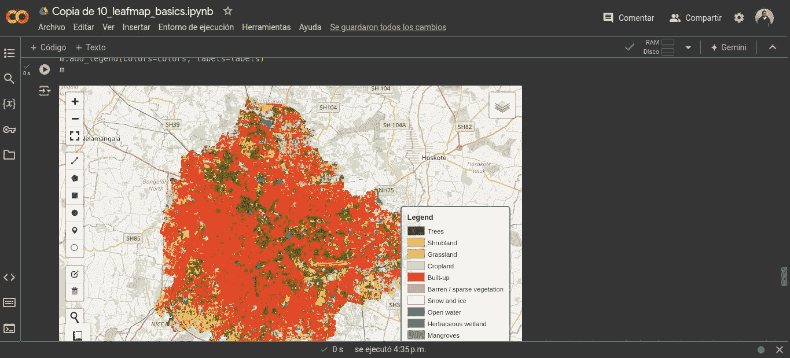

# 气候变化分析的图像数据收集

> 原文：[`towardsdatascience.com/image-data-collection-for-climate-change-analysis-a-beginners-guide-628fe4923c7f?source=collection_archive---------12-----------------------#2024-10-22`](https://towardsdatascience.com/image-data-collection-for-climate-change-analysis-a-beginners-guide-628fe4923c7f?source=collection_archive---------12-----------------------#2024-10-22)

## 初学者指南

 [Daniel Pazmiño Vernaza](https://medium.com/@pazmid?source=post_page---byline--628fe4923c7f--------------------------------)

·发表于 [Towards Data Science](https://towardsdatascience.com/?source=post_page---byline--628fe4923c7f--------------------------------) ·阅读时间 8 分钟·2024 年 10 月 22 日

--

埃特纳山卫星图像。来源：美国地质调查局（USGS）提供的 Unsplash 照片。链接：[`unsplash.com/es/fotos/una-imagen-satelital-de-un-area-roja-y-blanca-ZvLvu1gUcYA`](https://unsplash.com/es/fotos/una-imagen-satelital-de-un-area-roja-y-blanca-ZvLvu1gUcYA)

**I. 引言**

深度学习在地球观测领域取得了成功。它的成就推动了更复杂的架构和方法的发展。然而，在这个过程中，我们忽视了一些重要的事情。比起更好的模型，拥有更多质量更高的数据更为重要。

不幸的是，EO 数据集的开发一直很混乱。目前，已经有数百个数据集。尽管有多次努力进行数据集的汇编，但可以公平地说，这些数据集分散在各处。此外，EO 数据已经迅速增长，服务于非常特定的需求。矛盾的是，这正是我们应该避免的方向，特别是如果我们希望深度学习模型能更好地工作。

例如，[ImageNet](https://www.image-net.org/) 编译了成千上万的图像，以更好地训练计算机视觉模型。然而，地球观测（EO）数据比 ImageNet 图像数据库更为复杂。不幸的是，至今尚未为 EO 目的进行类似的举措。这迫使 EO 社区尝试将 ImageNet 资源适应我们的需求。这个过程既耗时又容易出错。

此外，EO 数据的空间分布不均。大部分数据覆盖了北美和欧洲。这是一个问题，因为气候变化将更严重地影响发展中国家。

[在我上一篇文章](https://medium.com/towards-data-science/introduction-to-computer-vision-for-climate-change-81d888f471bd)中，我探讨了计算机视觉如何改变我们应对气候变化的方式。由于选择地球观测（EO）数据的挑战，本篇文章的必要性应运而生。我希望简化这一重要的第一步，帮助我们更好地利用人工智能的力量造福社会。

本文将回答以下问题：我需要了解哪些关于 EO 数据的知识，以便在海量数据资源中找到我需要的信息？在众多资源中，我应该从哪里开始搜索？哪些是最具成本效益的解决方案？如果我有资源投资高质量数据或计算能力，应该选择哪些？哪些资源能加速我的结果？如何最有效地投资我的学习时间在数据获取和处理上？我们将首先解决以下问题：我应该专注于哪种类型的图像数据来分析气候变化？

**II. 遥感数据的力量**

与气候变化相关的图像数据有多种类型。例如，航空照片、无人机影像和环境监控摄像头画面。但遥感数据（例如卫星图像）提供了多个优势。在描述这些优势之前，让我们先来了解什么是遥感。

遥感传感器收集关于物体的信息。但它们并不与物体直接接触。遥感是基于反射原理工作的。传感器捕捉到表面反射的光与照射到表面光的比例。反射率可以提供关于表面特性的资料。例如，它帮助我们从图像中区分植被、土壤、水域和城市区域。不同的材料具有不同的光谱反射特性。这意味着它们在不同的波长下反射光。通过分析不同波长下的反射率，我们不仅可以推断地球表面的组成，还可以检测到环境变化。

除了反射率之外，还有一些其他的遥感概念我们需要理解。

**空间分辨率：**是场景中可观察到的最小物体的大小。换句话说，我们将无法看到比图像分辨率更小的物体。例如，假设我们有一张城市的卫星图像，分辨率为 1 公里。这意味着图像中的每个像素代表城市区域 1 公里乘 1 公里的面积。如果场景中有一个比这个区域更小的公园，我们将无法看到它。至少不会很清晰地看到。但我们仍然能看到道路和大型建筑物。

**光谱分辨率**：指传感器所测量的波段数量。这些波段与电磁辐射的所有可能频率相关。光谱分辨率有三种主要类型。全色数据捕捉可见光范围内的波段，也叫光学数据。多光谱数据同时收集多个波段的数据。色彩图像就是使用这些数据。高光谱数据有数百个波段，这种分辨率可以在图像中提供更多的光谱细节。

**时间分辨率**：也叫重访周期。指卫星返回初始位置以收集数据所需的时间。

**扫幅宽度**：指卫星覆盖的地面宽度。

现在我们已经了解了遥感的基本知识，接下来我们将讨论它在气候变化研究中的优势。遥感数据使我们能够覆盖大面积区域。此外，卫星图像通常提供随时间变化的连续数据。同样重要的是，传感器可以捕捉不同的波长。这使我们能够分析超出人类视觉能力范围的环境。最后，最重要的原因是可访问性。遥感数据通常是公开的，这意味着它是一种具有成本效益的信息来源。

作为下一步，我们将学习在哪里找到遥感数据。在这里，我们需要做一个区分。有些数据平台提供卫星图像。而也有一些计算平台允许我们处理数据，这些平台通常也有数据目录。我们将首先探讨数据平台。

**III. 地理空间数据平台**

如今，地理空间数据无处不在。下表描述了据我所知最有用的地理空间数据平台。该表优先列出了开源数据，同时也包括了一些商业平台。这些商业数据集可能价格昂贵，但值得了解。它们可以为许多应用提供高空间分辨率（范围从 31 到 72 厘米）。

**流行的地理空间数据平台**

本节介绍了几种数据平台，但值得注意的是，地理空间数据的规模和体量正在增长。所有迹象表明，这一趋势在未来将继续。因此，继续从平台下载图像的做法将变得不太可能。这种数据处理方式要求本地计算资源。很可能我们将在云计算平台中进行数据的预处理和分析。

**IV. 地理空间云计算平台**

地理空间云平台提供强大的计算资源。因此，这些平台提供自己的数据目录是合乎情理的。我们将在本节中回顾这些平台。

1.  [**谷歌地球引擎 (GEE)**](https://earthengine.google.com/)

该平台提供了多个应用程序编程接口（API）供我们交互。主要的 API 使用两种编程语言：JavaScript 和 Python。原始的 API 使用 JavaScript。由于我是一个更偏向 Python 的用户，这在开始时让我感到有些畏惧。尽管实际上你必须掌握的 JavaScript 知识非常少。更重要的是掌握 GEE 内置的函数，它们非常直观。Python API 的开发稍后才出现。在这里，我们可以释放 GEE 平台的全部潜力。这个 API 使我们能够利用 Python 的机器学习库。该平台还允许我们开发 Web 应用程序，部署我们的地理空间分析。尽管 Web 应用功能相对基础，作为一名数据科学家，我更倾向于使用 Streamlit 来构建和部署我的 Web 应用，至少对于最简可行产品来说。

Google Earth Engine 代码编辑器（JavaScript API）。来源：[`code.earthengine.google.com/`](https://code.earthengine.google.com/)

**2\.** [**亚马逊 Web 服务（AWS）**](https://aws.amazon.com/?nc1=h_ls)

AWS 提供了一系列功能。首先，它提供了对许多地理空间数据源的访问。这些数据源包括开放数据和来自商业第三方提供者的数据。此外，AWS 可以集成我们自己的卫星影像或地图数据。此外，该平台还促进了协作。它使我们能够与团队共享数据。此外，AWS 强大的计算能力使我们能够高效处理大规模的地理空间数据集。处理发生在一个标准化的环境中，并由现有的开源库支持。同样重要的是，它通过提供预训练的机器学习模型加速模型构建。此外，在 AWS 环境中，我们可以生成高质量的标签。我们还可以部署我们的模型或容器来启动预测。进一步而言，AWS 通过其全面的可视化工具，促进了预测结果的探索。

亚马逊 Web 服务地理空间能力。来源：[`aws.amazon.com/es/sagemaker/geospatial/`](https://aws.amazon.com/es/sagemaker/geospatial/)

[**3\. 气候引擎**](https://www.climateengine.org/)

我几天前遇到了这个平台。该平台展示了多个具有不同空间和时间分辨率的地理空间数据集。此外，它相对于 GEE 和 AWS 具有一个优势，即不需要编程。我们可以在平台上进行分析和可视化，并下载结果。分析的范围有些有限，因为它不需要编程，这也可以理解。然而，对于许多研究或至少快速的初步分析来说，它已经足够了。

气候引擎门户网站。来源：[`app.climateengine.org/climateEngine`](https://app.climateengine.org/climateEngine)

**4\.** [**Colab**](https://colab.google/)

这是另一个迷人的 Google 产品。如果你曾经在本地计算机上使用过 Jupyter Notebook，你一定会喜欢 Colab。和 Jupyter Notebook 一样，它允许我们用 Python 进行交互式分析。然而，Colab 在云端实现了相同的功能。我认为使用 Google Colab 进行地理空间分析有三个主要优点。首先，Colab 提供了图形计算单元（GPU）功能，GPU 在处理图形相关任务时非常高效。其次，Colab 提供了最新版本的数据科学库（例如 scikit-learn、Tensorflow 等）。最后，它允许我们连接到 GEE。因此，我们可以利用 GEE 的计算资源和数据目录。

Google Colab 中的地理空间分析

**5\.** [**Kaggle**](https://www.kaggle.com/)

这个著名的数据科学竞赛平台也提供类似于 Colab 的功能。拥有 Kaggle 账户后，我们可以在云端交互式运行 Python 笔记本。它也支持 GPU 功能。与 Colab 相比，Kaggle 的优势在于它提供了卫星图像数据集。

Kaggle 中的地理空间数据集搜索结果

**V. 结论**

正如我们所看到的，数据采集并不是一项简单的任务。为了非常具体的目的开发了大量的数据集。随着这些数据集的规模和体积不断增加，试图在本地运行我们的模型已经没有意义。如今，我们拥有强大的云计算资源。这些平台甚至提供一些免费的功能，供我们入门使用。

温馨提醒，改善我们建模的最佳方法是使用更好的数据。作为这些数据的用户，我们可以帮助识别该领域中的不足之处。值得强调的有两个方面。首先，缺乏一个为地球观测（EO）设计的通用基准数据集。另一个问题是发展中国家缺乏更广泛的空间覆盖。

我的下一篇文章将探讨图像数据的预处理技术。敬请关注！

**参考文献**

+   Lavender, S., & Lavender, A. (2023). *遥感实用手册*. CRC 出版社。

+   Schmitt, M., Ahmadi, S. A., Xu, Y., Taşkın, G., Verma, U., Sica, F., & Hänsch, R. (2023). 没有什么比更多的数据更重要：地球观测中深度学习数据集的应用。 *IEEE 地球科学与遥感杂志*。
