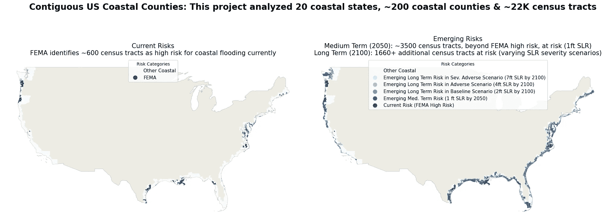
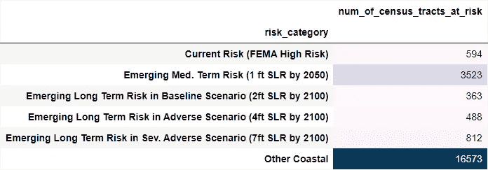
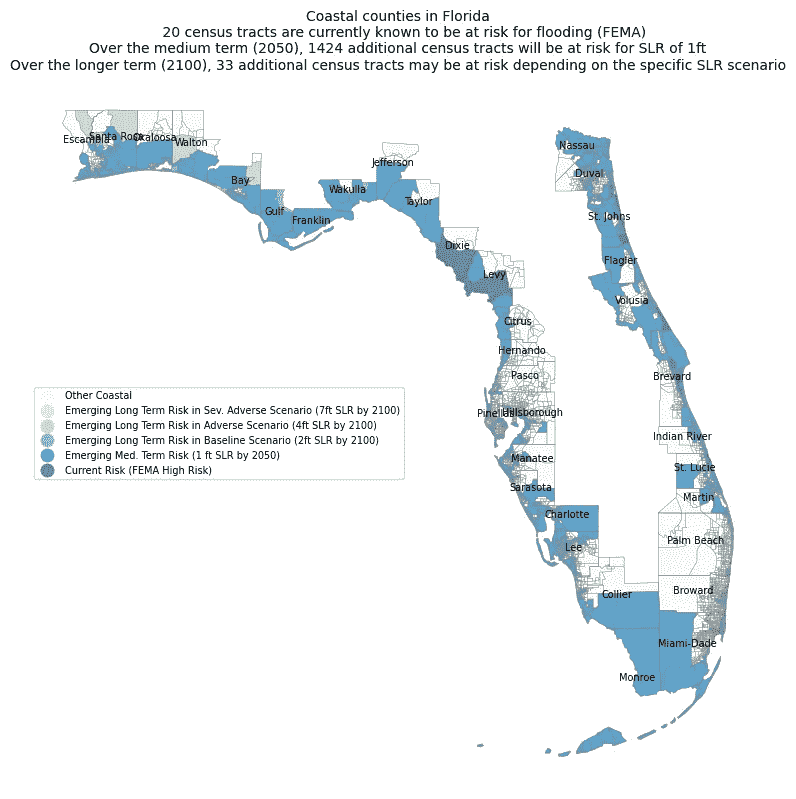
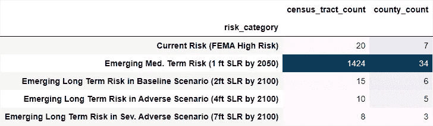
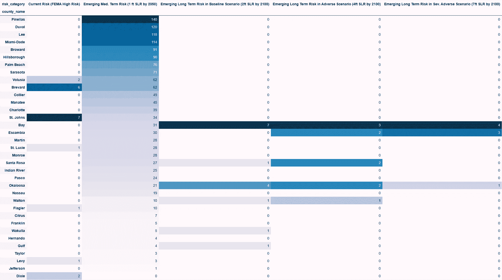
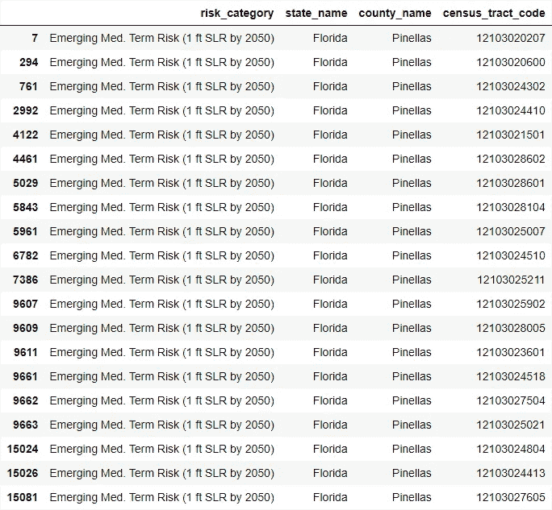

# 海平面上升对沿海住宅房地产资产的影响

> 原文：[`towardsdatascience.com/impact-of-rising-sea-levels-on-coastal-residential-real-estate-assets-f3d7764cbe8f?source=collection_archive---------11-----------------------#2024-03-01`](https://towardsdatascience.com/impact-of-rising-sea-levels-on-coastal-residential-real-estate-assets-f3d7764cbe8f?source=collection_archive---------11-----------------------#2024-03-01)

## 使用基于情景的压力测试方法识别中期（2050 年）和长期（2100 年）海平面上升风险

 [Riddhisha Prabhu](https://medium.com/@riddhishaprabhu?source=post_page---byline--f3d7764cbe8f--------------------------------)

·发表于[Towards Data Science](https://towardsdatascience.com/?source=post_page---byline--f3d7764cbe8f--------------------------------) ·阅读时间：10 分钟·2024 年 3 月 1 日

--

# 摘要

本项目采用基于情景的定性压力测试方法，识别出预计在中期（2050 年）和长期（2100 年）会受到海平面上升（SLR）不利影响的美国沿海人口普查区。设计了一个基准情景和两个“合理但严重”的不利情景，涵盖了 1 至 7 英尺的海平面上升。

通过本次分析得出的关键观察结果是，除了当前 FEMA 高风险区域之外，预计在中期（2050 年）会有**大约 3500 个其他沿美国大陆海岸的人口普查区，平均海平面上升 1 英尺**。在更长期（2100 年），还有大约 1660 个人口普查区面临 2 至 7 英尺的海平面上升风险。中期的观察尤为重要，因为即使在未来的排放路径或其他气候缓解行动下，海平面上升的影响仍然预计会发生，原因是由于气候变化导致的海洋已发生的*变暖*，***无论如何都会发生***[³](https://oceanservice.noaa.gov/hazards/sealevelrise/sealevelrise-tech-report-sections.html)。

图 1：中期（2050 年）和长期（2100 年）海平面上升风险的变化

本项目主要使用 Python 数据分析库，如 pandas 和 geopandas，以及一些可视化库，如 matplotlib 和 seaborn。该项目的代码可以在[此处](https://github.com/prarid/SeaLevelRiseImpact_CoastalRealEstate)找到。本项目的数据主要来自美国人口普查局和 NOAA。更多详细信息可以在下文的技术和数据部分找到。

# 项目的动机和目标

## 为什么选择沿海房地产和海平面上升？

大约 40%的美国人口，或约 1.28 亿人，居住在沿海县[¹](https://coast.noaa.gov/states/fast-facts/economics-and-demographics.html)。尽管近年来，由于一系列极端天气事件（如飓风、野火等），住宅资产普遍遭到重创，但对于这些沿海居民来说，另一个重要的新兴风险是由于加速的海平面上升（SLR）所导致的洪水和财产损失。然而，在本项目的探索性研究中发现，可能尚未深入理解潜在海平面上升影响的全部范围。因此，本项目旨在提高对预计在中期（2050 年）和长期（2100 年）内受到加速海平面上升影响的地区的关注。

美国国家海洋和大气管理局（NOAA）是一个领先的美国科学机构，负责监测海洋和大气状况[²](https://www.noaa.gov/)。根据 NOAA 2022 年《海平面上升技术报告》[³](https://oceanservice.noaa.gov/hazards/sealevelrise/sealevelrise-tech-report-sections.html)，与 20 世纪观测到的海平面水平相比，海平面目前正以*显著加速的速度*上升：预计在未来 30 年（2020-2050 年）美国大陆沿海的海平面将上升的幅度，平均将与过去 100 年（1920-2020 年）相当。

从长期来看（到 2100 年），与 2000 年水平相比，美国大陆沿海的海平面上升预测平均为 2 至 7 英尺。这些预测的变异性主要来源于关于未来温室气体排放率和由此引发的全球变暖的不确定性，而全球变暖是海平面上升的主要驱动力。中期（到 2050 年），考虑到由于气候变化而导致的***已发生***的海洋变暖[³](https://oceanservice.noaa.gov/hazards/sealevelrise/sealevelrise-tech-report-sections.html)，预计美国大陆沿海的海平面将平均上升 1.3 至 2 英尺，*无论*未来的排放路径或其他气候缓解措施如何。此外，预计这些更高的海平面也将导致比今天更多的高潮洪水（HTF）事件：预计轻微的破坏性 HTF 事件将从 2020 年的每年 3 次增加到 2050 年的每年 10 次以上，而重大破坏性 HTF 事件预计将从 2020 年的每年 0.04 次增加到 2050 年的每年 0.2 次。

## 项目目标

鉴于这些关于美国本土沿海海平面上升的预测，本项目的目标是双重的：

1.  为了让公众（潜在购房者、抵押贷款机构等）能够直观地了解中期（2050 年）和长期（2100 年）内 SLR 的区域性影响。海平面上升在不同严重程度下进行研究，范围从 1 英尺到 7 英尺。

1.  提供关于各个海平面上升（SLR）严重程度情境中将受影响的人口普查区的具体信息（FIPS 代码）。购房者和抵押贷款机构可以将这些人口普查区层级的位置信息纳入其购买决策，评估在评估房产价值时，是否需要进行任何折扣调整。

# 项目设计

## 基于情境的方法评估长期 SLR 影响

长期来看，考虑到海平面上升预测的潜在变动性，本项目被设计为基于情境的定性压力测试。SLR 情境的设计基于美联储资本压力测试练习中使用的原则[⁴](https://www.federalreserve.gov/publications/2023-Stress-Test-Scenarios.htm)；已使用一个基准情境和两个“可能但严重”的 SLR 情境，评估美国本土各沿海县区/人口普查区在不同的 SLR 水平下，在长期内可能受到的影响。

为每个情境选择的具体 SLR 水平基于 2022 年 NOAA 海平面上升技术报告[³](https://oceanservice.noaa.gov/hazards/sealevelrise/sealevelrise-tech-report-sections.html)。特别地，本项目考虑了 NOAA 的三种长期 SLR 水平：低（0.6 米或大约 2 英尺）、中（1.2 米或大约 4 英尺）和高（2.2 米或大约 7 英尺）；这些预测的 SLR 水平已映射到以下所示的定性压力测试情境中：

+   一个基准情境，其中海平面预计上升 2 英尺

+   一个不利情境，其中海平面预计上升 4 英尺

+   一个严重不利情境，其中海平面预计上升 7 英尺

基准情景映射到 NOAA 的长期“低”海平面上升（SLR）预测，约为 2 英尺。即使在低排放水平下，预计这一低预测也会实现，全球温度上升的所有水平下，概率大于 92%[3](https://oceanservice.noaa.gov/hazards/sealevelrise/sealevelrise-tech-report-sections.html)。不利和极度不利情景旨在呈现“可能但严重”的情况。NOAA 的长期“中等”海平面上升预测约为 4 英尺，“高”海平面上升预测约为 7 英尺，已分别被考虑为不利和极度不利情景。这些高海平面上升情景与更高的温室气体排放量以及与工业化前水平相比，全球温度的更大幅度上升相关联。极端的海平面上升情景，超过 2.5 米（大约 8 英尺），在 2100 年之后不再被认为是可能的[³](https://oceanservice.noaa.gov/hazards/sealevelrise/sealevelrise-tech-report-sections.html)，因此本项目考虑的最大海平面上升水平是 NOAA 高海平面上升情景的 7 英尺，作为极度不利情景的参考。

## 中期的附加分析

除了长期海平面上升影响外，本项目还分析了预计将在中期（2050 年）受到海平面上升影响的人口普查区。在中期，海平面上升的低端为 1 英尺，高端为 2 英尺，针对美国本土地区。最近的科学进展加深了对驱动海平面上升因素的理解，因此对这一较窄范围的预测信心大大增加（不论未来排放路径如何）[³](https://oceanservice.noaa.gov/hazards/sealevelrise/sealevelrise-tech-report-sections.html)。由于对中期海平面上升预测信心的增加，本项目在中期不采用基于情景的方法。相反，本项目认为，到 2050 年，所有受海平面上升 1 英尺影响的美国本土沿海人口普查区，都将在中期面临风险。

# 项目分析与观察

## 当前风险与新兴风险分析

本项目分析了美国本土的 20 个沿海州，涵盖了大约 200 个沿海县和其中大约 22,000 个沿海人口普查区。每个人口普查区都进行了分析，主要判断其是否已知存在风险，即“当前风险地区”，与其是否可能在未来中长期内面临风险，即“新兴风险地区”。

项目的第一部分涉及理解当前的风险。在海平面上升方面，最简单的表现形式之一就是洪水。联邦应急管理局（FEMA）已经确定了洪水高风险地区（FEMA 洪水平原）[⁵](https://www.fema.gov/flood-maps)。本项目使用 FEMA 的高风险洪水平原作为当前已知的沿海洪水风险区域的代表。在本项目中，这些地区被视为“当前风险地区”。

本项目的第二部分深入探讨了识别可能在中期或更长期内面临风险的普查区。该项目利用了来自美国国家海洋和大气管理局（NOAA）的海平面上升信息，以识别可能在中期（2050 年）或更长期（2100 年）成为新兴风险的普查区，即“新兴风险区域”。为了更好地理解海平面上升的风险严重性，新兴风险被分为四个类别——一个涵盖中期*，三个基于情景的长期类别：

+   新兴中期风险（2050 年海平面上升 1 英尺）

+   基准情景中的新兴长期风险（2100 年海平面上升 2 英尺）

+   不利情景中的新兴长期风险（2100 年海平面上升 4 英尺）

+   极为不利情景中的新兴长期风险（2100 年海平面上升 7 英尺）

*由于对海平面上升预测的信心较高，因此在中期不需要基于情景的方法。

## 关键观察结果

通过这一分析的关键观察结果是，在当前的 FEMA 高风险区之外，预计美国本土沿海的约 3500 个普查区将在中期（2050 年之前）面临 1 英尺的平均海平面上升，且在更长期（2100 年之前），约有 1660 个普查区面临 2 到 7 英尺的海平面上升风险。

图 2：当前风险与新兴风险——美国本土沿海县

表格 1：各个情景下面临风险的沿海普查区数量

+   在中期（2050 年前），鉴于气候变化已经导致的海洋温度升高，预计美国本土沿海的海平面将在平均上升 1.3-2 英尺，无论未来的排放路径或其他气候减缓措施如何。因此，**“新兴中期风险”普查区应视为高风险区**。

+   在更长期（2100 年之前），海平面上升的严重程度将受到温室气体排放率及由此产生的全球变暖的影响。即使在低排放情况下，大部分美国本土地区也预计会有 2 英尺的海平面上升。在基准情景中识别出的普查区，即**“基准情景中的新兴长期风险”**，此时应视为中高风险区。

+   在较高排放率下，海平面上升可能会在 4 英尺（NOAA 中等海平面上升）和 7 英尺（NOAA 高海平面上升）之间变化，分别对应于不利和极为不利情景。在这些情景下识别出的普查区，即**“不利情景中的新兴长期风险”**和**“极为不利情景中的新兴长期风险”**应视为中低风险和低风险区。

# 案例研究——佛罗里达州的当前风险与新兴海平面上升风险

目前，我们已知佛罗里达州有 7 个县和 20 个普查区面临高洪水风险。然而，未来预计会有多个额外的县和普查区受到海平面上升（SLR）的影响，尤其是在中期，如下所示。在中期（2050 年），1424 个额外的普查区将在海平面上升 1 英尺的情境下面临风险。在长期（2100 年），根据具体的海平面上升情境，可能有 33 个额外的普查区面临风险。

图 3：佛罗里达州沿海普查区在中长期内受到不同程度海平面上升的风险

表 2：在不同情境下，佛罗里达州面临风险的海岸县和普查区数量

表 3：每个海岸县在不同情境下面临风险的普查区的详细信息

表 4：预计在佛罗里达州 Pinellas 县受到影响的 20 个普查区样本。

注：其他海岸州的类似分析可在附录中找到 [这里](https://prarid.github.io/SeaLevelRiseImpact_CoastalRealEstate/)

# 技术与数据

本项目主要使用 Jupyter Notebook 实现，采用了 geopandas，以及其他标准的 Python 库，如 pandas、matplotlib、seaborn 等。在本项目所需分析中，使用了以下数据集：

+   **Census.gov 地理空间数据文件**：本项目的主要数据集是地理空间数据，用于识别美国本土的每个普查区。地理空间数据通过纬度和经度或几何形状对象存储关于各个位置的信息。例如，该数据集中的每个普查区将通过其几何形状表示。普查区是每个县内的子划分，空间大小因底层人口密度而异。[6](https://www.census.gov/programs-surveys/geography/about/glossary.html#par_textimage_13) 本项目中的所有分析都是在普查区级别进行的。所有相关数据均来自 census.gov[⁷](https://www2.census.gov/geo/tiger/GENZ2022/shp/cb_2022_us_tract_5m.zip)

+   **海岸县数据**：本项目的范围仅限于海平面上升的影响，因此地理空间数据库已经缩减至仅包含美国本土沿海的县。这个简化后的数据集被用于本项目中的所有分析。相关的海岸县数据来自于 census.gov[⁸](https://www2.census.gov/library/stories/2018/08/coastline-counties-list.xlsx)

+   **FEMA 数据集**：联邦应急管理局（FEMA）已确定易受洪水风险影响的区域（FEMA 洪水平原）[⁵](https://www.fema.gov/flood-maps)。这些区域进一步缩小，以集中识别与沿海县交集的区域，特别是易受*沿海*洪水影响的区域。在这些区域中，FEMA 标记为“高风险”或“非常高风险”的地区被合并到主地理空间数据集中。鉴于 FEMA 洪水区是一个相对较为人熟知的概念，这些区域被视为“当前高风险”区域，而与下文所述的 SLR 区域相比，它们被认为是“新兴风险”区域。该项目的数据来源于 FEMA 国家风险指数（NRI）[⁹](https://hazards.fema.gov/nri/)，所有分析均在普查区级别进行。

+   **NOAA.gov SLR 地理空间数据**：美国国家海洋和大气管理局（NOAA）已识别出美国沿海平原，在不同海平面上升水平下可能受到影响的地区。本项目分析了到 2100 年（与 2000 年海平面相比），海平面上升 1 英尺至 7 英尺的区域影响。海平面上升（SLR）被分析为三种情景——基线（2 英尺）、不利（4 英尺）和严重不利（7 英尺），这些情景与 2022 年 NOAA SLR 技术报告中低、中等和高 SLR 的情景相一致[³](https://oceanservice.noaa.gov/hazards/sealevelrise/sealevelrise-tech-report-sections.html)。请注意，鉴于地理空间数据的复杂性（识别和提取每个区域的地理空间层，跨多重多边形形状的空间连接），这些功能在每个情景下运行时需要几个小时。因此，在预处理阶段，相关文件在处理后会写入磁盘（请参见 Preprocessing_SLR.ipynb）。预处理的文件会直接在 Analysis_and_Visualization.ipynb 文件中读取。所有相关文件均来自 NOAA.gov[¹⁰](https://coast.noaa.gov/slrdata/)

# 参考文献：

[1\. 美国沿海县人口](https://coast.noaa.gov/states/fast-facts/economics-and-demographics.html)

[2\. NOAA](https://www.noaa.gov/)

[3\. NOAA 2022 年海平面上升技术报告](https://oceanservice.noaa.gov/hazards/sealevelrise/sealevelrise-tech-report-sections.html)

[4\. 联邦储备委员会压力测试](https://www.federalreserve.gov/publications/2023-Stress-Test-Scenarios.htm)

[5\. FEMA 洪水平原](https://www.fema.gov/flood-maps)

[6\. 什么是普查区？](https://www.census.gov/programs-surveys/geography/about/glossary.html#par_textimage_13)

[7\. 美国本土地理数据文件](https://www2.census.gov/geo/tiger/GENZ2022/shp/cb_2022_us_tract_5m.zip)

[8\. 沿海县](https://www2.census.gov/library/stories/2018/08/coastline-counties-list.xlsx)

[9\. FEMA 国家风险指数（NRI）](https://hazards.fema.gov/nri/)

[10\. SLR 数据](https://coast.noaa.gov/slrdata/)
